# 物联网——在 Twitter 上

> 原文：<https://towardsdatascience.com/the-internet-of-things-on-twitter-e5d6f6f983c0?source=collection_archive---------2----------------------->

## 用 Python 分析 800 万条物联网推文。

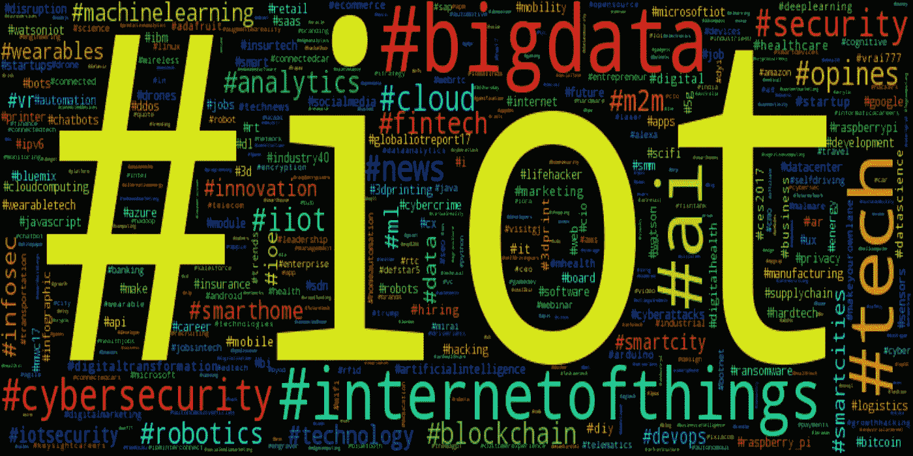

答几个月前，我想知道人们在推特上谈论**物联网**时会说些什么。所以在 *200 天*的过程中，从 2016 年【T10 月到 2017 年 5 月*，我记录了包含标签 ***#IoT*** 的推文。*

这导致总共超过 800 万条推文。

今天，我终于开始探索这些数据。

**这篇博文的目的有两个**:一方面，它展示了对这些数据进行探索性分析的一些*结果。另一方面，它旨在*简单介绍分析文本数据*，从预处理和可视化，到主题建模和情感分析— **都使用 Python** 。*

*【1】为了获取数据，我为基于*[*Tweepy*](http://www.tweepy.org/) *的* [*Twitter 流 API*](https://dev.twitter.com/streaming/overview) *实现了一个简单的监听器，它将每个传入的 Tweepy**包含标签* ***【物联网*** *的 Tweepy 存储到* [*DynamoDB* 【T4 可以](https://aws.amazon.com/dynamodb/) [*在 Github*](https://github.com/neocortex/twitter-stream) *上查看代码。*

# 初看:标签、用户、语言

```
import pandas as pd
df = pd.read_csv('tweets.csv')
df.head()
```

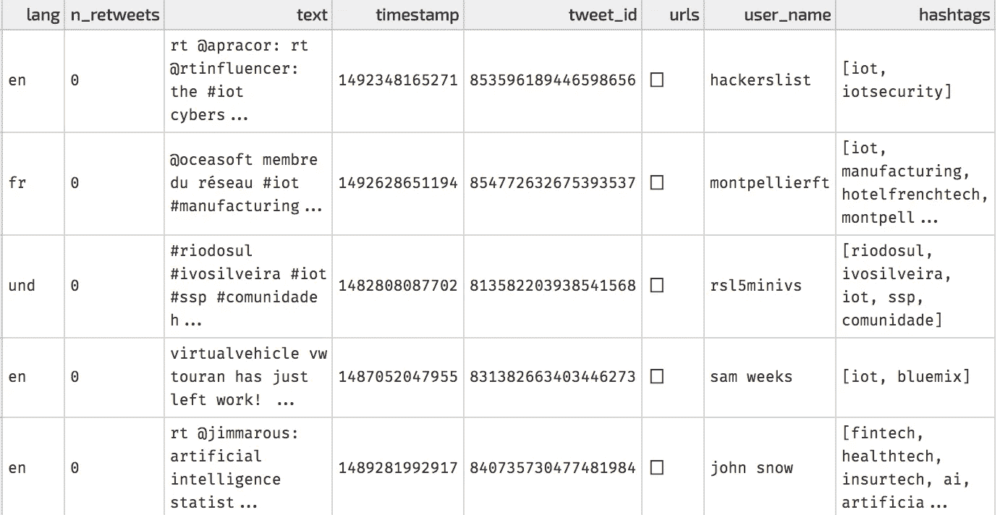

Raw data in a pandas DataFrame

上面你可以看到我从推特上收集的原始数据在读入[熊猫数据帧](https://pandas.pydata.org/pandas-docs/stable/generated/pandas.DataFrame.html)后的截图。它包含诸如推文的*文本*，推文的*语言*，推文的*标签*，以及作者的*用户名*等列。

与大多数数据相关的项目一样，我从简单的探索开始，最初对与标签 ***#IoT 一起使用的**最常见的标签**感兴趣。这很好地概述了人们在推特上谈论物联网时提到的其他话题。***

> **注**:如果你想看这篇博文引用的所有分析中使用的代码，看看[这本 Jupyter 笔记本](https://github.com/neocortex/iot-tweets-analysis/blob/master/iot-tweets-analysis.ipynb)和[相关的 Github 回购](https://github.com/neocortex/iot-tweets-analysis)。

下面是一个条形图，显示了物联网推文中出现的**前 10 个标签**(忽略标签 **#IoT** )及其相应的频率:

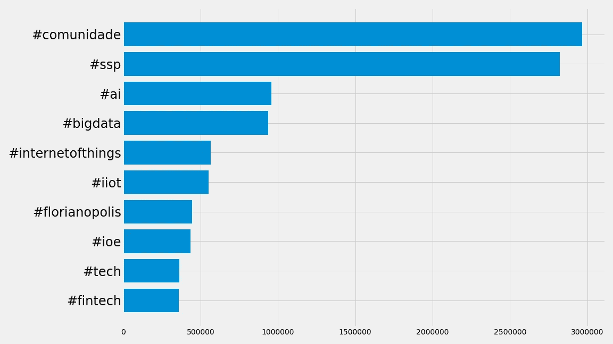

该图显示了我原本期望看到的标签，因为它们显然与物联网相关(例如， ***#ai*** ， ***#bigdata*** ， ***#tech*** )，但有些乍一看并不明显，例如， ***#comunidade*** ， ***#ssp***

经过快速搜索，我发现这些标签实际上与巴西圣卡塔林纳州公共安全部长有关。他们启动了一个名为 B [em-Te-Vi](http://sc.gov.br/index.php/noticias/temas/seguranca-publica/programa-bem-te-vi-contempla-sc-com-mais-de-2-mil-cameras-de-videomonitoramento) 的项目，该项目由安装在圣卡塔林纳[州多个地点的安全摄像头组成。从这些相机拍摄的图像每隔几分钟就会被发送到推特上，所有这些图像都标有 ***【物联网】***](https://en.wikipedia.org/wiki/Santa_Catarina_(state)) 。

由于我对这些特定的推文不感兴趣，我删除了所有包含标签***【ssp***(与上述机构相关的标签)的推文。通过这样做，230 万条***推文被从数据集中删除，我重新绘制了热门标签:***

***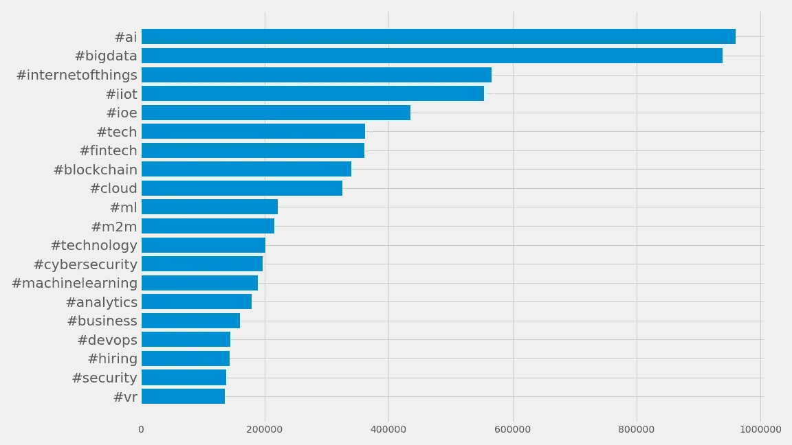***

***Top hashtags co-occurring with the hashtag #IoT after dropping the above-mentioned tweets***

***Et voilà，我获得了**人们在 twitter** 上谈论物联网时提到的话题的出色概述，如 *AI* 、*大数据*、*机器学习*、S*security*。***

***以类似的方式，其他有价值的见解也可以被揭示。下一步，我看了看关于物联网的最活跃用户的数量***

***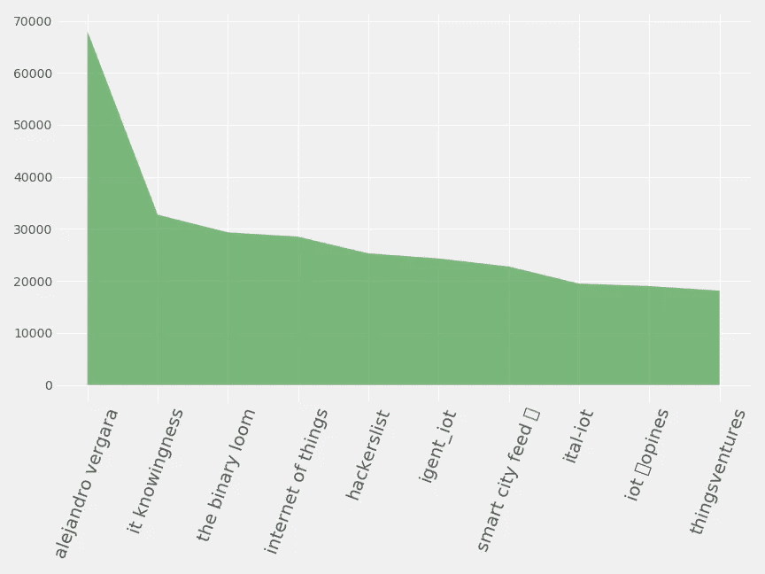***

***Most active users (according number of tweets about #IoT)***

***根据剧情，用户 [*亚历杭德罗·维加拉*](https://twitter.com/alevergara78) 最积极地参与了关于物联网的推文。有趣的是，在这个数据集中，他的推文超过 99%被转发。在所有后续分析中，我决定放弃转发。这样一来，最活跃用户的列表看起来就完全不同了:***

***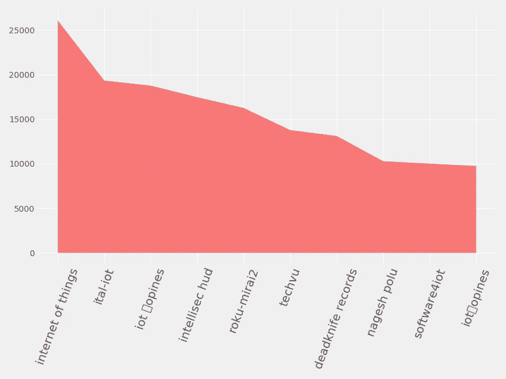***

***Most active users (number of tweets, retweets ignored)***

***此外，我还查看了推特数据集中使用的**最常见语言**。***

***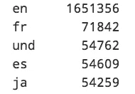******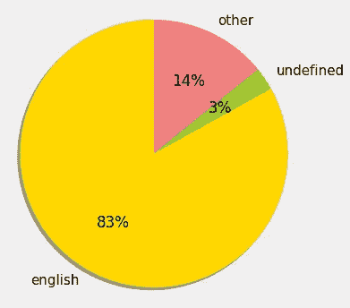***

***可以看到超过 8 条 */10 条关于物联网的推文都是英文*。***

***为了进行进一步的分析，我决定调查这些推文的内容。由于大多数文本分析工具都是特定语言的，所以我放弃了所有非英语的推文。***

***我最终得到了大约 165 万条推文的数据集。***

# ***词频:可视化常用术语***

***当处理文本数据时，通常需要执行多个预处理步骤，以便**清理手边的文本数据**。这种文本清理步骤通常包括类似于*移除标点符号*、*丢弃停用词和单个字符*、*将文本拆分成术语、* [*对*](https://en.wikipedia.org/wiki/Lemmatisation) *单词、*等的操作。***

***在对每条推文都这样做之后，我开始查看我们所有物联网推文中最常用的**个词**。我使用 Python 的 [wordcloud](https://github.com/amueller/word_cloud) 库来很好地可视化数据中的术语频率:***

******

***Wordcloud of the most common terms in IoT tweets***

***wordcloud 展示了与物联网相关的常见术语。***

***如果您感兴趣的不仅仅是孤立的术语频率，文本挖掘中的一种常见方法是识别**共现术语**，即所谓的 [n 元语法](https://en.wikipedia.org/wiki/N-gram)。NLTK 是一个强大的 Python 自然语言处理库。下面是一个使用 NLTK 来识别常见的*二元模型*的例子——成对的连续书面单词:***

***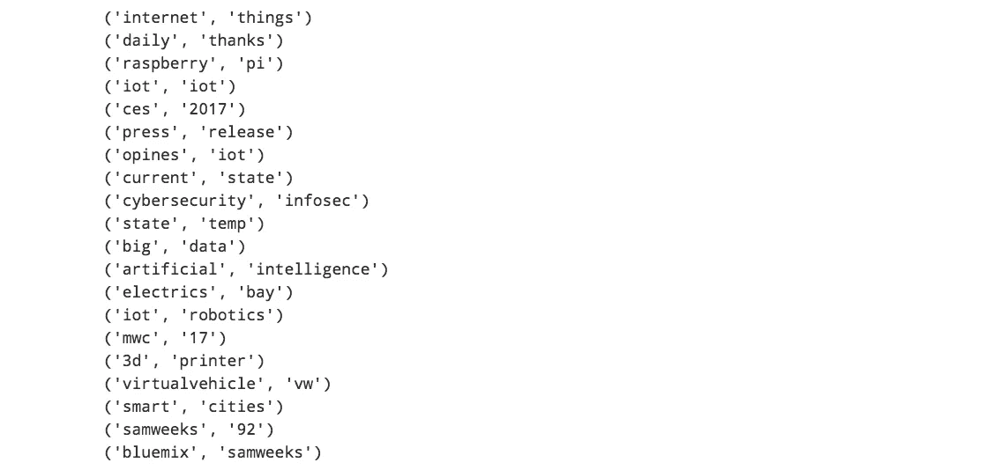***

***结果显示了顶级二元模型的列表——显示了非常熟悉的搭配！***

# ***主题建模:确定共同主题***

***主题建模是一种文本挖掘工具，用于发现文档中的中心主题(即推文)。主题模型的一个例子是[潜在狄利克雷分配(LDA)](https://en.wikipedia.org/wiki/Latent_Dirichlet_allocation) ，它假设文档是由主题的混合产生的。***

***使用 Python 的 [gensim](https://radimrehurek.com/gensim/) 实现 LDA 进行主题建模，并将主题数量设置为 *n=5* ，获得的每个主题的顶级术语为:***

***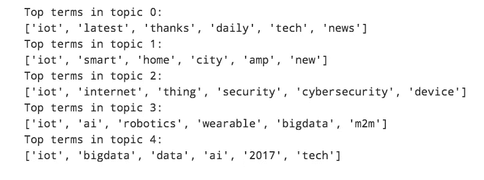***

***Top terms of topics identified using LDA***

***顶词列表显示不同的总体主题，例如*新闻(0)* 、*安全(2)* 或*数据(4)* 可以使用主题建模来自动识别。***

# ***情感分析:人们对物联网的感受如何？***

***[情感分析](https://en.wikipedia.org/wiki/Sentiment_analysis)用于确定作者对某一特定话题的态度是积极还是消极(或中立)。 [TextBlob](https://textblob.readthedocs.io/en/dev/) 是一个用于处理文本数据的 Python 库，为情感分析提供了一个模型。***

***将该模型应用于每条推文，并查看极性值的分布，我们可以了解推文的整体情绪:***

***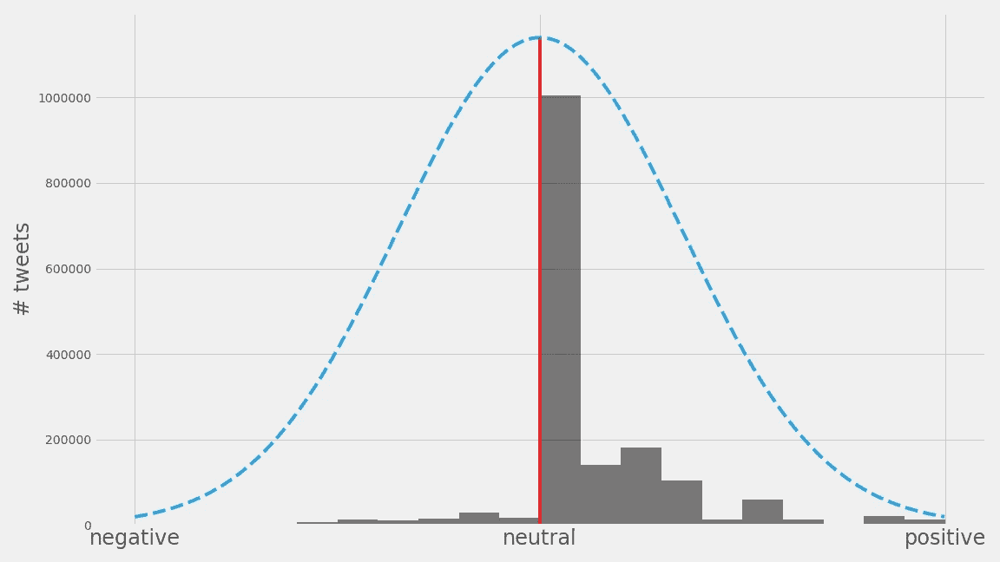***

***Histogram of sentiment polarity values***

***该图说明了极性直方图如何向右倾斜，表明关于物联网的推文的总体积极情绪**。*****

***我对负面关联的内容更感兴趣，所以我仔细查看了推文中极性很低的(即负面)最常见的**术语:*****

***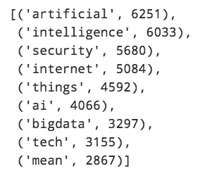***

***Most frequent terms in tweets with low polarity (negative)***

***并不奇怪，是吗？*人工智能*，其[越来越成为负面新闻报道](http://fortune.com/2017/08/18/elon-musk-artificial-intelligence-risk/)的一部分，以及 S *安全*、[一个在物联网](https://wattx.io/blog/research/2017/09/04/safety-first---the-economics-behind-iot-security.html)中仍未解决并被广泛讨论的问题，出现在负面情绪的术语列表中。***

***为了更好地将推文分为积极和消极情绪，下面是模型返回的具有最大和最小极性的推文的随机样本:***

***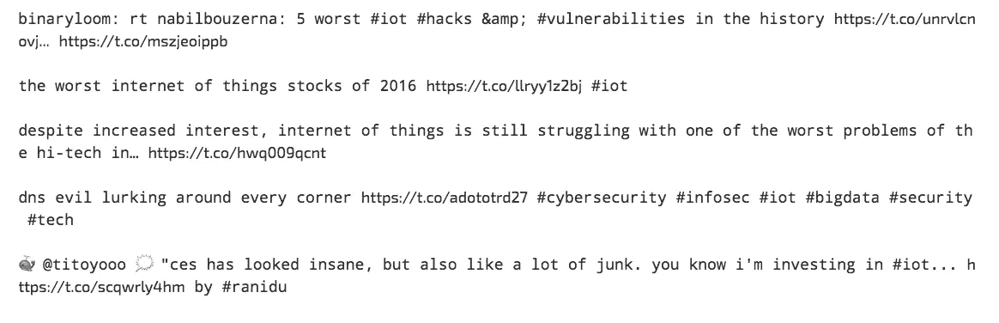***

***Examples of tweets with negative sentiment***

***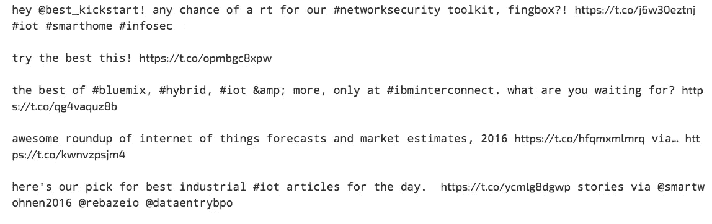***

***Examples of tweets with positive sentiment***

# ***摘要***

***可以从文本数据中提取有价值的见解。Python 生态系统及其丰富的数据科学库使得以许多不同的方式处理和分析文本数据变得容易，这取决于手边的用例。这些工具可用于快速、轻松地构建对公司有巨大价值的自动化工具。例如，在 [WATTx](http://www.wattx.io) ，我们构建了一个小工具，项目负责人可以输入一些与他的项目相关的标签，他的团队将定期从 Twitter 获得一个结果/新闻的精选列表到项目的 Slack 频道。这有助于我们了解正在运行的每个项目的进展情况。***

***这篇博文的目的是展示一些应用于推文的工具和文本分析概念的简单示例，以深入了解 Twitter 上的 ***【物联网】*** 内容。***

***这里展示的结果所使用的所有代码都是用 Python 编写的，可以在[这个 Jupyter 笔记本](https://github.com/neocortex/iot-tweets-analysis/blob/master/iot-tweets-analysis.ipynb)中找到。***

## ***Python 库***

*   ***[熊猫](https://pandas.pydata.org/) —强大的数据分析库***
*   ***[scikit-learn](http://scikit-learn.org)—Python 中机器学习的 goto 库***
*   ***[NLTK](http://www.nltk.org/) —自然语言处理工具***
*   ***[gensim](https://radimrehurek.com/gensim/)—Python 中的主题建模工具***
*   ***[wordcloud](https://github.com/amueller/word_cloud)——一个轻量级的库，用于生成好看的 word cloud***
*   ***[matplotlib](https://matplotlib.org/) — Python 2D 绘图库***
*   ***tweepy —用于访问 Twitter API 的 Python 库***