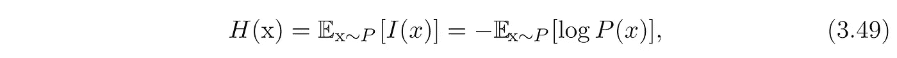
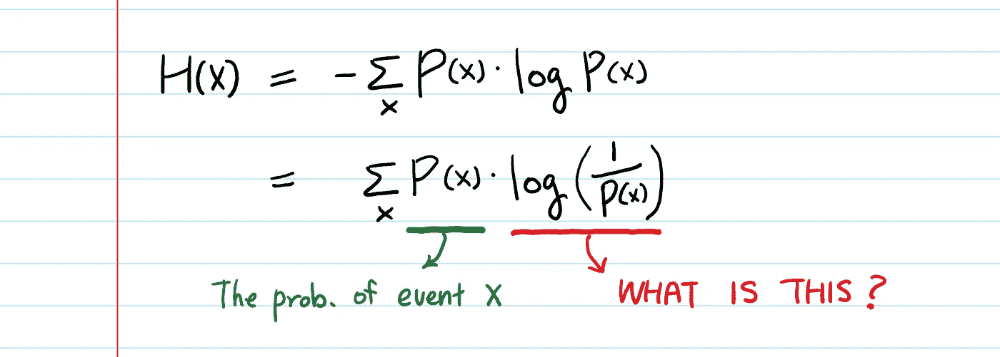
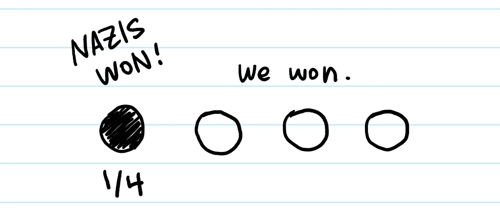
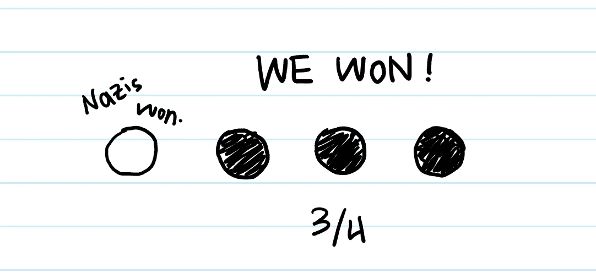
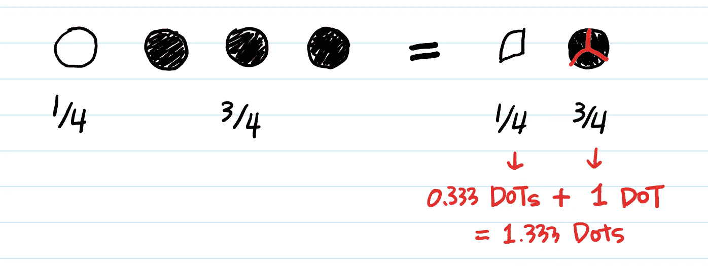

# 香农熵背后的直觉

> 原文：<https://towardsdatascience.com/the-intuition-behind-shannons-entropy-e74820fe9800?source=collection_archive---------3----------------------->

## 【警告:太容易了！]

伊恩·古德菲勒的《深度学习》一书*的[第 3.13 章信息论](https://www.deeplearningbook.org/contents/prob.html)中写道:*

> 我们将事件 X = x 的**自我信息定义为**
> 
> **I(x)=-log P(x)**
> 
> 因此，我们对 I(x)的定义是以纳特为单位的。一个 nat 是通过观察概率为 1/e 的事件获得的信息量。
> 
> …
> 
> 我们可以使用**香农熵来量化整个概率分布中的不确定性。**



The definition of Entropy for a probability distribution (from The Deep Learning Book)

# 但是这个公式是什么意思呢？

对于任何想要精通机器学习的人来说，理解香农熵是至关重要的。Shannon 熵产生了一个函数，它是 ML 从业者的面包和黄油——**交叉熵**在分类中大量用作损失函数，还有**KL 散度**广泛用于变分推理。

## 为了理解熵，我们需要从“比特”的角度开始思考。

位为 0 或 1。

因此，用 1 比特，我们可以表示 2 个不同的事实(又名**信息**)，要么是 1，要么是 0(或真或假)。假设你是 1945 年二战的一名指挥官。你的电报员告诉你，如果纳粹投降，他会给你一个“1”，如果他们不投降，他会给你一个“0”。

2018 年，你可以在智能手机上输入完全相同的信息

“战争结束了”(我们用 8 位* 15 个字符= **120 位**，而不是 1 位)

《战争还没有结束》(8 比特* 19 字符= **152 比特**)

因此，我们使用 100 多位来发送一条信息**,这条信息可以减少到一位。**

假设明天有四种可能的战争结果，而不是两种。1)德日双双投降。2)德国投降，日本不投降。3)日本投降，德国不投降。4)双方都不投降。现在你的电报员需要 2 位(00，01，10，11)来编码这个信息。同样，即使有 256 种不同的情况，他也只需要 8 位。

再正式一点，**一个变量的熵**就是这个变量所包含的“信息量”。你可以把变量想象成来自电报员的**消息。新闻可以是任何东西。不一定是 4 个州，256 个州等等。在现实生活中，新闻可以是数百万个不同的事实。**

现在，回到我们的公式 3.49:


The definition of Entropy for a probability distribution (from The Deep Learning Book)

**I(x)** 是**X**的信息内容。

I(x)本身是一个随机变量。在我们的例子中，战争的可能结果。这样， **H(x)** 就是**每一个可能信息的期望值。**

使用[期望值](https://en.wikipedia.org/wiki/Expected_value)的定义，上述等式可以改写为



Because -log P(x) = log (1/P(x))

> 等等…为什么我们要取概率的倒数？

H(X)是一个**整体**概率分布中的**总信息量**。这个意思是 **1/p(x)** 应该是**每个案例的信息**(打赢战争，输掉战争等)。

## **那么问题就是……**

# 为什么 1/p(x)是信息量？

假设纳粹有 50%的机会投降(p = 1/2)。然后，如果你的电报员告诉你他们确实投降了，你就可以消除 total 2 事件(投降和不投降)的不确定性，这是 p 的倒数(=1/2)。

当你的所有事件发生的可能性都相等，并且你知道一个事件刚刚发生，你可以排除所有其他事件(总共 1/p 个事件)发生的可能性。例如，假设有 4 个事件，它们发生的可能性都相等(p = 1/4)。当一个事件发生时，它表示其他三个事件没有发生。因此，我们知道总共 4 个事件发生了什么。

## 那些不太可能发生的事件呢？

假设纳粹有 75%的几率投降，有 25%的几率不投降。

> ‘投降’这个事件有多少信息？

**log(1/0.75)= log(1.333)= 0.41**(向前省略以 2 为基数的对数)

> '不投降'事件有多少信息？

**log (1/0.25) = log(4) = 2**

如你所见，不太可能的事件有更高的熵。

这就是为什么信息是概率的倒数的直觉。



黑点就是新闻。

通过了解黑点，我们可以同时消除另外 3 个白点。

**共 4 点(总信息)突发**。

现在，知道了**一个**黑点，我们总共能爆多少个**点**？



我们可以消去总共 1 又 1/3 = 1.333 个点，也就是**3/4 的倒数。**

> **你能爆的总点数=每条新闻的信息量。**

于是，**每一个可能新闻**中的信息是 0.25 * log(4)+0.75 * log(1.333)= 0.81(香农熵公式。)

现在我们知道 1/p 来自哪里了。但为什么是日志？香农认为任何事物的信息量都可以用比特来衡量。要用比特写一个数 *N* ，我们需要取 *N* 的以 2 为底的对数。

## 外卖食品

如果我们有 P(win) =1，熵就是 0。它没有一点不确定性。(-log1 = 0)

请注意，热力学“熵”和信息论中的“熵”都捕捉到了不断增加的随机性。

请注意，在我们的示例中，对于“同等可能性”的消息，熵(2 位)高于“不同等可能性”的消息(0.81 位)。这是因为在“不太可能”的消息中存在较少的不确定性。一个事件比另一个事件更有可能发生。这降低了不确定性。

对于实施爱好者，这里是 Python 代码。

看看字符数越多，不确定性(熵)越大。

```
import math 
import randomdef H(sentence): 
    """
    Equation 3.49 (Shannon's Entropy) is implemented.
    """
    entropy = 0 
    # There are 256 possible ASCII characters
    for character_i in range(256): 
        Px = sentence.count(chr(character_i))/len(sentence) 
        if Px > 0: 
            entropy += - Px * math.log(Px, 2) 
    return entropy# The telegrapher creates the "encoded message" with length 10000.
# When he uses only 32 chars 
simple_message ="".join([chr(random.randint(0,32)) for i in range(10000)])# When he uses all 255 chars
complex_message ="".join([chr(random.randint(0,255)) for i in range(10000)])**# Seeing is believing.****In [20]: H(simple_message)
Out[20]: 5.0426649536728 the** **In [21]: H(complex_message)
Out[21]: 7.980385887737537****# The entropy increases as the uncertainty of which character will be sent increases.**
```

在下一篇文章中，我将解释我们如何将香农熵扩展到交叉熵和 KL 散度。