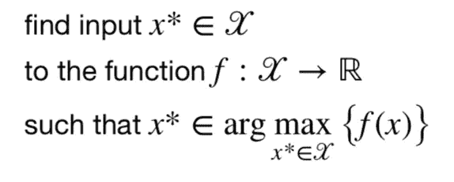
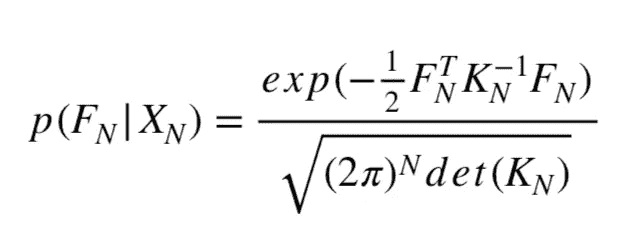
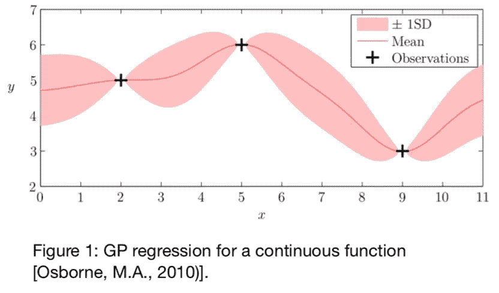
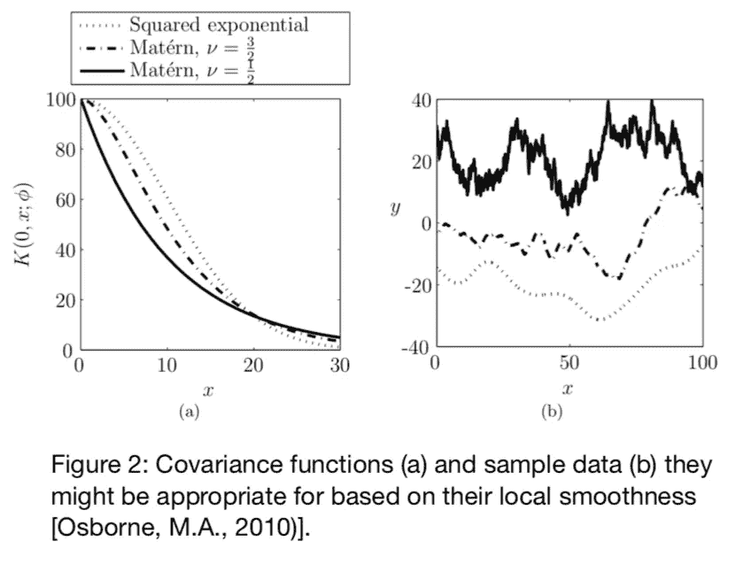
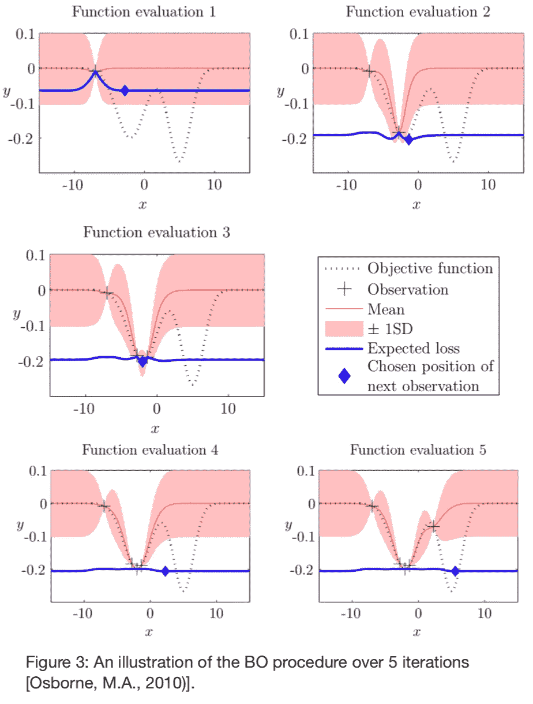
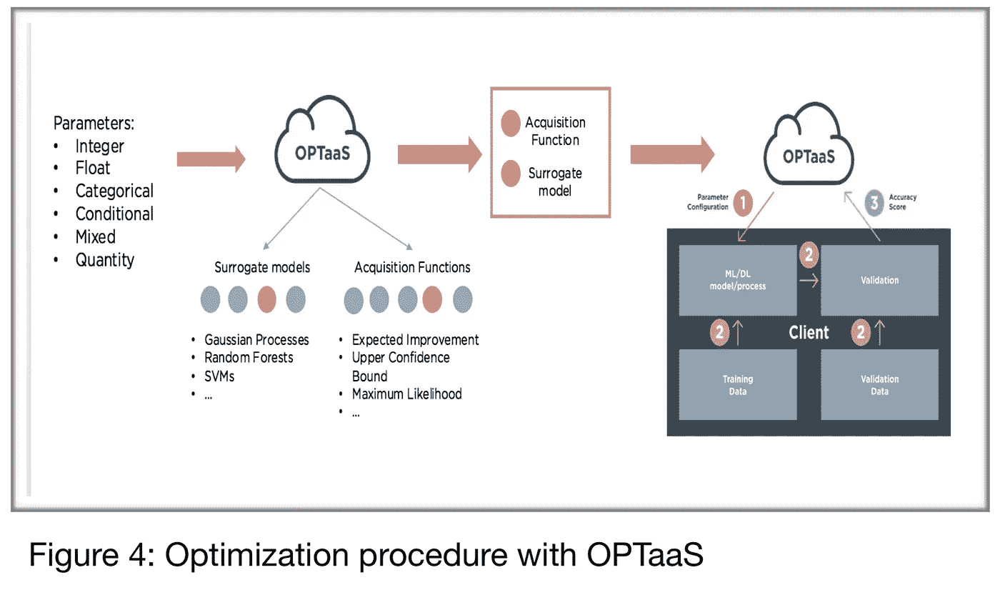

# 高斯过程贝叶斯优化背后的直觉

> 原文：<https://towardsdatascience.com/the-intuitions-behind-bayesian-optimization-with-gaussian-processes-7e00fcc898a0?source=collection_archive---------5----------------------->

**更新**:我开了一家科技[公司](http://www.legislate.tech/)。你可以在这里找到更多

在某些应用中，目标函数是昂贵的或难以评估的。在这些情况下，一般的方法包括创建目标函数的更简单的替代模型，该替代模型评估起来更便宜，并且将替代地用于解决优化问题。此外，由于评估目标函数的高成本，经常推荐迭代方法。迭代优化器通过在域中的一系列点上迭代地请求函数的评估来工作。贝叶斯优化通过在可能的目标函数空间上结合先验模型，将贝叶斯方法添加到迭代优化器范例中。本文介绍了高斯过程贝叶斯优化背后的基本概念和直觉，并介绍了 [OPTaaS](https://mindfoundry.ai/optaas) ，一个用于贝叶斯优化的 [API](https://optaas.mindfoundry.ai) 。

## 最佳化

优化方法试图将域*中的输入 ***x**** 定位到函数 ***f*** 中，该函数在*上最大化(或最小化)该函数的值:**

****

**The general Optimization framework**

**在实践中，函数 *f* 表示需要优化的过程的结果，例如交易策略的整体盈利能力、工厂生产线上的质量控制指标，或者具有许多参数和超参数的数据科学管道的性能。**

**输入域 ***𝒳*** 代表需要优化的过程的有效参数选择。这些可以是交易策略中使用的市场预测，工厂流程中使用的原材料数量，或者数据科学管道中 ML 模型的参数。正是输入域***【,𝒳***的描述，连同函数 ***f*** 的性质，表征了优化问题。流程域的有效输入， ***𝒳*** ，可以是离散的、连续的、受约束的或这些的任意组合。类似地，结果函数 ***f*** 可以是凸的、可微的、多模态的、有噪声的、缓慢变化的，或者具有许多其他重要性质。**

**在某些应用中，目标函数评估起来很昂贵(计算上或经济上)，很难评估(化学实验、石油钻探)。在这些情况下，一般的方法包括创建目标函数**的更简单的替代模型 ***f ̂*** ，该替代模型评估起来更便宜，并且将替代地用于解决优化问题。****

**此外，由于评估目标函数的高成本，经常推荐迭代方法。迭代优化器通过在域 *x* 1、 *x* 2、*中的一系列点处迭代地请求函数 *f* 的评估来工作。。。∈**t37】𝒳***t39】。通过这些评估，优化器能够构建函数 ***f*** 的图像。对于梯度下降算法，这个图像是局部的，但是对于代理模型方法，这个图像是全局的。在任何时候，或者在函数评估的预分配预算结束时，迭代优化器将能够陈述其对 ***x**** 的真实值的最佳近似。**

*使用 ***N*** 已知的评价值*:***F =(f1，f2，…，fN)***at***【XN =(x1，x2，…，xN)*** 来训练代理模型。有许多方法用于建立替代模型，如多项式插值、神经网络、支持向量机、随机森林和高斯过程。在 Mind Foundry，我们选择的方法是使用高斯过程进行回归。**

## **高斯过程**

**高斯过程(GPs)在函数空间上提供了一类丰富而灵活的非参数统计模型，其域可以是连续的、离散的、混合的，甚至是分层的。此外，GP 不仅提供关于*的可能值的信息，而且重要的是还提供关于该值的不确定性的信息。***

***高斯过程回归背后的思想是针对在某些点的一组观察值*****【XN】****我们假设这些值对应于具有先验分布的多变量高斯过程的实现:******

******

***其中 ***KN*** 是一个***N*x*N****协方差矩阵及其系数用一个相关函数(或核) ***Kmn =K(xm，xn，θ)*** 来表示。根据最大似然原则校准内核的超参数 ***θ*** 。 ***KN*** 被选择来反映函数的一个先验假设，因此核的选择将对回归的正确性产生重大影响。图 2 给出了几个协方差函数的示例。****

**通过数学变换并使用条件概率规则，可以估计后验分布*p*(*f n+1*|*f N*， *XN+1* )并将 ***f ̂N+1*** 表示为 KN 和 fn 的函数，具有不确定性。这允许我们从我们的观察中构建一个概率代理，如图 1 所示:**

********

## **贝叶斯优化**

**贝叶斯优化是一类迭代优化方法，专注于一般优化设置，其中𝒳的描述是可用的，但对 *f* 的属性的了解是有限的。贝叶斯优化方法有两个特点:**

*   *****代理模型 f ̂*** ，对于函数 *f* 、**
*   **以及从代理计算的 ***获取函数*** ，用于指导下一个评估点的选择**

**BO 通过在可能的目标函数空间上结合**f*的先验模型，将贝叶斯方法添加到迭代优化器范例中。通过在每次报告函数评估时更新该模型，贝叶斯优化例程保持目标函数 *f* 的后验模型。这个后验模型是函数 *f* 的代理 ***f ̂*** 。具有 GP 先验的贝叶斯优化例程的伪代码是:***

****初始化** :
根据初始空间填充实验设计，在 *f* 之前放置高斯过程，在 *n* 0 点观察 *f* 。**

**将 *n* 设定在 *n* 0**

****而**N≤*N*do:**

*   **使用所有可用数据更新 f 上的后验概率分布**
*   **识别𝒳上采集函数的最大值***【xn】****，其中采集函数是使用当前后验分布计算的***
*   ***观察*yn*=*f*(*xn*)***
*   **增量 *n***

****结束而****

****返回**具有最大 *f* ( *x* )的点或者具有最大后验均值的点。**

**标准采集函数的一个例子是 ***预期改善标准*** (EI)，对于 *x* ∈ 𝒳中的任何给定点，该标准是 *x* 处的 *f* 的值相对于 ***f*** 的最佳值的预期改善。 鉴于函数 ***f*** 在 *x* 处确实高于 ***f*** 的最佳值；所以如果我们在寻找 ***f*** 的最大值，EI 可以写成:**

*****e I*(*x*)= 𝔼(max(*f*(*x*)*f**，0)****

**其中 *f* *是目前看到的 *f* 的最大值。**

**采集功能的其他示例有:**

*   **熵搜索，其在于寻求最小化我们在最佳值位置的不确定性**
*   **置信上限**
*   **预期损失标准**

**图 3 示出了代理的演变以及它与获取函数的交互，因为它在它试图最小化的基础函数的每次迭代之后改进了它的知识。**

****

## **使用 OPTaaS 实施业务对象**

**OPTaaS 是一个通用的贝叶斯优化器，它通过 web 服务提供最佳的参数配置。它可以处理任何参数类型，并且不需要知道底层的过程、模型或数据。它要求客户端指定参数及其域，并回传 OPTaaS 推荐的每个参数配置的准确度分数。OPTaaS 使用这些分数对底层系统进行建模，并更快地搜索最佳配置。**

**Mind Foundry 已经在 OPTaaS 中实现了一套代理模型和采集功能，它将根据所提供的参数的性质和数量自动选择和配置，如图 4 所示。这种选择是基于彻底的科学测试和研究，因此 OPTaaS 总是做出最合适的选择。此外，Mind Foundry 能够为客户的特定问题设计定制协方差函数，这将显著提高优化过程的速度和准确性。OPTaaS 的大多数用户需要优化复杂的流程，这种流程运行起来很昂贵，而且反馈有限。出于这个原因，OPTaaS 将其 API 集中于提供一个简单的迭代优化器接口。然而，如果有更多关于被优化的过程的信息，它总是可以被用来更快地收敛到最优。因此，OPTaaS 还支持关于域𝒳的信息的通信，例如关于输入的约束，以及关于函数 *f* 的评估，例如噪声或梯度或部分完整的评估。此外，客户通常能够利用本地基础设施来分发优化搜索，也可以请求 OPTaaS 进行批量评估。**

****

**优化过程如下:**

1.  **OPTaaS 向客户推荐一种配置**
2.  **客户评估他们机器上的配置**
3.  **客户发回一个分数(准确性、夏普比率、投资回报等)**
4.  **OPTaaS 使用该分数来更新其代理模型，并且循环重复，直到达到最佳配置。**

**在整个过程中，OPTaaS 不访问底层数据或模型。更多关于 OPTaaS (Mind Foundry Optimize)的信息可以在[这里](https://www.mindfoundry.ai/mind-foundry-optimize)找到。**

**【**更新**:我开了一家法律科技公司。如果你已经做到了这一步，你可能会有兴趣在这里找到更多的**

## **团队和资源**

**Mind Foundry 是牛津大学的一个分支机构，由斯蒂芬·罗伯茨(Stephen Roberts)和迈克尔·奥斯本(Michael Osborne)教授创建，他们在数据分析领域已经工作了 35 年。Mind Foundry 团队由 30 多名世界级的机器学习研究人员和精英软件工程师组成，其中许多人曾是牛津大学的博士后。此外，Mind Foundry 通过其分拆地位，拥有超过 30 名牛津大学机器学习博士的特权。Mind Foundry 是牛津大学的投资组合公司，其投资者包括[牛津科学创新](https://www.oxfordsciencesinnovation.com)、[牛津技术与创新基金、](http://www.oxfordtechnology.com)、[牛津大学创新基金](https://innovation.ox.ac.uk/award-details/university-oxford-isis-fund-uoif/)和 [Parkwalk Advisors](http://parkwalkadvisors.com) 。**

****文档****

**教程:[https://tutorial . opta as . mind foundry . ai](https://tutorial.optaas.mindfoundry.ai)API 文档:[https://opta as . mind foundry . ai](https://optaas.mindfoundry.ai)**

****研究**[http://www . robots . ox . AC . uk/~ mosb/projects/project/2009/01/01/bayesopt/](http://www.robots.ox.ac.uk/~mosb/projects/project/2009/01/01/bayesopt/)**

****参考文献****

**奥斯本，硕士(2010)。顺序预测、优化和求积的贝叶斯高斯过程(博士论文)。牛津大学博士论文。**

****演示:**Charles . brecke @ mind foundry . ai**