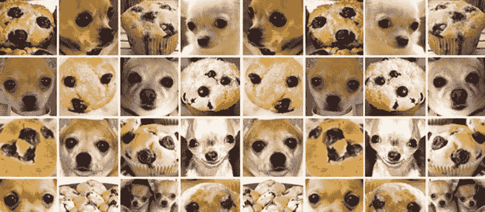

# 人工智能时代的隐形工人

> 原文：<https://towardsdatascience.com/the-invisible-workers-of-the-ai-era-c83735481ba?source=collection_archive---------9----------------------->

## 围绕管理为人工智能提供动力的数据，出现了一种新型的蓝领产业

在人工智能研究的早期，美国康奈尔大学的科学家弗兰克·罗森布拉特(Frank Rosenblatt)发明了他所谓的“感知机”。感知器是一种算法，旨在对展示给它的对象进行分类，是现代人工智能的祖先。当罗森布拉特在 1958 年的一次新闻发布会上变得有点自吹自擂时，《纽约时报》发现了这一点，并有点兴奋过头了。“海军新设备边做边学；一篇[文章的标题](https://www.nytimes.com/1958/07/08/archives/new-navy-device-learns-by-doing-psychologist-shows-embryo-of.html)写道:“心理学家展示了设计用来阅读并变得更聪明的计算机胚胎”。作者接着说:

> 海军表示，感知机将是第一个“能够在没有任何人类训练或控制的情况下接收、识别和识别周围环境”的非生物机制

这种语气听起来熟悉吗？

没有一个星期没有人工智能和算法能够完成以前留给人类的任务的新突破的消息。这些天有很多关于工作自动化和我们新的算法霸主的谈论，这些算法霸主似乎很少有人参与就能完成复杂的任务。然而，这是一个谬误——我们看不到人工智能背后的人类并不意味着没有人类。这不仅适用于开发这些算法的工程师。事实上，有一种新的蓝领工作管理数据，这些数据对算法的功能至关重要，据说这些算法为我们的数字化经济提供了动力。

这不是我们第一次忽视那些努力让技术发挥作用的人们。“计算机”实际上是人，其中很大一部分(报酬很低)是女性，从事已经自动化的计算工作，但时间不长。女性也是第一批计算机程序员之一，她们操作着复杂的机器，比如运行罗森布拉特感知器算法的机器，但却被第一批计算机的工程师所掩盖。当时很少有人关注大型科技公司、政府机构和研究实验室的幕后工作者。只是最近，学术界对这些工作者的认可有所上升，例如，在 T2 好莱坞也是如此。我们应该以史为鉴，不要重蹈覆辙。要做到这一点，我们需要看看谁是新的隐藏的技术人物，他们的工作是什么，以及为什么需要他们。

A computing group at NASA’s Jet Propulsion Laboratory, circa 1955 (source: JPL/Caltech)

# **像一辆没有轮子的汽车**

如今，当人们谈论人工智能时，他们真正的意思通常是机器学习。反过来，大多数 ML 算法本质上是统计模型，它们通过分析之前输入的大样本数据——“训练数据”，来“学习”如何执行特定任务。开发人员依赖这些模型是因为所谓的“波兰尼悖论”:我们知道的比我们能说的多，也就是说。我们的很多知识都是隐性的，这就是为什么我们不能简单地以硬性规则的形式将其编程到软件中；不管任务有多琐碎，要教计算机程序，我们需要展示或“训练”它们。因此，一个非常复杂但未经训练的 ML 算法就像一辆没有轮子的跑车:它可能看起来仍然很好，但它不会带你去任何地方——它本质上是无用的。同样，如果你喂你的 ML 模型垃圾训练数据，它也会吐出垃圾结果。

但是“训练数据”到底是什么？假设你经营着一家蓝莓松饼工厂，但每隔一段时间，一只从附近动物收容所逃跑的狗会意外地跳上传送带，你的人工智能包装机器人需要区分松饼和狗，以便没有狗最终出现在杂货店的货架上。对于机器人来说，要实现这一点，需要给它输入大量松饼和狗的图片，并给它们贴上相应的标签，这样它就可以推断出它们的识别特征。例如，同样的原则适用于自动驾驶汽车(除其他外，需要能够识别停车标志)和大多数其他人工智能应用。

Chihuahua or muffin? Not that easy to tell for a machine without human supervision (source: [Mariya Yao](https://www.topbots.com/chihuahua-muffin-searching-best-computer-vision-api/))

这给公司带来了一个问题:他们如何获得带标签或带注释的数据？即使他们获得了大量数据，如照片(用于图像识别算法)、录音(用于语音识别)或书面文本(用于情感分析)，标记所有这些数据也是一项繁琐的任务，需要由人类来完成。这是工作。

# **50 种标注数据的方式**

T 以下是给你的数据贴标签的不同方法。一些公司自己给他们的数据贴上标签——尽管这可能成本很高，因为雇佣人员来完成这些任务会让公司既花钱又失去灵活性。其他公司甚至想办法让人们免费标记他们的数据。有没有想过为什么谷歌的 reCAPTCHA 一直要求你识别模糊照片上的交通标志？(一个小提示:谷歌的控股公司 Alphabet 也拥有处于自动驾驶前沿的 Waymo)然而，在大多数情况下，标记和管理数据的是受薪工人，一个完整的外包行业已经围绕它兴起。无论是在世界各地工厂般的工作场所，还是通过在家或智能手机进行远程工作:这些都是推动人工智能的隐形工人。

reCAPTCHA — everybody’s favorite pastime on the internet

就像西方公司在 20 世纪 60 年代和 70 年代开始将制造工作外包给发展中国家一样，科技公司正在将数据标签外包给外国公司，这些公司运营着可以被称为数据标签工厂的工厂。就像过去一样，这些工作被转移到一些地方——从中国的[到中非的](https://medium.com/syncedreview/the-humans-behind-artificial-intelligence-3ff578cfcc60)——那里工资低，工作条件对他们更有利。在那里，前仓库和大型开放空间办公室中的大量工人坐在电脑前，花费他们的工作日来标记数据。正如李远在最近为纽约时报撰写的[文章中引用一家中国数据标签公司的联合创始人的话:](https://www.nytimes.com/2018/11/25/business/china-artificial-intelligence-labeling.html)

> 我们是数字世界的建筑工人。我们的工作是一砖一瓦[……]但我们在人工智能中发挥着重要作用。没有我们，他们就无法建造摩天大楼。

外包数据标签的另一种方式是通过在线众包工作平台，依靠他们的用户在世界各地完成分解成小组件的任务。这包括大型平台，如亚马逊的机械土耳其人(Mechanical Turk)及其数十万注册的众包工作者，但也包括专门的平台。一些大型科技公司甚至有自己的众包平台来管理数据，其他公司可以依赖专门关注数据标签的小型平台服务。员工从事这些工作的动机各不相同:一些人想在业余时间赚点外快，看重这类平台提供的灵活性。正如专业数据标签应用程序 [Spare5](https://app.spare5.com/fives) 的一名用户在[的宣传视频](https://vimeo.com/173964892)中解释的那样:

> 这只是，你知道，我可以很容易地做的事情，只是拿出我的手机，做一些任务，在回家和上班的路上做一些摘要。[……]对我来说，知道我花了这些时间真正深入挖掘，试图找到信息，这是一点点回报[……]我觉得我正在解决一个谜，解决这个难题。

然而，其他人依靠这些平台工作谋生，并经常面临巨大的风险:低工资，没有(或几乎没有)就业保护和员工权利，以及巨大的不确定性。

# **人工智能时代的蓝领工作**

T 退一步说，很明显，一种新型的低技能蓝领工作已经出现，以满足技术对标签数据的需求。与在工业经济中从事物理装配线工作相反，这种新的人工智能工人阶级已经成为数字化“数据供应链”的一部分。当然，并非所有这些工作都是低技能的——从 CT 扫描图像中检测癌症的算法需要由经验丰富的放射科医生进行培训。但是，根据波兰尼悖论，研究人员试图让 ML 应用程序完成的大多数任务对人类来说仍然相当简单，训练这些算法只需要常识。

因此，重要的是确保这种新的工作类别成为工人经济保障的驱动力，而不是剥削的来源。至于更“传统”的全球行业的供应链，如采矿业或服装业，我们所有人——政府、消费者和企业——都有责任确保那些标记数据的人在体面的条件下工作。

政府将很难监管这个全球无边界的数据标签服务市场的工作。然而，他们必须努力调整旨在改善工作条件的现有制度，并推动企业创建公平的数据供应链。在这方面，大众工作和数据标签工厂的工作都提出了不同的挑战，但这些障碍都不是不可克服的。然而，克服这些困难确实需要监管努力以及国际和跨部门合作。反过来，企业必须提供一些关于其数据供应链的透明度。尽管第一世界的消费者在很大程度上仍然不知道他们的衣服和小玩意是在遥远的地方制造的，但我们也应该让科技公司对它们驱动人工智能应用的方式负责。毕竟，消费者确实有影响力，负责任的消费可以影响企业的行为。

无论我们对技术进步的速度有多兴奋，现在和过去一样重要的是，不断提醒自己，我们每天在媒体上听到的人工智能的大多数进步背后都有人——实际上是很多人。由于 ML 研究人员正在寻找越来越多的自动化新任务，这些工作不会很快消失。让我们确保它们是体面的工作。

*本文是在巴黎政治学院“技术革命的历史”课程的背景下撰写的，授课老师为*[*laurène Tran*](https://medium.com/u/31b76182111a?source=post_page-----c83735481ba--------------------------------)*[*Besiana Balla*](https://medium.com/u/b57c90a0ecbd?source=post_page-----c83735481ba--------------------------------)*和*[*Nicolas Colin*](https://medium.com/u/c842401c1ec4?source=post_page-----c83735481ba--------------------------------)*。**

# *进一步阅读*

*如果上面的内容引起了你的兴趣，这里还有一些探索同一主题的文章:*

*莎拉戴，[人工智能承诺就业革命，但首先它需要老式的体力劳动——来自中国，*南华早报，2018 年 10 月*](https://www.scmp.com/tech/article/2166655/ai-promises-jobs-revolution-first-it-needs-old-fashioned-manual-labour-china)*

*马克·格雷厄姆，[全球劳动力市场的兴起——以及它对未来工作的意义，](https://tech.newstatesman.com/guest-opinion/planetary-labour-market) *《新政治家》*，2018 年 1 月*

*Hope Reese，[‘数据标签’是 AI 时代的新蓝领工作吗？](https://www.techrepublic.com/article/is-data-labeling-the-new-blue-collar-job-of-the-ai-era/)、 *TechRepublic、【2016 年 3 月**

*霍普·里斯和尼克·希斯，[亚马逊点击工人平台内部:50 万人如何被支付一分钱来训练人工智能](https://www.techrepublic.com/article/inside-amazons-clickworker-platform-how-half-a-million-people-are-training-ai-for-pennies-per-task/) *，TechRepublic，* Dember 2016*

*汤姆·西蒙尼特，[为了让人工智能更聪明，人类执行古怪的低收入任务](https://www.wired.com/story/behind-artificial-intelligence-lurk-oddball-low-paid-tasks/)，*连线*，2018 年 9 月*

*李远，[廉价劳动力如何推动中国的人工智能雄心](https://www.nytimes.com/2018/11/25/business/china-artificial-intelligence-labeling.html)，*《纽约时报》*，2018 年 11 月*