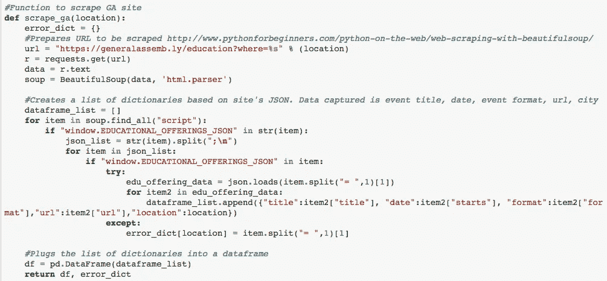
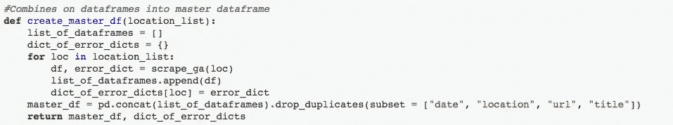
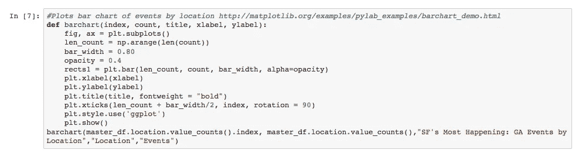
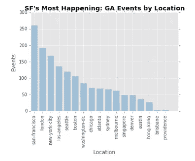

# IPO 模式

> 原文：<https://towardsdatascience.com/the-ipo-model-90c24535b543?source=collection_archive---------2----------------------->

在我的[大会](https://medium.com/u/ade87cdd122e?source=post_page-----90c24535b543--------------------------------)数据科学沉浸式课程期间，我的同事 [David Ortiz](https://medium.com/u/cd275e039f8c?source=post_page-----90c24535b543--------------------------------) 建议我应该写一篇关于我如何编写函数的博文。在编写脚本时，我倾向于使用输入过程输出模型(IPO ),它有助于组织和分类您的功能。让您的代码符合这种模型可能需要一些努力，但回报来自于拥有组织良好且易于调试的代码。

以下将是我如何在我的第一篇博文中使用 IPO 的演练，[哪个佐治亚大学校园发生的事件最多，](https://medium.com/@brendangallegobailey/which-ga-campus-is-most-happening-f1d6a8d74a87)分析了哪个佐治亚大学校园发生的事件最多。

**输入**

这应该是一个函数或一组函数，它加载创建所需输出所需的数据。很多时候，这将是读取 CSV 或使用 ODBC 连接从 SQL 数据库获取数据。

在这种情况下，我创建了一个名为 scrape_ga 的函数来抓取[总会网站](https://generalassemb.ly/education?format=events)上的各个城市活动页面。网络抓取的数据随后被放入相应城市的数据框架中。



Input Function

**流程**

这应该是一个或一组准备数据的函数，以便产生适当的输出。这可能意味着清理或聚合数据。

大会网站上的事件数据非常干净，所以这里不需要做太多处理。我所做的是将通过抓取功能创建的所有单个城市数据帧组合起来，然后对最终的主数据帧进行重复数据删除。



Process Function

**输出**

这应该是一个函数或一组函数，它使用干净的处理数据创建所需的输出。这可能是一个新的电子表格或模型或图形的输出。

在这种情况下，输出是一个条形图，比较每个校园的事件数量。



Output Function



Resulting Output

**为什么要用 IPO？**

在了解 IPO 之前，我只会用函数，避免重复自己。虽然用这种方式快速编写代码很容易，但这确实导致了一些问题。

*组织调试代码*

IPO 训练你了解你每项职能的广泛目的，并以逻辑的方式组织它们。IPO 有一个清晰的流程:输入函数提供给处理函数，处理函数提供给输出函数。遵循这个模型将使你的同事和你未来的自己更容易阅读和修改你的代码。如果有一个错误，那么它将更容易找到哪里需要进行修正。

*保持全局命名空间干净*

python 最酷的特性之一是名称空间。如果一个变量是在一个函数中创建的，那么只有这个函数能够使用这个变量——它是一个局部变量。但是如果变量是在函数之外创建的，那么所有函数都可以访问它——它是一个全局变量。

```
a = 1 #This is a global variabledef function_1():
    b = 2 #This is a local variabledef function_2():
    print a #This step will work because a is a global variable
    print b #This will result in an error because b is local to        
            #function_1
```

保持全局名称空间的整洁对于短脚本来说不是问题，但是对于长脚本来说，很难跟踪所有的变量，这会导致更多的错误。

```
a = 1### 1000 lines of codea = "Cat"### 1000 more lines of codea += 1 #I forgot that I changed a to a string. This will result in        
       #an error.
```

**根据分析环境修改 IPO**

作为数据科学家，我们的大部分工作是以一种易于阅读的格式显示我们的过程和结果，例如 Jupyter 笔记本。我发现自己经常写一行代码，然后用一个 markdown 单元格来解释它。将您的代码放在三个左右的主要 IPO 函数中并不真正有利于这种格式，除非是较小的项目。

在这种情况下，我使用 IPO 的修改版本，其中我有一组主要的输入函数和处理函数，并且我的所有分析(也就是我的输出)都是全局完成的。其原因是，尽管作为数据科学家，我们 80%的工作是获取和清理数据，但利益相关者主要关心的是 20%的分析。我仍然会注释掉我的输入和处理函数，但是要确保我的分析在整个笔记本的 markdown 单元格中突出显示。

你可以在我的[文件夹](https://brendanbailey.github.io/Blog/GAScrape/Which-GA-Campus-Is-Most-Happening.html)中看到大会网页抓取项目的全部 Jupyter 笔记本。我是 IPO 的大力支持者，因为它帮助我编写了长期可用的代码。偏离 IPO 可能很诱人，但每次偏离都会导致混乱的代码，我最终不得不重写到 IPO 中。