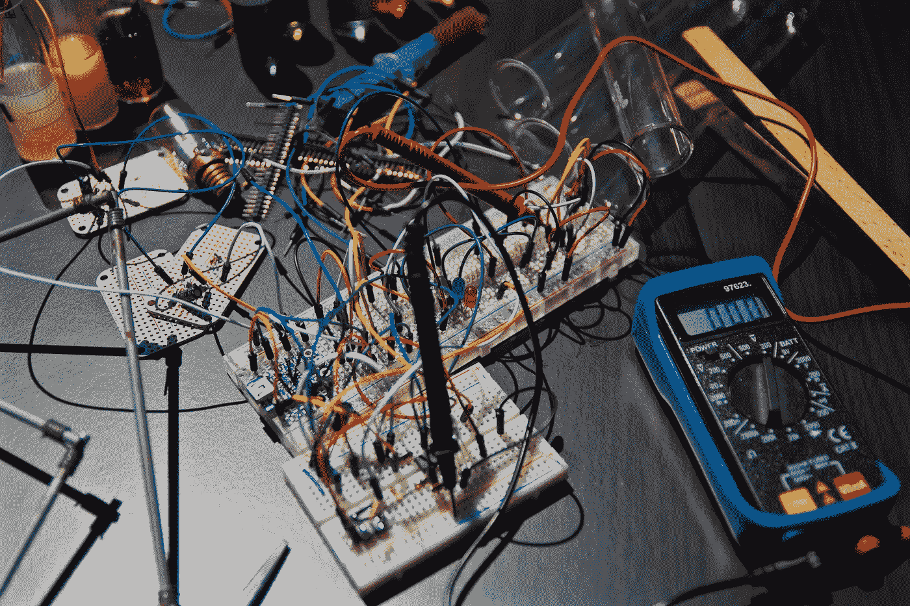

# 从深度学习实验到生产就绪模型构建的旅程🤓

> 原文：<https://towardsdatascience.com/the-journey-from-deep-learning-experimentation-to-production-ready-model-building-d9fe294d6be6?source=collection_archive---------19----------------------->

## 小规模和超大规模深度学习的主要区别

自深度学习革命兴起以来，由 [Krizhevsky 等人 2012 ImageNet](https://www.cs.toronto.edu/~kriz/imagenet_classification_with_deep_convolutional.pdf) 的胜利引发，人们一直认为数据、处理能力和数据科学家是构建人工智能解决方案的三个关键要素。拥有最大数据集、最多用于训练神经网络的 GPU 和最聪明的数据科学家的公司将永远占据主导地位。

然而，这只是事实的一部分。

虽然拥有最多数据的公司确实能够建立更好的预测模型，但模型质量的提高与数据集大小不成线性比例。与此同时，当今大多数公司要么拥有大数据，要么以数据收集为核心——因此，有人可能会说，虽然更多数据是一种竞争优势，但它不再是一种大优势。数据面临的挑战更多的是拥有带有标签和结构化数据的有意义的数据湖，而不是数据的绝对数量。更好的人工智能解决方案和数据之间存在相关性，但不一定是因果关系。

同样，虽然对处理能力的需求确实与模型训练的数据量成比例增长，但实际上今天每个公司都可以获得几乎无限的处理能力。强大的内部服务器场和大型云运营商让每个人都可以通过网络访问成千上万的 GPU。处理能力面临的挑战更多的是如何有效地利用这些资源，而不是访问它们。就像航空公司优化飞机在空中的时间一样，有效的数据科学就是优化云 GPU 的使用方式。

虽然数据科学家短缺，这表现在他们的工资上涨([比他们的软件工程师同行](https://www.glassdoor.com/Salaries/san-jose-data-scientist-salary-SRCH_IL.0,8_IM761_KO9,23.htm)高 30%)但算法开发的需求并不像拼凑基于预先研究的最佳实践的模型那样迫切。人工智能专家、作家和风险投资家[李开复](https://www.youtube.com/watch?v=ajGgd9Ld-Wc)称这种能力的转变为“从思想家到修补匠的转变”。当谈到人工智能时，我们已经从研究转向工程，这需要一套不同的技能。

通过数据、处理能力和能力的这种转变，深度学习在过去五年中从“如何应用它”的问题中变得成熟对于更实际的问题“我们如何快速扩大生产规模？”。快速构建生产规模的解决方案需要一套新的工具，而不是研究或勘探所需的工具。

让我们看看这在实践中意味着什么。

# 人工智能工具和框架来拯救！🚀

人工智能的大肆宣传和对更有技能的人的需求相结合，吸引了不同领域的人进入数据科学。软件工程师、数学家和统计学家都有不同的背景和不同的工作方式。软件工程师可能是唯一在时间紧迫的情况下在大团队中一起工作的人。

> 根据定义，工程师是思想家提出的解决方案的修补者，而数学家和分析师更多的是一个人的工作。

但是软件工程师也不总是一起工作。在 20 世纪 90 年代早期和更早的时候，软件开发往往是一个人的工作，英雄程序员们拼凑出没有人理解或能够合作的解决方案。没有支持真正协作的版本控制(你桌面上的文件，有人吗？)，更不用说单元测试了(println()测试对吗？)、持续集成、云计算或者 Scrum(UML 图和用例规格说明还是一个东西吗？).在过去的 30 年中，这些方法被反复开发，以适应加速软件开发和高效团队的需要。

*然而，今天我们在数据科学领域仍然缺乏这些工具。人们不再使用标准工具，而是设计自己的工作流、工具和框架。更糟糕的是，这一次，这些人来自完全不同的背景。快速和肮脏的解决方案再次积累。*

> 人们在 **Excel 表格**中通过 **Slack** 共享“版本控制实验”，并链接到 **Dropbox** 中存储的 **Jupyter** 笔记本。我们难道没有从过去 30 年中学到什么吗？

Dropbox 股票中的 Jupyter 笔记本就像深度学习的山达基——他们有狂热的支持者，但我们大多数人不会把钱投在它身上。工具本身并没有错，错的是你使用它们的目的。

在我们选择工具之前，我们必须就我们想要解决的问题达成一致。我认为我们要实现三个主要目标:

1.  **快速实验** —我们希望数据科学快速而敏捷。人们应该能够测试东西，而不需要花费时间在样板代码或开发工作上。
2.  **再现性** —我们希望确保我们进行的每个实验的再现性和审计追踪。团队应该互相学习，借鉴以前的实验，这样我们就不必一遍又一遍地重复发明轮子。
3.  **标准化的工作方式** —我们希望工作标准化。所以当新人加入时，他们知道事情是如何运作的。当有人离开时，我们知道他们以前做过什么。

让我们一次看一个！

# 快速实验🔬

A Data Scientist wants to quickly try out new models and see if they work. And in case they don’t tweak, re-iterate and improve!

在深度学习中，快速实验的核心取决于你处于模型构建的哪个阶段。在开始时，你需要能够探索你的数据，将它可视化并了解它。像 [H2O](https://www.h2o.ai/) 这样的工具对于了解你的数据和建立你的第一个假设是极好的。

当你走得更远时，你可能想在 Jupyter 笔记本上用熊猫做一点实验。但是，随着您构建生产规模模型的深入，尤其是如果您的团队不仅仅由您一个人组成，您肯定希望迁移到具有适当自动完成功能的 IDE，并且能够在比本地机器上的 GPU 更强大的集群上运行您的实验。

因此，快速实验的关键是全自动的机器编排，这对于单个数据科学家来说是尽可能透明的。单击一个按钮或在命令行上运行一个命令将是最佳选择。

# 再现性👯‍

Even Darth Vader seems to understand the importance of reproducibility once an optimal solution is found!

任何科学工作中再现性的关键是对每个实验进行严格和完整的簿记，即版本控制。不得不手动进行版本控制不是一个选项，因为这不是您在模型开发期间的主要关注点，从而导致随机快照而不是完全可再现性。

但是与软件工程不同，再现性不应该仅仅局限于你的训练代码，还必须包括你的训练和测试数据、外部超参数、软件库版本等等。

在这种情况下，对每一次训练运行的每一部分进行自动版本控制是最佳的解决方案。

# 标准化管道管理💩

Machine Learning pipelines are just like plumbing – you want to ensure the output from your toilet smoothly gets to the cleaning facility – without getting clogged on the way!

让整个团队以同样的方式工作，并有一定的自由度是必要的。你如何存储数据？您在哪里部署模型和代码？你在哪里训练他们？您使用哪些框架，以及如何将特征提取与模型训练链接在一起？

如果团队中的每个人都自己解决这些问题，不仅会浪费大量时间，还会使协作变得几乎不可能。

解决方案是通过标准的链接和编排方式将管道步骤解耦。作为一个简单的解决方案，它可以只是一个脚本，按顺序调用管道的每一步。但核心部分是它在公司和团队内部是标准化的。

# 深度学习的重生:人工智能平台🏆

AI Platforms standardize your way of working, abstract away unnecessary complexities and give you the power to move from idea to solution at the speed of a Shinkansen!🚄

为了给机器学习带来清晰度和结构，技术独角兽一直在构建自己的总体平台，将解决方案与上述所有挑战联系在一起，通常是以人工智能平台的形式，包括库、机器编排、版本控制、管道管理和部署。

[FBLearner Flow](https://code.fb.com/core-data/introducing-fblearner-flow-facebook-s-ai-backbone/) 是脸书的统一平台，用于协调整个公司的机器和工作流程。 [BigHead](https://soundcloud.com/twiml/bighead-airbnbs-machine) 是 AirBnB 的机器学习平台，用于标准化生产方式，主要基于 Apache Spark 构建。[米开朗基罗](https://eng.uber.com/scaling-michelangelo/)是优步的机器配器和 ML 训练平台，用于快速训练 ML 模型。

对于谷歌、网飞和几乎所有规模较大的公司来说也是如此，它们都明白通过快速建模可以获得竞争优势。

但是我们其他人呢？对于那些不能投入 10 个人年来构建我们自己的流程编排，但今天就需要结果的人来说，该怎么办？

Valohai 是 FBLearner Flow，BigHead 和 Michelangelo 对科技独角兽的意义，但却是为我们其他人建造的。它是一个基于云的服务，可以在 AWS、GCP、Azure 或你的内部服务器群上运行。Valohai 允许您在云中运行您的模型，就像您在本地主机上作为单独的步骤或流水线工作流运行它们一样。它会自动拍摄每次训练运行的快照，以便您可以随时获取生产中运行的模型(在 Valohai 的可扩展 Kubernetes 集群上)，单击一个按钮并追溯到它是如何训练的、由谁训练的、使用了哪些训练数据、代码的哪个版本等等。

然而，瓦罗海并不是你唯一的选择——你可以自己建造很多。重要的是你要确保快速的实验，实验的可重复性和标准化的工作方式。但真正的问题是，你是想上路跑步还是想从设计和制作自己的跑鞋开始？

*最初发表于*[*blog.valohai.com*](https://blog.valohai.com/from-dl-experimentation-to-production-ready-models)*。*