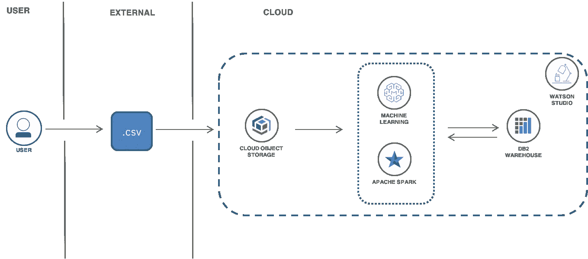
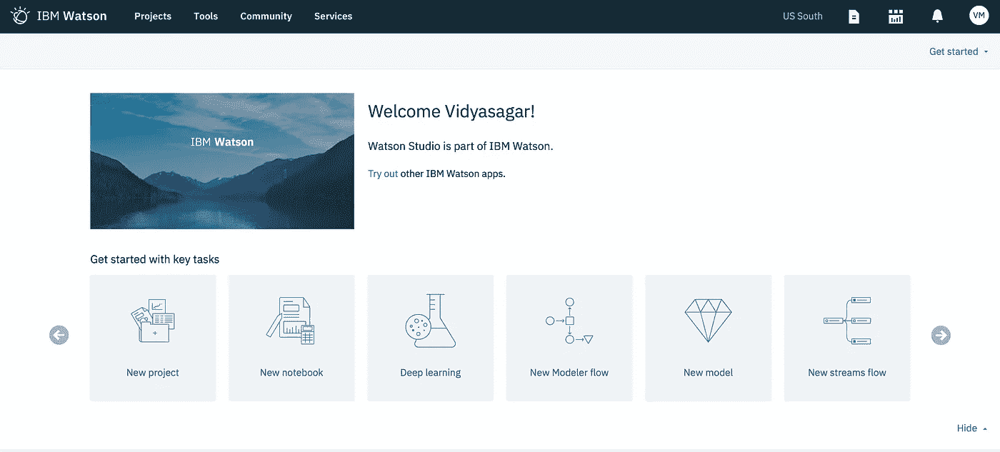
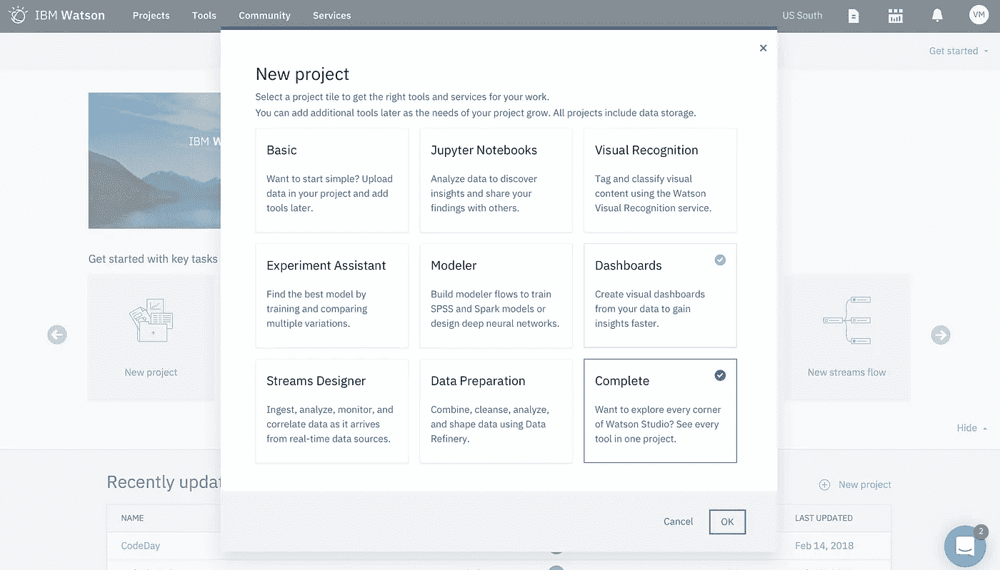
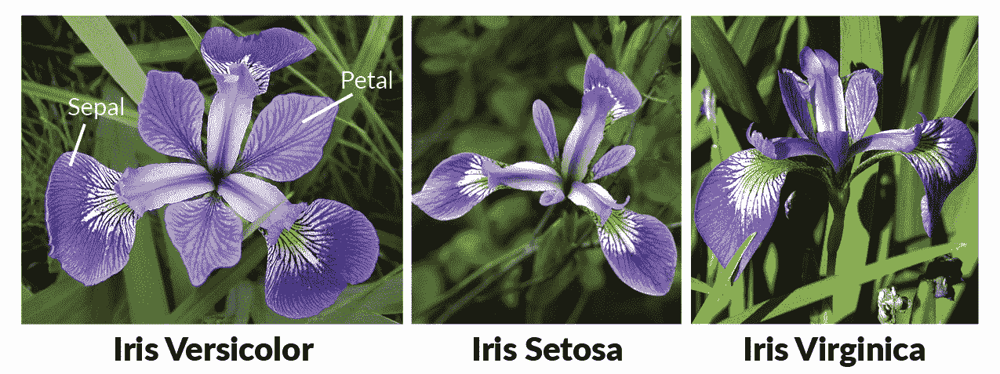
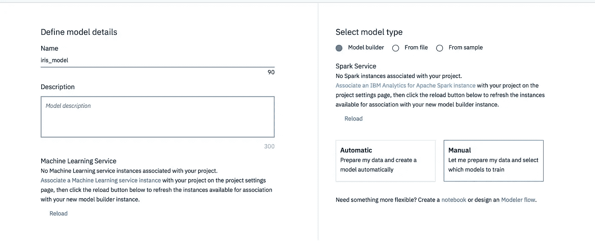
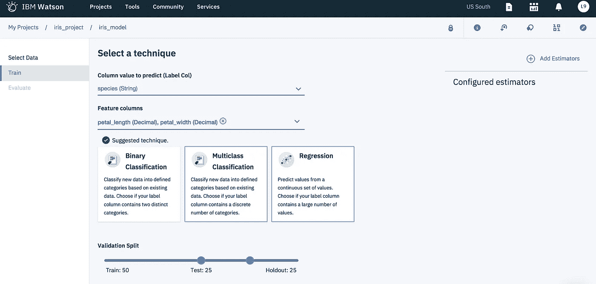
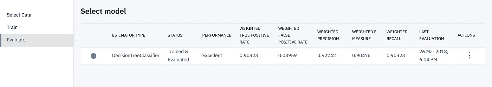

# 机器学习模型从建立到再训练的旅程

> 原文：<https://towardsdatascience.com/the-journey-of-a-machine-learning-model-from-building-to-retraining-fe3a37c32307?source=collection_archive---------6----------------------->

这篇文章摘自我们的[解决方案教程](https://console.bluemix.net/docs/tutorials/create-deploy-retrain-machine-learning-model.html#build-deploy-test-and-retrain-a-predictive-machine-learning-model)，它将带你完成构建预测机器学习模型的过程，将其部署为应用程序中使用的 API，测试该模型，并用反馈数据重新训练该模型。所有这一切都发生在 IBM Cloud 上的集成和统一的自助服务体验中。

Architecture Diagram

在这篇文章中，著名的**鸢尾花数据集**被用于创建一个机器学习模型来对花卉物种进行分类。

在 机器学习的术语中，分类被认为是监督学习的一个实例，即在正确识别的观察值的训练集可用的情况下的学习。

# 将数据导入项目

项目是你如何组织你的资源，以实现沃森数据平台的特定目标。您的项目资源可以包括数据、合作者和分析工具，如 Jupyter 笔记本和机器学习模型。

您可以创建一个项目来添加数据，并在 data refiner 中打开一个数据资产来清理和调整您的数据。

**创建项目:**

1.  进入 [IBM Cloud 目录](https://console.bluemix.net/catalog)，在 **AI** 部分下选择 [Watson Studio](https://console.bluemix.net/catalog/services/data-science-experience?taxonomyNavigation=app-services) 。**创建**服务。点击**开始**按钮，启动**沃森工作室**仪表盘。

Watson Studio Landing page

2.创建**新项目**选择**完成**。点击**确定**。为项目添加一个名称，如`iris_project`和可选描述。

3.因为没有机密数据，所以不要勾选**限制谁可以成为协作者**复选框。

4.在**定义存储**下，点击**添加**并选择一个现有的对象存储服务或创建一个新的服务(选择 **Lite** plan > Create)。点击**刷新**查看创建的服务。

5.点击**创建**。新项目打开，您可以开始向其中添加资源。

**导入数据:**

如前所述，您将使用**虹膜数据集**。Iris 数据集在 r . a . Fisher 1936 年的经典论文[中使用，在分类问题中使用多种测量](http://rcs.chemometrics.ru/Tutorials/classification/Fisher.pdf)，也可以在 [UCI 机器学习知识库](http://archive.ics.uci.edu/ml/)中找到。这个小数据集通常用于测试机器学习算法和可视化。目的是通过测量萼片和花瓣的长度和宽度，将鸢尾花分为三个种类(刚毛鸢尾、杂色鸢尾或海滨鸢尾)。iris 数据集包含 3 类，每类 50 个实例，其中每类涉及一种类型的 iris 植物。

Courtesy: DataCamp

**下载** [iris_initial.csv](https://ibm.box.com/shared/static/nnxx7ozfvpdkjv17x4katwu385cm6k5d.csv) ，其中包含每个类的 40 个实例。您将使用每个类的其余 10 个实例来重新训练您的模型。

1.  在项目中的**资产**下，点击**查找并添加数据**图标

2.在**加载**下，点击**浏览**并上传下载的`iris_initial.csv`。

3.添加之后，您应该会在项目的**数据资产**部分看到`iris_initial.csv`。单击名称以查看数据集的内容。

# 建立一个机器学习模型

1.  回到**资产**概述，在**型号**下点击**新型号**。在对话框中，添加 **iris-model** 作为名称和可选描述。
2.  在**机器学习服务**部分，点击**关联一个机器学习服务实例**将一个机器学习服务( **Lite** plan)绑定到您的项目。点击**重新加载**。

3.在 **Spark Service** 部分，点击**Associate a IBM Analytics for Apache Spark instance**将 Apache Spark Service(**Lite**plan)绑定到您的项目。点击**重新加载**。

4.选择**模型生成器**作为模型类型，选择**手动**手动创建模型。点击**创建**。

F 或者自动方法，你完全依赖自动数据准备(ADP)。对于手动方法，除了由 ADP 转换器处理的一些功能之外，您还可以添加和配置自己的估计器，这些估计器是分析中使用的算法。

5.在下一页，选择`iris_initial.csv`作为您的数据集，并点击**下一个**。

6.在**选择技术**页面上，基于添加的数据集，标签列和特征列被预填充。选择**物种(字符串)**作为您的**标签列**，选择**花瓣 _ 长度(小数)**和**花瓣 _ 宽度(小数)**作为您的**特征列**。

7.选择**多类分类**作为你建议的技术。

8.对于**验证分割**，配置以下设置:

*   **训练:** 50%，
*   **测试** 25%，
*   反对者: 25%

9.点击**添加估算器**并选择**决策树分类器**，然后**添加**。

你可以一次评估多个估值器。例如，您可以添加**决策树分类器**和**随机森林分类器**作为评估器来训练您的模型，并根据评估输出选择最佳拟合。

10.点击**下一步**训练模型。一旦看到**已培训&已评估**的状态，点击**保存**。

11.点击**概述**查看模型详情。

你的旅程不会在此停止。按照下面的步骤，您将把您的模型部署为一个 API，测试它并通过创建一个反馈数据连接来重新训练。

*   [**部署模型，试用 API**](https://console.bluemix.net/docs/tutorials/create-deploy-retrain-machine-learning-model.html#deploy-the-model-and-try-out-the-api)
*   [**测试你的型号**](https://console.bluemix.net/docs/tutorials/create-deploy-retrain-machine-learning-model.html#test-your-model)
*   [**创建反馈数据连接**](https://console.bluemix.net/docs/tutorials/create-deploy-retrain-machine-learning-model.html#create-a-feedback-data-connection)
*   [**重新训练你的模型**](https://console.bluemix.net/docs/tutorials/create-deploy-retrain-machine-learning-model.html#re-train-your-model)