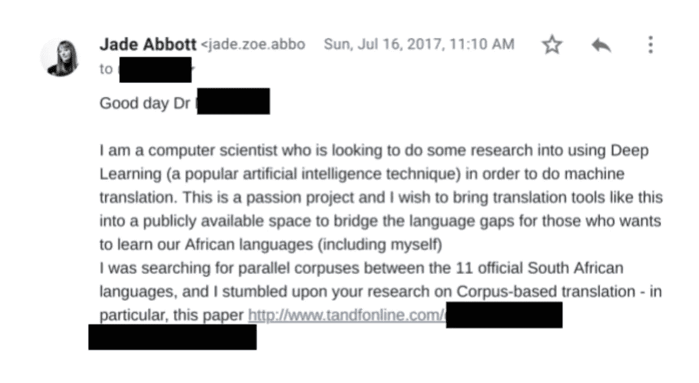
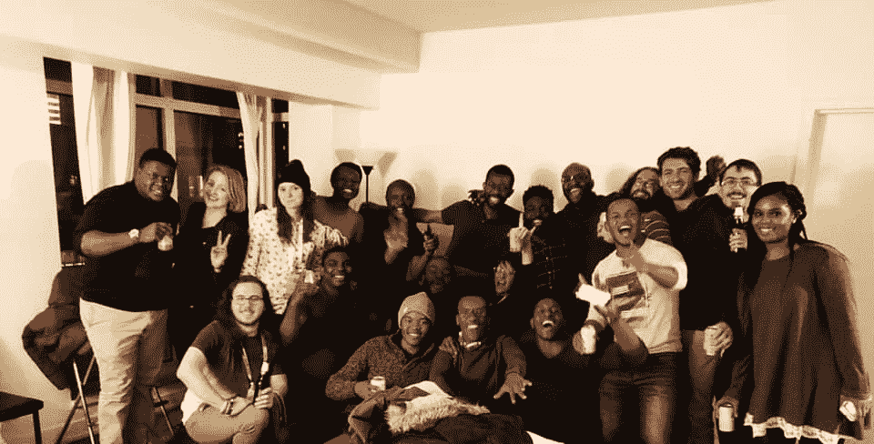

# 通往 NeurIPS 的旅程

> 原文：<https://towardsdatascience.com/the-journey-to-neurips-ee1a197da538?source=collection_archive---------19----------------------->

## 3 个月内从见面到在 NeurIPS 研讨会上演讲

今年[劳拉·简·马丁纳斯](https://medium.com/u/d2775a566698?source=post_page-----ee1a197da538--------------------------------)和我在[neur IPS](https://sites.google.com/view/ml4d-nips-2018)的 ML4D 研讨会上[发表了一篇虽小但令人兴奋的论文](https://arxiv.org/abs/1811.05467)。我们两个三个月前在 Indaba 的深度学习上相遇，仅仅一个多月，我们就向工作室提交了一些东西。当我们的小论文被接受时，我们既兴奋又震惊。我们刚刚在 NeurIPS 度过了最后一周——这是我打算在 3 年时间内实现的目标，但现在已经实现了。我觉得有必要把这段旅程写下来，并分享那些让它成为可能的经验教训和人们。我想我们中的许多人并不觉得自己有价值或者没有准备好——也许是因为我们来自不同的背景或者来自一个不寻常的机构。这是一个告诉你如何去做的故事——不管你的背景如何。

# 种子

这一切都始于一颗热情的种子。甚至在我读理学硕士期间(关于一个完全不同的主题)，我已经开始接触研究人员来获取数据集，以便为非洲语言进行机器翻译。我不知道该怎么做，但我想做。我认为这源于一种通过相互理解将南非团结在一起的动力。由于缺乏公开可用的数据集、软件和研究人员的回应，我放弃了我的搜索。我继续在我的工作场所实际应用 NLP，希望有一天机器翻译可以成为我的工作重点。

One of my many unanswered pleas

# 催化剂

如果你还没有听说过[深度学习 Indaba](https://medium.com/@alienelf/an-open-letter-to-the-deep-learning-indaba-team-2723ec0ae0a8) ，那么是时候赶上了。深度学习 Indaba 的目标是加强非洲的机器学习，他们是少数几个真正有办法在❤.机器学习领域改变多样性的运动之一我喜欢把英达巴看作是非洲惊人作品的催化剂。我可以整天谈论 Indaba，但我想强调今年 Indaba 的 3 个具体方面，它们促进了我们向 NeurIPS 的提交:

*   [Kyunghyun Cho](https://medium.com/u/7d9c005997e9?source=post_page-----ee1a197da538--------------------------------) 和 [Sebastian Ruder](https://medium.com/u/e3999e445181?source=post_page-----ee1a197da538--------------------------------) 的自然语言处理 [talk](https://www.youtube.com/watch?v=Vm6vsQfuqNU&t=2929s) 和 [workshop](https://www.youtube.com/watch?v=sGVi4gb90zk) 和 Cho 的[序列模型 talk](https://www.youtube.com/watch?v=0c6yAT7d0d0) 。没有什么比这个领域的专家指导你读什么论文更好的了。这些列表是如何快速精通该领域的指南。不仅如此，他们是世界上我最喜欢的两个人，并且总是很乐意和我讨论他们的过程。
*   [“如何撰写研究论文”研讨会](http://www.deeplearningindaba.com/uploads/1/0/2/6/102657286/research-paper-writing.pdf)由 [Nando de Freitas](http://@NandoDF) 、Ulrich 帕凯、Stephan Gouws、Martin Arjovsky 和 Kyunghyun Cho 主持。从这个演讲中学到了很多东西，但有一点很突出:写一篇好的研究论文不是因为只有去斯坦福或牛津的人才会学到的特殊魔术——我们任何人都可以写出好的研究——即使没有著名的导师或博士学位。
*   会见我的合作者[劳拉·简·马丁纳斯](https://medium.com/u/d2775a566698?source=post_page-----ee1a197da538--------------------------------)。关于劳拉有很多美好的事情，但我特别从她那里学到了一课——这是她写论文的哲学:如果你有一个想法，得到结果并写下来其实很简单——没有那么多单词或代码行。她说，如此多的研究人员已经放弃了写论文的想法——许多研究人员害怕被他们的工作所评判，因此从不提交任何东西。我认为她是对的。我记得以前每次写论文时我个人的焦虑，害怕被拒绝，害怕它会说我是一名研究人员。她的母亲和她以母女关系的身份参加了非洲各地的会议——这些论文意义不大，但它们确实提供了一个练习写论文的平台。做得越多，收获越大。

# 合作

谢天谢地，劳拉住在离我很远的一个城市。我们立即开始了每周一次的 NLP 阅读小组。前提很简单:选择一篇有意义的 NLP 论文(主要是按照 Cho 的建议)，阅读它，然后下周聚在一起，边喝啤酒、喝鸡尾酒、吃披萨边讨论它。我们发现，在一个月的时间里，我们已经深入讨论了许多神经机器翻译的关键论文。

我们梦想有工具将教育资源从英语翻译成任何一种非洲语言。我们有了为南部非洲语言的神经机器翻译技术做实验基线的想法，因为目前什么都不存在。因此，我们开始计划我们将提交给哪些会议——特别是我们正在关注的 [Africatek](http://africatek.org/) ,因为他们会发现我们的工作是相关的。

就在那时，劳拉的一个朋友给我们发来了 NeurIPS ML4D 研讨会，我们注意到离截止日期还有 10 天。我们有 10 天的时间来写实验、得到结果和写论文。

# 喧嚣

我不知道该如何解释，除非用要点来说明这一过程有多简单(实际上，这是一场与时间的赛跑):

*   使用脸书的[卷积序列对](https://arxiv.org/pdf/1705.03122.pdf)进行排序，使用谷歌的[转换器](https://arxiv.org/abs/1706.03762)使用来自 [SADiLaR](https://repo.sadilar.org/) 的现有数据集进行英语到茨瓦纳语的翻译。
*   与此同时，我花了一天时间搜索以前的研究，以便与我们的结果进行比较——该领域的研究非常稀少，而且只使用了相对古老的技术
*   我们的结果可以与现有的研究相媲美——事实上，Transformer 模型展示了英语到茨瓦纳语翻译的最新性能。显然，这是光荣和非常幸运的，因为这种通向好结果的直接途径经常发生。
*   我们花了 8 个小时写了论文。这很容易，因为我们的研究有一个明确的目的，我们希望这篇论文传达的是:激励进一步研究使用现代技术来翻译资源匮乏的非洲语言，因为我们已经证明了这些技术有前途。
*   我们又花了 5 个小时编辑了它——其中一部分是在火车上——牢记我们在英达巴学到的教训
*   我们赶上了提交截止日期。

我们每天都查看电子邮件。不管我们是否会被接受，我们都为我们的小论文感到自豪——它写得很好，符合我们的研究目标，是我们新发现的合作的代表。很小，但是很刺激。如果它没有进入研讨会，我们将学习，在成果的基础上，争取下一次会议。

# 会议

我们被接纳进了车间！那是多么美妙的感觉啊！仍然有一些事情需要处理(机票，会议票，谢天谢地没有签证问题困扰着会议的其余部分)，但是在经历了很多的忙碌之后(感谢复古兔，ML4D 研讨会和我们在深度学习学院的联系)，我们最终找到了去蒙特利尔的路！

至于会议，我将在上面写一大堆帖子，但简单地说:我们会见了来自非洲和世界各地的潜在合作者，并建立了将持续一生的联系。这是一个令人难以置信的机会，可以与他们领域的顶尖研究人员互动并向他们学习。查看我即将发布的帖子，了解从# NeurIPS2018 中学到了什么。

Some Deep Learning Indaba and Black in AI crew at #NeurIPS. Photo by [Muthoni Wanyoike](https://medium.com/u/4487b764337a?source=post_page-----ee1a197da538--------------------------------)

# 超越

这只是开始

*   甚至在被接受之前，我们就在全速继续我们的研究。我们已经取得了显著的进步，您可以在这里
*   能够参加神经科会议向我们展示了参加主要的 ML 会议的必要条件，所以现在我们把希望寄托在了 ICML ❤上
*   我们将与世界各地的研究人员合作，帮助我们为低资源语言转换神经机器翻译。

# 教训

*   你不需要有一个花哨的主管或与一个闪亮的学术机构有联系，就可以在神经科发表文章
*   如果你处于早期阶段，在尝试参加一个主要会议之前，不要回避参加一个研讨会。他们接受有希望的工作方式，并让你了解主要会议的要求。
*   练习写论文。将每份提交材料视为改进的机会。正如[乌尔里希·帕凯](https://twitter.com/ulrichpaquet)所说:“作为一名研究员，你能得到的最有价值的东西，就是让另一名研究员阅读你的作品”
*   协作者加速学习和研究，所以协作。其影响似乎是指数级的。社区，社区，社区，社区…
*   和激励你的人在一起。
*   跟随您最喜欢的研究人员。他们将引导您度过目前 ML 研究中的信息超载问题。
*   有一个你想交流的故事。
*   相信自己能行——因为你能行。如果您不认为您可以，尽管尝试吧。你可能会发现你让自己大吃一惊