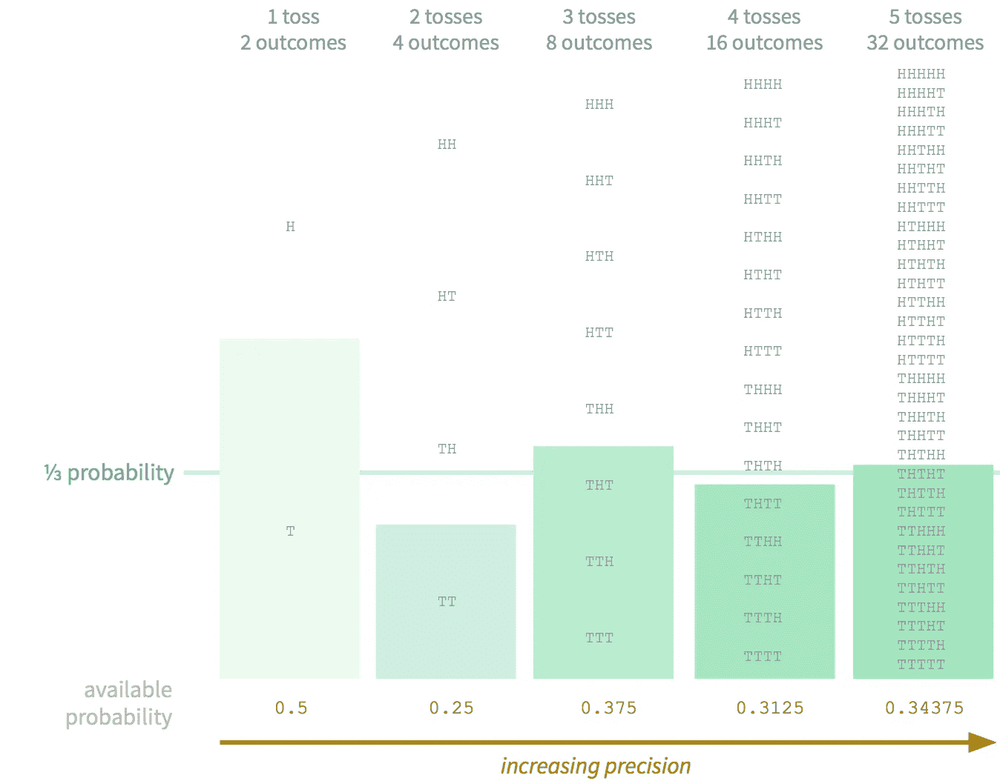
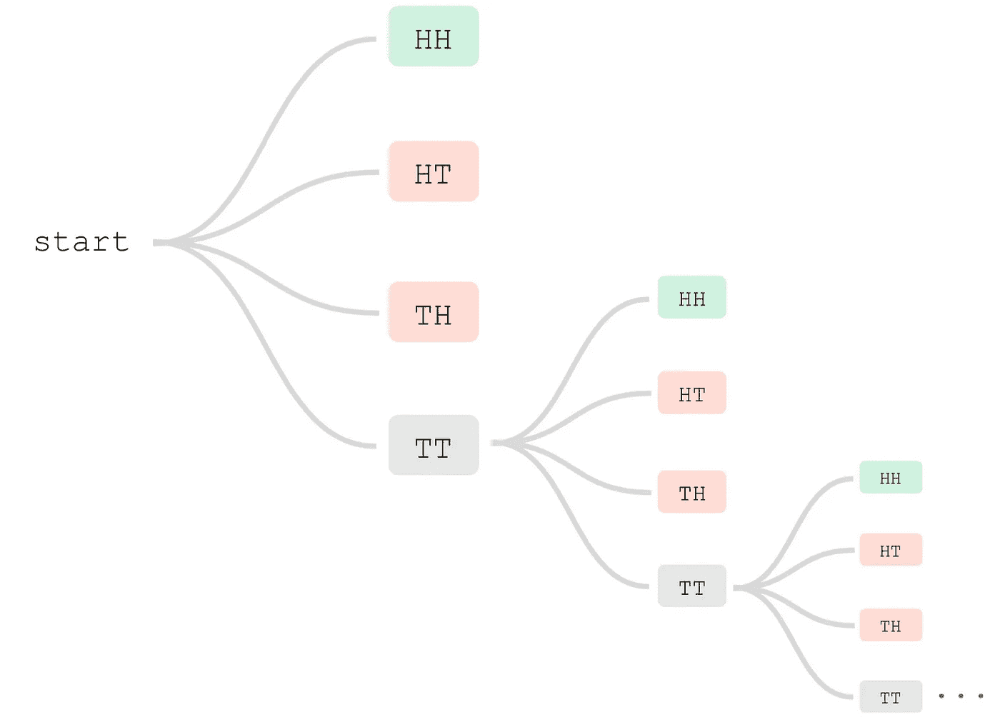
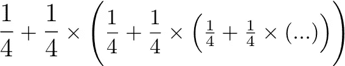
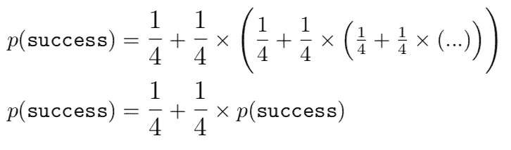
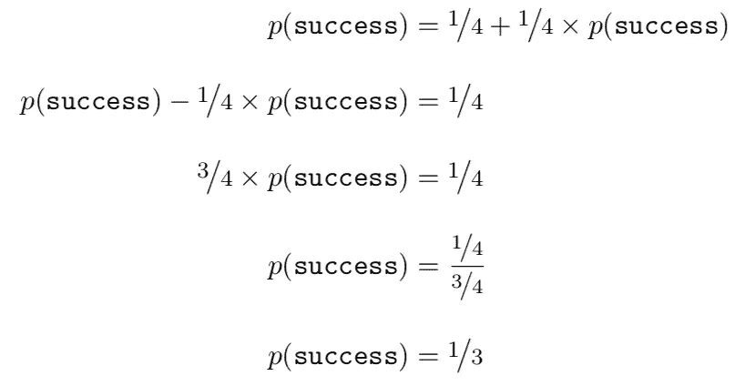

# 下兔子洞的快乐，第一部分

> 原文：<https://towardsdatascience.com/the-joy-of-going-down-rabbit-holes-part-i-5a56cecf293?source=collection_archive---------20----------------------->

作为一名想要构建真正有用的工具的数据科学家，需要掌握的一项关键技能是放弃一种思维方式。在适当的时候，得出*的结论，这将花费太多的时间，收获太少。简直不值得*。一个人必须避免掉进兔子洞。从商业角度来看，兔子洞通常会将宝贵的资源冲向一个未满足期限和仓促交付的黑洞。考虑到解决问题有多么诱人，这种经济学是一个巨大的耻辱。所以，几个月前，当一个谜题突然出现在我脑海中时，我决定一头扎进一个兔子洞。令人振奋。

在我脑海中盘旋的意识混合物所带来的问题如下。*如果我掷一枚公平的硬币，它正面朝上的几率是一半。如果我扔两次，连续两次人头落地的几率是四分之一。从这样一个随机来源中还能构建出其他什么概率呢？有没有可能把一个公平的硬币，一个我以前认为只能产生 2 的幂概率的东西，变成一个强大得多的东西？一个很好的例子，也是我在接下来的几天里一直坚持并思考的一个例子，是三分之一的概率。这听起来很容易，但它确实难倒了我。我绝对不可能去研究这个问题，剥夺自己解决这个问题的满足感。我决心看看下了这个兔子洞会把我带到哪里。*

我的第一个想法是*扔硬币我能得到什么？*半个。掷两次硬币我能得到什么？四分之一，或一半。我能做得更好吗？是的，我可以。事实上，如果你掷三次硬币，就有八种可能的结果。如果你简单地将成功定义为从这些序列中任意选择三个，你有 0.375 的成功概率。然后你可以把它精确到你喜欢的任何程度。随着 *n* 次投掷，有 *2* 的 *n* 次方个不同的序列。然后你可以取其中的大约三分之一，将这些序列定义为成功。瞧啊！随着 *n* 趋于无穷大，这个概率趋于三分之一。

Precision improves the more tosses we use [source: me]

但是，这感觉像作弊。事实仍然是，对于任何一个 *n* ,“成功”的概率仍然顽固地不等于三分之一。这似乎是一个无法解决的问题。毕竟，如果你掷硬币的次数是固定的，考虑到掷硬币的独立性，结果的任何组合或组合或组合的概率注定在分母上有 2 的幂。我需要的是一个事件，其投掷硬币的次数是*无限*，而*有限*。无界性会让我摆脱那些讨厌的 2 的幂，而有限性会确保概率总和为 1。换句话说，我需要一个保证终止的进程，但是它的终止时间理论上可以是任意整数次投掷硬币。

因此，我想到了一个简单得令人沮丧的解决方案。让我们再一次考虑我们期望的三分之一的概率。让我们回到掷硬币两次的想法。有四种可能的顺序。 **HH** 、 **HT** 、 **TH** 和 **TT** 。每一种都有四分之一的发生概率。所以如果成功是着陆，我们有四分之一的机会成功。现在，如果我们忽略结果，再试一次，如果我们得到了 **TT** 呢？现在，我们每个人都有四分之一的机会 **HH** 、 **HT** 和 **TH** 获胜，但也有四分之一的机会完全忽略结果，再次投掷硬币两次。然后，这最后的四分之一在第二次投掷的 **HH** 、 **HT** 、 **TH** 和 **TT** 之间平均分配，当然，最后的结果再次被忽略，重复这个过程，直到我们得到除 **TT** 之外的任何序列。

The sequence continues indefinitely until an outcome occurs other than **TT** [source: me]

因此，“成功”的概率是四分之一(我们在第一次双掷中获得 **HH** ),加上四分之一倍的我们在任何未来双掷中获得它的概率，也就是四分之一(我们在第二次双掷中获得 **HH** )加上四分之一倍的我们在任何未来双掷中获得**HH**…

挺住；这开始听起来像一些无穷级数。的确，正是如此。我们成功的可能性是

[source: me]

注意，省略号表示这个表达式无限重复。这导致了一个难以置信的数学上的便利方法来证明这确实导致了三分之一的概率。如果我们将整个无穷和定义为 *s* ，我们可以观察到，如果这个无穷级数有一个有限和，那么我们有下面的递归

[source: me]

因此，我们可以很容易地重新排列，求解 *s* 并观察到 *s* = *1/3* 如下

[source: me]

如果这让你不满意，这里有另一个解释。如果我们可以证明进程*有*在 **HH** 、 **HT** 或 **TH** 终止，并且这些都是同等可能的，我们必须得出结论:在 **HH** 终止的概率是 *1/3* 。

鉴于每当我们遇到 **TT** 时，我们继续并翻转两次以上，终止于 **TT** 的概率为零。但是，在 **HH** 、 **HT** 或 **TH** 中的任何一个上终止的概率平均分布在所有三个上。现在，我们只需要证明终止是必然的。让我们开始第一次双掷。这次双抛后**不**终止的概率是 *1/4* 。现在让我们进行第二次双掷。这里不终止的概率也是 *1/4* ，假设我们已经过了第一次双抛。但从一开始，任何一次投掷前，两次双掷后**不**终止的概率是 *1/4* 乘以 *1/4* ，也就是 *1/16* 。然后你可以看到，在 *n* 双掷之后没有终止的概率是 *1* 除以 *4* 的 *n* 的幂，随着 n 线性增加，它很快趋于零。例如，在十次双掷后没有终止的概率是 1/4 ⁰，大约是 0.00000095。因此，我们的流程肯定会终止，并且我们得到了想要的结果。

请继续关注第二部分，在第二部分中，我们将进一步深入兔子洞，使我们的硬币更加强大，仅使用其自身的随机性来产生任何概率的事件，这些事件可以表示为 *n/d* ，其中 *n* 和 *d* 是整数。