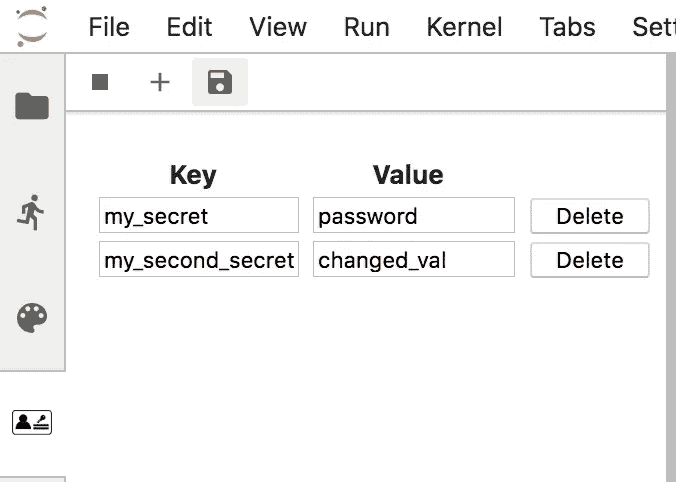
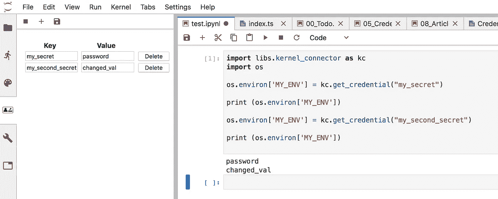
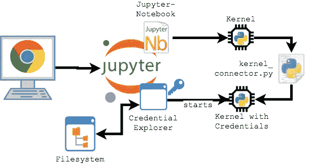

# JupyterLab 凭据存储

> 原文：<https://towardsdatascience.com/the-jupyterlab-credential-store-9cc3a0b9356?source=collection_archive---------14----------------------->

这个 JupyterLab 扩展使您的凭证安全，并提供方便的访问。


## TL；博士:

**JupyterLab 凭据库**使用 AES 加密保护您的凭据安全。在这个 JupyterLab 前端扩展中添加、编辑和删除作为键-值对的凭证。使用他们的密钥访问凭据:

```
import kernel_connector as kc
kc.get_credential(“my_secret”)
```

使用以下命令安装 **JupyterLab 凭证存储库**:

```
pip install pycrypto
apt-get install nodejs -y
apt-get install npm -y
jupyter labextension install @lean-data-science/jupyterlab_credentialstore
```

如果你喜欢容器化的配置， **JupyterLab 凭证存储库**与 [JupyterLab-Configurator](https://lean-data-science.com/#/configure-jupyterlab) (此处呈现)无缝集成，让你轻松创建自己的 **JupyterLab 配置**。

## 保管好你的证件

JupyterLab 是一个交互式开发环境，使您能够在选项卡式工作区中使用 Jupyter 笔记本。Jupyter 笔记本允许您轻松地与您的同事共享您的代码和模型。当您处理数据时，访问数据几乎总是需要某种形式的凭证，例如用户名和密码或 API 访问密钥。

你需要特别注意你的证件。如果您直接在笔记本中使用它们，您可能会意外地暴露它们，例如，当您将笔记本提交到您的 git-repository 时，或者当您共享笔记本时。

## 笔记本的力量:是福是祸

以正确的方式处理凭证的问题不仅限于 Jupyter 笔记本。这在任何其他开发环境中都同样重要。但是笔记本有暴露凭证的特殊风险。不是技术上的。而是程序性的！

笔记本作为一种工具，可以快速、轻松地浏览数据，无需太多开销。笔记本电脑不需要明确的解决方案架构来规定代码、数据和凭证的存放位置。笔记本电脑很少采用多阶段部署的方式投入生产，这可确保凭据分别安全地存储在各个阶段的配置中。

但是笔记本是一个灵活而强大的工具。它们在数据科学家的工具箱中有合法的位置。

## 环境变量

将凭证存储在环境变量中是一种常见的做法。环境变量驻留在系统进程中。Jupyter 内核就是一个很好的例子。这些进程源自操作系统(或启动它们的软件，如 Jupyter)。流程及其环境变量不是笔记本的一部分，因为笔记本不是流程，而是文件(JSON)。Jupyter 应用程序将笔记本文件与进程(内核)连接起来。

但是使用环境变量似乎是一种有一些缺点的变通方法:

1.  无论何时添加、编辑或删除环境变量，都必须重新启动笔记本服务器，以使更改生效。但是，如果您刚刚完成了一个长时间运行的计算，您不能存储它的结果，因为存储它需要一个 API 调用，您之前没有设置它的凭证，那该怎么办呢？请你把凭据放进笔记本里，只有这一次，答应吗？哎呀！
2.  API(例如 AWS)通常提供使用环境变量的便利功能。当环境变量设置好后，一切都正常了。但是你的同事在使用笔记本和复制你的结果时遇到了问题。不仅如此，API 调用也不起作用(这是可以的，因为你不希望别人使用你的账户)。而且，你的同伴不一定知道(详细地)为什么它不起作用，以及需要什么来使它起作用。当你不能轻松分享时，笔记本就失去了它的大部分用途。
3.  如果因为使用两个同类服务(例如 AWS)而需要同一个环境变量的两个不同值，该怎么办？每个服务都需要自己的凭据。您会手动设置和更改环境变量吗？在给定的情况下，记住变量的所需值将是一个严峻的挑战，不是吗？

## 保持你的灵活性

**JupyterLab 凭据库**保留了 Jupyter 笔记本的灵活性，同时确保您的凭据安全。这个 JupyterLab 扩展向您的工作区添加了一个凭证浏览器，您可以通过侧边栏上的菜单项打开它。在凭据资源管理器中，您可以添加、编辑和删除凭据的键值对。



The credential explorer

您可以在代码中轻松使用凭据。只需导入`kernel_connector`并使用其密钥访问凭证。这就像使用环境变量一样简单。

```
import kernel_connector as kc
kc.get_credential(“my_secret”)
```

当您更改凭证时，不需要重新启动内核。当您添加或编辑凭证时，只需按下保存按钮，您就可以直接使用它。当您删除凭据时，对它的访问会立即被删除。

如果需要设置环境变量，可以在代码中完成，而不会有暴露凭据的风险。因为您直接在活动内核中设置环境，所以您可以立即使用它，而无需重启内核。这允许您动态地准备您的环境。它明确地向你的同伴显示，你在这里使用环境变量。但这并没有暴露他们！下图描述了这个用例。但是请注意，您不应该打印您的凭据。



Example of using the credential store

## 你的证书是安全的

**JupyterLab 凭据库**使用您在首次使用时设置的密码。每个凭证都用您的密码散列加密。加密的凭证存储在启动 JupyterLab 的目录中的`.credentialstore`文件中。如果您使用版本控制系统，请确保将它添加到您的`.gitignore`文件中。

JupyterLab 凭证存储库要求您在解密凭证之前登录。因此，即使有人获得了你的`.credentialstore`文件，那个人仍然需要破解 AES 加密的密码。

2003 年 6 月，美国政府宣布 AES 可用于保护最高机密级别的信息。

## Jupyter 辅助安全

**JupyterLab 凭证存储库**利用了 Jupyter 的一个核心特性:生成缺省情况下相互独立的进程(内核)的能力。当您登录到凭证存储时，它会将解密的凭证放入一个新的 Python 内核中。为了获得凭证，您需要访问这个内核。因为每次启动凭证存储时内核的标识符都会发生变化，这增加了一定程度的混淆。

这个 JupyterLab 扩展的`kernel_connector`模块从前端获取 kernel-id，并提供对保存凭证的内核的方便访问。

当您停止凭证存储时(使用 stop 图标)，持有凭证的内核会立即停止。因此，您的凭证会立即被阻止访问。如果您现在试图访问它们，库将抛出一个异常。如果您再次登录，您可以立即再次访问，而无需重启内核。

## 易于安装

您可以使用以下命令安装 **JupyterLab 凭证存储库**及其依赖项:

```
apt-get install nodejs -y
apt-get install npm -y
jupyter labextension install @lean-data-science/jupyterlab_credentialstore
```

您还可以使用[**JupyterLab-Configurator**](https://lean-data-science.com/#/configure-jupyterlab)为您自动创建一个脚本控制的容器化 JupyterLab 环境。在配置器中，只需选中**使用 JupyterLab 凭证存储**选项。关于**JupyterLab-Configurator**的介绍见[这篇文章](/how-to-setup-your-jupyterlab-project-environment-74909dade29b)。

容器化的 JupyterLab 环境不仅方便使用，而且进一步增加了安全性。容器将保存凭证的内核与系统的其余部分分开。如果有人想访问这个内核，他需要首先进入容器的环境。

下图描述了 **JupyterLab 凭证存储库**的架构。



The architecture of the JupyterLab Credential Store