# 支持向量分类中的核技巧

> 原文：<https://towardsdatascience.com/the-kernel-trick-c98cdbcaeb3f?source=collection_archive---------0----------------------->

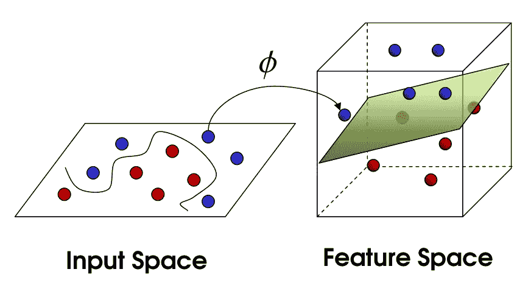

内核技巧似乎是统计学和机器学习中最容易混淆的概念之一；它首先看起来是真正的数学魔法，更不用说词汇歧义的问题(内核是指:一种估计概率密度(统计)的非参数方法，线性变换 T 映射到零向量的向量集**v**——即 T( **v** ) = 0(线性代数)，通过组之间的同态映射到单位元素的组 G 中的元素集(群论)，计算机操作系统的核心(计算机科学)，或者与坚果种子有关的东西).

尽管理解核技巧有一些障碍，但是理解核在支持向量分类中是如何使用的是非常重要的。出于实际原因，理解这一点很重要，因为实现支持向量分类器需要指定一个核函数，并且没有既定的通用规则来知道哪种核最适合您的特定数据。

更概念性地，内核技巧还说明了一些关于表示数据的不同方法以及机器学习算法如何“看到”这些不同的数据表示的基本思想。最后，内核技巧中表面上的数学花招只是让人们进一步探索它的实际含义。

在这篇文章中，我当然不能完全解释内核的技巧。我相信对内核技巧的真正深入理解需要严格的数学处理，而这不可能在所谓的七分钟阅读中完成，更不用说由那些实际上只在很短时间内学习内核技巧和 SVM 的人来完成。但是，我将尝试做以下事情:

*   简要介绍支持向量分类
*   在支持向量分类的上下文中可视化一些非线性变换
*   介绍核技巧在训练支持向量分类器中的好处在于独特的数据表示

# I ntro 支持向量分类

支持向量分类基于一种非常自然的方式，人们可以尝试将数据点分类到各种目标类中。如果我们的训练数据中的类可以由一条线或某个边界分开，那么我们可以根据数据位于该决策边界的哪一侧来对数据进行分类。

在下面的二维例子中，我们可以用三条线中的任何一条来分隔数据，然后根据观察值是在线的上方还是线的下方来分配类别。数据是由特征 X1 和 X2 指定的二维矢量，分类标签为 y =1(蓝色)或 y = 0(红色)。

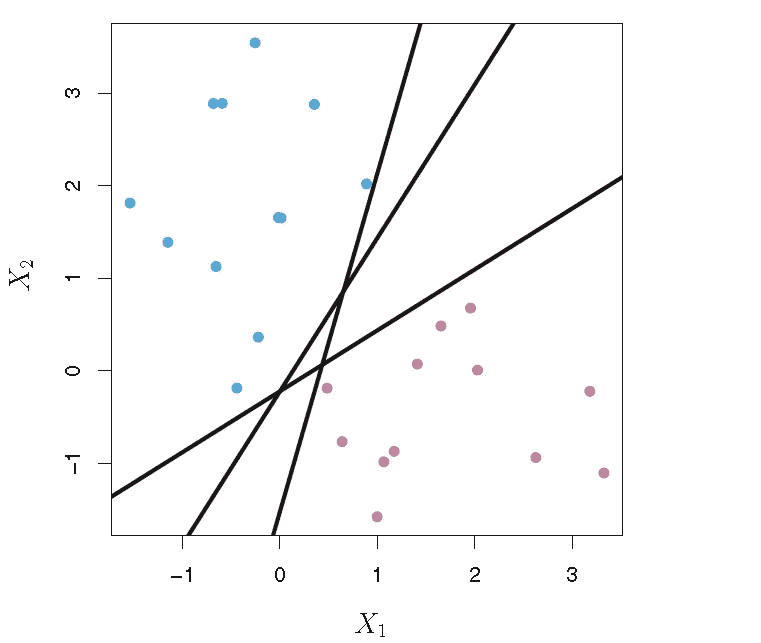

An example dataset showing classes that can be linearly separated.

像机器学习和生活中的几乎每个问题一样，训练线性支持向量分类器是一个优化问题。我们最大化*裕度*——分离属于相反类别的最近的一对数据点的距离。这些点被称为支持向量，因为它们是“支持”或确定决策边界的数据观察。为了训练支持向量分类器，我们找到了*最大间隔超平面*，或*最优分离超平面*，其最优地分离两个类，以便推广到新数据并做出准确的分类预测。

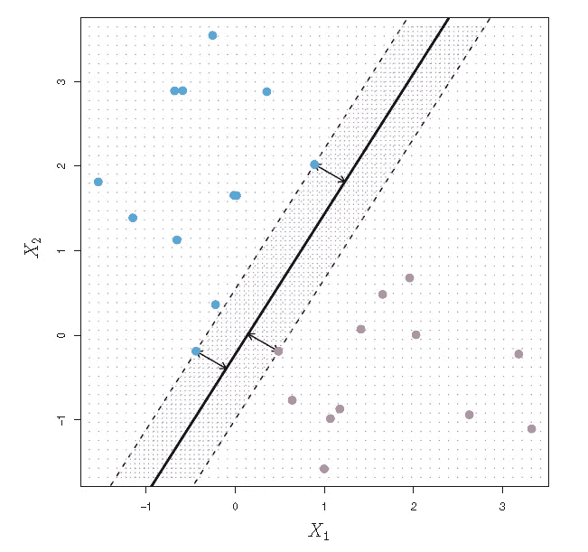

The support vectors are the points on the dashed lines. The distance from the dashed line to the solid line is the margin, represented by the arrows.

支持向量机在高维空间更难解释。很难想象数据是如何线性分离的，以及决策边界是什么样子的。p 维中的超平面是位于更大的 p 维空间内部的 p-1 维“平坦”子空间。在二维中，超平面只是一条线。在三维中，超平面是一个规则的二维平面。从数学上讲，我们有以下内容:

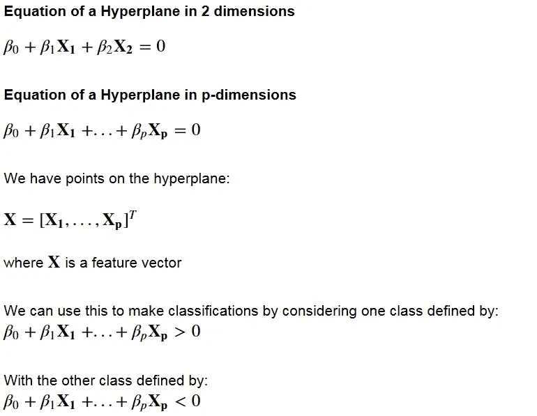

Equations defining a hyperplane and the classification rules defined by the decision boundary.

支持向量分类依赖于线性可分数据的概念。在数据不是完全线性可分的情况下，“软边界”分类可以适应训练数据上的一些分类错误。然而，在实践中，数据通常远远不是线性可分的，我们需要将数据转换到更高维的空间中，以便适合支持向量分类器。

# 非线性变换

如果数据在原始或输入空间中不是线性可分的，那么我们对数据应用变换，将数据从原始空间映射到更高维的特征空间。目标是在转换到更高维度空间之后，类别现在在这个更高维度特征空间中是线性可分的*。然后，我们可以拟合一个决策边界来划分类别并进行预测。决策边界将是这个高维空间中的超平面。*

显而易见，很难将高维数据可视化，因此我们首先关注应用于一维数据的一些变换。在这个例子中，左边的图片显示了我们的原始数据点。在一维中，这些数据不是线性可分的，但是在应用变换 *ϕ* (x) = x 并且将第二维添加到我们的特征空间之后，这些类变成线性可分的。

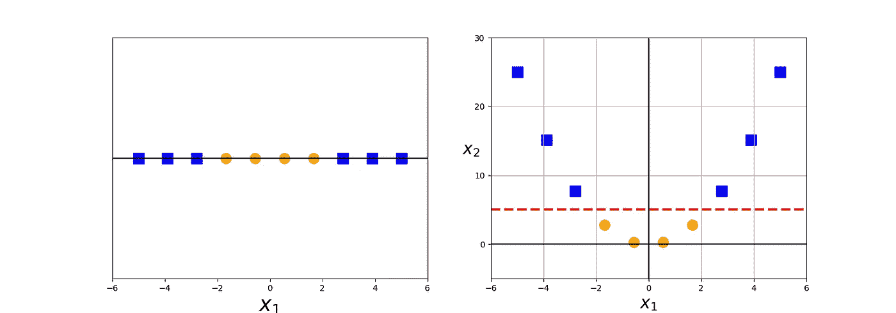

This data becomes linearly separable after a quadratic transformation to 2-dimensions.

目前，我们只是检查原始数据到更高维度的转换，允许数据线性分离。这些只是函数，还有许多可能的函数可以将数据映射到任意数量的更高维度。

这里我们应用变换 *ϕ* (x) = x 模 2

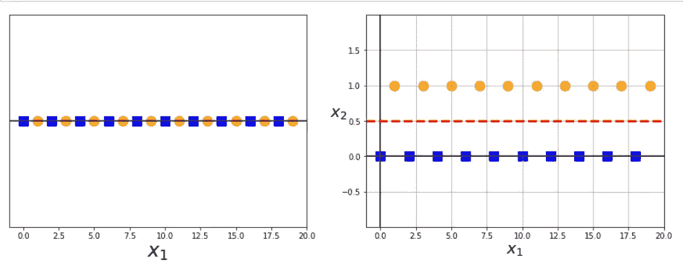

This transformation allows us to linearly separate the even and odd X1 values in 2 dimensions.

现在让我们看一个例子，在这个例子中，我们的原始数据在二维空间中不是线性可分的。这里是我们的原始数据，不能线性分离。

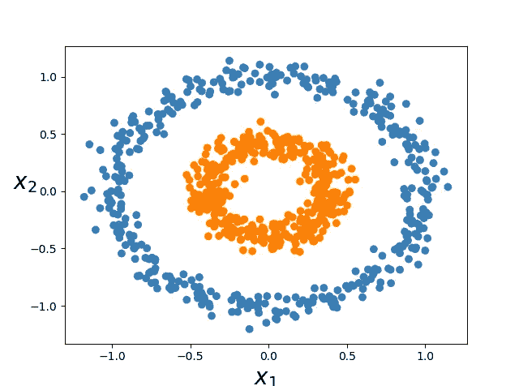

经过以下转换:

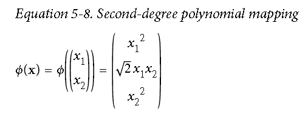

我们的数据在三维空间中可以线性分离(通过二维平面)。

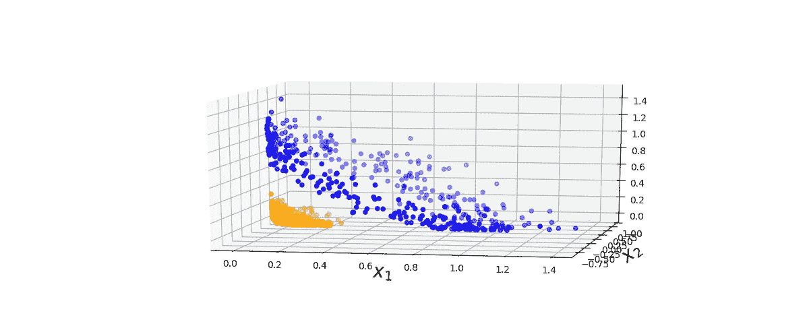

Linearly separable data in 3-d after applying the 2nd-degree polynomial transformation

可以有许多允许数据在更高维度中线性分离的转换，但是并不是所有这些函数都是内核。核函数具有特殊的性质，这使得它在训练支持向量模型中特别有用，并且在优化非线性支持向量分类器中使用该性质通常被称为核技巧。

# 内核技巧

我们已经看到了更高维度的变换是如何允许我们分离数据以进行分类预测的。看起来，为了训练支持向量分类器并优化我们的目标函数，我们将不得不对变换后的特征空间中的更高维向量执行操作。在实际应用中，数据中可能有许多特征，应用涉及这些特征的许多多项式组合的变换将导致极高且不切实际的计算成本。

**内核技巧**提供了这个问题的解决方案。“诀窍”是内核方法仅通过原始数据观察值 **x** (原始坐标在低维空间中)之间的一组成对相似性比较来表示数据，而不是显式应用变换 *ϕ* ( **x** )并通过高维特征空间中的这些变换坐标来表示数据。

在核方法中，数据集 **X** 由成对相似性比较的 n×n 核矩阵表示，其中条目(I，j)由**核函数定义:** k(xi，xj)。这个核函数有一个特殊的数学性质。核函数充当修改的点积。我们有:

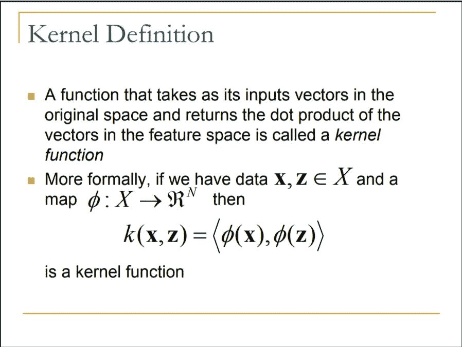

我们的核函数接受原始低维空间中的输入，并返回高维空间中的变换向量的点积。在某些条件下，也有定理保证这种核函数的存在。

通过考虑变换向量 *ϕ* ( **x** )的每个坐标只是相应的低维向量 **x** 中的坐标的某个函数，可以在某种程度上帮助理解核函数如何等于变换向量的点积。

例如，下面举例说明了二次多项式的核心技巧，并且我们在前面的图中以三维方式可视化了这种转换。变换后的向量具有作为两个分量 x1 和 x2 的函数的坐标。所以点积也只包括分量 x1 和 x2。内核函数也将接受输入 x1、x2 并返回一个实数。点积也总是返回一个实数。

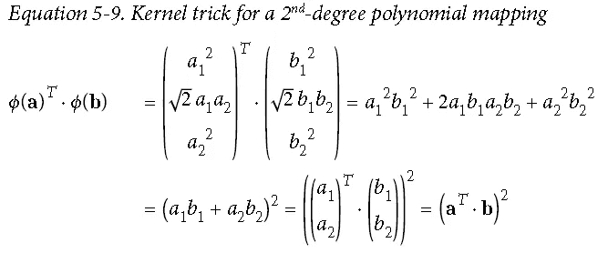

On the left-hand side, we have the dot product of the transformed feature vectors, which is equal to our 2nd-degree polynomial kernel function.

这里的核函数是多项式核 k(a，b) = (a^T * b)

核技巧的最终好处是，我们正在优化以适合更高维度决策边界的目标函数仅包括变换后的特征向量的点积。所以我们可以直接用核函数代替这些点积项，甚至不用 *ϕ* ( **x** )。

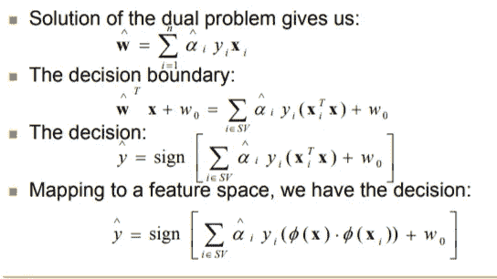

In the bottom equation, we replace the dot product of the transformed vectors with the kernel function.

请记住，我们的数据只能作为高维空间中的向量 *ϕ* ( **x** )进行线性分离，我们正在这个高维空间*中寻找最佳分离超平面，而无需计算或者实际上甚至不知道任何关于ϕ(x).的事情*