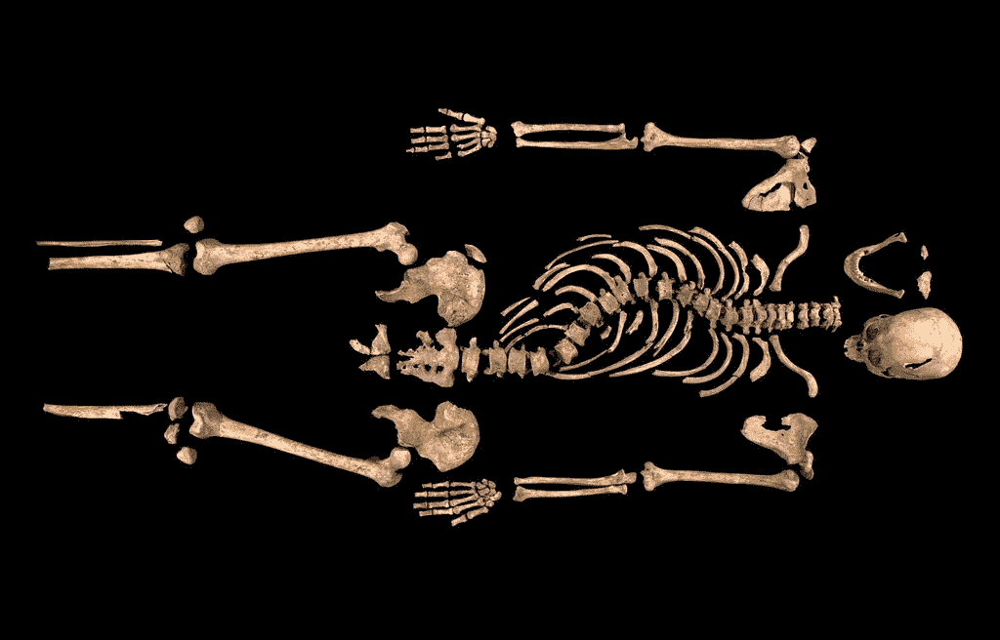
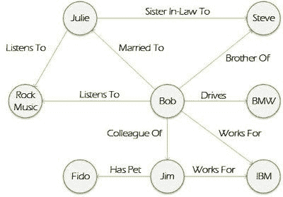
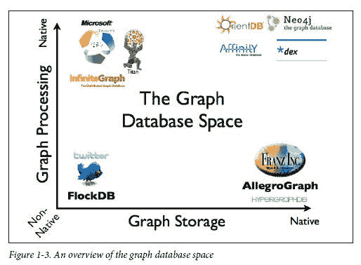

# 图论发现的王者

> 原文：<https://towardsdatascience.com/the-king-that-graph-theory-discovered-8cce31a3cd26?source=collection_archive---------17----------------------->

这是为那些可能在数据科学环境中使用网络的人解释网络原理的系列文章的第四篇。第一篇文章，主要讲图论的起源和图的基本性质，这里可以找到[](/facebook-and-twitter-were-born-in-18th-century-europe-2efdf6816693)**。**

*2012 年 8 月的一个早晨，在英国中部莱斯特的一个停车场，一台机械挖掘机开始切入混凝土表面。许多感兴趣的观众都在场，抱着一线希望，希望可能会发生一些惊人但极不可能发生的事情。*

*一些艰苦的侦探工作让一群业余和专业历史学家相信，这可能是 500 多年前理查德三世——弯腰驼背的英国国王，在 1485 年博斯沃思菲尔德战役中惨遭杀害——被随意抛弃的地方。在捐款和众筹的支持下，他们筹集了足够的资金，并获得了在当地议会大楼停车场进行有限考古挖掘的批准。他们激动得无以复加。其他人，包括在场的学术和专业考古学家，都持怀疑态度。*

**

*The skeleton of King Richard III discovered in Leicester in 2012*

*第一次切割是在停车场的一个区域，标有一个看起来神秘的字母 R。这可能表明这个停车位是为某个重要人物保留的，但事实上，没有人能解释为什么那个 R 会在那里以及它意味着什么。*

*几个小时后，在字母 R 的正下方，他们发现了一具驼背的骷髅。*

*这是现代最惊人的考古发现之一的开端。但是，他们如何证明这具骨骼无疑就是国王理查德三世呢？它清楚地显示出一生都饱受脊柱侧凸的折磨——这与历史上对国王理查德三世的描述有着长久的联系。*

*随后对骨骼的分析表明，它可以追溯到 15 世纪晚期，并且享受丰富的肉类和鱼类饮食，所有这些都增加了这是国王的可能性。但是他们还需要一样东西来完成证明:DNA。*

*用 DNA 来证明这是理查德三世将是一个巨大的挑战。只有线粒体 DNA 或 mtDNA，在家族中通过母系遗传，一代代保持不变。因此，为了找到证据，需要找到一个活着的理查德三世的妹妹的后代，这个后代只能通过一个 500 岁的女性来追溯。大海捞针！*

*那根针原来是加拿大人迈克尔·易卜生，他在伦敦北部做木匠和家具修复工。从迈克尔的嘴里取出了一个拭子，提取了 mtDNA，并与从骨骼上提取的进行了比较。这是一场完美的比赛。*

*2015 年 3 月 26 日，挖掘出的国王理查德三世的遗体被带到莱斯特大教堂，在那里，在他去世 500 多年后，它以完整的英国教会仪式和盛大的仪式被重新安葬！*

**

*Graph databases focus on the properties of nodes and the relationships between them*

# *图形数据库*

*由于图表数据库的出现，迈克尔·易卜生的皇室血统和无数其他家族血统之谜现在变得更容易被发现。*

*尽管图形数据库自 20 世纪 60 年代以来就存在于高度专业化的圈子中，但它在 2005 年左右才开始进入企业技术领域。与更常见的将信息存储在链接表中的关系数据库不同，图数据库背后的原理与数学图论中的原理完全相同(有关图论的简介，请参阅本系列以前的文章)。在与人的研究相关的领域中，图形数据库可能特别有用。*

*每个“顶点”或“节点”可以存储关于人或物体的信息。每条“边”都存储着它所连接的节点之间的关系信息。这允许更灵活的查询。通过查询节点和边，您可以回答类似“显示所有与此人一起发表过论文的人”这样的问题。在[数学谱系项目](https://www.genealogy.math.ndsu.nodak.edu/index.php)的网站上，通过查询图形数据库，我可以使用边来追溯我的数学谱系到像狄利克雷、泊松和欧拉这样的巨人。我也可以通过查询节点来了解我的或者他们的博士论文题目。*

*显然，像脸书、Twitter 和 LinkedIn 这样的社交媒体引擎是由图形数据库大量支持的。边缘将你与你的追随者或关系，以及你的喜好联系起来。当脸书最近引入了更广泛的反应(如愤怒、爱)时，他们基本上只需将这些添加到他们的图形数据库的边缘属性中。*

*系谱学也是一个被图形数据库大规模支持的领域的很好的例子。*Ancestry.com*在其节点中存储个人的传记信息(出生日期、结婚日期、照片、文档)，在其边缘存储关系数据(母亲、父亲、兄弟、姐妹)。当您查看某人的家谱时，您正在查询该人的图形数据库(尽管一种特殊类型的图形被称为树—参见[此处](/facebook-and-twitter-were-born-in-18th-century-europe-2efdf6816693) 了解图形类型的简介)。*

**

# *建立图形数据库*

*图形数据库的设置和配置相对简单，目前市场上已经有一些成熟的图形数据库产品。 *Neo4j* 是目前最流行的图形数据库，适用于大多数用例，但也有很多其他的。对于任何以关系为主要分析焦点的用例来说，图数据库将证明优于传统的关系数据库。它将更快地处理查询，并且更容易配置和调整。您可以通过更高效的查询来询问更复杂的问题。*

*在大多数图数据库中，如果你熟悉图论，查询语言是非常直观和容易学习的。 *Neo4j* 的查询语言 *Cypher* ，用括号将节点括起来，如`(p)`，用箭头表示边/关系，如`-->`。比如说，你可能想使用 *Neo4j* 来找到你最亲密的朋友，他们可以教你关于 *Neo4j* 的知识——你可能会这样使用:*

```
*MATCH (you {name:"You"})
MATCH (expert)-[:WORKED_WITH]->(db:Database {name:"Neo4j"})
MATCH path = shortestPath( (you)-[:FRIEND*..5]-(expert) )
RETURN db,expert,path*
```

*当您拥有可以重新配置以表示人或对象之间的连接的现有数据时，设置图形数据库引擎特别有意义。这方面的例子可能包括:*

*   *根据时间表或财务数据在项目中一起工作的时间*
*   *来自电子邮件元数据的电子邮件或日历连接*
*   *日志或出勤记录中的共同参与事件*
*   *发布记录的文档协作*
*   *公开的关系，如导师或教练关系*
*   *实体之间的契约关系*

*如果您没有玩过图形数据库，请尝试找个机会测试一下。亲身体验会让你真正感受到他们的力量。如果图形数据库可以在几秒钟内找到你所有的第五代表兄弟，想象一下他们在一个大型组织中可以做什么。*

*在本系列关于网络分析的下一篇也是最后一篇文章中，我将探讨网络如何为研究现象提供难以置信的机会，并为网络支持的未来研究提供思路。*

*最初我是一名纯粹的数学家，后来我成为了一名心理计量学家和数据科学家。我热衷于将所有这些学科的严谨性应用到复杂的人的问题上。我也是一个编码极客和日本 RPG 的超级粉丝。在[*LinkedIn*](https://www.linkedin.com/in/keith-mcnulty/)*或*[*Twitter*](https://twitter.com/dr_keithmcnulty)*上找我。**