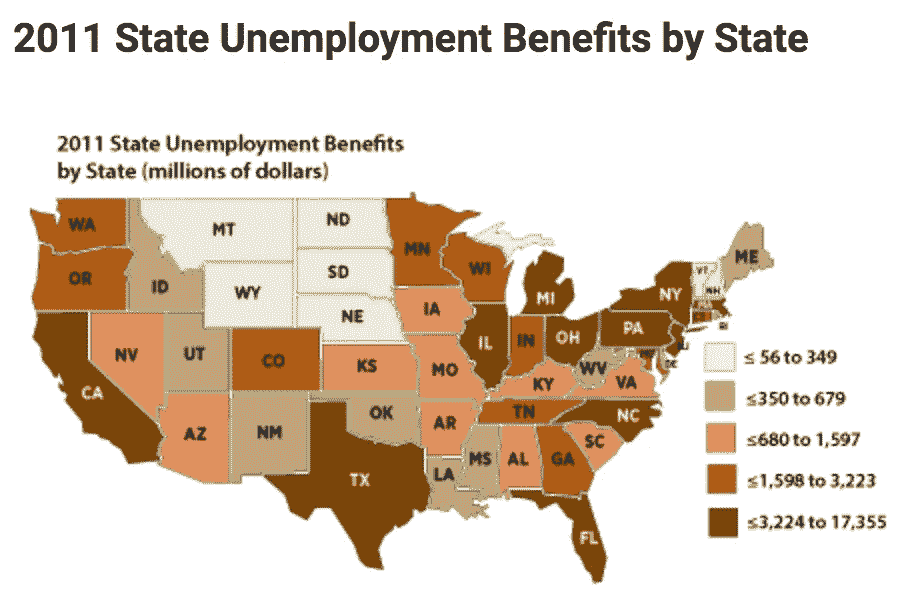
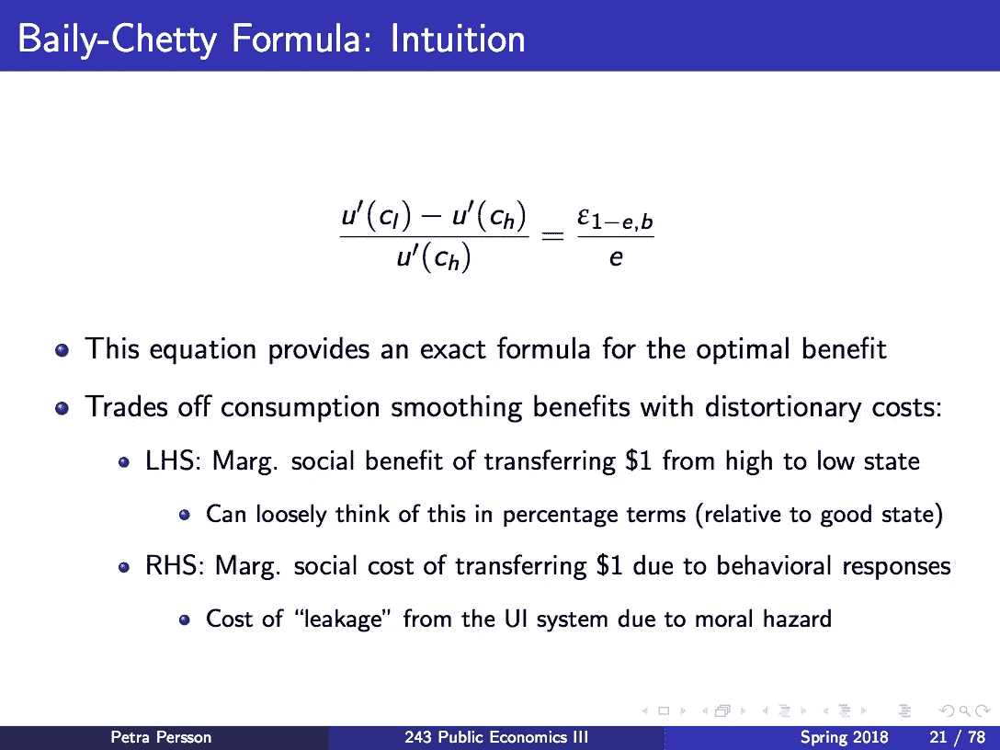
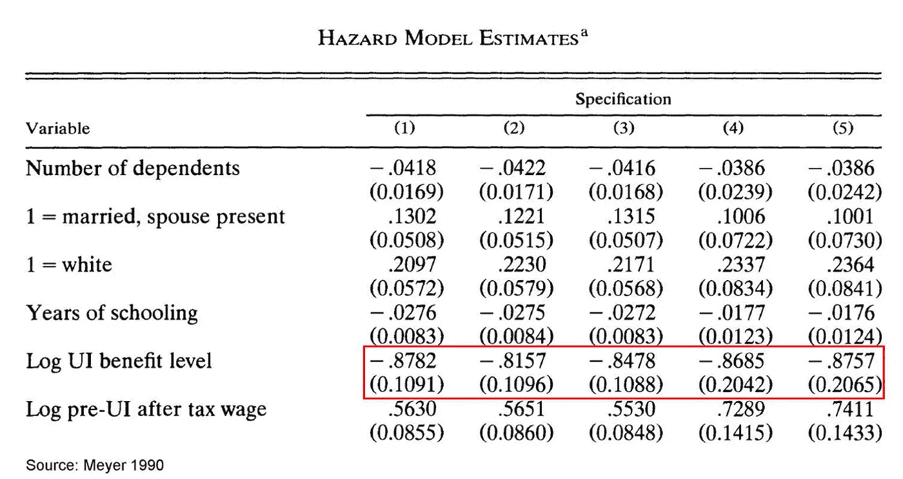
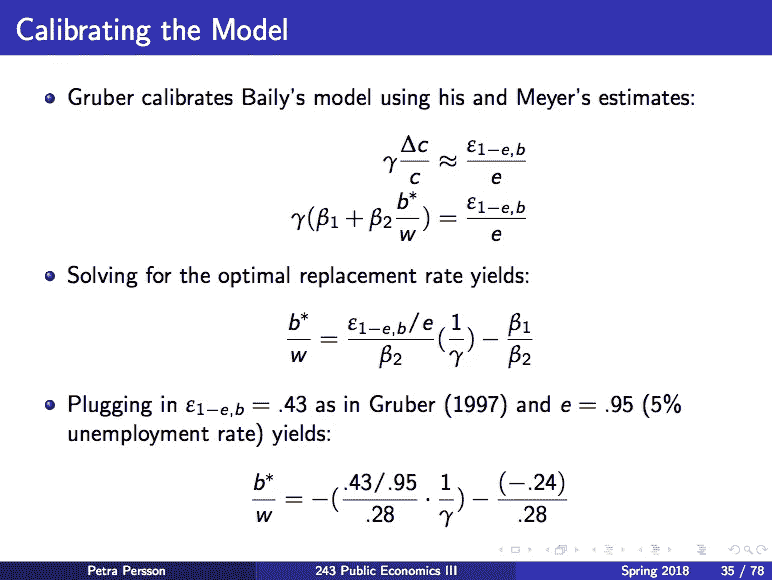
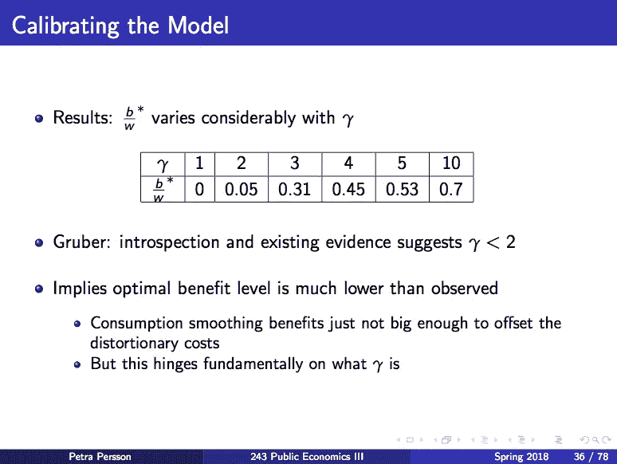
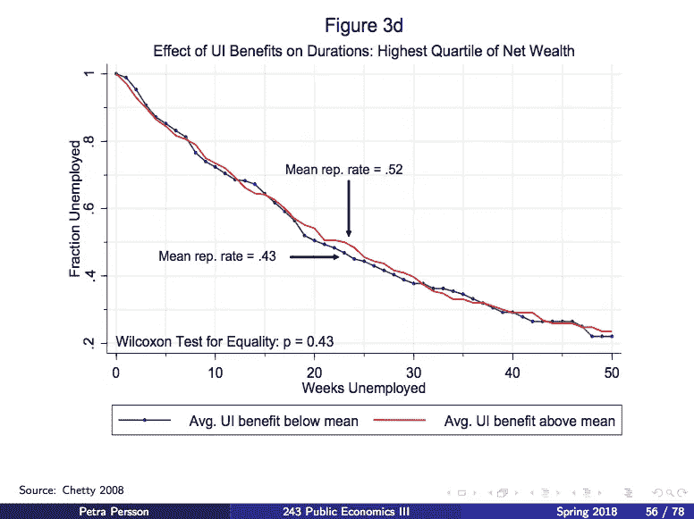
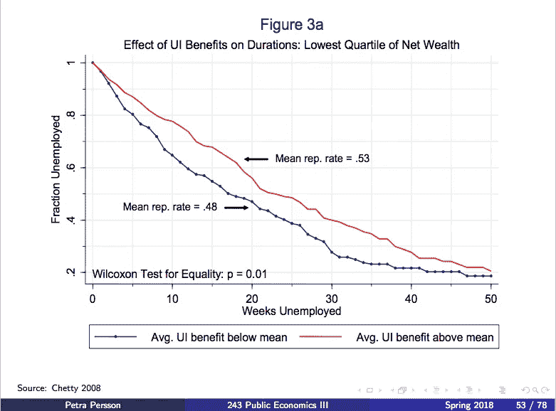
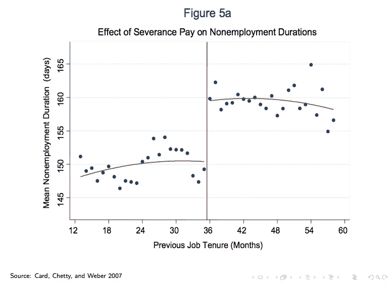
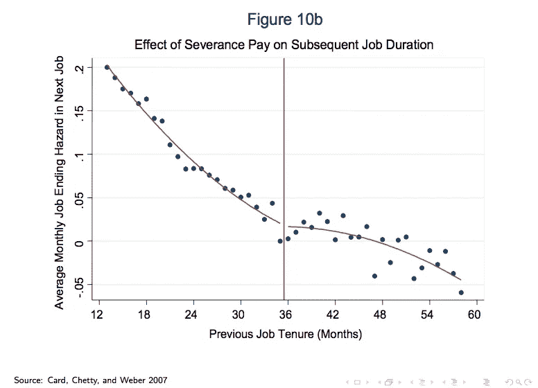

# 眼球数据科学的危险

> 原文：<https://towardsdatascience.com/the-lazy-jobless-reality-or-myth-b3adfdc23ffa?source=collection_archive---------8----------------------->

## 失业救济金会让人变懒吗？

本周在斯坦福大学的公共财政 III 中，佩尔松教授谈论了最优保险设计。这门课总共有 78 张幻灯片。我会把它们编成一段轻松的 7 分钟的读物给你。

# 眼球数据科学的危险

失业救济金会让人变懒吗？如果是这样，在其他条件不变的情况下，福利越高的州失业率越高。

**瞧，到处都是红线在蓝线之上！**

在这一点上，任何不知情的人都会忍不住做出如下结论:**失业救济金会让人变懒。**

## 那么，我们应该一劳永逸地停止支付失业救济金吗？

毕竟，所有的州都有相同的失业率——唯一的区别是，福利低于平均水平的州似乎更快达到目标。

# 相关！=因果关系

**相关性并不意味着因果关系。**

> 当我们看到(高福利，高失业率)时，除了“失业福利让人变懒”之外，还有很多可能的解释。

这里有另一种解释:高收益的州有更多的知识型产业。他们需要更长的时间来找到合适的员工。这也符合(高效益，高失业率)，但与人懒无关。

Eyeball data science: knowledge-based states have higher benefits.

这个解释是否正确并不重要。**我要说的就是，在得出“福利让人变懒，所以应该取消失业救济”的结论之前，我们先慢下来。**

## 让我们回到基础:

1.  失业救济金如何影响失业时间的长短，如果有的话？
2.  如果福利增加了失业率，有多少是因为逃避？
3.  最后，失业救济金的最佳水平是多少？

在下面的讨论中，我将从问题 3 开始，这样我们就可以对这个问题有一个总体的了解。在这个过程中，我将讨论一些很酷的数据分析来解决问题 1 和 2。

# 寻找失业救济金的最佳水平

## 为什么很难

**本质上，寻找最佳社会保险设计是一项成本效益分析。我们想帮助那些运气不好的人，尽管他们自己并没有错。但我们也承认，利益鼓励逃避。为了找到最优的失业救济水平，我们需要回答一些基本问题:**

*   当人们失业时，失业救济金能帮助他们平稳消费吗？这是一个重要的问题，因为如果你能简单地搬去和你的父母一起住，并且你们三个都有足够的食物和支付账单，我们就不需要政府介入并取代一份有效的失业保险。
*   失业救济金会鼓励逃避责任吗？它是否阻碍了人们尽最大努力寻找？或者，它允许人们坚持寻找合适的工作吗？

## 做不可能的事

**最优社会保险问题可以形式化为一个动态规划问题。详情请 PM 我或阅读[哈吉·柴提教授的论文](http://www.rajchetty.com/chettyfiles/ui_formula_jpube.pdf)。**

下面是基本结果:

**这里有一些关于符号的注释:**

*   **C_l:** 低状态下的消费(即失业时)；
*   **C_h:** 高状态下的消耗(即就业时)；
*   **U(C)** :一个人消费的效用$ C；
*   **U'(C):** 消费水平$C 时效用函数的导数说白了，一个人已经在消费$C 时，他的消费边际效用多$1。
*   **e:** 求职努力程度。为简单起见，Chetty 将找到工作的概率设为 e。
*   b: 失业救济金水平
*   **Epsilon_(1-e)，b** :当失业救济金 **b** 增加 1%时，一个人要懈怠的百分比是多少 **(1-e)** ？

## 关键见解

*   直觉上，这证实了我们的直觉，即最优失业权衡了消费平滑的好处和推卸责任造成的效率损失的成本。
*   我们需要估计这个公式中的所有东西，从而得出失业救济金的最佳水平。让我们开始吧。

# 发现ε:当福利增加时，失业持续时间如何变化？

## 第一次尝试:危险模型

通过估计*连续工资和福利历史*的风险模型，Meyer 回答了以下问题:

> 定义为(就业人数/失业人数)的风险率如何对失业救济金的变化做出反应？

以下是他从 1978 年至 1983 年间居住在 12 个州的 3365 名男性中收集的数据:

> 福利增加 10%会导致危险率降低 9%。这意味着预期失业时间增加了 9%!

值得注意的是，最近的研究使用了更大更好的数据，包括 Meyer 本人的数据，得到的估计值更小，约为 5%。

# 估计 e:搜索工作

随着调查数据越来越细，经济学家现在对人们花在找工作上的时间有了一个相当好的估计。

# 放弃最佳利益

缺失的最后一块拼图是 U'(C)s，找到消费数据很容易，但找到效用函数就不那么容易了。因此，经济学家所做的是取消各种效用函数的最优收益水平。

> **如果你相信人们有******不变的相对风险厌恶，一致风险系数在 2 左右，那么最优收益是总工资的 5%，远低于我们所拥有的。****

********

# **那么，失业率的增加有多少是由于拖延造成的呢？**

**根据[哈吉·柴提(2008)](https://dash.harvard.edu/bitstream/handle/1/9751256/Chetty_MoralHazard.pdf?sequence=1) :**

> **40%，这意味着 60%的额外失业时间被用于寻找更好的匹配。**

## **Chetty 是如何设法分离这些影响的？**

****强大的洞察力:失业救济金的增加做了两件事:**给你钱+扭曲相对工资(即降低工资福利比)。**

**它们如何影响你的搜索工作？直觉上，当你手头有更多现金时，你会感到寻找自己不喜欢的工作的压力较小(又称“流动性效应”)；当工资与福利的比率较低时，你会觉得工作动力不足(也称为“道德风险”)。**

****流动性和道德风险都会降低你的搜索努力——只不过流动性效应是可取的，而道德风险则不是。****

****重要见解:为了估计一种效应，我们需要使另一种效应静音。****

> **要估计道德风险效应，看看那些已经有足够钱的人。即使没有任何额外的帮助，这些人也不会从事不受欢迎的工作。实际上，流动性效应被弱化了。**

********

**对于净财富最高的四分之一的人来说，当福利水平增加时，失业率没有显著增加！**

**将此与我在本博客开始时展示给你的净财富最低四分之一人群的图表进行比较:这表明许多穷人被迫接受不太理想的工作，因为他们等不起！**

# ****但是等等！你在假设穷人和富人是可比的！****

**如果你同意共和党的思路，认为富人变富恰恰是因为他们有更好的职业道德，那会怎么样？**

# **没问题！**

****全能的切蒂有另一篇论文** [**用卡和韦伯 2007 年的**](http://www.nber.org/papers/w12639) **来处理这种担忧，用的是来自奥地利建筑工人的遣散费数据。****

**遣散费是一种失业保险，相对于失业，它不会扭曲工作的吸引力。因此，它将捕捉流动性效应，而不是道德风险效应。**实际上，我们正在抑制道德风险渠道，以估计流动性效应。****

**在奥地利，只有当你的工作期限超过 36 个月，你才能得到遣散费。让我们比较一下低于和高于 36 个月门槛的人的失业持续时间。**这些人应该蛮有可比性的。****

********

## **左图显示流动性效应巨大！**

**当没有足够积蓄的人，真的需要更加努力的去寻找。**

**右边的图表表明，员工在压力下接受了不太理想的工作匹配，这转化为更短的后续工作持续时间。**

# **结论**

**对失业保险文献的全面讨论超出了本博客的范围。但是，教训是明确的:**

## ****眼球数据科学危险！****

**每当你看到暗示性的情节，问问你自己:有没有其他的叙事可以产生这种模式？**

## **现实很少是非黑即白。**

**在这种情况下，失业保险是好的，因为它帮助人们找到更好的工作匹配(60%)，但它也鼓励一些人拖延(40%)。**

**在现实世界中，任何改变都有成本和收益。真正的问题很少是“是或不是”，而是“值得吗？”**

## **研究是不断发展的！**

**有了更好的数据和更好的设计，科学家们不断更新他们对关键参数的估计。甚至我讨论的 Card，Chetty 和 Weber (2007)的论文也不是无懈可击的。你能发现致命的弱点吗？如果你认为你已经找到了，请在下面留下回复:)**

**下次见！**