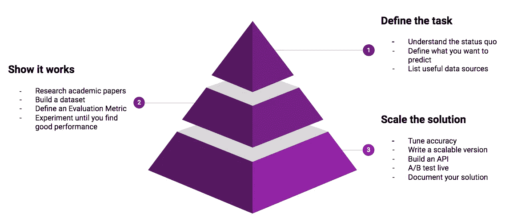
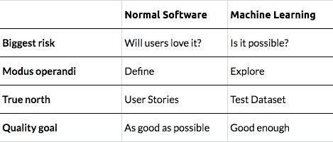
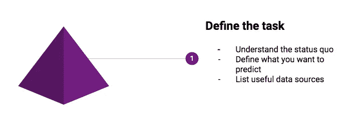
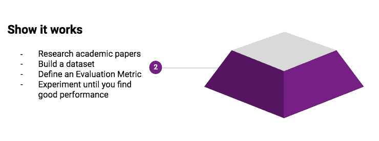
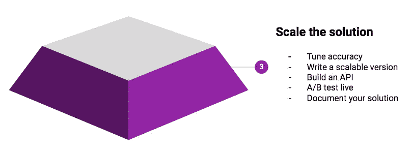

# 机器学习工作流程

> 原文：<https://towardsdatascience.com/the-machine-learning-workflow-8e83c3b008be?source=collection_archive---------15----------------------->

## 机器学习项目有什么不同？你如何在最短的时间内降低风险并建立一个可行的解决方案？

在**普通软件开发**中，你只需回答这个问题:

> 你想实现什么？

然后你，嗯，实施。

但是在机器学习项目中，你首先需要**探索**什么是可能的——用你拥有的数据。因此，第一个问题是:

> 什么 ***可以*** 实现？

以下是我们学到的让机器学习项目从开始到结束都保持在正轨上的方法:

# 1.定义任务

很容易被无处可去的人工智能项目吸引。一个正确的机器学习项目定义可以大大降低这种风险。

定义项目时，您需要回答以下问题:

## **了解当前流程**

您目前的流程是什么？你的机器学习解决方案将取代一个已经存在的过程。在这个过程中，目前是如何做出决策的？当前的过程将教会你许多领域知识，并帮助你定义你的机器学习系统应该是什么样子。

## **定义你想要预测的内容**

你想预测什么样的变量？定义你的机器学习系统的输出——尽可能详细。

## **列出有用的数据来源**

你有什么有用的数据来正确预测这个输出？首先列出当前流程所依赖的数据源。列出有用数据源的一种方法是问自己:*“如果我——作为一个人——需要做这个预测，我想要了解哪些数据点？”*

如果你了解当前的流程，知道你想要预测什么，并识别出所有有用的数据来源，你就能很好地决定进入下一阶段是否有意义。

# 2.找到一种可行的方法

即使你有一个好的问题定义，你也无法知道你的机器学习模型最终会有多准确。以及是否值得替换当前的过程。

概念验证是了解最终解决方案的投资回报率的最经济的方法。这些是步骤:

## **研究**

研究其他团队解决类似任务的所有方法——无论他们是否使用机器学习。然后**制定一个计划**，利用你所学到的，以及你从你想要取代的现有流程中学到的。

## **构建数据集**

任何机器学习项目的中心部分都是样本数据集！这个数据集包括*真实的*例子，这些例子正是你希望你的机器学习系统做出正确预测的情况。可以把它想象成一个 Excel 表格，带有

1.  每个示例一行，并且
2.  许多列有用的输入数据，加上
3.  一列包含输出(也称为*目标*)。

然后，模型必须学会根据输入预测输出*。例如，从客户的支付历史(输入)预测客户的信用等级(输出)。*

这个数据集就像普通软件项目中的*需求文档*——你检查自己是否在正轨上的参考点。

## **实验**

从最有希望的方法开始，评估它，然后从那里改进。重复——直到你找到一个足够好的方法。

# 3.构建全面的解决方案

> *工作软件是进度的主要衡量标准。—* [敏捷宣言](http://agilemanifesto.org/principles.html)

概念验证不会让你赚到钱。这些是实现稳定、全面解决方案的步骤。

## **提高精度**

概念验证是 20/80 实施。现在是时候做出您在第一次迭代中遗漏的关键改进了:

*   添加更多数据
*   构建新功能
*   尝试其他算法
*   微调模型参数。

## **刻度**

这是从概念验证脚本到生产就绪解决方案的一大步。

*   **可伸缩性&稳定性**:将数据处理步骤重写为数据管道中独立的、可伸缩的任务。
*   测试:编写额外的单元测试和集成测试——也包括数据中可能的错误。
*   **部署**:构建灵活、可重复且简单的部署，满足您所需的吞吐量&处理速度(包括基础设施的自动构建)。

## **A/B 测试**

与其他软件更新类似，新自动化流程的最终测试是与当前流程进行比较。通过 A/B 测试，你可以衡量你所取得的进步，以及你的项目的投资回报率。

## **API**

您的机器学习服务需要一种方式来与基础设施的其余部分进行交流。这要么通过不断地将结果保存到数据库中来完成，要么通过 API 使算法可用。

## **文档**

除了代码文档之外，您应该考虑编写一个用户指南来解释解决方案是如何工作的。澄清实现背后的思想很重要:在数据科学中，仅仅从代码中很难理解你的推理。

# 可选附件

*   **版本化**。也许您需要针对旧的模型进行 A/B 测试，或者您需要在短时间内切换到您的管道的先前版本——正确的版本控制使这变得容易。
*   自动化再培训。模型会过时，最终你将不得不根据新数据对其进行重新培训。在某些情况下，自动化模型更新是有意义的。

有任何问题或意见吗？下面让我知道。

如果你在机器学习问题上需要帮助——[联系](https://www.datarevenue.com/en/contact-us)。

【www.datarevenue.com】最初发表于**。**