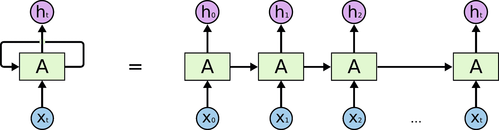
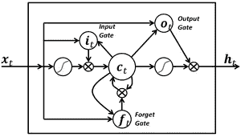
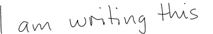
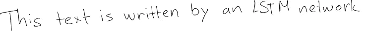
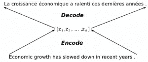
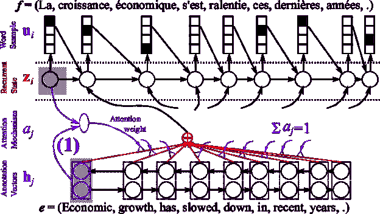
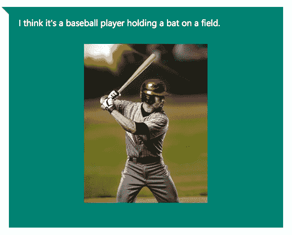

# LSTM 神经网络的魔力

> 原文：<https://towardsdatascience.com/the-magic-of-lstm-neural-networks-1e4a1f7d81c0?source=collection_archive---------8----------------------->


[LSTM 神经网络](https://en.wikipedia.org/wiki/Long_short-term_memory)，代表**L**ONG**S**short-**T**erm**M**emory，是一种特殊类型的递归神经网络，最近在机器学习社区得到了很多关注。

简单地说，LSTM 网络有一些内部的**上下文状态单元**充当长期或短期记忆单元。
LSTM 网络的输出由这些单元的状态**调制**。当我们需要神经网络的预测依赖于输入的**历史背景**而不是仅仅依赖于最后的输入时，这是一个非常重要的特性。

举个简单的例子，假设我们要预测以下序列的下一个数字:6 -> 7 -> 8 ->？。我们希望下一个输出是 **9** (x+1)。但是，如果我们提供这个序列:2 - > 4 - > 8 - >？，我们想得到 **16** (2x)。
虽然在这两种情况下，当前的最后输入是数字 **8** ，但是预测结果应该是不同的(当我们考虑先前值的上下文信息而不仅仅是最后一个时)。

LSTM 网络通过整合一个允许信息从一个步骤流向下一个步骤的*回路*来管理保持输入的上下文信息。这些循环使得递归神经网络看起来很神奇。但是如果我们想一想，当你在读这篇文章的时候，你是在理解前面的单词的基础上理解每个单词的。你不会扔掉所有东西，从每一个单词开始思考。类似地，LSTM 预测总是受到网络输入的过去经验的制约。



LSTM loop unrolled

另一方面，时间过得越久，下一个输出就越不可能依赖于一个非常旧的输入。这个时间依赖距离本身也是要学习的上下文信息。LSTM 网络通过“忘记门”权重来学习何时记住何时忘记。简单地说，如果遗忘门只是 0.9 的乘法因子，在 10 个时间步长内，该因子变成:0。⁹ ⁰=0.348(或 65%的信息被遗忘)，以及 30 步内- > 0.04 (96%被遗忘)。



LSTM internal wiring showing the forget gate

在这篇文章中，我不会过多地谈论 LSTM 的技术细节。这篇博文很好地解释了他们的机制。相反，我将在这里介绍 LSTM 的不同应用汇编。

生成这样的文本可以转化为 LSTM 任务，其中每个字母的生成都要考虑所有先前生成的字母。事实上，[教一个 LSTM 网络字母表](http://machinelearningmastery.com/understanding-stateful-lstm-recurrent-neural-networks-python-keras/)可以成为第一个学习如何让 LSTM 学习东西的编程例子。[安德烈·卡帕西](http://karpathy.github.io/2015/05/21/rnn-effectiveness/)，展示了 LSTM 根据你输入的训练集生成文本的不同例子。以下是一些自动生成的文本:

**莎翁:**

```
PANDARUS:
Alas, I think he shall be come approached and the day
When little srain would be attain’d into being never fed,
And who is but a chain and subjects of his death,
I should not sleep.Second Senator:
They are away this miseries, produced upon my soul,
Breaking and strongly should be buried, when I perish
The earth and thoughts of many states.
```

**维基百科**:

```
Naturalism and decision for the majority of Arab countries’ capitalide was grounded
by the Irish language by [[John Clair]], [[An Imperial Japanese Revolt]], associated
with Guangzham’s sovereignty. His generals were the powerful ruler of the Portugal
in the [[Protestant Immineners]], which could be said to be directly in Cantonese
Communication, which followed a ceremony and set inspired prison, training. The
emperor travelled back to [[Antioch, Perth, October 25|21]] to note, the Kingdom
of Costa Rica, unsuccessful fashioned the [[Thrales]], [[Cynth’s Dajoard]], known
in western [[Scotland]], near Italy to the conquest of India with the conflict.
```

**XML:**

```
<revision>
 <id>15900676</id>
 <timestamp>2002–08–03T18:14:12Z</timestamp>
 <contributor>
 <username>Paris</username>
 <id>23</id>
 </contributor>
 <minor />
 <comment>Automated conversion</comment>
 </revision>
```

**奥巴马:**

```
SEED: War on terror
Good everybody. Thank you very much. God bless the United States of America, and has already began with the world’s gathering their health insurance.
It’s about hard-earned for our efforts that are not continued.
We are all the assumptionion to the streets of the Americas that we are still for everybody and destruction.
We are doing a lot of this.
I know that someone would be prefered to their children to take a million insurance company. We’re watching their people and continued to find ourselves with Republicans — to give up on these challenges and despite the challenges of our country. In the last two years, we must recognise that our borders have access from the world. We’re continuing that this day of things that the United States will clean up it´s allies and prosperity to stand up enough to be a sanctions that we made their faith, and for the country of the Internet to Osama bin Laden.
Thank you. God bless you. Good morning, everybody. And May God loss man. Thank you very much. Thank you very much, everybody.
```

这是 Alex Graves 制作的一个动画，展示了一个 LSTM 网络在现场进行手写识别:

*   第 1 行:显示被识别的字母(网络的**输出**
*   第 2 行:显示存储单元的状态(注意当一个字符被识别时它们是如何复位的)
*   第 3 行:显示了正在被 LSTM 分析的书写内容(网络的**输入**
*   第 4 行:显示从最活跃的字符反向传播到输入的梯度。这体现了**忘记**的效果。

作为一个反向实验，这里有一些由 LSTM 生成的笔迹。



对于现场演示，并自动生成一个 LSTM-'手'写文本自己，访问[这一页](http://www.cs.toronto.edu/~graves/handwriting.html)。

因为音乐，就像文本一样，是一系列音符(而不是字符)，它也可以由 LSTM 通过考虑先前演奏的音符(或音符的组合)来生成。在这里你可以找到一个关于如何在 midi 文件上训练 LSTM 的有趣解释。否则，您可以欣赏以下生成的音乐(来自古典音乐训练集):

语言翻译可以看作是[序列到序列](https://www.tensorflow.org/tutorials/seq2seq)的映射。一组研究人员与英伟达合作，公布了如何驯服 LSTM 完成这项任务的细节([第一部分](https://devblogs.nvidia.com/parallelforall/introduction-neural-machine-translation-with-gpus/)、[第二部分](https://devblogs.nvidia.com/parallelforall/introduction-neural-machine-translation-gpus-part-2/)、[第三部分](https://devblogs.nvidia.com/parallelforall/introduction-neural-machine-translation-gpus-part-3/))。
简而言之，他们创建了一个神经网络，其中一个编码器将文本压缩为更高抽象的矢量表示，一个解码器将其解码回目标语言。



Machine translation encoder/decoder architecture



English to french translation by NVidia

最后，LSTM 网络最令人印象深刻的用途是从输入图像生成描述图像内容的文本标题。微软研究院在这方面取得了很大进展。以下是一些他们的结果的示例演示:



你可以在这里自己尝试一下他们的在线演示:[https://www . caption bot . ai](https://www.captionbot.ai)

玩得开心！

*原载于 2018 年 2 月 2 日*[*medium.com*](https://medium.com/datathings/the-magic-of-lstm-neural-networks-6775e8b540cd)*。*