# 数据分析中分层的魔力

> 原文：<https://towardsdatascience.com/the-magic-of-stratification-in-data-analysis-f1ee4800a283?source=collection_archive---------6----------------------->

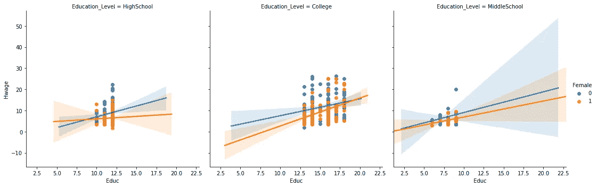

在我关于 Medium 的第一篇文章中，我将简要回顾一下我认为统计学中最基本的问题——混淆，更重要的是，我们如何利用熊猫和一些可视化来处理这个问题。

人们可以通过想象一项流行病学家正在研究吸烟导致的死亡率的研究，很容易理解混淆。如果我们将样本人群分为吸烟者和非吸烟者，并观察死亡率，我们很快就会遇到如下问题:

*   如果吸烟的人多了会怎么样？
*   如果吸烟者比不吸烟者有更多更老更胖的人会怎样？

不考虑这些其他变量可能会导致研究中的偏差，并使结果非常可疑。这也是我高度怀疑任何出现在传统新闻来源和社交媒体上的夸张标题的原因之一。

我们将使用这个[数据集](https://github.com/Captmoonshot/Hwage_article)来确定:

1.  存在性别工资差距
2.  这一差距在多大程度上可归因于对妇女的歧视

请注意，我们使用的数据已经过时，这篇文章的目的是说明技术，而不是进入关于工作场所性别歧视的[辩论](https://www.vox.com/2018/2/19/17018380/gender-wage-gap-childcare-penalty)。

让我们做我们的进口。

```
import pandas as pd
import numpy as np
import matplotlib.pyplot as plt
import seaborn as sns
%matplotlib inline
```

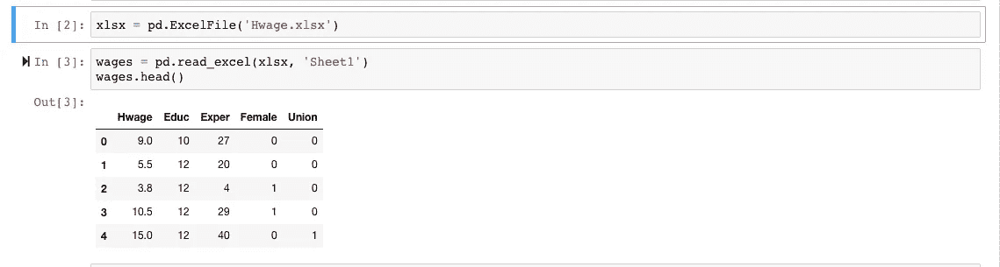

For those new to reading in excel files, you might have to conda or pip install xlrd and openpyxl packages

数据集相对较小，有 527 行和 5 列。

## 输入变量

1.  教育程度:研究中受试者完成教育的年数
2.  Exper:在他们的职业中经历的年数
3.  女性:分类变量，其中女性=1，男性=0
4.  Union:分类变量，其中 Union 成员资格=1，Non-Union 成员资格=0

## 目标变量

1.  Hwage:不同的小时工资率

2.logHwage:Hwage 的自然日志

## 次要预处理

幸运的是，这个数据集已经进行了大部分预处理，但有一件事我们需要注意，那就是“Educ”变量。


让我们把他们分成“初中”、“高中”和“大学”作为一个新的栏目。

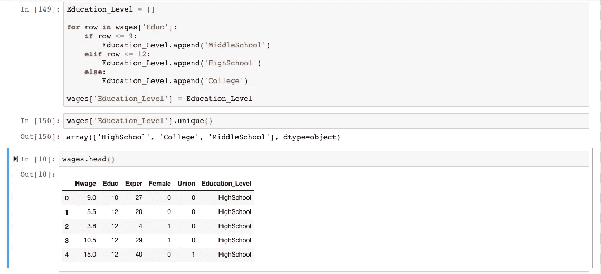

## 数据探索

让我们通过一些基本的视觉效果和表格来感受一下我们的数据集。通过可视化数据集，我们可能会得到什么属性可能是工资的重要决定因素的线索。

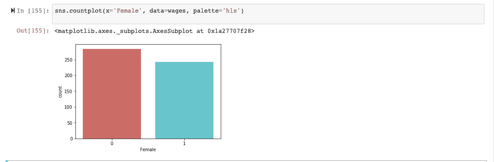

“女性”一栏在男性和女性之间相当平衡。

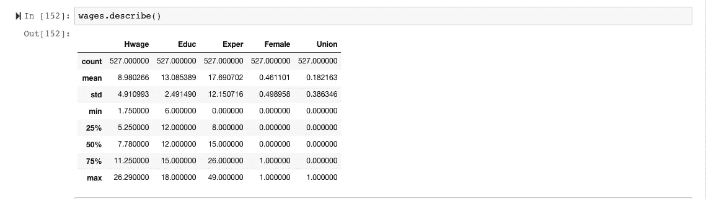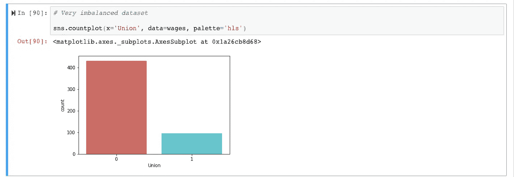

然而,“工会”属性不平衡，只有大约 22%的人属于工会。当进行因果推断和解释回归系数时，这可能是一个令人头痛的大问题，但是我们将保持联合变量不变，因为它似乎提供了相对于其他属性尤其是“女性”的有价值的信息。

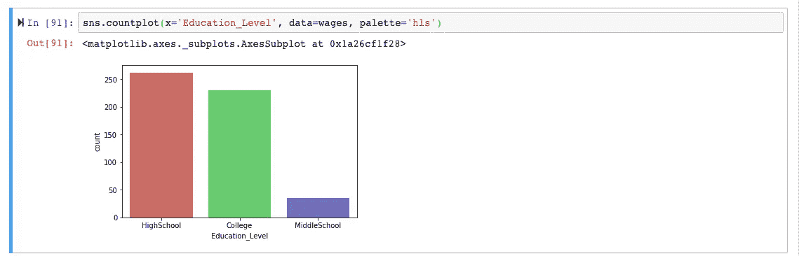

“教育程度”和“教育水平”属性似乎很均衡，只有少数人是“初中”学生，但这是意料之中的，因为大多数美国人至少都是高中毕业生。

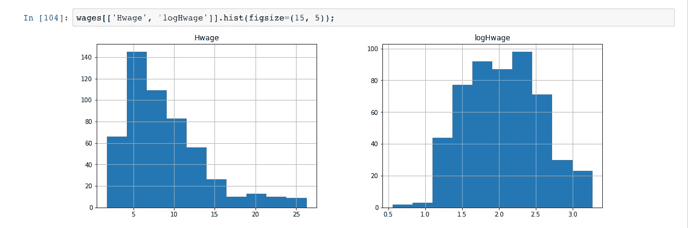

“Hwage”有一个偏斜的分布，这可能会有问题，所以我们将记录变量供以后使用。我们可以看到，在执行日志之后,“Hwage”具有更“正常”的分布。

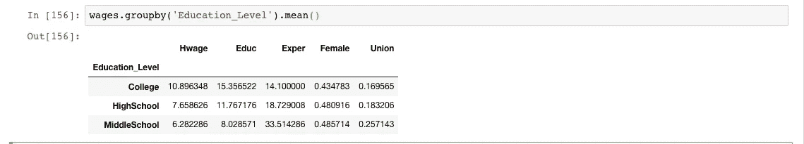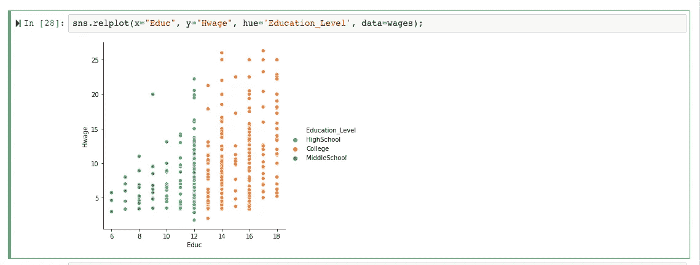

该数据集的一个预期但突出的特征是上述关系，即较高的教育水平等同于较高的工资率。

让我们看看这种关系是否对男性和女性都适用。

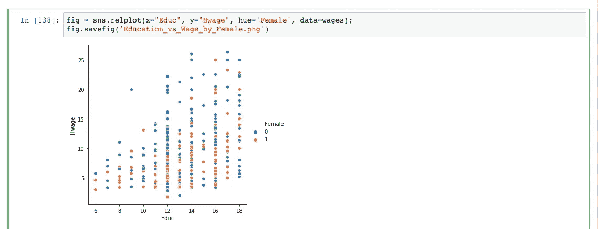

在这里，我们得到了第一个暗示，一切都不太好，在丹麦可能有些东西已经腐烂了。在教育水平相同的情况下，男性(蓝点)往往在工资水平较高的人群中占主导地位，尤其是在“教育程度”较高的人群中。

这是否意味着男女之间存在明显的工资差距？

简洁量化视觉效果的一种方法是相关性。


这种相关性意味着在确定工资率时最感兴趣的 3 个变量是:

1.  教育水平——正相关
2.  女性-消极关系
3.  联盟-积极的关系

有些违反直觉的经验(Exper)与工资率的关联很弱。

让我们通过回归所有四个独立变量的工资(对数)率，对数据集进行 OLS 多元回归分析。

## 线性回归

```
import statsmodels.api as sm
import statsmodels.formula.api as smf
```

我使用 statsmodels 是因为它能够打印格式良好的回归统计数据，否则使用 scikit-learn 会产生完全相同的结果。

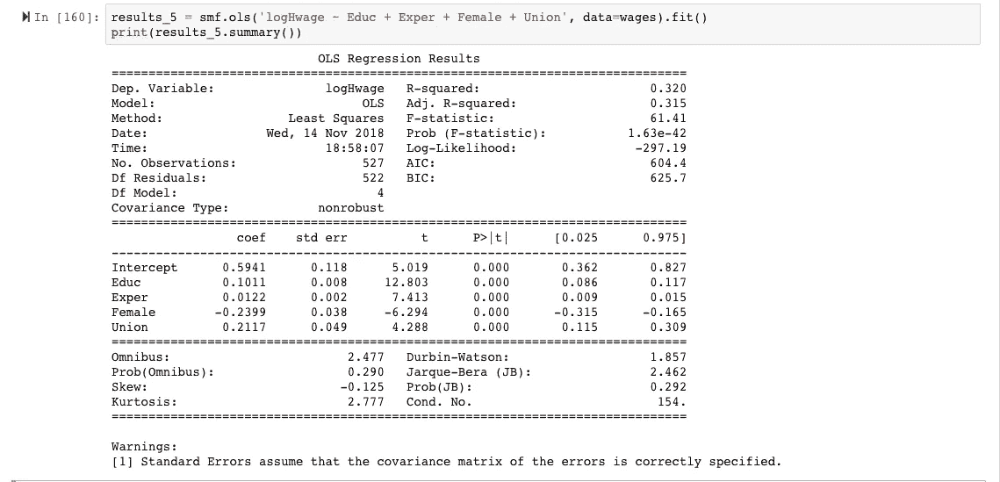

检查 R 平方和 F 分数，模型的拟合优度相对较弱。总的来说，这不是一个非常令人满意的了解工资率差异的模型。

如果我们看一下系数，这个模型中最重要的四个属性依次是:

1.  女性的
2.  联盟
3.  教育
4.  经验

这个结果不同于相关性告诉我们的，也有些不同于视觉告诉我们的。

这种相关性暗示着教育水平是最重要的，而图片也在一定程度上支持了这一论断。

## 这是怎么回事？

首先，让我们确立这样一个观点，至少在这个特定的数据集中，在所有其他因素不变的情况下，男性和女性之间似乎确实存在某种普遍的工资差距。

第二个问题是，这种工资差距的驱动因素可能是什么？

回归表明，工会成员资格可能是答案，但我们已经从回归统计中知道，该模型受到混杂因素的严重影响。

## 一个可能的解决方案:将数据分层

对我来说，一个重要的观点是，数据科学并不总是给出明确的答案。有时，这是一个苦读指向不同结论的数据的问题。

统计学家设计的处理混淆的最简单也是最优雅的方法之一是将数据分层以深入细节。在 Python 中，简单胜于复杂，数据科学也是如此。

让我们通过首先创建一个全男性数据框架来仔细检查“Union”分类属性。

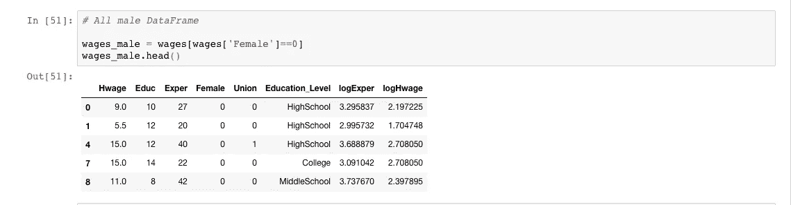

让我们来了解一下加入工会给男性带来的好处。

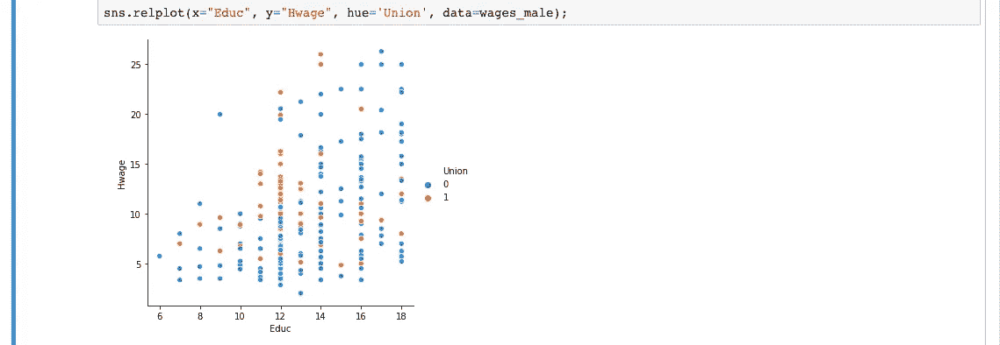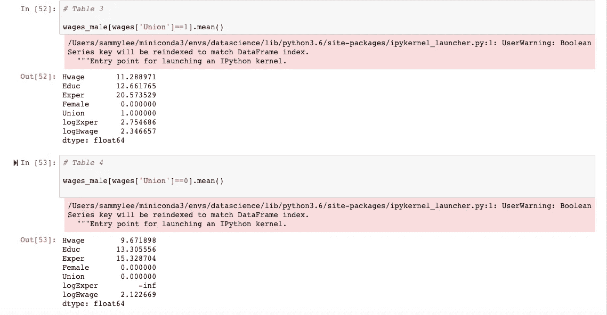

从上面我们可以看到，加入工会后，男性的工资平均增加了 2 美元。

如果看一下上面的图像，在“Educ = = 12”标记处，我们可以清楚地看到加入工会的男性和未加入工会的男性的工资率之间的分界线。

现在让我们通过创建一个全女性的数据框架来看看女性的情况。

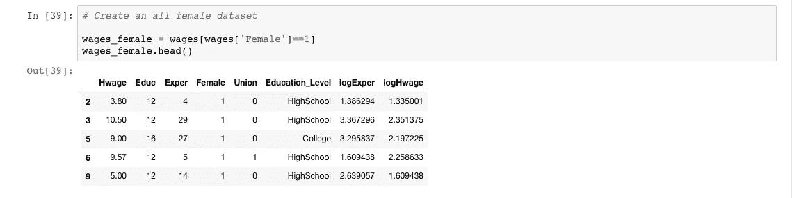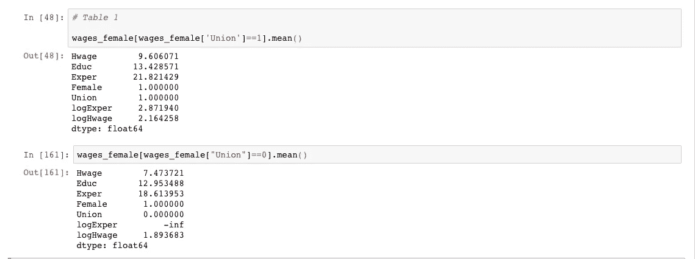

经济理论告诉我们，工会可以帮助工人谈判获得更高的工资。这似乎是我们混乱局面的关键。

女性似乎还从工会会员那里获得了平均 2 美元的加薪。

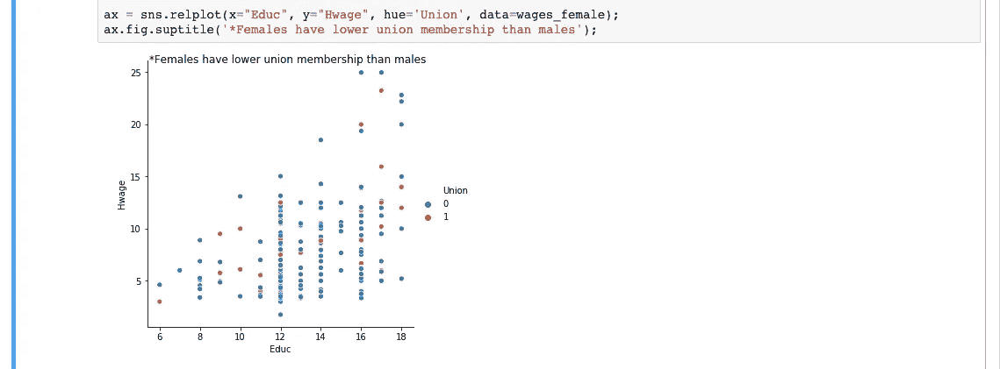

如上图所示，问题在于，在数据集中，很少有女性是一个工会的成员！

因此，一种可能的解释是，女性的工资比男性低，因为女性没有获得工会会员的福利。

以这种方式对数据集进行分层给了我们一种可能的解释。

女性和联合之间有某种互动的可能性，但是我们假设没有这种关系。

但是还有一个更大的问题。

在全部 527 项记录中，只有 96 人加入了工会，而这 96 人中只有 28 人是女性。因为与男性相比，样本是如此不平衡，我们不能用对男性同样的方式解释回归系数(女性和结合)。

如果能有一些数据来揭示女性是否曾经怀孕，以及这些变量如何随着时间的推移而变化，那就太好了，因为工资率是一个动态变量。另一个重要的变量可能是男性和女性获得的大学学位的类型。

## 结论

在处理观察数据时，数据科学可能会很艰难。

然而，这并不意味着一切都完了。对数据进行分层和可视化可以提供新的见解，否则仅靠纯粹的回归分析是无法找到这些见解的。

尽管我在学校学过一些计量经济学，但用 pandas 和 seaborn 的工具挖掘这个特殊的数据集让我看到了分层方法是一种魔术。

在我结束之前，我想展示另一个分层表，我认为如果样本中有更多的工会妇女，它可能会有所启发。

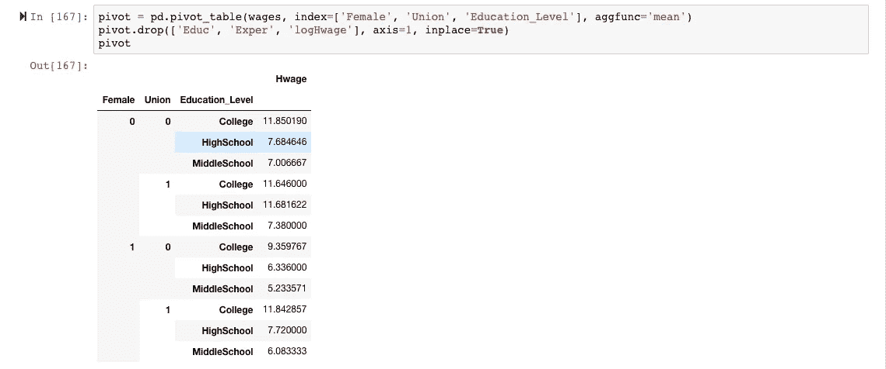

如果我们研究女性=1，并比较工会=1 和工会=0 的高中学生的工资率，工资率几乎没有增加大约 1 美元，这是我们在男性中看到的 4 美元增长的一小部分。

因此，如果工会变量更加平衡，我们可以陈述一个看似合理的案例，说明尽管拥有相同的教育水平和工会会员资格，妇女在薪酬方面仍受到歧视。

不幸的是，这个数据集不允许我们这样做。

*本文的 Jupyter 笔记本驻留在此处。