# 使用示例 Python 代码进行 A/B 测试背后的数学原理

> 原文：<https://towardsdatascience.com/the-math-behind-a-b-testing-with-example-code-part-1-of-2-7be752e1d06f?source=collection_archive---------0----------------------->


Animation by [Gal Shir](https://galshir.com/)

在参加 Google 在 Udacity 上的 [A/B 测试课程时，我对课程中没有明确涵盖的一些数学步骤有一些疑问。这是可以理解的，因为本课程是一个压缩和简明的概述。为了解决我的问题，我求助于网络上的其他资源，并决定总结一下我在这篇文章中学到的东西。](https://www.udacity.com/course/ab-testing--ud257)

# A/B 测试大纲

1.  准备实验。
2.  运行测试并记录每组的成功率。
3.  绘制两个样本之间差异的分布图。
4.  计算统计功效。
5.  评估样本大小如何影响 A/B 测试。

# 1.准备实验

我们将为一家假设的公司运行 A/B 测试，该公司试图增加注册高级帐户的用户数量。运行 A/B 测试的目的是评估网站的变化是否会导致特定指标的性能提高。您可能会决定测试非常简单的替代方案，例如更改网页上单个按钮的外观，或者测试不同的布局和标题。您还可以对多步骤流程运行 A/B 测试，这些流程可能有许多不同之处。这方面的例子包括注册新用户或在在线市场上处理销售所需的步骤。A/B 测试是一个庞大的课题，有许多关于建立实验的技术和规则。除了 Udacity 课程，下面还有一些其他有用的资源:

*   [Optimizely 的 A/B 测试术语表](https://www.optimizely.com/optimization-glossary/)
*   [埃文·米勒的 A/B 测试文章](http://www.evanmiller.org/)
*   [脸书关于广告衡量的帮助网页](https://www.facebook.com/business/help/927019534094639/?helpref=hc_fnav&bc[0]=AHCv1&bc[1]=Ads%20Help&bc[2]=Measure%20%26%20Optimize)

对于这篇文章，我将保持简单，这样我们就可以专注于数学。

## 基线转换率和提升

在运行测试之前，我们将知道我们想要测试的**基线转换率**和**期望提升量**或签约量增加量。基线转换率是我们在现有设计下签约新用户的当前比率。在我们的例子中，我们希望通过测试来确认我们对注册流程所做的更改将会导致注册率至少增加 2%。我们目前为 100 个用户中的 10 个注册了高级账户。

```
# code examples presented in Python
bcr = 0.10  # baseline conversion rate
d_hat = 0.02  # difference between the groups
```

## 对照组(A)和试验组(B)

通常，参与 A/B 测试的用户总数只占用户总数的一小部分。用户被随机选择并被分配到[控制组或](https://en.wikipedia.org/wiki/Treatment_and_control_groups)测试组。你决定的样本大小将决定你需要等多久才能收集到足够的样本。例如，拥有大量受众的网站可能能够很快收集到足够的数据，而其他网站可能需要等待数周。有些事件即使在高流量的网站上也很少发生，因此确定必要的样本量将有助于您尽快评估您的实验并继续改进其他指标。

最初，我们将为每个组收集 1000 个用户，并为控制组提供当前的注册页面，为测试组提供新的注册页面。

```
# A is control; B is test
N_A = 1000
N_B = 1000
```

# 2.运行测试

因为这是一个假设的例子，我们将需要“假”数据来处理。我写了一个函数，可以为我们的模拟生成数据。这个脚本可以在我的 Github repo [这里](https://github.com/mnguyenngo/ab-framework/tree/master/src)找到。

```
ab_data = generate_data(N_A, N_B, bcr, d_hat)
```

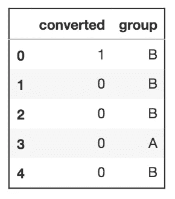

`generate_data`函数返回左边的表格。**仅显示前五行。**`converted`列分别用 1 或 0 表示用户是否注册了高级服务。`A`组将作为我们的对照组，而`B`组将作为我们的测试组。

让我们来看看在 Pandas 中使用[数据透视表函数](https://pandas.pydata.org/pandas-docs/version/0.22/generated/pandas.pivot_table.html)的结果汇总。

```
ab_summary = ab_data.pivot_table(values='converted', index='group', aggfunc=np.sum)# add additional columns to the pivot table
ab_summary['total'] = ab_data.pivot_table(values='converted', index='group', aggfunc=lambda x: len(x))
ab_summary['rate'] = ab_data.pivot_table(values='converted', index='group')
```

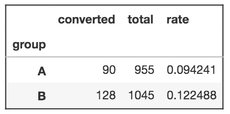

看起来两组之间转化率的差异是 0.028，大于我们最初想要的 0.02 的提升。这是一个好迹象，但这还不足以让我们自信地采用新设计。在这一点上，我们还没有衡量我们对这一结果的信心。这可以通过观察两组的分布来缓解。

# 3.比较两组

我们可以通过绘制对照组的分布图并计算从我们的测试组获得结果的概率来比较这两组。我们可以假设对照组的分布是二项式的，因为数据是一系列伯努利试验，其中每个试验只有两种可能的结果(类似于掷硬币)。

```
fig, ax = plt.subplots(figsize=(12,6))
x = np.linspace(A_converted-49, A_converted+50, 100)
y = scs.binom(A_total, A_cr).pmf(x)
ax.bar(x, y, alpha=0.5)
ax.axvline(x=B_cr * A_total, c='blue', alpha=0.75, linestyle='--')
plt.xlabel('converted')
plt.ylabel('probability')
```

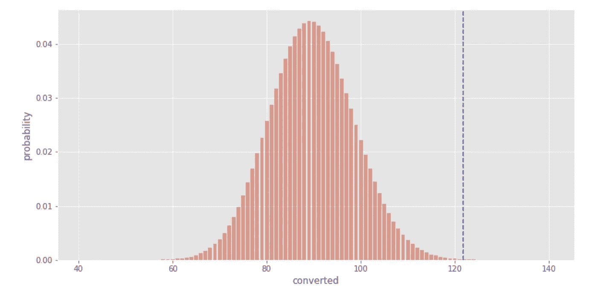

对照组的分布以红色显示，测试组的结果以蓝色虚线表示。我们可以看到，从测试组得到结果的概率非常低。**然而，概率并不传达结果的置信水平。**它没有考虑我们测试组的样本量。直觉上，随着样本量的增加，我们会对结果更有信心。让我们继续将测试组的结果绘制成二项式分布，并将这些分布相互比较。

## 二项分布

```
fig, ax = plt.subplots(figsize=(12,6))
xA = np.linspace(A_converted-49, A_converted+50, 100)
yA = scs.binom(A_total, p_A).pmf(xA)
ax.bar(xA, yA, alpha=0.5)
xB = np.linspace(B_converted-49, B_converted+50, 100)
yB = scs.binom(B_total, p_B).pmf(xB)
ax.bar(xB, yB, alpha=0.5)
plt.xlabel('converted')
plt.ylabel('probability')
```

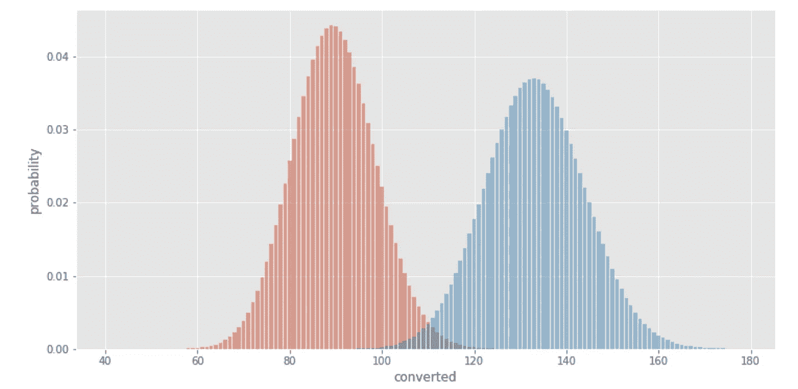

Binomial distributions for the control (red) and test (blue) groups

我们可以看到，测试组比控制组转化了更多的用户。我们还可以看到，测试组结果的峰值低于对照组。我们如何解释峰值概率的差异？我们应该把重点放在转化率上，这样我们就可以进行比较。为了进行计算，我们需要对数据进行标准化，并比较每组的成功概率 ***p*** 。

## 伯努利分布和中心极限定理

为此，首先考虑对照组的[伯努利分布](https://en.wikipedia.org/wiki/Bernoulli_distribution)。

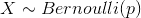

其中 p 是对照组的转化概率。

根据伯努利分布的性质，均值和方差如下:

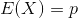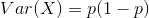

根据[中心极限定理](https://en.wikipedia.org/wiki/Central_limit_theorem)，通过计算许多样本的平均值，我们可以近似得到群体的真实平均值 **𝜇** ，对照组的数据就是从这个群体中获取的。样本平均值的分布， ***p*** ，将围绕真实平均值呈**正态分布**，其标准偏差等于平均值的[标准误差。这方面的公式如下:](https://en.wikipedia.org/wiki/Standard_error)

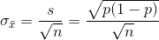

因此，我们可以将两组都表示为具有以下属性的正态分布:

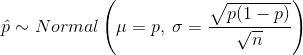

测试组也可以这样做。因此，`p_A`和`p_B`有两个正态分布。

```
# standard error of the mean for both groups
SE_A = np.sqrt(p_A * (1-p_A)) / np.sqrt(A_total)
SE_B = np.sqrt(p_B * (1-p_B)) / np.sqrt(B_total)# plot the null and alternative hypothesis
fig, ax = plt.subplots(figsize=(12,6))x = np.linspace(0, .2, 1000)yA = scs.norm(p_A, SE_A).pdf(x)
ax.plot(xA, yA)
ax.axvline(x=p_A, c='red', alpha=0.5, linestyle='--')yB = scs.norm(p_B, SE_B).pdf(x)
ax.plot(xB, yB)
ax.axvline(x=p_B, c='blue', alpha=0.5, linestyle='--')plt.xlabel('Converted Proportion')
plt.ylabel('PDF')
```

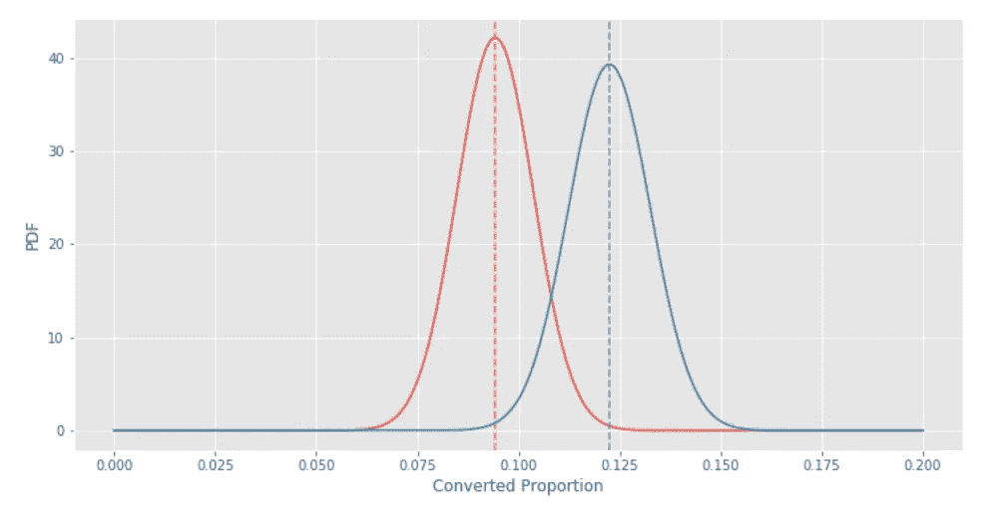

Control (red) and test (blue) groups as normal distributions for the proportion of successes

虚线代表每组的平均转化率。红色虚线和蓝色虚线之间的距离等于对照组和测试组之间的平均差异。`d_hat`是两组随机变量之差的分布。

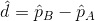

## 总和的方差

回想一下，零假设表明两组之间的概率差为零。因此，这个正态分布的平均值为零。正态分布需要的另一个性质是标准差或方差。(注:方差是标准差的平方。)差异的方差将取决于两组概率的方差。

方差的一个基本性质是:两个随机自变量之和的[方差是方差之和。](https://en.wikipedia.org/wiki/Variance)

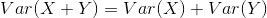

这意味着零假设和替代假设将具有相同的方差，该方差将是对照组和测试组的方差之和。

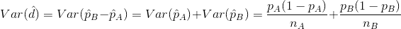

标准偏差可计算如下:

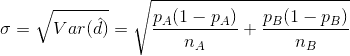

如果我们把这个方程用伯努利分布的标准差来表示， ***s*** :

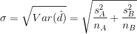

我们得到了[合并标准误差](http://www.statisticshowto.com/find-pooled-sample-standard-error/)的[萨特思韦特近似](http://www.statisticshowto.com/satterthwaite-approximation/)。如果我们计算混合概率，并使用混合概率计算两组的标准差，我们得到:

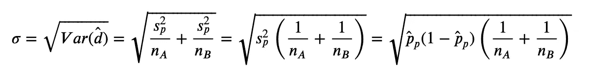

其中:

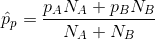

这与 Udacity 课程中使用的等式相同。合并标准误差的两个方程将给出非常相似的结果。

这样，我们现在有足够的信息来构建零假设和备择假设的分布。

## 比较零假设和替代假设

让我们从定义[零假设和替代假设](http://the null hypothesis and the alternate hypothesis)开始。

*   无效假设是指试验组**的设计变更不会导致转换率**发生变化。
*   另一个假设是相反的观点，即测试组**设计的改变会导致转换率的提高(或降低)**。

根据 [Udacity 课程](https://www.youtube.com/watch?v=iub8yWiO84I)，零假设将是均值为零的正态分布，标准偏差等于合并标准误差。

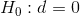

The null hypothesis

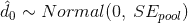

替代假设与原假设具有相同的标准差，但平均值将位于转换率的差异处`d_hat`。这是有意义的，因为我们可以直接从数据中计算转化率的差异，但正态分布代表了我们的实验可能给我们的可能值。


The alternative hypothesis

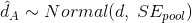

既然我们理解了合并标准误差的来源，我们就可以直接为将来的实验绘制零假设和替代假设。我写了一个脚本来快速绘制无效假设和替代假设，`abplot`，可以在这里找到[。](https://github.com/mnguyenngo/ab-framework/blob/master/src/plot.py)

```
# define the parameters for abplot()
# use the actual values from the experiment for bcr and d_hat
# p_A is the conversion rate of the control group
# p_B is the conversion rate of the test groupn = N_A + N_B
bcr = p_A  
d_hat = p_B - p_A
abplot(n, bcr, d_hat)
```

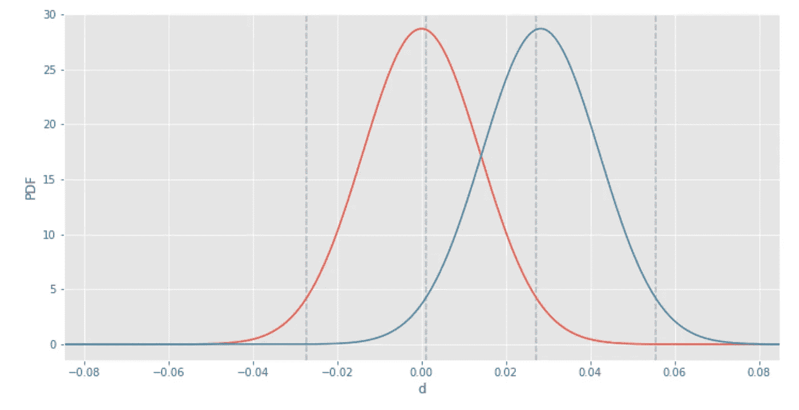

Null hypothesis (red) vs. alternative hypothesis (blue)

从视觉上看，零假设和替代假设的图与上面的其他图非常相似。幸运的是，两条曲线在形状上是相同的，所以我们可以比较两个分布的平均值之间的距离。我们可以看到，替代假设曲线表明，测试组的转化率高于对照组。该图也可用于直接确定统计功效。

# 4.统计功效和显著性水平

我认为，通过首先显示它们在无效假设和替代假设图中是如何表示的，来定义统计功效和显著性水平更容易。我们可以通过添加参数`show_power=True`返回统计能力的可视化。

```
abplot(N_A, N_B, bcr, d_hat, show_power=True)
```

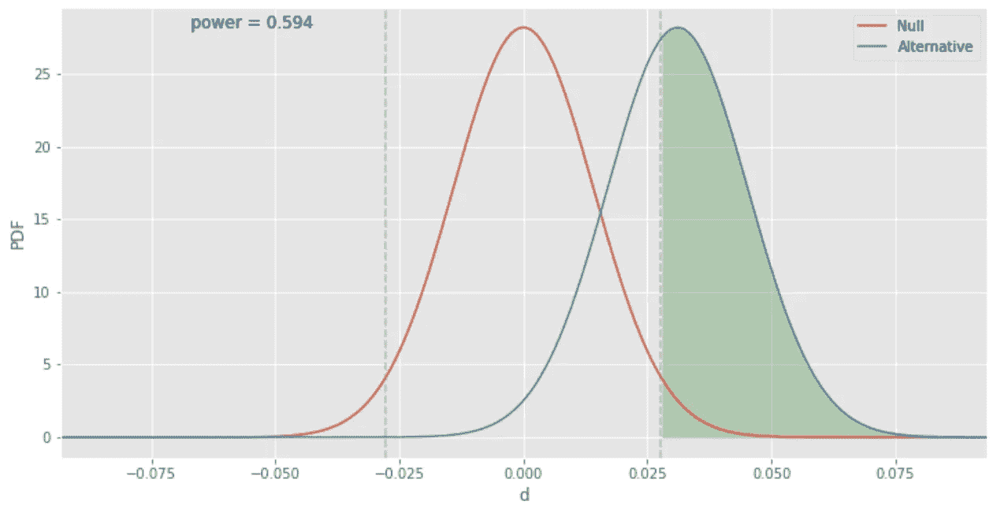

Statistical power shown in green

绿色阴影区域代表[统计功率](https://en.wikipedia.org/wiki/Power_(statistics))，功率的计算值也显示在图上。上图中的灰色虚线代表零假设的置信区间(上图为 95%)。统计功效的计算方法是找出替代假设分布下和无效假设的置信区间之外的面积。

在运行我们的实验之后，我们得到了两组的最终转化率。如果我们计算转换率之间的差异，我们最终会得到一个结果，即差异或设计变更的影响。我们的任务是确定这个结果来自哪个人群，是零假设还是替代假设。

替代假设曲线下的面积等于 1。如果备选设计确实更好，则功效是我们接受备选假设并拒绝零假设的概率，等于绿色阴影面积**(真阳性)**。替代曲线下的相反区域是我们接受零假设和拒绝替代假设的概率**(假阴性)**。这在 A/B 测试或假设测试中被称为 [**beta**](https://en.wikipedia.org/wiki/Type_I_and_type_II_errors) ，如下所示。

```
abplot(N_A, N_B, bcr, d_hat, show_beta=True)
```

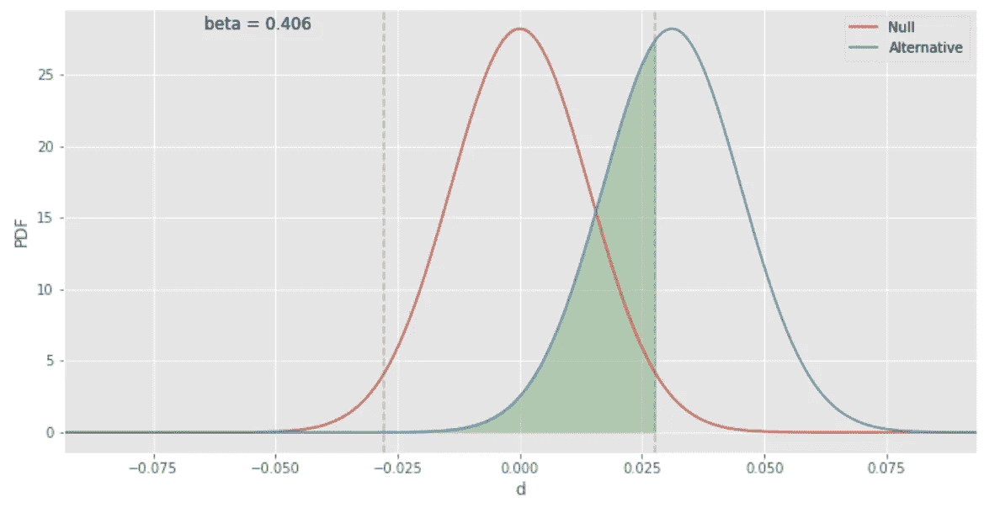

Beta shown in green

将替代曲线下的区域一分为二的灰色虚线也直接分割与显著性水平相关的区域，通常用希腊字母 alpha 表示。

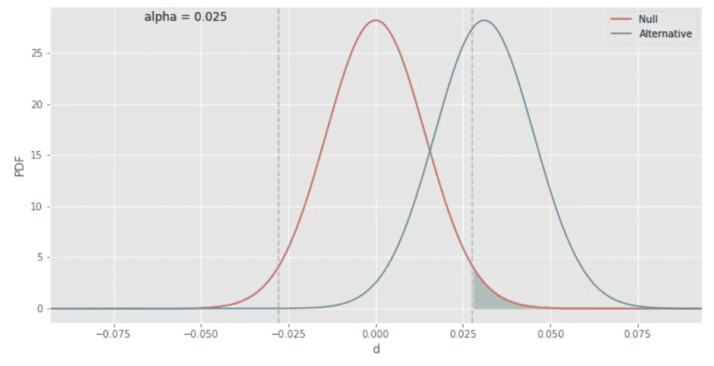

The green shaded area has an area equal to 0.025, which represents alpha.

如果零假设为真，并且在对照组和测试组之间**确实没有差异**，那么显著性水平是我们拒绝零假设并接受替代假设**(假阳性)**的概率。假阳性是指我们错误地认为新设计更好。这个值很低，因为我们想限制这个概率。

通常，问题会以期望的置信水平而不是显著性水平给出。A/B 测试的典型 95%置信水平对应于 0.05 的显著性水平。


Significance Level (alpha) and Confidence Level

当您评估 A/B 测试的结果和不同的结果概率时，参考[混淆矩阵](https://en.wikipedia.org/wiki/Confusion_matrix)可能会有所帮助。

实验通常设置为 80%的最小期望功率。如果我们的新设计真的更好，我们希望我们的实验表明至少有 80%的可能性是这样。不幸的是，我们目前的实验只有 0.594 的功效。我们知道，如果我们增加每组的样本量，我们将减少无效假设和替代假设的混合方差。这将使我们的分布更窄，并可能增加统计能力。让我们看看样本大小将如何直接影响我们的结果。

# 5.样本量

如果我们用每组 2000 个样本而不是 1000 个样本再次运行我们的测试，我们会得到下面的结果。

```
abplot(2000, 2000, bcr, d_hat, show_power=True)
```

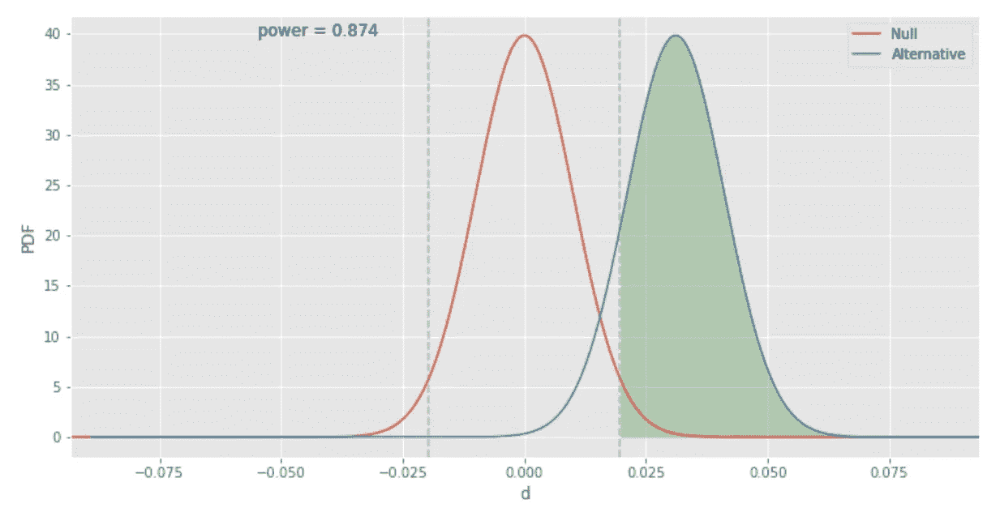

我们的零假设和替代假设的曲线变得更窄，替代曲线下的更多区域位于灰色虚线的右侧。功效的结果大于 0.80，符合我们的统计功效基准。我们现在可以说我们的结果在统计学上是有意义的。

你可能会遇到的一个问题是确定实验所需的最小样本量。这是一个常见的面试问题，了解这一点很有用，因为它直接关系到你能多快完成实验，并向你的设计团队提供具有统计意义的结果。您可以使用网上提供的计算器，例如下面这些:

 [## 样本量计算器(Evan 出色的 A/B 工具)

### 可视化交互式样本量计算器，非常适合 A/B 测试。

www.evanmiller.org](http://www.evanmiller.org/ab-testing/sample-size.html) [](https://www.optimizely.com/sample-size-calculator/?conversion=10&effect=20&significance=95) [## A/B 测试样本大小计算器

### 使用这种方法，您不再需要使用样本量计算器来确保结果的有效性…

www.optimizely.com](https://www.optimizely.com/sample-size-calculator/?conversion=10&effect=20&significance=95) 

您将需要基线转化率(bcr)和最小可检测效应，这是您或您的团队首先确定值得投资进行设计变更的对照组和测试组之间的最小差异。

我想写一个脚本来做同样的计算，但需要找到正在使用的方程。经过大量搜索，我找到并测试了这个来自斯坦福讲座的等式。**(警告:链接打开 Powerpoint 下载。)**


Equation for minimum sample size


许多人从表格中计算 Z，比如这里显示的和这里显示的。然而，我更像是一个视觉学习者，我喜欢参考 Z 分布的图，这些值就是从 Z 分布图中得出的。

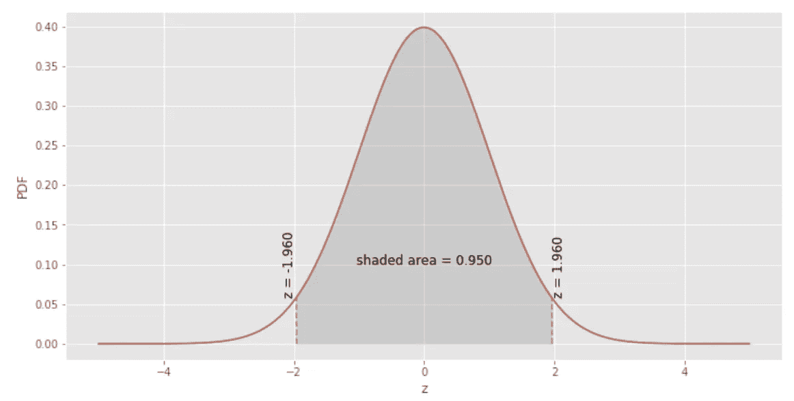

Plot for typical significance level of 0.05 or confidence level of 0.95 (z = 1.96)

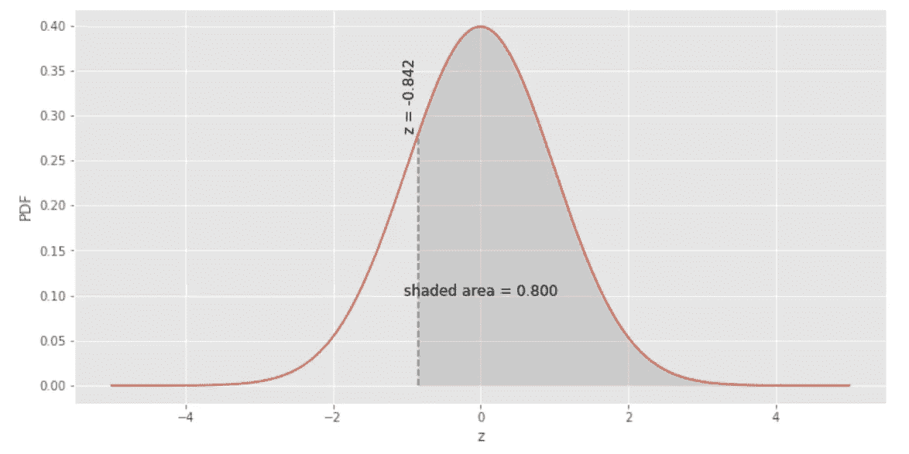

Typical z-score for power level of 0.80 (z = 0.842

这些 z 图的代码可以在我的 Github repo [这里](https://gist.github.com/mnguyenngo/3e0695c138c567852cff966c19ea0354)找到。

以下是针对最小样本量执行相同计算的 Python 代码:

我可以通过运行另一个 A/B 实验来证明这个方程返回了正确的答案，实验的样本大小是由这个方程得出的。

```
min_sample_size(bcr=0.10, mde=0.02)
**Out: 3842.026**abplot(3843, 3843, 0.10, 0.02, show_power=True)
```

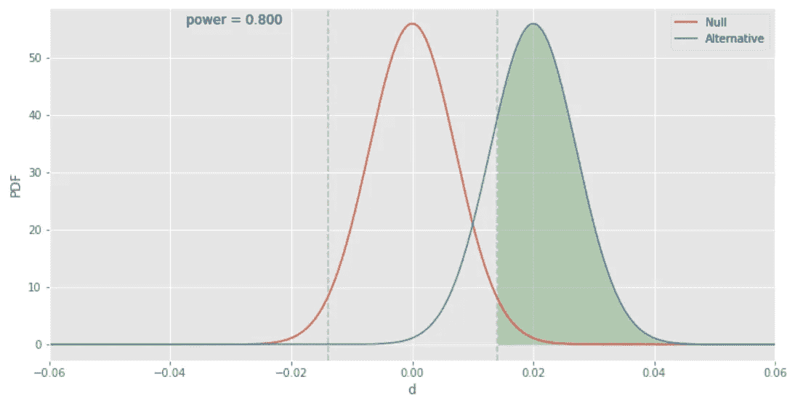

该样本大小的计算功效约为 0.80。因此，如果我们的设计变更在转化率方面有大约 2%的改进，我们将需要每组至少 3843 个样本，统计功效至少为 0.80。

这是一个非常长但基本的 A/B 测试演练。一旦你理解并熟悉了这个过程，你就有可能进行一个实验，并直接进入无效假设和替代假设的图表，以确定你的结果是否达到了足够的功效。通过计算实验前所需的最小样本量，您可以确定需要多长时间将结果反馈给您的团队以供最终决策。

如果你有什么问题，我可以试着在下面的评论里回答。如果你喜欢这篇文章，请👏。大声喊出来[布莱恩·麦克加里](https://www.linkedin.com/in/briantmcgarry/)编辑笔记。感谢您的阅读！