# 主成分分析背后的数学

> 原文：<https://towardsdatascience.com/the-mathematics-behind-principal-component-analysis-fff2d7f4b643?source=collection_archive---------0----------------------->

## 从原始数据到主成分

Photo by [Tim Johnson](https://unsplash.com/@mangofantasy?utm_source=medium&utm_medium=referral) on [Unsplash](https://unsplash.com?utm_source=medium&utm_medium=referral)

# 介绍

主成分分析(PCA)的中心思想是降低由大量相关变量组成的数据集的维数，同时尽可能多地保留数据集中存在的变异。这是通过转换成一组新的变量来实现的，即*主成分**【PCs】*，它们是不相关的，并且是有序的，因此前几个保留了所有原始变量中存在的大部分变化。

# PCA 背后的数学

PCA 可以被认为是一个无监督的学习问题。从原始数据集获取主成分的整个过程可以简化为六个部分:

*   取由 *d+1 维*组成的整个数据集，忽略标签，这样我们的新数据集就变成了 *d 维。*
*   计算整个数据集的每个维度的平均值。
*   计算整个数据集的*协方差矩阵*
*   计算*特征向量*和相应的*特征值*。
*   将特征向量按特征值递减排序，选择 k 个特征值最大的特征向量，形成一个 *d × k 维*矩阵 **W.**
*   使用这个 *d × k 特征向量矩阵*将样本变换到新的子空间上。

所以，让我们一个一个地展示这背后的数学原理。

1.  **取由 *d+1 维*组成的整个数据集，忽略标签，这样我们的新数据集就变成了 *d 维。***

假设我们有一个数据集，它是 d+1 维的。其中，在现代机器学习范例中，d 可以被认为是 *X_train* ，1 可以被认为是 y_train *(标签)*。因此， *X_train + y_train* 组成了我们完整的训练数据集。

因此，在我们去掉标签后，我们剩下的是 *d 维*数据集，这将是我们用来寻找主成分的数据集。此外，让我们假设在忽略标签(即 d = 3)后，我们剩下一个三维数据集。

我们将假设样本来自两个不同的类，其中数据集的一半样本被标记为类 1，另一半被标记为类 2。

让我们的数据矩阵 **X** 是三个学生的分数:

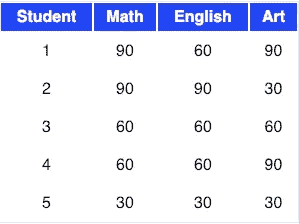

**2。计算整个数据集每个维度的平均值。**

上表中的数据可以用矩阵 **A，**来表示，其中矩阵中的每一列显示测试分数，每一行显示学生的分数。

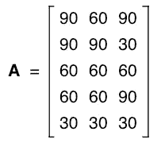

Matrix A

因此，矩阵 **A** 的平均值为

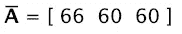

Mean of Matrix A

**3。计算整个数据集的*协方差矩阵*(有时也称为方差-协方差矩阵)**

因此，我们可以使用以下公式计算两个变量 **X** 和 **Y** 的协方差:

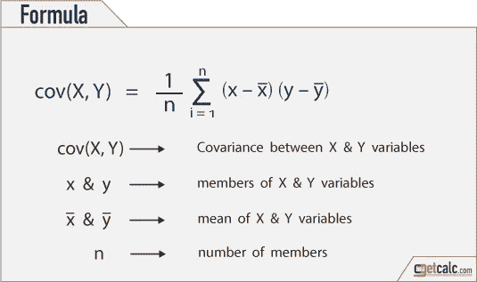

[https://getcalc.com/statistics-covariance-calculator.htm](https://getcalc.com/statistics-covariance-calculator.htm)

使用上述公式，我们可以找到 **A.** 的协方差矩阵。同样，结果将是 d ×d 维的*方阵。*

让我们像这样重写我们的原始矩阵

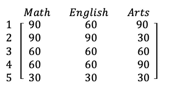

Matrix A

它的 c *卵巢矩阵*会是

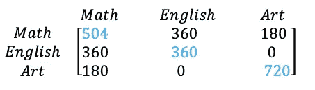

Covariance Matrix of A

这里值得注意的几点是:

*   如对角线上的蓝色*所示，我们可以看到每次测试分数的变化。艺考方差最大(720)；还有英语考试，最小的(360)。所以我们可以说艺考成绩比英语考试成绩有更多的可变性。*
*   协方差在矩阵 **A** 的非对角线元素中显示为黑色

**a)** 数学与英语的协方差为正(360)，数学与美术的协方差为正(180)。这意味着分数趋向于以积极的方式协变。随着数学分数的上升，艺术和英语的分数也趋于上升；反之亦然。

T21 然而，英语和艺术之间的协方差是零。这意味着英语和艺术成绩之间没有可预测的关系。

**4。计算特征向量和相应的特征值**

> 直观上，特征向量是一个向量，当对其应用线性变换时，其方向保持不变。

现在，我们可以很容易地从上面的协方差矩阵计算特征值和特征向量。

> 设 ***A*** 为方阵， **ν** 为向量， **λ** 为标量，满足***A***ν**=λ**ν，则 **λ** 称为与特征向量****ν*A***关联的特征值。**

*****A*** 的特征值是特征方程的根**

****

**计算 *det(A-λI)* 首先， *I* 是一个单位矩阵:**

**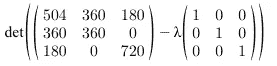**

**先简化矩阵，我们可以以后再计算行列式，**

**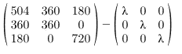******

**既然我们已经有了简化的矩阵，我们就可以求出它的行列式:**

**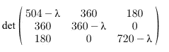****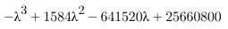**

**我们现在有了方程，我们需要求解 *λ，*从而得到矩阵的*特征值。因此，将上面的等式等于零:***

**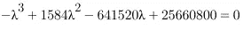**

**求解此方程得到 ***λ、*** 的值后，我们得到以下值**

**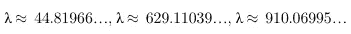**

**Eigenvalues**

**现在，我们可以计算上述特征值对应的特征向量。我不会在这里展示如何计算特征向量，访问这个[链接](https://study.com/academy/lesson/eigenvalues-eigenvectors-definition-equation-examples.html)来了解如何计算特征向量。**

**因此，在求解了*特征向量*之后，我们将得到相应的*特征向量*的如下解**

**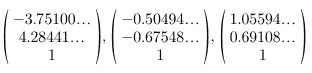**

****5。将特征向量按特征值递减排序，选择 k 个特征值最大的特征向量，形成一个 *d × k 维*矩阵 W.****

**我们从降低我们的特征空间的维度的目标开始，即，通过 PCA 将特征空间投影到更小的子空间上，其中特征向量将形成这个新的特征子空间的轴。然而，特征向量仅定义新轴的方向，因为它们都具有相同的单位长度 1。**

**因此，为了决定对于低维子空间，我们要去掉哪个(些)特征向量，我们必须看一下特征向量的相应特征值。粗略地说，具有最低特征值的特征向量承载关于数据分布的最少信息，并且那些是我们想要丢弃的。**

**常见的方法是将特征向量从最高到最低的对应特征值进行排序，选择顶部的 *k* 个特征向量。**

**因此，按降序排列特征值后，我们有**

**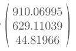**

**对于我们的简单示例，我们将 3 维特征空间缩减为 2 维特征子空间，我们将两个具有最高特征值的特征向量进行组合，以构建我们的 *d×k* 维特征向量矩阵 **W.****

**所以，*特征向量*对应的两个最大特征值是:**

**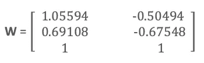**

****6。将样本转换到新的子空间上****

**在最后一步中，我们使用刚刚计算的 3x2 维矩阵 ***W*** 通过等式***y = W′×x***将样本变换到新的子空间上，其中***W′***是矩阵*的*转置****

****最后，我们计算了两个主成分，并将数据点投影到新的子空间上。****

*****学分和来源:*****

1.  ***[塞巴斯蒂安·拉什卡博客](http://sebastianraschka.com/Articles/2014_pca_step_by_step.html)***
2.  ***[Stattrek 矩阵代数](https://stattrek.com/matrix-algebra/covariance-matrix.aspx)***