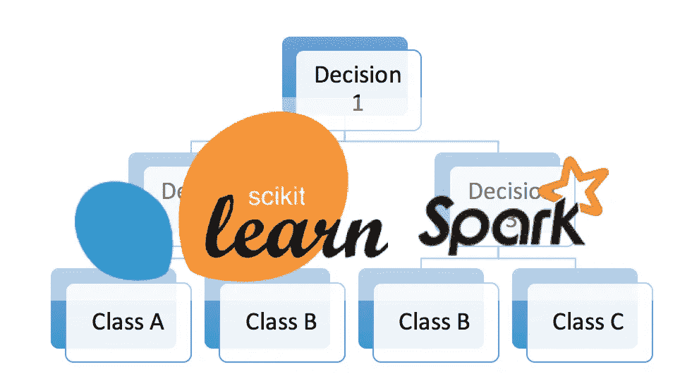
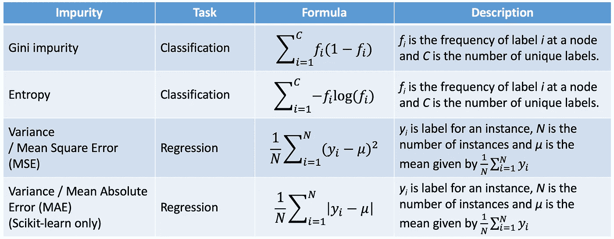
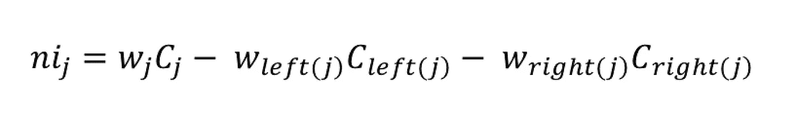
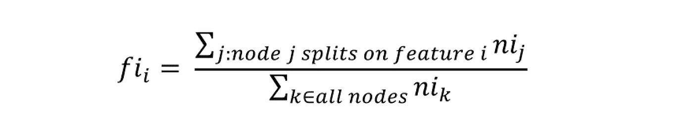

# Scikit-learn 和 Spark 中决策树、随机森林和特征重要性的数学

> 原文：<https://towardsdatascience.com/the-mathematics-of-decision-trees-random-forest-and-feature-importance-in-scikit-learn-and-spark-f2861df67e3?source=collection_archive---------0----------------------->

# **简介**

这篇文章试图在 Scikit-learn 和 Spark 中整合关于树算法及其实现的信息。特别是，它提供了如何计算特性重要性的说明。

网上有很多很棒的资源在讨论决策树和随机森林是如何创建的，这篇文章并不打算这样做。尽管它包含了上下文的简短定义，但它假设读者已经掌握了这些概念，并且希望知道 Scikit-learn 和 Spark 中的算法是如何实现的。

所以，让我们从…

## **决策树**

决策树学习如何最好地将数据集分成越来越小的子集来预测目标值。条件或测试被表示为“叶子”(节点)，而可能的结果被表示为“分支”(边)。这个分裂过程继续进行，直到不能获得进一步的增益或者满足预设规则，例如达到树的最大深度。

## **决策树算法**

有多种算法，scikit-learn 文档提供了其中一些算法的概述([链接](http://scikit-learn.org/stable/modules/tree.html#tree-algorithms-id3-c4-5-c5-0-and-cart))

*那么 Scikit-learn 和 Spark 用什么呢？*

Scikit-learn 文档称，它正在使用“CART 算法的优化版本”。虽然文档中没有明确提到，但可以推断 Spark 将 ID3 与 CART 一起使用。

所以让我们把重点放在这两个上——ID3 和 CART。

论文[对 ID3、CART 和 C4.5 决策树算法的优缺点进行了比较研究](http://citeseerx.ist.psu.edu/viewdoc/download?doi=10.1.1.685.4929&rep=rep1&type=pdf)。更全面的定义也可以在那里找到。

**ID3**

该算法创建了一个多向树——每个节点可以有两条或更多条边——使用杂质标准*熵*找到将最大化*信息增益*的分类特征。它不仅不能处理数字特征，而且只适用于分类问题。

优势

*   从训练数据中创建可理解的预测规则
*   构建最快的树
*   构建一棵矮树
*   只需要足够的属性，直到所有数据都被分类
*   找到叶节点使得测试数据能够被修剪，从而减少测试的数量
*   搜索整个数据集以创建树

不足之处

*   如果测试一个小样本，数据可能会过度拟合或过度分类
*   一次只测试一个属性来做出决策
*   不处理数字属性和缺失值

**推车**

CART 代表分类和回归树。该算法创建一个二叉树，每个节点正好有两条向外的边，使用适当的杂质标准找到最佳的数字或分类特征进行分割。对于分类，可以使用*基尼系数*或 *twoing 标准*。对于回归，CART 使用最小二乘法(均方误差)引入了*方差缩减*。

优势

*   CART 可以轻松处理数字和分类变量
*   CART 算法将自己识别最重要的变量并消除不重要的变量
*   CART 可以轻松处理异常值

不足之处

*   购物车可能有不稳定的决策树
*   购物车按一个接一个的变量拆分

## **节点杂质/杂质标准**

Scikit-learn 和 Spark 都在其文档中提供了有关杂质标准所用公式的信息。对于分类，他们都默认使用基尼系数，但提供熵作为替代。对于回归，两者都使用均方差来计算方差减少。此外，可以使用 Scikit-learn 中的平均绝对误差来计算方差减少。

Impurity Formulas used by Scikit-learn and Spark

**树算法文档的链接**

*   [Sci-kit 学习](http://scikit-learn.org/stable/modules/tree.html#tree)
*   [火花](https://spark.apache.org/docs/2.2.0/mllib-decision-tree.html)

**信息增益**

另一个值得注意的术语是“信息增益”，它与使用熵分割数据一起使用。它被计算为在属性上分割数据集后熵的减少:

> 增益(T，X) =熵(T) —熵(T，X)

*   T =目标变量
*   X =要分割的特征
*   熵(T，X) =在特征 X 上分割数据后计算的熵

## **随机森林**

随机森林(RF)在训练中构造许多个体决策树。来自所有树的预测被汇集以做出最终预测；用于分类的类的模式或用于回归的平均预测。由于他们使用一系列的结果来做最后的决定，他们被称为集成技术。

## **特征重要性**

特征重要性被计算为通过到达该节点的概率加权的节点杂质的减少。节点概率可以通过到达节点的样本数除以样本总数来计算。*值越高，特性越重要。*

**sci kit-learn 中的实施**

对于每个决策树，Scikit-learn 使用 Gini 重要性计算节点重要性，假设只有两个子节点(二叉树):

*   ni sub(j)=节点 j 的重要性
*   w sub(j) =到达节点 j 的加权样本数
*   C sub(j)=节点 j 的杂质值
*   left(j) =在节点 j 上从左侧拆分的子节点
*   right(j) =在节点 j 上从右侧拆分的子节点

*sub()正在被使用，因为下标在媒体*中不可用

参见 [_tree.pyx](https://github.com/scikit-learn/scikit-learn/blob/18cdaa69c14a5c84ab03fce4fb5dc6cd77619e35/sklearn/tree/_tree.pyx#L1056) 中的*compute _ feature _ importances*方法

决策树中每个特征的重要性计算如下:

*   fi sub(i)=特性 I 的重要性
*   ni sub(j)=节点 j 的重要性

然后，通过除以所有要素重要性值的总和，可以将这些值归一化为 0 到 1 之间的值:

在随机森林级别，最后一个特征重要性是所有树的平均值。计算每棵树上的要素重要性值之和，然后除以树的总数:

*   RFfi sub(i)=从随机森林模型中的所有树计算的特征 I 的重要性
*   normfi sub(ij)=树 j 中 I 的归一化特征重要性
*   T =树木总数

参见 [forest.py](https://github.com/scikit-learn/scikit-learn/blob/0abd95f742efea826df82458458fcbc0f9dafcb2/sklearn/ensemble/forest.py#L360) 中的方法 *feature_importances_*

*符号的灵感来自这个*[*stack exchange thread*](https://stats.stackexchange.com/questions/311488/summing-feature-importance-in-scikit-learn-for-a-set-of-features)*，我发现它对这篇文章非常有用。*

**在 Spark 中实现**

对于每个决策树，Spark 通过对增益求和来计算特征的重要性，增益按通过节点的样本数进行缩放:

*   fi sub(i) =特性 I 的重要性
*   s sub(j) =到达节点 j 的样本数
*   C sub(j) =节点 j 的杂质值

参见 [treeModels.scala](https://github.com/apache/spark/blob/master/mllib/src/main/scala/org/apache/spark/ml/tree/treeModels.scala#L212) 中的方法*computeFeatureImportance*

要计算随机森林级别的最终要素重要性，首先要相对于树对每棵树的要素重要性进行归一化:

*   normfi sub(i) =特征 I 的归一化重要性
*   fi sub(i) =特性 I 的重要性

然后将每棵树的特征重要性值归一化求和:

*   RFfi sub(i)=从随机森林模型中的所有树计算的特征 I 的重要性
*   normfi sub(ij)=树 j 中 I 的归一化特征重要性

参见 [treeModels.scala](https://github.com/apache/spark/blob/master/mllib/src/main/scala/org/apache/spark/ml/tree/treeModels.scala#L150) 中的*方法特征重要性*

## 结论

该模型的目标是解释 Scikit-Learn 和 Spark 如何实现决策树并计算特征重要性值。

希望在这篇文章结束时，你能更好地理解适当的决策树算法和杂质标准，以及用于确定模型中每个特征重要性的公式。