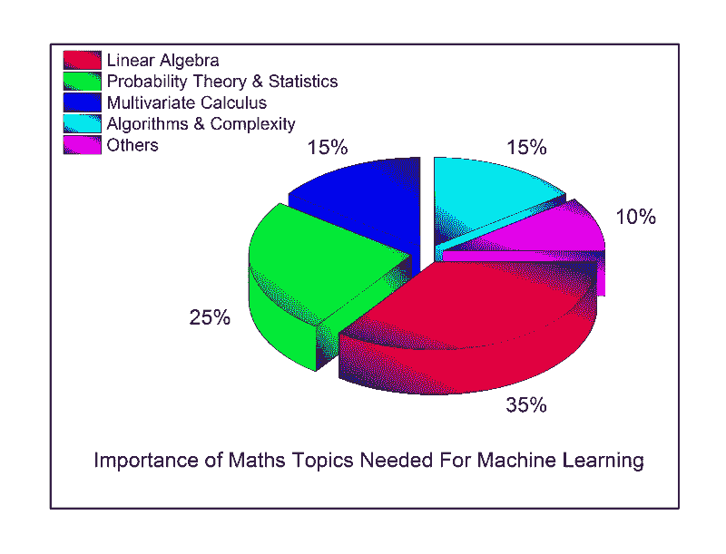

# 机器学习的数学

> 原文：<https://towardsdatascience.com/the-mathematics-of-machine-learning-894f046c568?source=collection_archive---------0----------------------->

在过去的几个月里，有几个人联系我，说他们热衷于探索数据科学的世界，并使用机器学习(ML)技术来探索统计规律，构建无懈可击的数据驱动产品。然而，我观察到有些人实际上缺乏必要的数学直觉和框架来获得有用的结果。这是我决定写这篇博文的主要原因。最近，出现了许多易于使用的机器和深度学习包的可用性热潮，如 [scikit-learn](http://scikit-learn.org/) 、 [Weka](http://www.cs.waikato.ac.nz/ml/weka/) 、 [Tensorflow](https://www.tensorflow.org/) 、 [R-caret](http://topepo.github.io/caret/index.html) 等。机器学习理论是一个交叉统计学、概率学、计算机科学和算法方面的领域，产生于从数据中迭代学习和发现可以用于构建智能应用的隐藏见解。尽管机器和深度学习有巨大的可能性，但要想很好地掌握算法的内部工作原理并获得良好的结果，对这些技术中的许多技术进行彻底的数学理解是必要的。

为什么要担心数学？

机器学习的数学之所以重要，有很多原因，下面我将重点介绍其中的一些原因:

1.  选择正确的算法，包括考虑准确性、训练时间、模型复杂性、参数数量和特征数量。
2.  选择参数设置和验证策略。
3.  通过理解偏差-方差权衡来识别欠拟合和过拟合。
4.  估计正确的置信区间和不确定性。

你需要什么水平的数学？

当试图理解像机器学习这样的跨学科领域时，主要问题是理解这些技术所需的数学量和数学水平。这个问题的答案是多维度的，取决于个人的水平和兴趣。对机器学习的数学公式和理论进步的研究正在进行中，一些研究人员正在研究更先进的技术。我将陈述我认为成为机器学习科学家/工程师所需的最低数学水平，以及每个数学概念的重要性。

Image by Author

1.  线性代数:我的一个同事，Skyler Speakman 最近说“线性代数是 21 世纪的数学”，我完全同意他的说法。在 ML 中，线性代数随处可见。诸如主成分分析(PCA)、奇异值分解(SVD)、矩阵的特征分解、LU 分解、QR 分解/因式分解、对称矩阵、正交化&正交化、矩阵运算、投影、特征值&特征向量、向量空间和范数等主题是理解用于机器学习的优化方法所需要的。线性代数的神奇之处在于有如此多的在线资源。我总是说，传统的课堂正在消亡，因为互联网上有大量的可用资源。我最喜欢的线性代数课程是[麻省理工学院课件](http://ocw.mit.edu/courses/mathematics/18-06-linear-algebra-spring-2010/)(Gilbert Strang 教授)提供的课程。
2.  概率论和统计学:机器学习和统计学不是很不同的领域。实际上，最近有人将机器学习定义为“在 Mac 上做统计”。ML 需要的一些基本统计和概率理论是组合学、概率规则和公理、贝叶斯定理、随机变量、方差和期望、条件和联合分布、标准分布(伯努利、二项式、多项式、均匀和高斯)、矩母函数、最大似然估计(MLE)、先验和后验、最大后验估计(MAP)和抽样方法。
3.  多元微积分:一些必要的主题包括微分和积分，偏导数，向量值函数，方向梯度，海森，雅可比，拉普拉斯和拉格郎日分布。
4.  算法和复杂的优化:这对于理解我们的机器学习算法的计算效率和可扩展性以及利用我们的数据集中的稀疏性是很重要的。需要了解数据结构(二叉树，散列，堆，栈等)，动态规划，随机和次线性算法，图形，梯度/随机下降和原始对偶方法。
5.  其他:这包括上述四个主要领域中没有涵盖的其他数学主题。它们包括实分析和复分析(集合和序列、拓扑、度量空间、单值和连续函数、极限、柯西核、傅立叶变换)、信息论(熵、信息增益)、函数空间和流形。

一些用于研究机器学习所需的一些数学主题的在线 MOOCs 和材料是:

*   可汗学院的[线性代数](https://www.khanacademy.org/math/linear-algebra)、[概率&统计](https://www.khanacademy.org/math/probability)、[多变量微积分](https://www.khanacademy.org/math/calculus-home/multivariable-calculus)和[优化](https://www.khanacademy.org/math/differential-calculus/derivative-applications/calc-optimization/e/optimization)。
*   [编码矩阵:通过计算机科学应用的线性代数](http://codingthematrix.com/)作者菲利普·克莱恩，布朗大学。
*   [线性代数——前沿基础](https://www.edx.org/course/linear-algebra-foundations-frontiers-utaustinx-ut-5-04x)作者:罗伯特·范·德·盖因，德克萨斯大学。
*   [线性代数的应用，第一部分](https://www.edx.org/course/applications-linear-algebra-part-1-davidsonx-d003x-1)和[第二部分](https://www.edx.org/course/applications-linear-algebra-part-2-davidsonx-d003x-2)。戴维森学院蒂姆·查蒂尔的新课程。
*   约瑟夫·布利茨坦— [哈佛统计 110 讲座](http://projects.iq.harvard.edu/stat110/youtube)。
*   拉里·乏色曼的书——《所有的统计学:统计推断简明教程》。
*   Boyd 和 Vandenberghe 在斯坦福大学上的[凸优化课程。](http://stanford.edu/~boyd/cvxbook/)
*   线性代数—[edX 前沿基础](https://www.edx.org/course/linear-algebra-foundations-frontiers-utaustinx-ut-5-04x)。
*   Udacity 的[统计学简介](https://www.udacity.com/course/intro-to-statistics--st101)。

最后，这篇博文的主要目的是给出一个善意的建议，关于数学在机器学习中的重要性，以及掌握这些主题的必要主题和有用资源。然而，一些机器学习爱好者是数学新手，可能会发现这篇文章令人沮丧(说真的，这不是我的目的)。对于初学者来说，开始做机器学习不需要很多数学。基本的先决条件是本文[博客](http://www.r-bloggers.com/the-real-prerequisite-for-machine-learning-isnt-math-its-data-analysis/)中描述的数据分析，随着你掌握更多的技术和算法，你可以在旅途中学习数学。

*本条目最初发表于 2016 年 7 月我的* [*LinkedIn*](https://www.linkedin.com/pulse/mathematics-machine-learning-wale-akinfaderin?trk=pulse_spock-articles) *页面。*