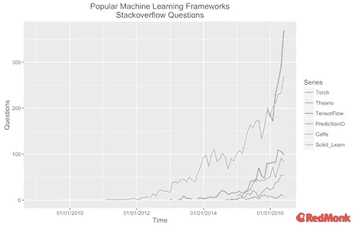
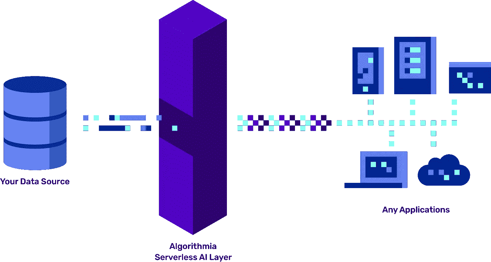

# 机器学习革命中缺失的部分

> 原文：<https://towardsdatascience.com/the-missing-part-of-the-machine-learning-revolution-91e58b3427ef?source=collection_archive---------3----------------------->

## 尽管人工智能被广泛采用，但扩展和部署基于人工智能的产品一如既往地困难；但是一些新技术正试图改变这一现实

(免责声明:我不受雇于 Algorithmia，也不以任何方式与该公司有财务关系。我只是一个有数据科学背景的人，觉得这家公司很有吸引力。)

毫无疑问，我们正在进入人工智能时代，机器学习几乎触及了我们日常生活中的一切。在数据存储和计算能力的逐步创新的推动下，神经网络从 70 年代轰轰烈烈地回来了。医药、安全、客户服务、欺诈检测，凡是你能想到的，都有资金充足的公司应用机器学习来改进和增强它。见鬼，你甚至可以通过 Medium 基于机器学习的推荐系统找到这篇文章。

不管出于什么原因，深度学习似乎对许多立竿见影的问题非常有效。你甚至可以称之为一场革命。

## 创建深度学习模型变得越来越容易，但不是大规模部署它们

虽然数据存储和 Nvidia 的发展无疑有助于刺激这场革命，但今天机器学习状态的主要驱动力之一是你可以轻松地实际创建工作，准确的模型。机器学习正在经历重大的抽象化— [新工具使人工智能比以往任何时候都更容易起步](https://machinelearnings.co/machine-learning-abstraction-and-the-age-of-ai-ease-f3274bb9e0c1)。

除了为特定任务提供功能丰富的 API 的私营公司，如 [Clarifai](https://www.clarifai.com/) 和 [Indico](https://indico.io/) ，像 R 和 Python 这样的流行数据科学语言的第三方包生态系统正在呈指数级增长。谷歌在 2015 年 11 月发布了最初版本的 [TensorFlow](https://www.tensorflow.org/) ，从那以后它就像火箭一样起飞了(除了已经很流行的 ScikitLearn)。对于数据科学家来说，在测试环境中创建复杂的模型变得更加容易。

不幸的是，这种轻松并没有离开 iPython 笔记本。这是因为让机器学习模型在生产中工作与让它在你的电脑上工作是完全不同的任务。部署您的模型意味着让它们在需要时以您希望的方式大规模工作。创建理论上准确的模型是没有用的，如果一旦你开始把它们提供给客户，它们就会分崩离析。

你需要担心一系列全新的挑战，掌握一系列新的技能，以及衡量你成功的不同标准。

## 部署与模型创建有很大不同，对于小型和大型公司来说都非常困难

像任何分布式应用程序一样，部署机器学习模型是极其困难的，这与一开始创建它们是完全不同的任务。这在多个维度上都是正确的:

**谁:**建模由数据科学家和机器学习研究人员完成，而部署由软件工程师、机器学习工程师和数据工程师完成。

**度量:**模型构建的目标是创建可以准确预测的东西，而部署的目标是快速可靠地预测。

**其中:**模型构建通常由几个人在几个虚拟服务器上完成，而部署的模型需要能够伸缩并处理数千或数百万个 API 请求。

这些只是部署与众不同的几个方面。这也很难做到——它涉及到杂耍不同的技能、优先级和能力。如果您最精确的模型运行时间太长怎么办？你如何用新数据更新你的模型？您如何通过跨地域多样化来优化速度？

这个问题在不同规模的公司中都存在。对于寻求围绕机器学习模型开发和运行产品的早期创业公司来说，部署是一团乱麻。雇佣合适的软件和数据工程人才已经够困难的了；当你试图推出一个产品时，这就更难了，你的恢复能力取决于一群新的人让你的模型运行起来。数据科学家拥有的技能(精确的模型)不会让你达到目标(大规模部署)。

随着公司的发展，这个问题不会变得更容易——事实上，在某些方面，这个问题在企业中更为突出。数据科学团队开发有影响力的模型和产品，但他们需要让它们工作并可扩展；这意味着转向其他不一定有合适背景的工程团队。然而，数据科学家需要依靠*它们*来正确移植模型、调整超参数和决定批量大小。当他们的同事团队完成了机器学习部署的所有挑战时，可能是 4 个月或更久之后，这些模型看起来或行为都不像数据科学团队最初构建的。

总之是很多早期公司解决不了，很多企业处理不了的真正头疼的问题。部署问题的一个常见解决方案是使用水平平台，但这并不适合大多数公司。本质上，您保留自己的数据，但使用 API 来构建驻留在供应商服务器上的快速而肮脏的模型；他们为您向外扩展，并担心如何让事情正常运行。符合这种模式的平台有 [BigML](https://bigml.com/) 和 [Seldon](https://www.seldon.io/) 。

不幸的是，水平部署平台并不总是有用的，因为它们是如何构建的:如果你是一家制造涉及大量机器学习的产品的公司，你*不能*让你的模型驻留在第三方。你想要创建自己的复杂算法，无论是 TensorFlow 上的神经网络还是其他任何东西。

问题是，没有一种产品只负责最后一英里——允许你按照自己的想法开发模型，然后只负责剩下的部分。谢天谢地，这种情况正在改变。

## Algorithmia 通过提供部署即服务来解决最后一英里的问题

Algorithmia 正在发布一款新产品来解决这个问题，但仍然将建模和数据留在了它应该在的地方:数据科学家的手中。它被称为企业人工智能层，它本质上自动化了机器学习部署的开发操作，同时让您担心什么是重要的——创建伟大的模型和产品。

企业人工智能层涵盖了您在可伸缩部署解决方案中期望的所有基础。它与云无关，可根据您的需求进行扩展，允许您在 CPU 和 GPU 之间进行选择，并且延迟极低。Algorithmia 的平台也是由开发运维团队设计的，这意味着需要大量详细的仪表盘，并跟踪所有正确的指标，以确保您的部署符合您的客户需求。

> “作为一个花了多年时间设计和部署机器学习系统的人，Algorithmia 的无服务器微服务架构给我留下了深刻的印象——对于希望以任何规模部署人工智能的组织来说，这是一个很好的解决方案”
> 
> 谷歌人工智能工程副总裁安娜·帕特森*

但除了技术规格，Algorithmia 的人工智能层也很重要，因为它改变了组织看待机器学习的方式。目前，机器学习就像任何应用程序一样——在发送新数据和预测之前，你需要处理所有的基础设施。就像一个 API 调用 Yelp 应用程序一样，你的 API 调用你的模型。这是一种应用程序，这意味着您的团队需要应用程序部署专业知识。

现在不同了，因为你的团队可以专注于创建伟大的模型，而不是让它们工作的基础设施。这是无服务器的数据存储模式，谷歌的 BigQuery 和 T2 的亚马逊的 Athena 让组织专注于分析他们的数据，而不是将数据存储在任何地方的技术复杂性。赚钱的数据分析是从数据存储中抽象出来的。现在建模可以从部署中抽象出来。

这太棒了:这意味着更多的想法可以转化为产品，更多的产品可以摆脱单调的巨型工程团队和企业积压。这意味着作为一名数据科学家，你可以做你真正想做的事情:专注于构建伟大的想法和模型，而不是如何处理他们的后端工程。我认为这是一件大事。

**安娜和谷歌是 Algorithmia 的投资者。*