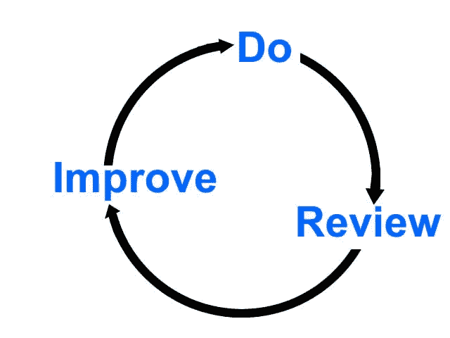

# 数据科学项目最重要的部分是写博客

> 原文：<https://towardsdatascience.com/the-most-important-part-of-a-data-science-project-is-writing-a-blog-post-50715f37833a?source=collection_archive---------4----------------------->

[Pixabay.com](https://pixabay.com/photos/write-communication-filler-2163261/)

## 写作创造机会，给你批判性的交流实践，通过反馈让你成为更好的数据科学家

在将最终代码上传到 GitHub 或提交作业后，称数据科学项目已经完成是一种诱惑。然而，如果你就此打住，你就错过了这个过程中最关键的一步:写并分享一篇关于你的项目的文章。写博客通常不被认为是数据科学管道的一部分，但是为了从你的工作中获得最大的收益，它应该是你任何项目的最后一步。

写一篇关于你工作的简单博客有三个好处:

1.  **沟通练习:**好的代码光靠它自己是不够的。如果你不能让人们关心这项工作，再好的分析也没有影响。
2.  **写作创造机会:**通过向世界展示你的作品，你将能够建立联系，从而获得工作机会、合作和新的项目创意。
3.  **反馈:**变得更好的循环是:做工作，分享，听取建设性的批评，改进工作，重复

写作是那些活动中的一种——锻炼和教育也在考虑之中——可能在短期内没有回报，但从长期来看几乎有无限的潜在回报。就我个人而言，我的博客帖子每天有 10，000 次浏览量，每次需要 3-15 个小时才能写完，我从中赚了 0 美元。然而，如果不是因为我的文章，我也不会有一份全职的数据科学工作。

> 此外，我知道我的数据科学工作的质量要高得多，因为我打算写它，也因为我使用了我以前收到的反馈，使写作的长期回报明显是积极的。

# 沟通:好的代码是不够的

我知道这种感觉:你在 GitHub 上放了一些 Jupyter 笔记本或脚本，你想停下来说“我已经完成了工作，现在我要让其他人发现它。”虽然这可能发生在理想世界，但在现实世界中，让你的项目受到关注需要交流你的结果。

> 如果 GitHub 上最好的作品能自动浮出水面，那就太好了，但事实上，最有影响力的是那些得到最好传播的作品。

想想你最后一次在 GitHub 上找到项目代码库:如果你和我一样，那么你读了一篇关于一个项目的有趣文章，然后继续阅读代码。人们从一篇文章到代码，因为首先他们需要一个令人信服的理由来检查代码。这并不意味着愤世嫉俗，这只是事情的运作方式:人们不会去挖掘你的分析，直到他们知道你做了什么，以及为什么它很重要/有趣。

举一个真实世界的例子，我的[数据分析报告](https://github.com/WillKoehrsen/Data-Analysis)是众多数据科学项目的集合，大多数都是用非常粗糙的代码编写的。然而，因为我写了一些关于这些项目的文章，它有超过 600 颗星。虽然明星不是衡量影响力的好方法，但很明显，人们正在使用这些代码，并从中发现价值。然而，前几天当我偶然发现[这个组合结构贝叶斯优化(BOCS)](https://github.com/baptistar/BOCS) 的回购时，客观地说，它比我写过的任何代码都好，我震惊地看到它只有两颗星。[就像伟大的想法在孤立中死去](https://medium.com/key-lessons-from-books/the-key-lessons-from-where-good-ideas-come-from-by-steven-johnson-1798e11becdb)，如果没有令人信服的结果交流，最好的代码将会被忽视。

## 分析和解释一样有价值

分析的价值不是与使用最好的算法或最多的数据成正比，而是与你如何与广大观众分享结果成正比。1854 年，[约翰·斯诺](https://en.wikipedia.org/wiki/John_Snow)利用 *578 个数据点、一篇公开论文和一张点状地图*帮助减缓了伦敦[霍乱疫情。他没有把他的结果藏在笔记本里，希望人们偶然发现它们，而是把他的工作发表出来，让人们可以很容易地获得。](https://en.wikipedia.org/wiki/1854_Broad_Street_cholera_outbreak)

John Snow’s dot map of the London cholera outbreak. ([Source](https://upload.wikimedia.org/wikipedia/commons/thumb/2/27/Snow-cholera-map-1.jpg/1024px-Snow-cholera-map-1.jpg))

最终，他能够说服镇上的成员停用水泵，从而阻止了霍乱的传播，实现了数据科学的目标:**利用数据做出更好的现实决策**。

> 写博客可以让你在数据科学最重要的部分之一进行实践:与广大读者交流你的工作。写得好的代码和透彻的分析是一个好的开始，但是要完成你的项目，你需要把它和一个令人信服的叙述联系起来。一篇文章是解释你的成果并让人们关心你所有努力的完美媒介。

# 机遇:写作打开了大门

尽管数据科学在招聘中可能比其他领域更客观，但获得一份工作仍然主要取决于你认识谁——**或谁认识你**——而不是你知道什么。上大学的全部意义(这里只是稍微夸张)不是学习你将在职业生涯中使用的东西，而是在你打算的职业领域结识人并建立联系。

幸运的是，在数据科学这一点上，虽然上大学学习*的东西*是有帮助的，但这不是必须的。有了通过一篇博客文章接触成千上万在线用户的能力，你就可以通过写作和分享的行为形成那些关键的联系并打开大门——不需要学费。当你在公共论坛上写你的项目时，你可以获得机会，而不仅仅是交作业。

我大学学的是机械工程，在学校没有做过一个数据科学方面的联系(更别说学什么有用的技能了)。然而，我在最后一个学期确实开始了[写作](http://medium.com/@williamkoehrsen/)，因此，我能够与潜在的雇主、合作者，甚至书籍编辑(答案是最终)建立许多关系，这对我导航数据科学职业生涯的开始非常有帮助。

回到第一点，我的代码远不如许多其他数据科学家的代码好，但我很幸运地获得了机会，因为我能够让我的工作变得容易理解。

> 我从来没有被在 GitHub 上找到我的人单独联系过，但我被看过我文章的人联系过几百次。

虽然我的雇主[Feature Labs](https://www.featurelabs.com/)——确实找到了我的 GitHub 工作，但不是通过在 GitHub 上搜索“伟大的数据科学分析”。更确切地说，是通过我写的一篇文章，遍历一个项目并总结结论。**记住，不是代码对文章，是文章对代码。**

博客文章是建立重要联系的绝佳媒介，因为它表明 1。你做了很好的数据科学工作。你在乎的是分享它，并教给别人。对数据科学的过度热情不是一份工作的必备条件，但表现出你对该领域和学习感兴趣将有助于吸引雇主，尤其是如果你刚刚起步，没有太多经验的话。此外，写得好的博客文章可以有很长的保质期，给你一个潜在的未来几年的投资组合。

> 数据科学工作还没有既定的路径，这意味着我们都可以打造自己的工作。写作并与社区分享可以帮助你形成所有重要的联系，并在该领域获得立足点。

# 反馈:工作、分享、倾听、改进、重复

作为一个新的领域，数据科学很少有什么标准答案。最好的学习方法是尝试一些事情，犯一些错误，然后从经验中学习。将您的工作放在公共场所意味着您可以从数千名拥有数千年集体经验的数据科学家那里获得反馈。这就是成为社区一员的好处:我们一起比任何一个人知道的都多，作为社区的一员，你可以通过反馈来利用这些知识来改进你自己的工作。

处理互联网上的反馈可能很难，但我发现数据科学社区，特别是媒体上的数据科学的[非常文明。我的](https://towardsdatascience.com/)[应对评论](https://www.themuse.com/advice/taking-constructive-criticism-like-a-champ)的策略是:

1.  **正面评论:**致谢
2.  建设性的批评:写下评论，修正当前分析中可以修正的部分，并在未来的项目中尽可能实践这些建议
3.  **非建设性的批评:**忽略

不幸的是，我们经常没有花时间经常回顾我们自己的工作，但是，幸运的是，我们可以与世界分享它，并让其他人回顾它。这些人对我们的工作可能比我们更诚实，所以我们通过分享得到了更客观的评估。

> 一堂课最有价值的部分从来都不是内容，而是你从教授那里得到的对你作业的反馈。幸运的是，通过在博客中公开与数据科学社区分享您的项目，您可以在不上课的情况下获得反馈。

虽然学校教育我们要厌恶失败，但只有通过反复失败，然后改进，我们才能变得更好。毫无疑问，我是一个更好的作家*和*数据科学家，因为我把我的工作拿出来接受批评，并听取反馈。

## 怎么办？

现在，你可能有一个或十几个 Jupyter 笔记本，可以用来写很棒的文章！花一两个小时写一篇这样的文章，并把它公之于众。不一定要完美:只要你做过数据科学的工作，人们就会尊重你的文章。

如果你纠结于释放任何不完美的东西(这是我最大的问题之一)，那么设定一个时间限制，比如说 60 分钟，无论你在 60 分钟内完成了什么，都必须释放。我不得不这样做了几次，这使得我的工作更有意义，也更有效。

现在，拿起你的笔记本，写一篇文章。在媒体上发布，然后让社区看到你的作品。虽然回报不是瞬间的，但随着时间的推移，收益会逐渐增加:

1.  你会更好地完成重要的沟通任务
2.  **机会/关系将会打开**
3.  **你的数据科学*和*写作会随着你建设性的批评而提高。**

继续做你的[数据科学项目](https://github.com/WillKoehrsen)，但是不要在代码上传到 GitHub 或者上交的时候停下来。走完最后一步，写一篇文章。你未来的自己会感谢你的！

和往常一样，我欢迎反馈、建设性的批评以及倾听您的数据科学项目。可以在 Twitter [@koehrsen_will](http://twitter.com/koehrsen_will) 上找到我。