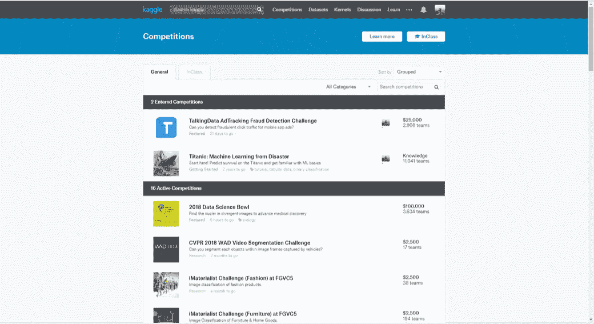
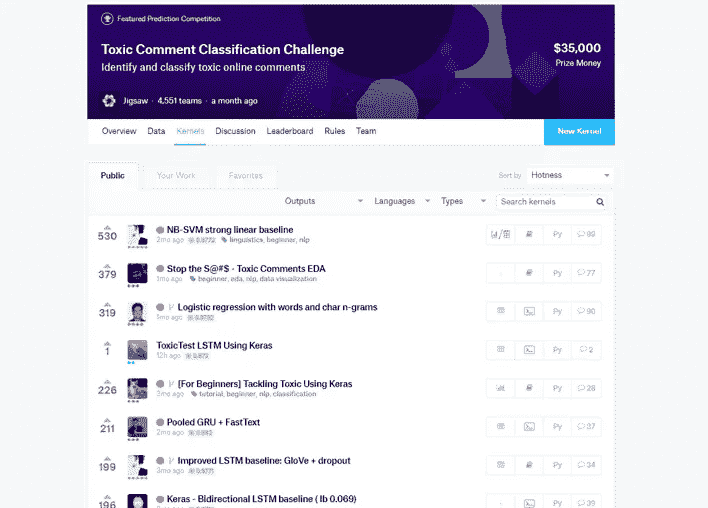
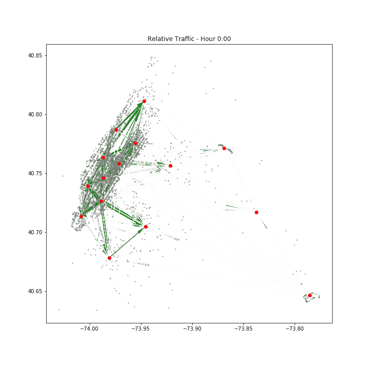

# 如果您是数据科学家或想成为数据科学家的人，这是最有价值的资源

> 原文：<https://towardsdatascience.com/the-most-valuable-resource-if-youre-a-data-scientist-or-wannabe-9846a068943c?source=collection_archive---------6----------------------->

我从事数据科学家的工作已经有几年了，一直在大学里作为私人教师和讲师教授数据科学。这篇文章反映了我自己的观点。请注意，我没有支付推广任何网站。

## 从哪里开始学习，不断进步？

[coursera.org](http://coursera.org)、 [fast.ai](http://fast.ai) 、[sci kit-learn documentation](http://scikit-learn.org/stable/)、Quora——举一些我经常使用的网站——有太多的在线资源提供高质量的数据科学实践内容。但是有一个人脱颖而出:[kaggle.com](http://kaggle.com)

让我解释一下为什么 [Kaggle](http://kaggle.com) 这么酷，为什么你*绝对应该在这个网站上学习*

## 什么是 kaggle.com？

Kaggle 是一个数据科学竞赛的在线平台。此外，它聚集了世界上最大的数据科学家群体之一。由受信任的公司和组织主办的竞赛类型包括欺诈检测、自然语言处理、图像处理等。而且当然是免费的。

Currently 16 open competitions, on image processing, sales forecasting…

## 向最好的人学习

Kaggle 社区分享了许多关于如何成为数据科学从业者的见解，这对学习者来说是黄金。

Kaggle 为每场比赛提供:

*   **带有解释的数据集**。数据通常是真实世界的数据，这很好，因为你想在真实世界中擅长数据科学
*   评估算法性能的**度量**(或测量)的定义。这是理解我们想要通过机器学习实现什么具体目标的关键。根据您的度量标准，一个简单的算法有时就足够了。定义度量将定义问题的复杂性
*   规则和奖励，这些东西其实并不重要，除非你是一名经验丰富的数据科学家，有时间花在一项挑战上:)

现在最重要的资源来了:

*   **讨论区**数据科学家分享关于数据或指标的疑问，人们在这里寻求建议或帮助来改进模型。这是拓宽您对数据科学家如何解决给定问题的视野的好方法。通过投票对主题进行排序，以获得最有价值的贡献

Kernels are scripts, usually Python or R, showcasing a data scientist’s skill to perform well in a competition and/or to explore and visualize datasets

*   **内核部分**——我的 goto 资源——在这里，数据科学家不仅分享他们的算法的*代码*以在比赛中获得高分，还分享他们探索和可视化数据集的代码。与讨论类似，您可以通过 upvotes 对内核进行排序。投票最多的内核提供了解释和可视化。它们会令人兴奋不已

An example of data visualization from a Kernel, created by a data scientist on Kaggle on a competition about road traffic in NYC. The data and the code are available for everyone for free

下面是一些最受社区欢迎的内核。你应该去看看！别忘了:好的艺术家复制，伟大的艺术家偷窃。

 [## 做我的客人-招聘餐厅 EDA

### 招聘餐厅游客预测-R 代码

www.kaggle.com](https://www.kaggle.com/headsortails/be-my-guest-recruit-restaurant-eda)  [## 语音表示和数据探索

### TensorFlow 语音识别挑战—Python 代码

www.kaggle.com](https://www.kaggle.com/davids1992/speech-representation-and-data-exploration)  [## 纽约出租车 EDA -更新:快速和好奇

### 使用来自多个数据源的数据

www.kaggle.com](https://www.kaggle.com/headsortails/nyc-taxi-eda-update-the-fast-the-curious)  [## 探索性分析- Instacart

### 使用来自 Instacart 市场篮分析的数据

www.kaggle.com](https://www.kaggle.com/philippsp/exploratory-analysis-instacart)  [## 数据分析和 XGBoost 启动器(0.35460 磅)

### 使用来自 Quora 问题对的数据

www.kaggle.com](https://www.kaggle.com/anokas/data-analysis-xgboost-starter-0-35460-lb) 

如果你喜欢这篇文章，考虑给它至少 50 分👏 :)