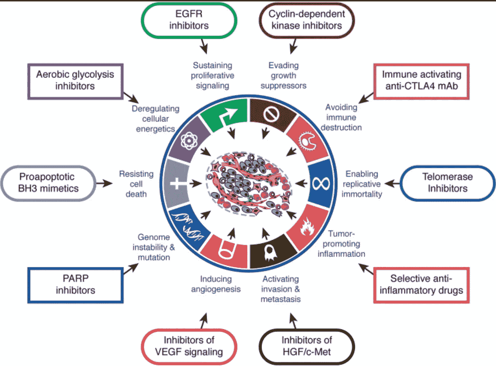
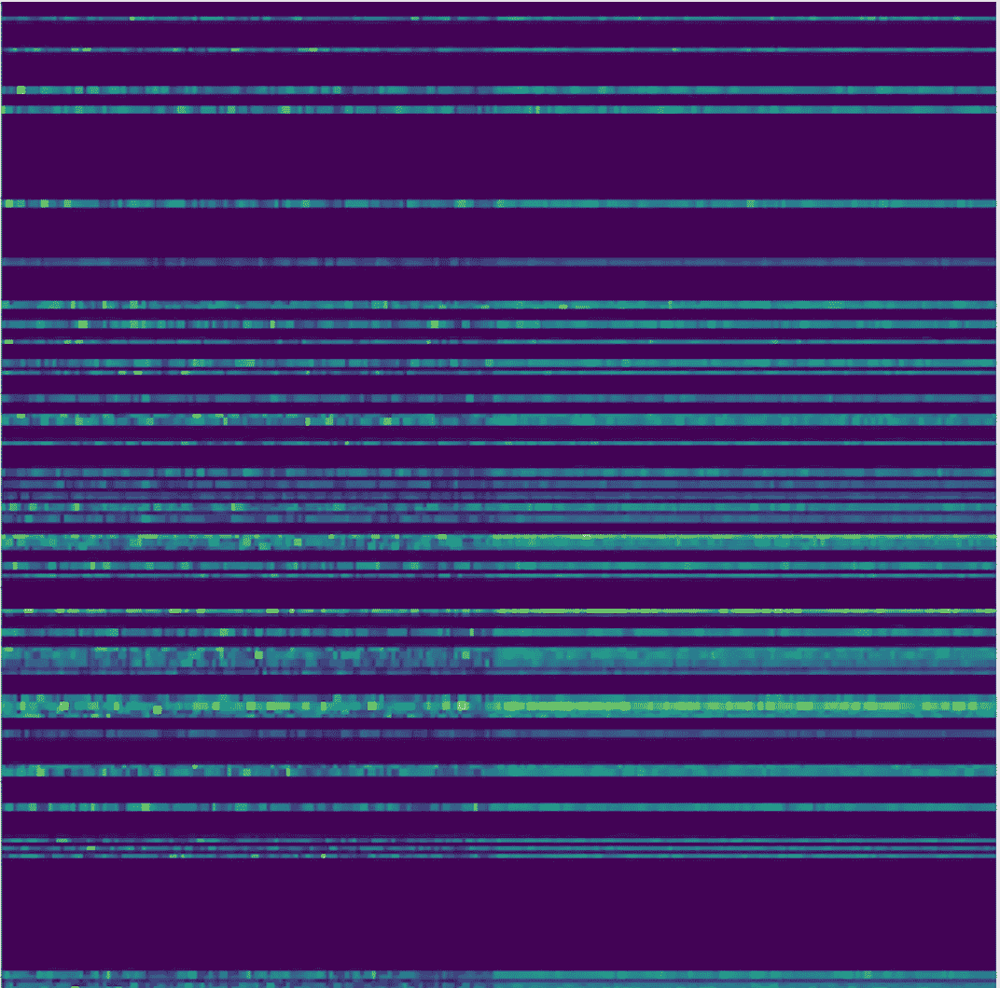
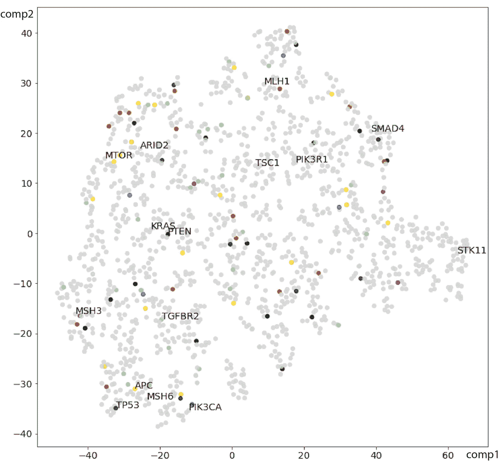
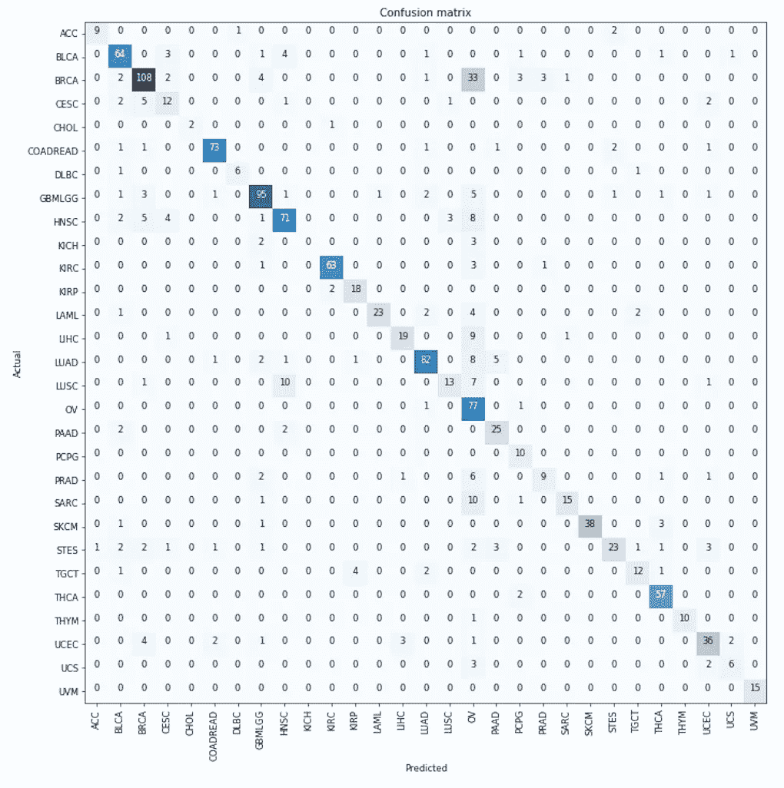

# 起源之谜——利用 Fast 进行癌症类型分类。人工智能图书馆

> 原文：<https://towardsdatascience.com/the-mystery-of-the-origin-cancer-type-classification-using-fast-ai-libray-212eaf8d3f4e?source=collection_archive---------7----------------------->

tree without its roots

# 第一章。问题——没有根的树

大约 15%的癌症转移，*即*癌细胞从它们最初形成的地方(原发部位或起源组织)脱离，并通过血液或淋巴系统形成新的转移性肿瘤。确定转移肿瘤**的原发部位是癌症治疗中的公开问题之一，因为治疗的功效通常取决于癌症原发部位。**

**使用肿瘤中的 [**点突变**](https://en.wikipedia.org/wiki/Point_mutation) 进行癌症分类具有挑战性，主要是因为数据非常稀少。许多肿瘤在编码区只有少数突变，而且许多突变是独特的。**

**先前已经证明，依赖于肿瘤中点突变的分类器实现了有限的准确性，特别是在 12 个肿瘤类别上 **64.9%，例如 [**DeepGene**](https://github.com/yuanyc06/deepgene) 算法。依靠**基因表达数据**的可用性，可以大大提高肿瘤分类的准确率(33 个肿瘤类别**[~ 90%)。然而，这些额外的数据在临床环境中通常不容易获得。因此，能够仅从 DNA 点突变预测肿瘤类别而不依赖于额外的基因表达数据的精确计算方法是非常令人感兴趣的。](https://bmcgenomics.biomedcentral.com/articles/10.1186/s12864-017-3906-0)**

# **第二章。解决方案=嵌入+迁移学习和微调**

**那么解决办法是什么呢？**

**正如量子理论物理学家 [**尼尔斯·玻尔**](https://www.brainyquote.com/quotes/niels_bohr_390862?src=t_solution) 所指出的那样: ***“每一个巨大而深刻的困难本身都有它自己的解决方案。”为了找到它，它迫使我们改变思维。*****

**让我们检查一下我们面临的困难:**

1.  ****数据的表示** —当前的数据表示不允许我们使用预训练的深度神经网络，这些网络在图像数据集上表现非常好。不幸的是，在癌症基因组应用领域，训练数据很少，并且诸如数据扩充的方法不适用。从[癌症基因组图谱(TCGA)](https://cancergenome.nih.gov/) 可获得 9642 个样本，分布在 29 个类别。**
2.  ****即使在基因水平上总结，肿瘤点突变数据也很少**。来自癌症生物学的一个有趣观察是，属于同一[途径](https://en.wikipedia.org/wiki/Biological_pathway)的基因中的癌症突变通常是互斥的。下面是癌症中受影响的“标志性”过程(途径)的一个例子。路径以蓝色列出；图片摘自[本文](https://linkinghub.elsevier.com/retrieve/pii/S0092867400816839)。**

****

**那么，为什么**不用途径**编码点突变数据，但是怎么编码呢？使用来自通路中**基因成员的信息来训练我们自己的**基因 2Vec 编码**怎么样？****

**这里有一个预览，它在不阅读细节的情况下工作得有多好— **仅依靠 DNA 点突变对 29 种肿瘤分类的准确率为 78.2%**。**

# **第三章。循序渐进的“如何做”**

****3.1 数据及其预处理:**我从[基因组数据共享门户](https://portal.gdc.cancer.gov/)下载了 TCGA 突变注释格式(MAF)文件。我去除了沉默突变，只保留了带有智人基因组组装 GRCh38 (hg38)注释的基因。数据集被分成 29 种肿瘤类型，每种类型中 80%的样本用于训练，20%用于测试。**

**[MutSigCV](http://software.broadinstitute.org/cancer/software/genepattern/modules/docs/MutSigCV) 用于识别在每个肿瘤类型训练集中检测到的[非沉默突变](https://en.wikipedia.org/wiki/Mutation)中的显著突变基因。这让我能够提取非常稀疏的数据集的重要特征。考虑到包括给定基因的碱基组成、长度和背景突变率在内的协变量，MuTSigCV 检测突变发生率高于随机预期的基因。我只剩下**1348 个独特的显著突变基因**。**

**为了学习数据的生物学相关嵌入，我训练了 **Gene2Vec** 嵌入。我使用了所有已知途径的数据库，[MSI gdb](http://software.broadinstitute.org/gsea/msigdb/index.jsp)6.2 版，包含 17810 个途径。本着 [Word2Vec](https://papers.nips.cc/paper/5021-distributed-representations-of-words-and-phrases-and-their-compositionality.pdf) 的精神，我将路径相似的基因映射到附近的点上。在这里，我假设出现在相同途径环境中的基因共享生物功能。我在定义 Gene2Vec 时使用了标准的 [Skip-Gram](https://papers.nips.cc/paper/5021-distributed-representations-of-words-and-phrases-and-their-compositionality.pdf) 模型。**

****

****3.2 突变数据到图像的转换:**
然后我提取学习过的基因 2Vec 嵌入我们训练集中的 1348 个明显突变的基因，这一步产生了一个方阵。我使用[谱聚类算法](http://www1.icsi.berkeley.edu/~stellayu/publication/doc/2003kwayICCV.pdf)在嵌入矩阵中创建视觉结构。谱聚类是一种将一维空间中的 N 个数据点分成几个簇的技术。然后使用光谱聚类基因嵌入对训练和测试样本进行编码。左图是胃癌样本的包埋示例。下图是 1348 个显著突变基因的 t 分布随机邻近嵌入( [t-SNE](https://lvdmaaten.github.io/tsne/) )基因嵌入可视化。参与相同癌症途径的基因在它们的表达中彼此更接近，例如 KRAS 和 PTEN(结肠直肠癌)；TP53、APC 和 MSH6 (DNA 错配修复)比其他基因靠得更近。**

****

****3.3 迁移学习和微调—** [**快速。AI**](https://www.fast.ai/) **:**
我使用 [ResNet34](https://arxiv.org/abs/1512.03385) 模型在 [ImageNet](https://en.wikipedia.org/wiki/ImageNet) 上预先训练好的权重作为使用我们的肿瘤图像嵌入进行肿瘤分类的目标任务的初始化。图像被重新缩放到 512x512，并被归一化以匹配 ImageNet 图像的平均值和标准偏差，批量大小被设置为 32 以适合我的 GTX 1070 Ti GPU。**

**在微调的第一阶段， [ResNet34](https://arxiv.org/abs/1512.03385) 除了最后一个自定义全连接层外，其他层都被冻结。使用学习率查找器将学习率选择为 0.01，参见 [Leslie Smith 的论文](https://arxiv.org/abs/1506.01186)及其在 [Fast 中的实现。AI 回购](https://github.com/fastai/fastai)。[倾斜三角形学习率训练计划](https://arxiv.org/pdf/1801.06146.pdf)用于 10 个周期。第一阶段达到的精度为 **73.2%** 。**

**在第二阶段，[区别微调](https://arxiv.org/pdf/1801.06146.pdf)使用 0.000001 至 0.001 的学习率序列，这些也是使用学习率查找器确定的。区别性微调将深度神经网络的层分成组，并对每个组应用不同的学习率，因为不同的层应该被微调到不同的程度；最早的残差块最小，全连通层的学习率最大。在第二阶段的训练中，我使用了 12 个周期的倾斜三角形学习率训练计划。第一阶段达到的准确度为 **78.3%** 。**

**这是我们分类器的混淆矩阵:**

****

# **第四章。一些观察**

**我观察到我们的错误分类主要在相同的器官系统内，*例如*卵巢浆液性囊腺癌(OV)和乳腺癌(BRCA)。**

**我还观察到卵巢浆液性囊腺癌(OV)是错误最多的一类。这实际上并不令人惊讶，因为与其他群组的大量基因相比，在该群组中只有 6 个基因被确定为显著突变。**

**但是我最重要的观察是**快。AI 库允许最先进的迁移学习和微调**。给定数据的正确表示，构建最先进的分类器变得非常容易:在这里，我将这个问题**的先前最先进的错误减少了 30%以上**，而同时区分了更多的类。**谢谢杰里米、雷切尔和 Fast。艾！****

**我真的很期待表演更多的 ***【知识转移】从 Jeremy 和 Rachel*** 到我自己 **(:-)** ，**有区别地微调**我在其他重要和有趣的问题上所学的 hack！**

**如果您对上述内容有任何疑问**请在 twitter @alenushka 上找到我****