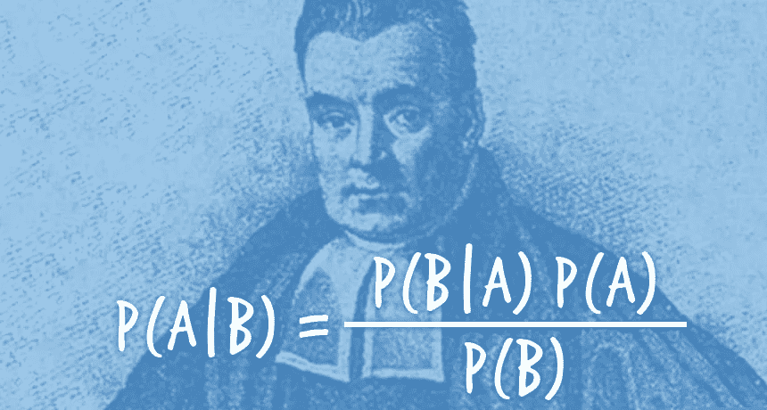
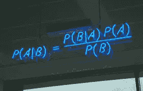

# 朴素贝叶斯分类器

> 原文：<https://towardsdatascience.com/the-naive-bayes-classifier-e92ea9f47523?source=collection_archive---------7----------------------->

约瑟夫·卡坦扎里特

*[*朴素贝叶斯分类器*](https://en.wikipedia.org/wiki/Naive_Bayes_classifier) *或许是用来构建、训练和预测的最简单的机器学习分类器。这篇文章将展示它是如何工作的以及为什么工作。* ***第一部分*** *揭示了广为人知的* [*贝叶斯法则*](https://simple.wikipedia.org/wiki/Bayes%27_theorem) *只是简单陈述了关于* [*联合*](https://en.wikipedia.org/wiki/Joint_probability_distribution)*[*条件*](https://en.wikipedia.org/wiki/Conditional_probability) *的概率。但它的平淡掩盖了惊人的力量，正如我们将在* ***第 2 和第 3 部分、*** *中看到的，在那里我们组装了机械的* [*朴素贝叶斯分类器*](https://en.wikipedia.org/wiki/Naive_Bayes_classifier) *。* ***第四部分*** *是一个简要的讨论，而* ***第五部分和第六部分*** *列举了* [*朴素贝叶斯分类器*](https://en.wikipedia.org/wiki/Naive_Bayes_classifier) *的优缺点。* ***第 7 部分*** *是总结，* ***第 8 部分*** *列举了几个我觉得有用的参考文献。欢迎建设性的意见、批评和建议！***

****

**Reverend Thomas Bayes**

# **1.前奏:贝叶斯法则**

**给定两个事件 A 和 B，[联合概率](https://en.wikipedia.org/wiki/Joint_probability_distribution) P(A，B)是 A 和 B 一起发生的概率。它可以用两种方式之一来写:**

****第一种方式:****

> ***P(A，B) = P(A|B) * P(B)***

**这里 P(A|B)是一个[条件概率](https://en.wikipedia.org/wiki/Conditional_probability):假设 B 已经发生，A 发生的概率。这就说 A 和 B 一起发生的概率是(假设 B 已经发生，A 发生的概率)乘以(B 已经发生的概率)。**

****第二种方式:****

**将前一等式中的 A 和 B 互换，得到一个等价的表达式:**

> ***P(B，A) = P(B|A) * P(A)***

**注意，P(B，A)和 P(A，B)是相等的，因为联合概率不依赖于顺序。相等的两个方程的右边产生著名的[贝叶斯法则](https://simple.wikipedia.org/wiki/Bayes%27_theorem):**

> **P(A|B) * P(B) *=* P(B|A) * P(A)**

# **2.如何构建贝叶斯分类器**

**假设我们有一个由 N 个数据点组成的数据集，每个数据点有 M 个特征，被标记为一组 K 个类中的一个。给定特征值，有一个可以预测类别标签的分类器就好了，对吧？你想一下，条件类概率 P(C|D)就是那张票！我们只需要添加一个*决策规则*来告诉我们如何选择类标签。**

**条件类概率来自[贝叶斯法则](https://simple.wikipedia.org/wiki/Bayes%27_theorem)的应用:**

> ***P(C | D)= P(C)* P(D | C)/P(D)***

**其中:**

**c 是一个类，D 是一个数据点，由 M 个特征中的每一个的值组成。**

**[贝叶斯规则](https://simple.wikipedia.org/wiki/Bayes%27_theorem)表达式中的术语从左至右为:**

*   **[后验](https://en.wikipedia.org/wiki/Posterior_probability) P(C|D)是数据点 D 在类别 C 中的概率**
*   **[先验](https://en.wikipedia.org/wiki/Prior_probability) P(C)是 C 类在数据集中出现的概率，即具有 C 类的数据点的比例**
*   **[可能性](https://en.wikipedia.org/wiki/Likelihood_function) P(D|C)是给定类为 C 的情况下，我们观察到数据点 D 的相对概率**
*   **[证据](https://en.wikipedia.org/wiki/Bayesian_inference) P(D)是数据点 D 在自然界出现的概率**

**实际上，P(D)通常很难或不可能计算。不要担心！因为 P(D)独立于 C 类，就我们而言，它只是一个比例常数，我们并不关心。**

**不知道 P(D)的唯一后果是后验概率将是一个*相对*概率，而不是一个*真实*概率。但这也没什么，posterio r 的*相对*值足以进行分类预测。**

**为了完成我们的分类器的规范，我们采用了[映射](https://en.wikipedia.org/wiki/Maximum_a_posteriori_estimation)(最大后验概率)*决策规则*，该规则将标签分配给具有最高[后验概率](https://en.wikipedia.org/wiki/Posterior_probability)的类。**

**为了应用分类器，我们
1。计算每个类的 [posterio](https://en.wikipedia.org/wiki/Posterior_probability) r，然后
2。应用[映射](https://en.wikipedia.org/wiki/Maximum_a_posteriori_estimation)决策规则来预测分类标签**

# **3.朴素贝叶斯分类器**

**采用“[天真的](https://simple.wikipedia.org/wiki/Na%C3%AFve)”假设，即特征值对于给定类别的成员是独立的，可以极大地简化[可能性](https://en.wikipedia.org/wiki/Likelihood_function)的计算。假设数据点 D 的 M 个特征值具有值(x1，x2，..，xM)。然后在“天真”的假设下，[可能性](https://en.wikipedia.org/wiki/Likelihood_function)成为每个特征的独立[可能性](https://en.wikipedia.org/wiki/Likelihood_function)的乘积:**

> ***P(D|C) = P(x1，x2，..，xM|C) = ∏{i=1 到 M}P(xi|C)***

**独立的[可能性](https://en.wikipedia.org/wiki/Likelihood_function)易于计算离散特征:P(xi|C)是 C 类中所有数据点的比例，这些数据点在具有特征的*中具有 xi 值。***

**通过这种简化，[贝叶斯法则](https://simple.wikipedia.org/wiki/Bayes%27_theorem)变成了**

> ***P(C|D) ∝ P(C) * ∏{i=1 到 M}P(xi|C)***

**上述公式受到[下溢误差](https://en.wikipedia.org/wiki/Arithmetic_underflow)的影响，因为它通常是非常小的数的乘积。取对数将小数字的乘积转换为普通大小数字的和，同时保持正数的顺序(即，如果 A > B，则 logA > logB)。有了这个补救措施，我们就有了一个实用的计算版本的[朴素贝叶斯分类器](https://en.wikipedia.org/wiki/Naive_Bayes_classifier)，它很容易用代码实现:**

> ***logP(C|D) = logP(C) + ∑{i=1 到 M}logP(xi|C)***

**我们忽略了右边比例常数的对数；由于我们只对[后验](https://en.wikipedia.org/wiki/Posterior_probability)的相对值感兴趣，这不会影响课堂作业。**

**对于具有离散值的特征(如单词),求和中带有项的*是 C 类数据点比例的对数，其带有*特征值的*等于 xi。万一没有呢？那项变成 log(0)，方程爆炸，我们无法做出预测。为了确保这种情况不会发生，我们可以在每个[可能性](https://en.wikipedia.org/wiki/Likelihood_function)因子的分子和分母上加 1。这是拉普拉斯平滑的变体。***

# **4.讨论**

**如果有连续值特征，如身高和体重，[朴素贝叶斯](https://en.wikipedia.org/wiki/Naive_Bayes_classifier)可用于回归。在这种情况下，训练数据被划分到它的类中。在每个类中，每个特征的值都被假设为[正态分布](https://en.wikipedia.org/wiki/Normal_distribution)；[高斯](https://en.wikipedia.org/wiki/Naive_Bayes_classifier#Gaussian_naive_Bayes)的参数是特征值的均值和方差。或者，可以通过宁滨值对连续要素进行离散化，但这样做会丢弃信息，并且结果可能对宁滨方案很敏感。**

**每当“天真”假设成立时，[朴素贝叶斯分类器](https://en.wikipedia.org/wiki/Naive_Bayes_classifier)是最优的(意味着它是最准确的可能分类器)，甚至在某些情况下[不成立](http://web.cs.ucdavis.edu/~vemuri/classes/ecs271/Bayesian.pdf)。在大多数情况下，假设不成立，结果是[后验](https://en.wikipedia.org/wiki/Posterior_probability)概率不准确。令人惊讶的是，使用[图](https://en.wikipedia.org/wiki/Maximum_a_posteriori_estimation)决策规则进行的分类通常相当准确，即使概率并不准确！**

**当训练数据代表母体时，朴素贝叶斯应该工作得最好，以便[先验](https://en.wikipedia.org/wiki/Prior_probability)是准确的。**

# **5.朴素贝叶斯分类器的优势**

*   **对于少量训练数据的问题，它可以获得比其他分类器更好的结果，因为它具有较低的过拟合倾向。那是[奥卡姆剃刀](https://en.wikipedia.org/wiki/Occam%27s_razor)在起作用！**
*   **训练很快，包括计算[先验](https://en.wikipedia.org/wiki/Prior_probability)和[可能性](https://en.wikipedia.org/wiki/Likelihood_function)**
*   ****对新数据点的预测**很快。首先计算每个类的[后验](https://en.wikipedia.org/wiki/Posterior_probability)。然后应用[映射](https://en.wikipedia.org/wiki/Maximum_a_posteriori_estimation) *决策规则*:标签是具有最大[后验](https://en.wikipedia.org/wiki/Posterior_probability)的类。**
*   **RAM 内存的占用是适度的，因为这些操作不需要一次将整个数据集保存在 RAM 中。**
*   ****CPU 使用率**适中:没有梯度或迭代参数更新需要计算，因为预测和训练仅使用解析公式。**
*   **与特征数量和数据点数量成线性比例，并且易于用新的训练数据进行更新。**
*   **因为它的线性缩放、快速执行、较小的内存需求和较低的 CPU 使用率，可以为其他方法计算量太大的大量问题(许多行和列)提供可行的解决方案。**
*   **[轻松处理缺失的特征值](https://qr.ae/TUtuL0) —在没有该特征的情况下通过重新训练和预测！**

# **6.朴素贝叶斯分类器的缺点**

*   **无法合并功能交互。**
*   **对于回归问题，即连续的实值数据，可能没有好的方法来计算[的可能性](https://en.wikipedia.org/wiki/Likelihood_function)。对数据进行宁滨并将离散类分配给箱是次优的，因为它丢弃了信息。假设每个特性都是正态分布的是可行的，但是如果特性不是正态分布的，可能会影响性能。另一方面，有了每个类中足够的训练数据，您可以直接估计[可能性](https://en.wikipedia.org/wiki/Likelihood_function)密度，允许对新数据进行精确的[可能性](https://en.wikipedia.org/wiki/Likelihood_function)计算。**
*   **性能对倾斜的数据很敏感，也就是说，当训练数据不代表总体中的类别分布时。在这种情况下，[之前的](https://en.wikipedia.org/wiki/Prior_probability)估计将是不正确的。**

# **7.摘要**

**在这篇文章中，你已经学会了如何从头开始构建一个朴素贝叶斯分类器。你现在被授权运用[奥卡姆剃刀](https://en.wikipedia.org/wiki/Occam%27s_razor)从观测数据中推断[宇宙的真相！我希望你已经看到了一丝曙光，为什么贝叶斯规则是有史以来最重要的实用数学发现之一。现在，向前去发现…](https://en.wikipedia.org/wiki/Informal_inferential_reasoning)**

# **8.参考**

**a.[文本分类应用(斯坦福 CS124)](https://web.stanford.edu/class/cs124/lec/naivebayes.pdf)**

**b.[一个不错的教程，有一个工作示例和代码](https://dzone.com/articles/naive-bayes-tutorial-naive-bayes-classifier-in-pyt)**

**c.[Na](https://en.wikipedia.org/wiki/Naive_Bayes_classifier)μve Bayes 分类器，维基百科**

****

**Bayes’ Rule**