# 数字声音处理的天然耳朵

> 原文：<https://towardsdatascience.com/the-natural-ear-for-digital-sound-processing-as-an-alternative-to-the-fourier-transform-79872b7a823d?source=collection_archive---------6----------------------->

## 傅立叶变换的替代方案

这是自然耳朵的原始模型。我为什么想到它，以及它在数字声音处理(DSP)中如何优于快速傅立叶变换(FFT)——这就是本文的内容

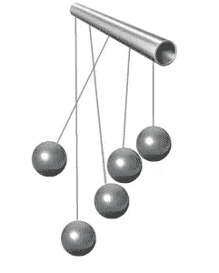

我参与的一些软件开发项目使用傅立叶变换进行波形分析。这些项目包括枪支目标和 DTMF 信号的声音音调识别。但在此之前，我渴望得到一张人类语言和音乐和谐的“照片”。最近，我启动了一个应用程序，它可以在我弹吉他的时候演奏一些乐器。问题是教电脑听我的节奏，并保持音乐节奏有序。为了做到这一点，我在平克·弗洛伊德的作品《放逐》的前几秒使用了傅立叶变换。然后，我将“图片”与我演奏的相同作品进行比较，结果很差，直到我选择了高达 8192 的 FFT 块大小来识别至少第六个八度音阶的音符。

这显示了傅立叶变换的第一个问题——要获得真正好的分析，需要增加块大小(在多个频率仓上),结果性能下降，特别是对于实时处理。

音乐傅里叶变换分析的第二个问题是，同样的乐器，根据音色的不同，会产生不同的泛音。这些通过 FFT 分析的泛音频率产生了与我们实际听到的内容无关的峰值。为了概括这个结果，我用 12 个半音概括了频率仓。画面更好，但现在第一个音符被识别为 C，而实际上是 B:

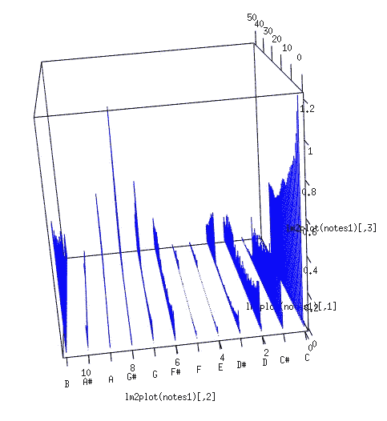

这迫使我去阅读更多关于声音、听觉和 [**人耳**](https://en.wikipedia.org/wiki/Cochlea) 的本质。我想问题可能是傅里叶变换的第三个问题——它对信号相位很敏感。人耳不能识别单个谐波的相位，只能识别频率。

我使用 R 语言创建了一个模型(您可以在文章末尾找到代码)，它为一组频率生成输入信号:

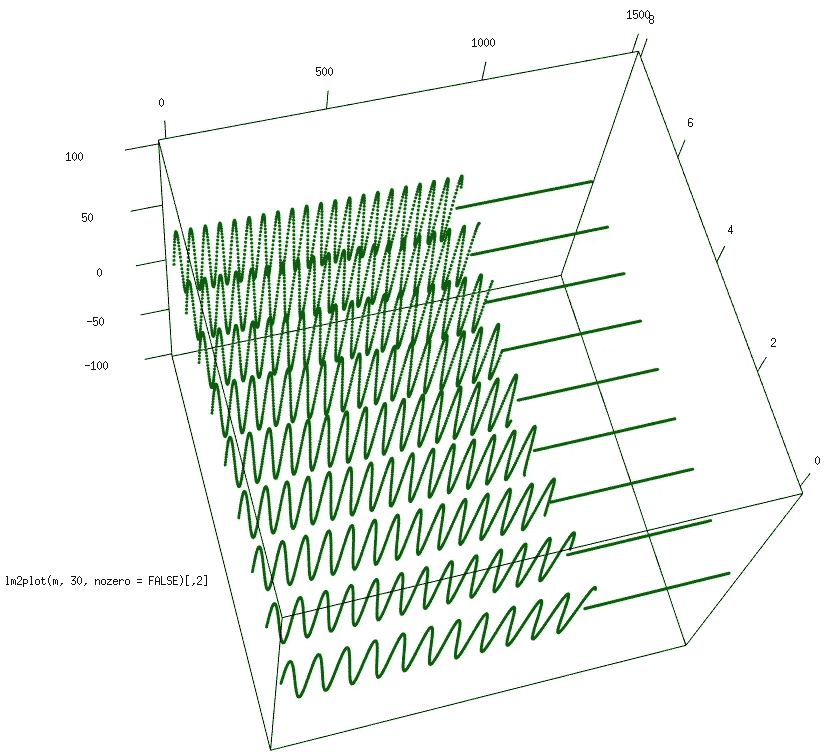

然后用我十五年前组合的一些公式(同样的实验由于 PC 性能差而失败)创建了一个钟摆的模型。物体可以接收输入信号，如果信号中有相同的频率，物体就会振荡

频率:

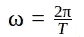

不依赖于摆锤自振频率的衰减系数:

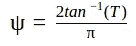

钟摆的位置:

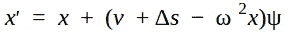

速度和能量:

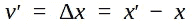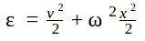

这是钟摆对相同频率信号的反应:

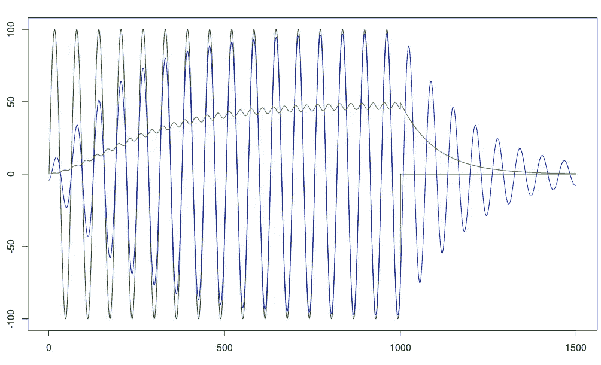

绿色—输入信号
蓝色—摆振荡
红色—摆能量

对于与摆锤频率略有不同的输入信号，振幅和能量明显小于之前的结果:

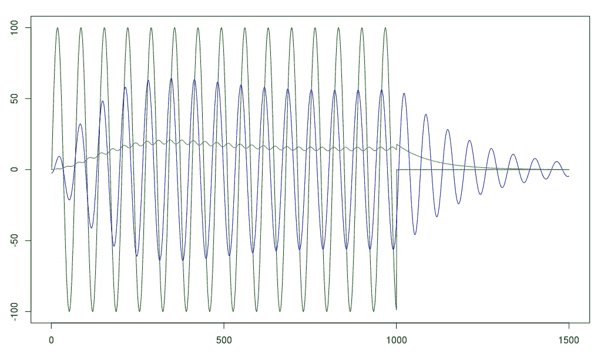

九种不同信号的组合图—中央信号已被识别:

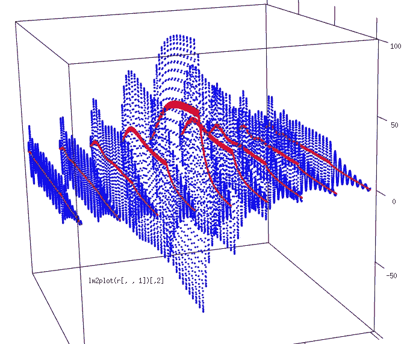

在那之后，我为不同的频率建造了一套钟摆来覆盖五个八度音阶和十二个音符。这导致了 60 个钟摆聆听“放逐”的第一个和弦的能量:

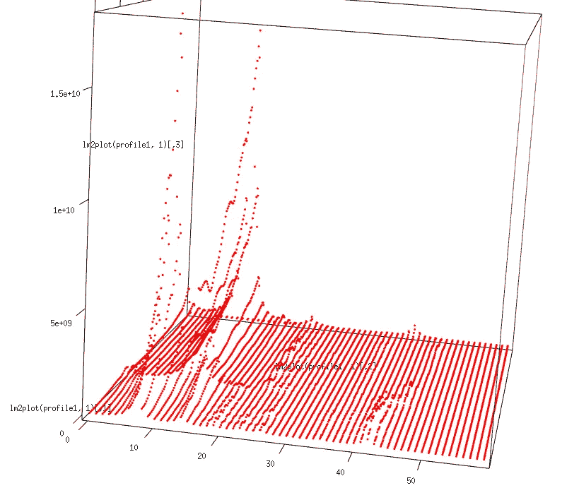

结果，主音调被正确地检测到。我认为人耳忽略输入信号相位信息的能力对于音乐识别至关重要。我用这个模型创建了一个名为耳蜗的 C++库，用来实时聆听、检测和同步音乐。这将在下一篇文章中描述。

# r 代码

```
library(plyr);
library(tuneR); #*define a class that imitate a pendulum and has two methods - init and tick*pendulum <- setRefClass(
   "pendulum",
   fields = list( v = "numeric",
                  x = "numeric",
                  K = "numeric",
                  T = "numeric",
                  Phi = "numeric",
                  E = "numeric",
                  lastS = "numeric"),
   methods = list(
     #*define the initial state and calculate coefficients*
     init = function(w = "numeric")
    {
     #*period*
     T <<- 44100 / w;
     #*coefficient of elasticity*
     K <<- (2 * pi / T) * (2 * pi / T);
     #*fading coefficient*
     Phi <<- 2 * atan(T) / pi;
     #*initial state*
     v <<- 0;
     x <<- 0;
     lastS <<- 0;
    },
    #*pass the position of the stimulating lever*
    tick = function(s)
    {
     lastX <- x;
     #*position*
     x <<- x + (v + s - lastS - K * x) * Phi;
     #velocity
     v <<- x - lastX;
     #*energy*
     E <<- (v * v) / 2 + (K * x * x) / 2;
     lastS <<- s;
     return(c(x, E));
    }
   )
  )
  #*create one pendulum and init with 700 as frequency of auto-oscillation*
  p <- pendulum();
  p$init(700);
  #*init a vector of waveforms with frequencies from 500 to 900*
  m <- aaply(seq(500, 900, 50), 1, function(x) sine(x, 1500)@left);
  # *clear end of the waveform*
  m[, 1001:1500] <- 0;
  #*apply the pendulum tick to the vector of waveforms*
  m <- t(m);
  r <- aaply(m, c(1, 2), p$tick, .progress = "time");
  #*index of the waveform to plot*
  i <- 5;
  #*show results*
  plot(m[, i] * 100, type = "l", col = "dark green");
  lines(r[ , i, 1], type = "l", col = "blue");
  lines(r[ , i, 2], type = "l", col = "red");
```

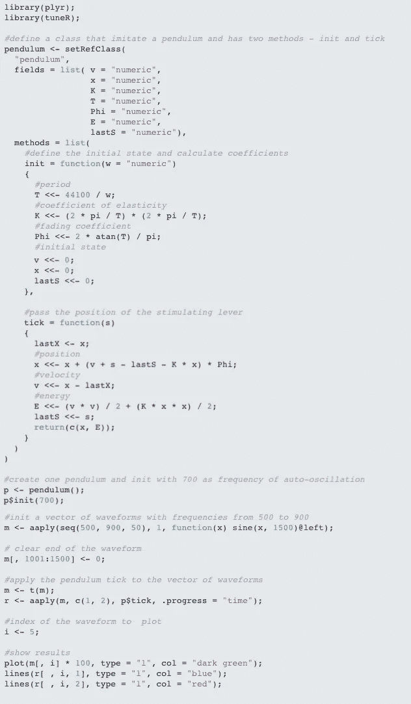

沿着这个链接可以找到 R 码: [**R 码**](http://bosyi.com/craft/natural-ear-digital-sound-processing-fourier-transformation/)

## 附言（同 postscript）；警官（police sergeant）

对于个人问题，请在 [Linkedin](https://www.linkedin.com/in/andybosyi/) 或[脸书](https://www.facebook.com/profile.php?id=100013517439841)上联系我，有时我会在那里发布关于人工智能的简短新闻和想法。
如果有 AI 方面的需求，或者需要组建数据科学咨询团队，请联系我