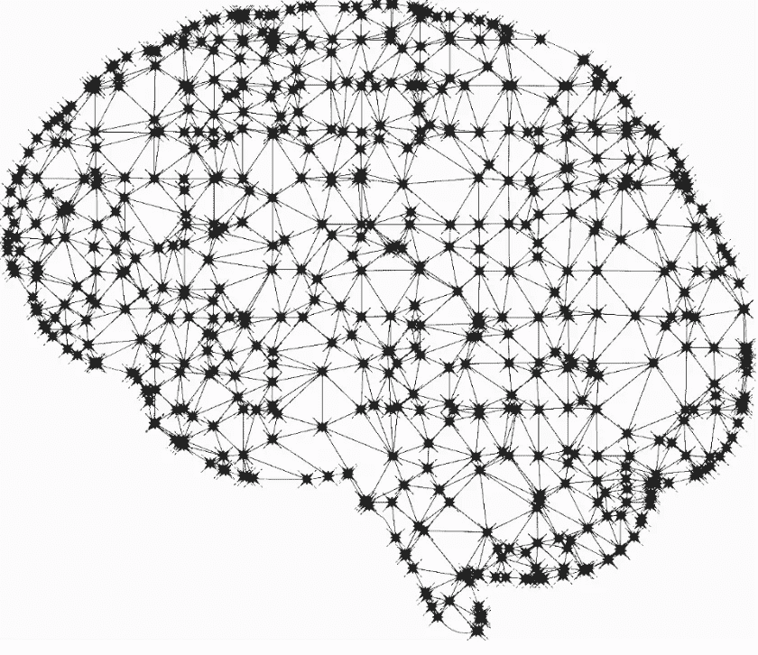

# 深度学习的不远的将来

> 原文：<https://towardsdatascience.com/the-near-future-of-deep-learning-deb9fb9e811e?source=collection_archive---------18----------------------->

在所有最新的深度学习研究中保持领先是非常困难的。下载 Arxiv 移动应用并启用通知将向您展示深度学习研究的疯狂步伐。这么多论文被公开，很难区分信号和噪音。这篇文章将强调我认为将对深度学习的未来产生最大影响的 3 个研究领域。

# 一、建筑搜索

事实上，设计神经网络架构与其说是科学，不如说是艺术。我们大多数人只是从货架上抓取一个流行的网络架构，如 VGG-16/19 [1]或 ResNet [2]。这些前沿架构是如何被发现的？使用强大的 GPU 计算机进行简单的试错。

何时应用最大池、使用何种卷积滤波器大小、在何处添加漏失层，这些决策大多只是随机猜测。

回车，**神经架构搜索** [3]。NAS 使用强化学习来搜索卷积网络架构。

与敌手对 NAS，**衰老进化为图像分类器搜索**【4】。该策略使用遗传算法的修改来搜索卷积网络架构。

这两种算法都能够设计出优于人类的 CNN 架构。Keras 或 PyTorch 等库中的未来神经网络 API 将只要求您定义网络中所需的一系列层或参数。这些算法将设计架构。

# **二世。压缩神经网络**

训练深度学习网络是熟悉计算机内存的好方法。典型的笔记本电脑大约有 8 到 16 GB 的内存。iPhone 8 plus 有大约 3 GB 的内存。VGG-16 图像分类网络有大约 1.44 亿个参数，大约 500 MB。由于这些网络的巨大规模，很难建立移动人工智能应用程序和使用多个网络的应用程序。将网络加载到 RAM 内存中可以加快计算速度。

压缩这些网络的研究比如**深度压缩**【5】工作原理非常类似 JPEG 图像压缩；量化和霍夫曼编码。深度压缩能够将 VGG-16 从 552 MB 减少到 11.3 MB，而不损失准确性。

# **三世。基于 GAN 的数据增强**

构建深度学习模型的最大挑战之一是构建数据集。深度学习模型需要大量的数据。GANs 是一个很有前途的生成式建模框架，可以从数据集中推断出新的数据点。这可用于从小数据集创建大数据集。

甘斯与训练稳定性作斗争。在图像域，很难实现高分辨率输出，如 GANs 的 360 x 360 x 3。这导致了诸如 DCGAN [6]、StackGAN [7]和逐渐增长的 GANs [8]等架构的发展。

# **结论**

总而言之，我认为架构搜索、压缩神经网络和使用 GANs 建立深度学习数据集都将成为深度学习未来的基础部分。关于这些主题，有很多令人兴奋的研究论文，我推荐大家去看看。

感谢阅读！希望这有助于引导你对深度学习的兴趣！

# **参考文献**

[1]卡伦·西蒙扬，安德鲁·齐泽曼。用于大规模图像识别的非常深的卷积网络。2014.

[2]何、、任、。用于图像识别的深度残差学习。2015.

[3] Barret Zoph，Quoc 诉 Le。强化学习的神经结构搜索。2017.

[4] Esteban Real，Alok Aggarwal，黄雁萍，Quoc 诉 Le。图像分类器结构搜索的正则化进化。2018.

[5]宋汉，毛，威廉 j .日报。深度压缩:通过剪枝、训练量化和霍夫曼编码压缩深度神经网络。2015.

[6]亚历克·拉德福德，卢克·梅斯，苏密特·钦塔拉。深度卷积生成对抗网络的无监督表示学习。2015.

[7]张寒、徐涛、李洪生、张少婷、王晓刚、黄小蕾、季米特里斯·梅塔克萨斯。StackGAN:使用堆叠生成式对抗网络进行文本到照片级逼真图像合成。2016.

[8]泰罗·卡拉斯、蒂莫·艾拉、萨穆利·莱恩、贾科科·莱蒂宁。为了提高质量、稳定性和变化性而逐步种植甘蔗。2017.