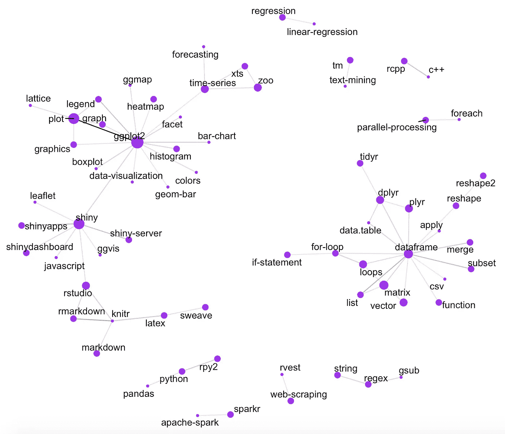
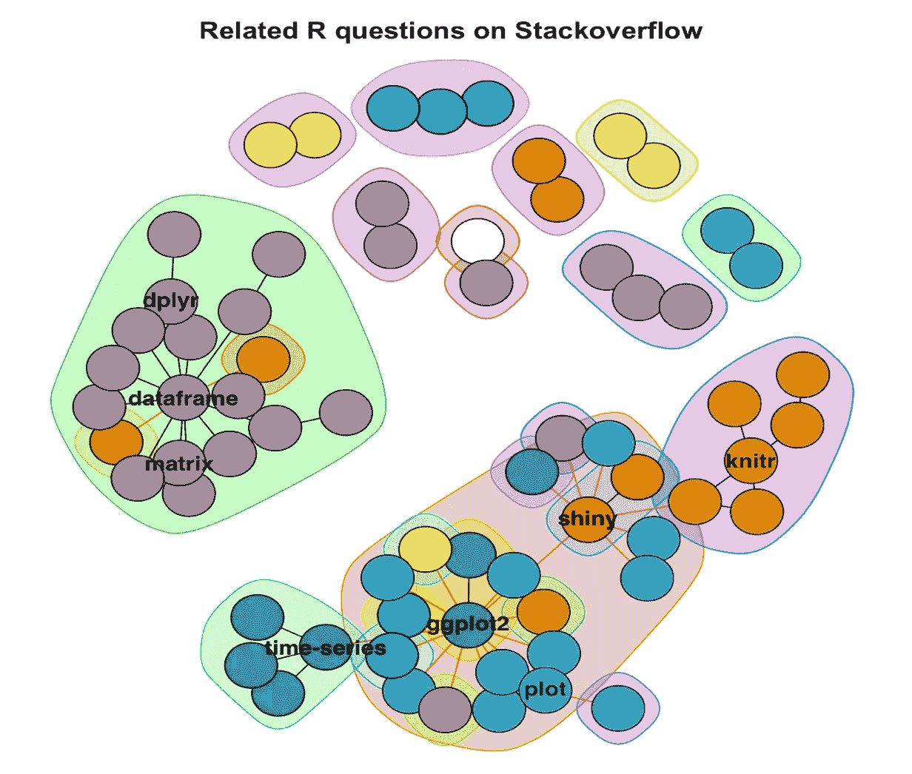
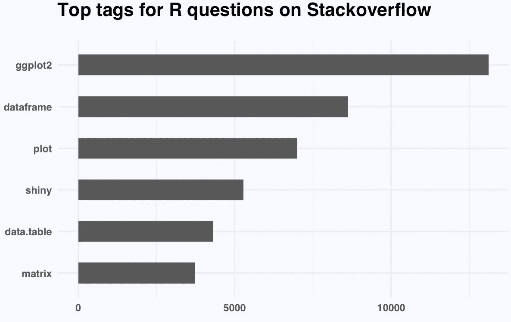
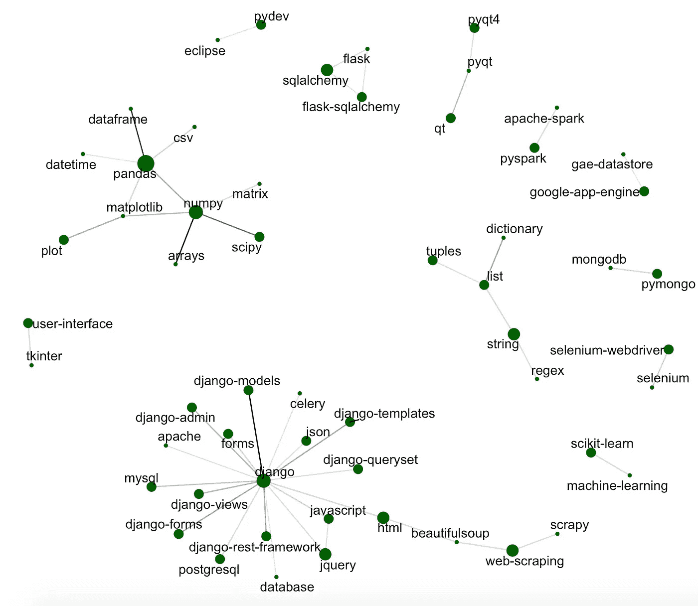
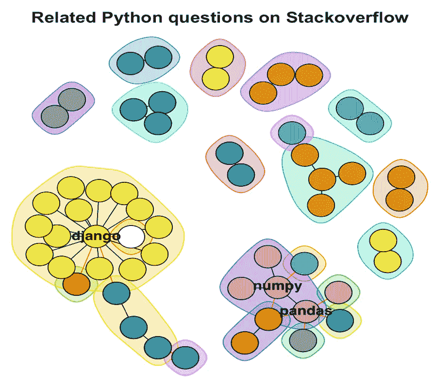
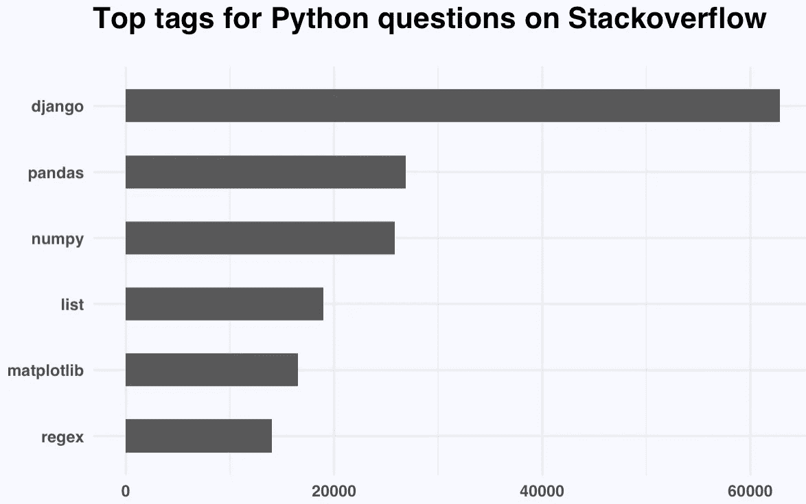
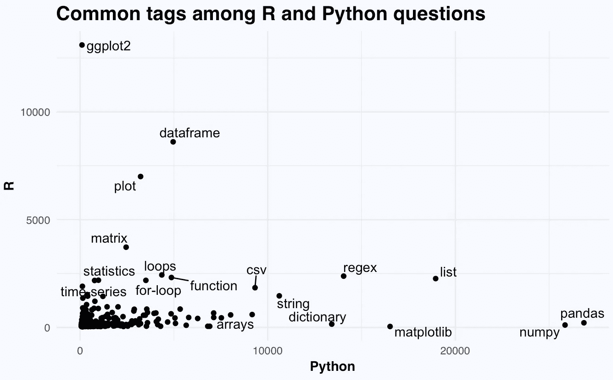
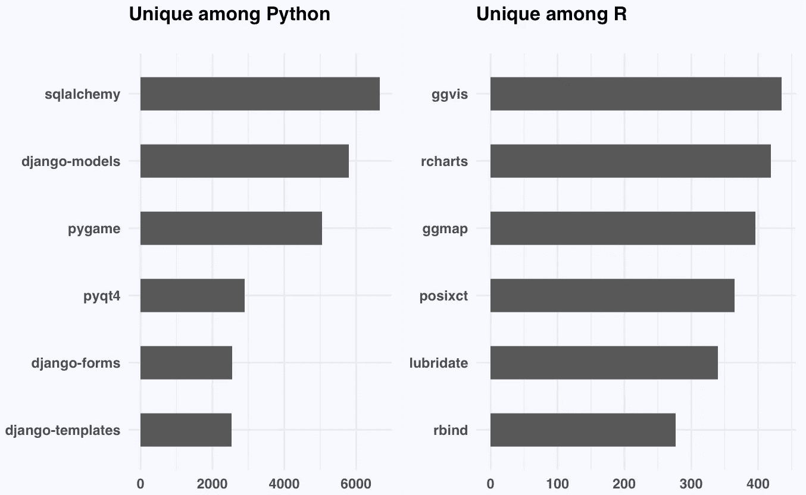

# stackoverflow 上的 R/python 问题网络

> 原文：<https://towardsdatascience.com/the-network-of-r-python-questions-on-stackoverflow-8f7b149bbdbf?source=collection_archive---------3----------------------->

当人们在 stackoverflow 上问编码问题时，R 和 Python 分别有哪些主题是相互关联的？

直到 10 月 16 日，我在 stackoverflow 上使用了两个带有完整 [R](https://www.kaggle.com/stackoverflow/rquestions) 和 [Python](https://www.kaggle.com/stackoverflow/pythonquestions) 问题的数据集。通过查看链接到不同问题的 240K R 标签和 1.8M Python 标签，我们可以基于标签的共现来检测主题集群。

**大部分 R 题围绕 ggplot2，dataframe 和 shiny**



network of tags on R questions with more than 150 co-occurence

我们可以看到 ggplot2 和 dataframe 这样的标签是如何分支到它们的子主题的:dataframe 与 csv(数据输入)、预处理库(reshape2、dplyr、data.table)以及条件和循环相关。ggplot2 与不同的图表元素、数据可视化和交互式闪亮仪表板相关。

为了更清楚地看到集群，我们可以给社区着色。



Clusters of R questions

通过统计单个标签的出现次数，我们可以知道 ggplot2 出现的次数最多，这表明 R 作为数据可视化工具的常见用法高于其他函数。



我们现在将研究 Python。

**Python 问题主要围绕 django、熊猫和 numpy**

接下来，我们来看看 Python 的问题。由于它的一般功能，它比 r 有更多的问题。



network of tags on Python questions with more than 800 co-occurrence

相似性我们可以快速浏览主题的主要社区。



clusters of python questions

这些话题在 Python 问题中出现得最多:django，pandas，numpy。



## R/Python 问题的共性和差异

接下来，我研究了在不同场合与 R 和 Python 标签同时出现的标签。



Commonalities

我们可以观察共享主题，如数据帧、情节、循环和函数。那些特定于只在一种语言中可用的包的标签不会经常与 R 和 Python 标签同时出现。

我们还可以观察到只与 Python 或 R 标签一起出现的标签。



Differences

## 围捕

在这个分析中，我们分别可视化了 R 和 Python 问题中标签的共现，并比较了这两种语言中问题的共性和差异。

我今天学到的是如何计算和可视化共现。

获得共现的一种方法是计算二部图的关联矩阵，通过矩阵与其转置矩阵相乘将其转化为单模邻接矩阵。但是，这种方法可能会很慢。更好的方法是使用 join:

```
co_occurence = sqldf("SELECT a.Tag a, b.Tag b, COUNT(*) cnt
FROM  df a 
JOIN df b 
ON b.Id = a.Id AND b.Tag > a.Tag
GROUP BY a.Tag, b.Tag")
```

这是我关于数据科学和视觉故事的[# 100 日项目](https://medium.com/@yanhann10)的第 37 天。完整代码在我的 [github](https://github.com/yanhann10/opendata_viz) 上。感谢阅读。欢迎新主题的建议和反馈。