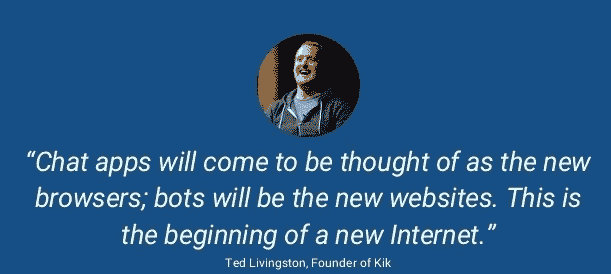
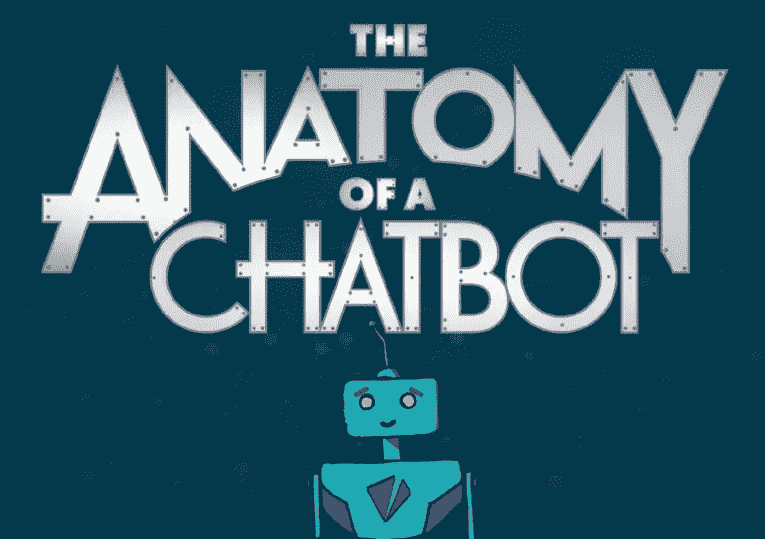
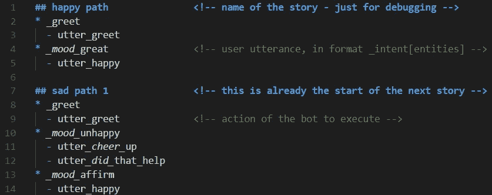
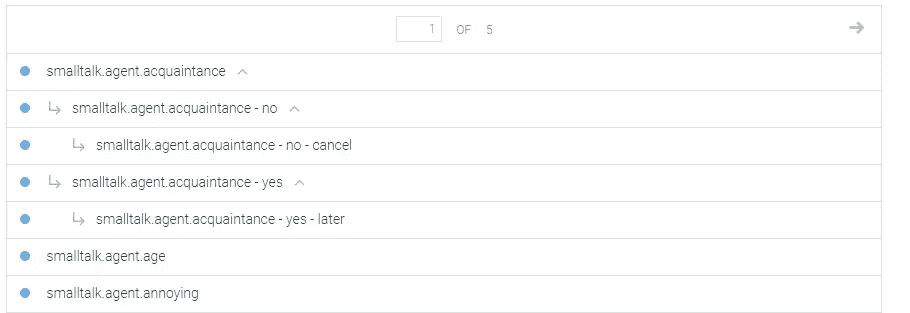
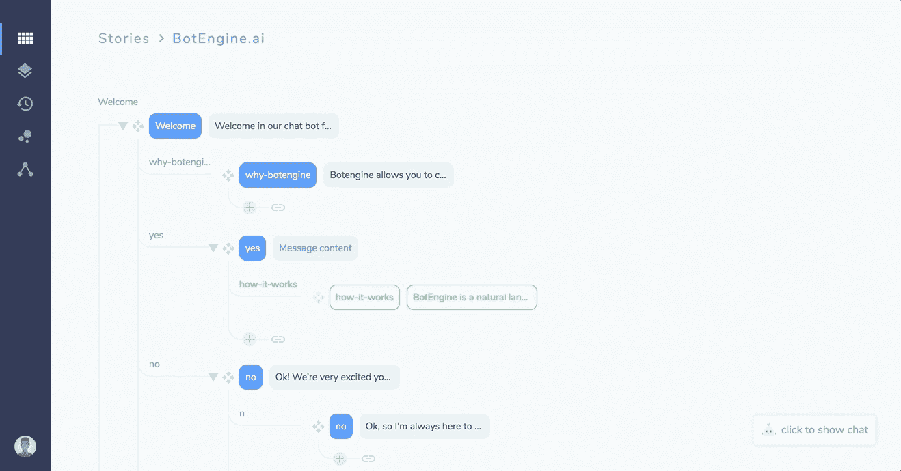
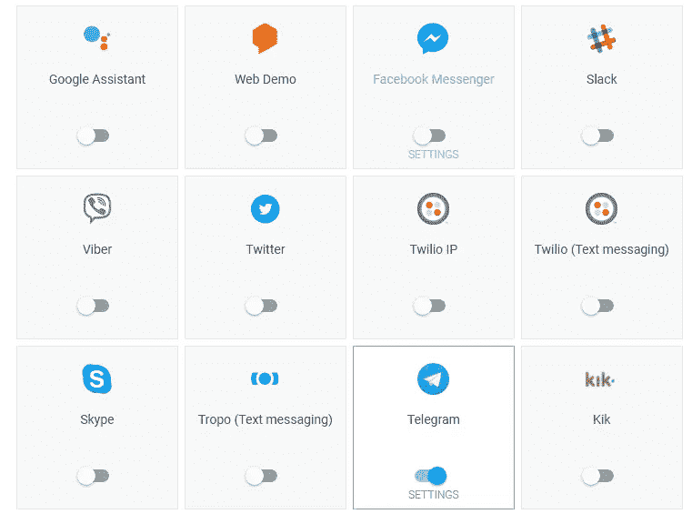
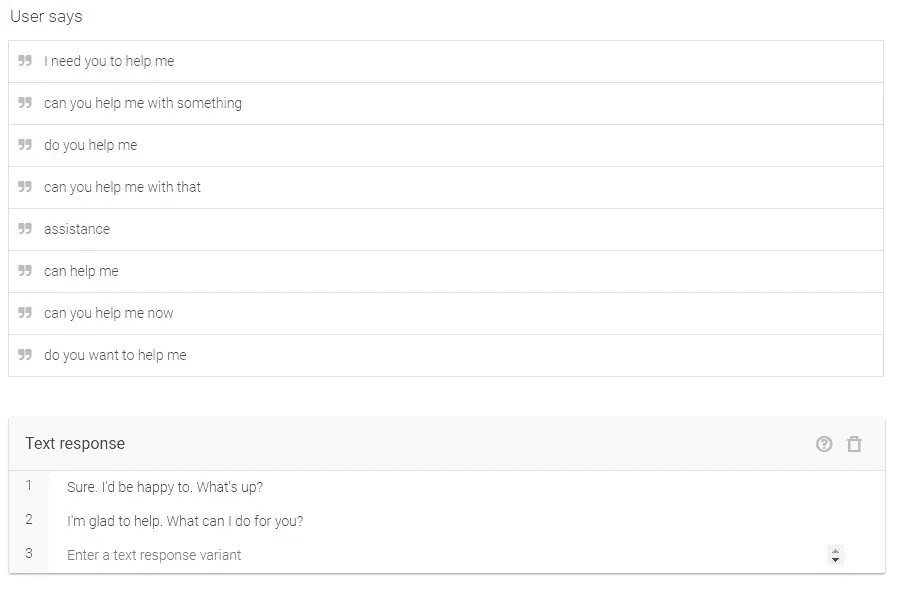

# 聊天机器人的非编码者指南

> 原文：<https://towardsdatascience.com/the-non-coders-guide-to-chatbots-fc038f715f40?source=collection_archive---------2----------------------->

## 所有该知道的。

作为学习过程的一部分，每个聊天机器人开发者最终都会写一些教程，我当然也不例外。我知道已经有几十个教程了，但我还是想再写一个，因为

> 我相信我能比我看过的大多数文章更好地解释某些方面。

# 变得健谈🤖

聊天机器人在过去的几年里已经走了很长的路，你可能已经知道了，因为你正在阅读这篇文章。品牌一直在使用聊天机器人吸引客户，因为争夺手机空间真的很难，因为大多数下载的应用程序几乎一次都没用过。

因为这些聊天机器人存在于你的聊天应用程序中，所以没有必要下载任何对每个人都双赢的东西。

Chatbots are the new apps.

这些机器人帮助我们将服务层隐藏在简单的英语对话层之后，这样我们就不必再用笨重的应用程序来预订出租车或订购披萨。每个人都理解机器人带来的便利，它们可以安排会议或预订餐厅。

# 深入研究机器人

## 基于检索的聊天机器人

早期的聊天机器人依赖于基于规则的方法，并具有硬编码的响应。像你这样聪明的程序员会试图预测用户可能说的每一句话，并为你能想到的每一个问题建立一个庞大的回答列表。

即使在深度学习取得进展之后，这种情况也没有太大变化，我们仍然需要提前预测整个对话流程，并建立一个预定义响应的知识库，但在机器学习的帮助下，这种努力可以大大减少。我们可以使用一个简单的分类器来识别查询背后的意图，这样它就可以将两个意图相同的问题放在一起，即使措辞不同，也可以有相似的响应。

## 生成聊天机器人

深度学习每天都有新的发现，并迅速改变着技术。这些模型不依赖于硬编码的响应，而是从头开始生成它们。由于它需要大量的数据，它本身也存在效率低下的问题，比如语法错误、不相关或不一致的回答。我还没有看到它们被部署到任何生产系统中。

它们在实践中似乎不起作用，企业不会让他们的客户冒险使用聊天机器人，因为聊天机器人有如此多的回复自由。

> 今天深度学习的大部分价值都在你可以获得大量数据的狭窄领域。这里有一个它做不到的例子:进行一次有意义的谈话。有演示，如果你精心挑选对话，它看起来像是有意义的对话，但如果你真的亲自尝试，它很快就会偏离轨道。—安德鲁·吴

# 聊天机器人的解剖学

> 理解语言是机器学习的圣杯。约翰·詹南德雷亚

智能聊天机器人有两大组成部分。

*   **NLU 引擎:**这个作品致力于理解句子的真正含义，可以使用各种技术来推断，如对意图进行分类(使用 Sklearn、TensorFlow 等)，识别重要实体(使用 Spacy、CoreNLP 等 NER 库)，找到情感并将上下文存储在变量中，并在对话中循环。
    NLU 仍在努力识别这句话的真正含义，但这些统计成分放在一起帮助我们缩小差距，是我们今天拥有的最好的东西。

[*拉沙·NLU*](https://rasa-nlu.readthedocs.io/en/latest/)*:这个框架允许我们对意图进行分类，并通过灵活地使用不同的库来识别实体，从而完成分类和命名实体识别任务。*

*   **对话管理:**在理解了用户要说的话之后，这个模块的主要功能就是寻找回应。这些机器人模仿人与人之间的互动，这就是开始变得复杂的地方。
    对话管理器负责保存聊天历史的状态，进而维护对话的流程。

[*Rasa Core*](https://rasa.ai/products/rasa-core/)*:引导对话，考虑对话的历史和外部环境。Rasa 从真实对话中挑选模式，而不是成千上万的规则。*

[*僵尸工具*](https://www.botkit.ai) *:这可以让你使用不同的规则定义自己的故事。没有机器学习被用来定义对话的流程。*

# 对话流程

在构建对话场景时，有两种类型的对话

## 线性对话

这类似于一个问题/答案模型。此对话的目的是收集完成任务所需的信息。这也称为槽填充，因为我们需要在进行下一步之前填充强制实体。

例如，在创建一个预订电影票的机器人时。我们需要在订票前了解一些必要的信息，比如

*   电影的名称
*   显示计时

机器人将不断询问所需的问题来填充这些信息，并且它必须足够聪明来为相应的插槽选择正确的实体。

## 非线性对话

非线性对话完全取决于用户的反应，并且可以有几个分支，这允许对话在其流程中采取不同的路径。这种类型的对话似乎更人性化，因此如果处理不当，会变得更加混乱和复杂。

开发人员可以利用各种平台来创建惊人的故事和复杂的对话流

*   [Rasa](https://rasa.ai/products/rasa-core/) — XML，Python 体验

RasaCore — Story Mode

*   [机智](https://wit.ai/)，[对话流程](https://dialogflow.com/) —点击播放

DialogueFlow

*   [重铸](https://recast.ai/bot-builder)、[僵尸引擎](https://docs.botengine.ai/key-concepts/stories)、[僵尸模仿](https://botmock.com/) —拖拽&拖放界面

BotEngine

# 聊天机器人术语

## 代理人

聊天机器人，也称为对话代理或对话系统，最好描述为与对话管理器结合的 NLU 模块。

## 意图/互动:

意图代表了用户所说的和你的软件应该采取的行动之间的映射。这些是机器人的预定义组件，定义用户的请求并对它们进行分类以采取适当的行动。

## 实体:

用户请求进一步处理所需的任何重要数据或参数被称为实体。最先进的 NER 系统可以用来从句子中提取这些实体。

*例如:我想订一张从* ***巴黎*** *到* ***纽约*** ***今天*** *晚上 10 点**的机票*

*上面突出显示的值是位置和时间实体，这些信息对于处理和预订机票至关重要。*

## *槽填充:*

*一些强制的实体被称为槽，槽填充的过程是不断地提示用户，直到这些槽被填充。*

## *上下文:*

*上下文表示用户请求的当前上下文。这有助于根据用户的偏好、地理位置、应用程序中的当前页面或谈话主题来区分可能模糊或具有不同含义的短语。*

*例如，如果一个用户正在听音乐，发现一个引起他们兴趣的乐队，他们可能会说:“我想听更多他们的音乐”。作为开发人员，您可以在请求的上下文中包含乐队的名称，以便代理可以在其他目的中使用它。*

## *回退:*

*当用户请求不属于任何一个提到的意图时，我们可能会有一系列的响应，比如*我不明白，我不太知道那是什么意思等等。**

## *动作:*

*在找到请求的意图并填充所有必要的槽之后，机器人可能需要执行一个特定的动作，假设是连接到第三方插件的 cloud/lambda 函数。*

# *Web 集成*

**

*一旦你的聊天机器人准备好面对人类，是时候将它与一些领先的聊天机器人平台集成在一起了。大多数 bot 框架都自带插件来实现无缝集成。Telegram、Messenger、Google Assistant 等平台通过向其拥有的广大受众展示您的产品和服务，打开了新的机会，并反过来发展您的业务。*

# *聊天机器人礼仪😺*

*设计聊天机器人最具挑战性的部分之一是让对话尽可能自然和高效，而不是如何分类意图、识别实体、生成丰富的响应或进行一些花哨的技术集成。*

*创建一个机器人在技术上并不困难，但这是一个丰富的用户体验和希望用户回到你身边的问题。一个好的设计应该少关注聊天机器人要说什么，多关注用户要说什么。*

**

*不要试图通过直接提问来快速填充你的位置，因为这可能听起来太命令和无聊，可能会推开用户。*

*如果处理得当，如果你有足够的关于用户的信息，大多数问题首先不需要答案。另一种方法是存储用户的上下文，并在对话中携带它，以便在有任何疑问时使用。*

*如果有必要问一个问题，试着用不同的方式问，注意不要问一个用户已经回答过的问题，如果实体识别失败，通常会出现这种情况。(多训练！！)*

**

*即使在完全不同的会话中响应，也应不惜一切代价避免机器人重复响应。最好的方法是为同一话语准备一堆预先配置好的响应，然后在回复时随机挑选响应。*

**

*Different ways of responding to the same intent*

*这个例子显示了 3 个不同的响应，字面意思是相同的*帮助*意图。*

**

*用户喜欢他们的机器人有幽默感，能够根据上下文讲笑话。这可能会变得棘手，因为不是每个人都喜欢机智的回答，所以谨慎使用这种方法，只有当你有情绪分析器来预测用户的情绪时才是可取的。😜*

**

*给你的机器人起一个名字和一个个性对于拟人化机器人是很重要的。聊天机器人用户通常没有什么私人问题想问，你的聊天机器人最好为他们做好准备。谷歌的聊天代理将所有这些意图归类为*机器人。个人*，并有一长串机智的回复😉*

*   *你是机器人吗？*
*   *你叫什么名字？*
*   *你几岁了？*
*   *你好吗*

**

> *如果你喜欢阅读它，并发现它很有意义，请继续关注，分享并鼓掌！！*