# 北欧人。艾节——你错过了什么

> 原文：<https://towardsdatascience.com/the-nordic-ai-festival-what-you-missed-7ef8701d1961?source=collection_archive---------3----------------------->

**从音乐推荐和手机结账到紧急呼叫和社会的未来，就职** [**北欧。AI**](http://nordic.ai) **大会是一个令人眼花缭乱的快照，展示了围绕人工智能如何影响我们的生活、工作和娱乐的最新研究、技术、思维和辩论。**

**3 月 7 日在哥本哈根 Vega 举行的首届活动展示了该地区在该领域工作的许多最令人兴奋的初创公司和公司，探索我们现在的位置、未来的方向，以及推动北欧地区发展还需要做些什么。**

**做不下来？这是你错过的。**

莎拉·吉尔的话

***首先:为什么是北欧人工智能？***

*[Nathan Benaich](http://nathanbenaich.github.io/) 为北欧人工智能领域目前正在发生的事情以及北欧人工智能为何如此重要设定了场景。他演讲中的一些要点包括:*

***1。** **对北欧公司的投资和退出正在增长** —在 2016–2011 年和 2000–2010 年间，交易增加了 5.7 倍，投资增加了 3.6 倍。
2。欧洲拥有强大的资源—470 万开发人员对 410 万美国开发人员，2 家人工智能公司成立于 2016 年至 2011 年，2010 年至 2000 年。
**3。聚会越来越多**——在过去的五年里，赫尔辛基+斯德哥尔摩的聚会增加了 20 倍，回复也增加了 10 倍。*

*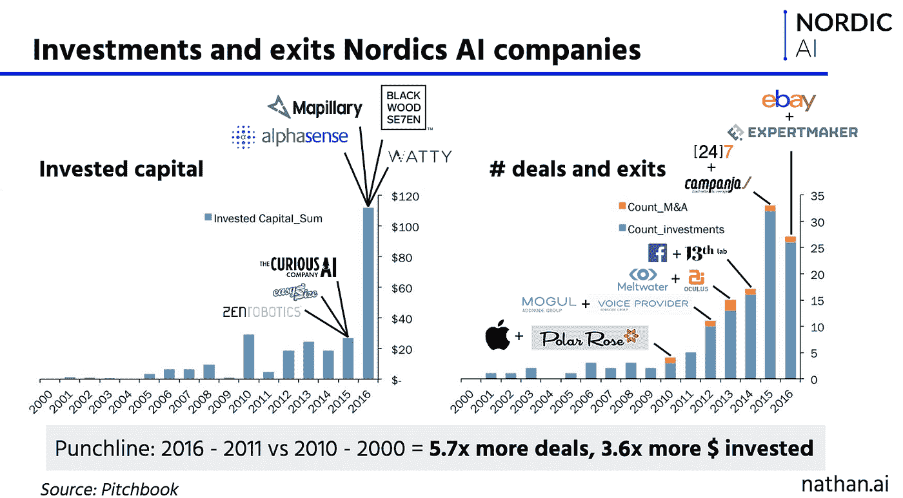*

*Slide by Nathan Benaich*

*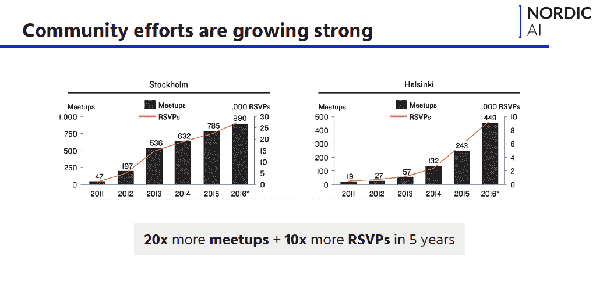*

*Slide by Nathan Benaich*

*北欧的心脏。AI 的[使命](https://medium.com/@Nordic_AI/nordic-ai-a-movement-6fc8a935c38e)是将北欧地区所有建设、研究、投资和思考人工智能的人聚集在一起，帮助他们做更伟大的事情。*

*它是关于激发创业公司、行业和学术界之间的联系，以及将新兴的当地社区、聚会和团体联系在一起，以聚焦正在发生的事情，并推动整个北欧地区共同前进。*

*Nathan 谈到了目前欧洲技术生态系统的分裂，以及为什么促进斯德哥尔摩、哥本哈根、雷克雅未克、赫尔辛基和奥斯陆之间的合作、讨论和知识共享如此重要，但更重要的是，促进与伦敦、柏林和更远的其他主要中心的合作、讨论和知识共享。*

****“欧洲枢纽之间的关系是脆弱的或者充其量是新兴的”***[***——@ NathanBenaich***](https://twitter.com/NathanBenaich)***关于为什么支持***[***【nordicAI***](https://twitter.com/hashtag/nordicai?src=hash)等倡议很重要*

*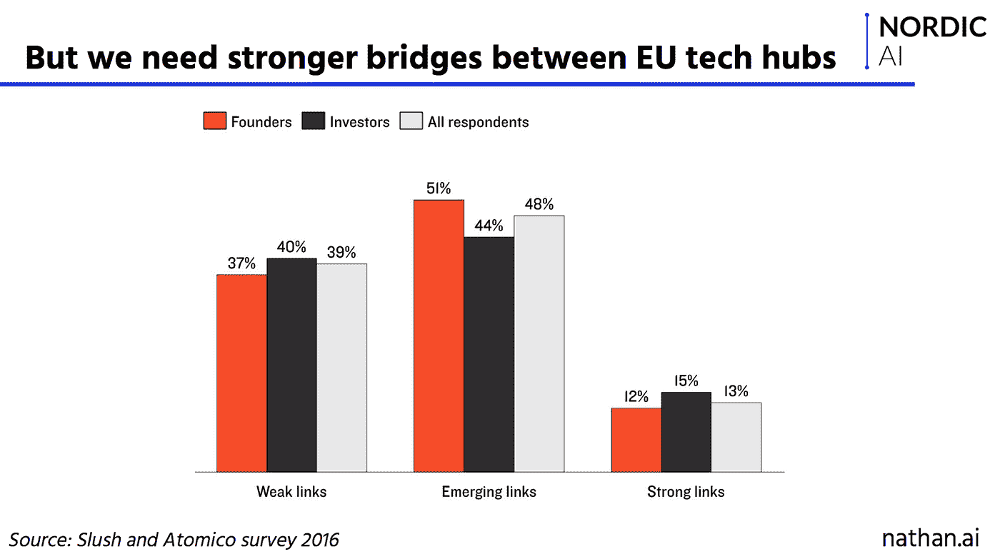*

*Slide by Nathan Benaich*

***状态检查:AI 的状态***

*阿齐姆·阿兹哈尔描绘了人工智能现状的大图景——自从人们第一次开始谈论它已经过去了大约 60 年。他谈到了技术革命的周期，数据的爆炸和这个领域的工作遗产，这意味着我们今天可以建造有趣的东西。*

*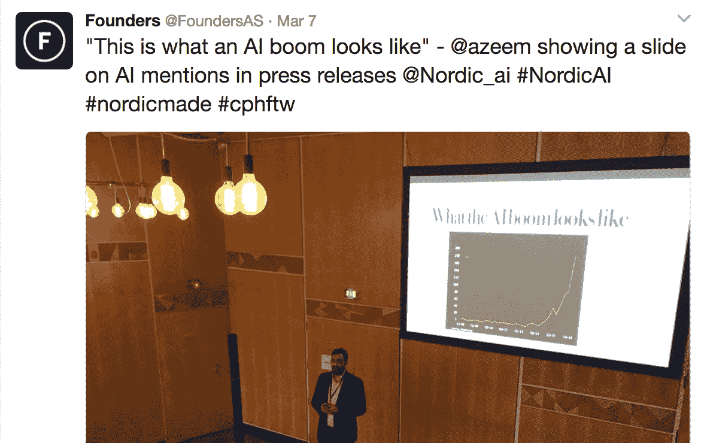*

*他最后呼吁人们、公司、初创公司和研究人员大胆大胆地思考他们在人工智能方面的雄心，但也要仔细思考利用这项技术的意义，谁掌握着缰绳以及它将对社会产生的影响。*

***北欧。AI:演讲者重点介绍***

*🔥Danny Lange 曾是优步机器学习的负责人，现任哥本哈根创立的 Unity Technologies 的人工智能和机器学习副总裁，他带我们走过了人工智能在企业中的应用。他谈到了典型的商业挑战(如需求波动、供应复杂性、不断增长的客户期望等)，以及机器学习如何“让企业再次变得聪明”。*

*🔥在“机器学习的干扰”中，我们听到马士基的数据科学家 Clemmensen 讲述了该公司如何使用该技术处理数百万行数据的真实例子，以改善他们处理从集装箱维修到预测到流失的一切事情的方式。*

*🔥Wise.io(成立于哥本哈根，被 GE Digital 收购)的联合创始人 Henrik Brink 通过一个工程师将机器学习部署到生产中的 5 步过程，开始了实际工作。*

*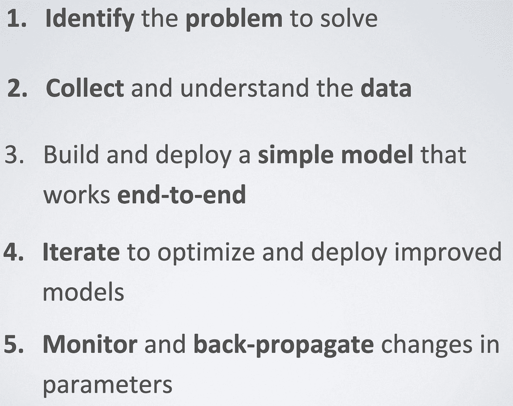*

*Slide by Henrik Brink*

*🔥[来自爱立信数据中心自动化部门的 Jesse Chao](https://www.linkedin.com/in/jesse-chao-15b06640/) 谈到了用户数据、应用数据和网络/基础设施数据的机会，以及围绕用户体验、网络自动化、连接用户安全和身份管理以及基础设施效率的使用案例。*

*🔥 [Rafal Lukawiecki](https://www.linkedin.com/in/rafallukawiecki/) 带我们对人工智能的过去、现在和未来进行了一次疯狂的短暂停留之旅。他的[演讲](https://projectbotticelli.com/ppt?pk_campaign=pb2017dkai)谈到了为什么企业需要人工智能、人工智能和数据科学来理解成功和失败、他们的客户、规划未来、尝试冒险和做出明智的决策。*

*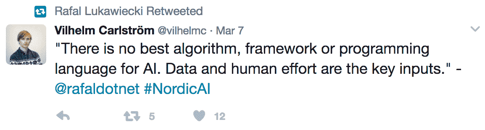**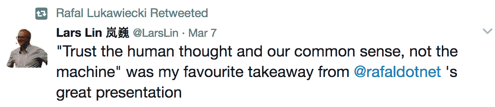*

*🔥Nathan 和 Azeem 与 Creandum 的 Bjarke Staun-Olsen 和北欧制造商的 Hampus 雅柯布逊从投资者的角度谈论人工智能，话题包括小公司如何在这个领域赶上大公司。你可以读读 Bjarke 关于北欧的文章。AI 和接下来的[这里](https://medium.com/creandum-family/what-comes-next-after-nordic-ai-5140a6ae4be3)。*

*🔥该计划的研究部分看到了 DTU ( [丹麦技术大学](http://www.dtu.dk/english))教授 [Ole Winther](https://www.linkedin.com/in/owinther/) 在学术界和工业界谈论人工智能。DIKU ( [哥本哈根](http://diku.dk/english/)大学)机器学习教授 Christian Igel 讲述了机器学习对科学和社会的影响，雷克雅未克大学[的](https://en.ru.is/) [Kristinn Thorsisson](https://www.linkedin.com/in/thorisson/) 和冰岛智能机器研究所向我们概述了过去十年冰岛人工智能领域发生的事情。*

*展示:北欧正在酝酿什么*

*如果围绕北欧人工智能生态系统中的所有参与者建立一个社区是运动的第一步，那么下一步就是帮助让国际社会关注这里正在发生的事情。这是此次活动中展示的所有初创企业和扩大规模企业的快照。*

*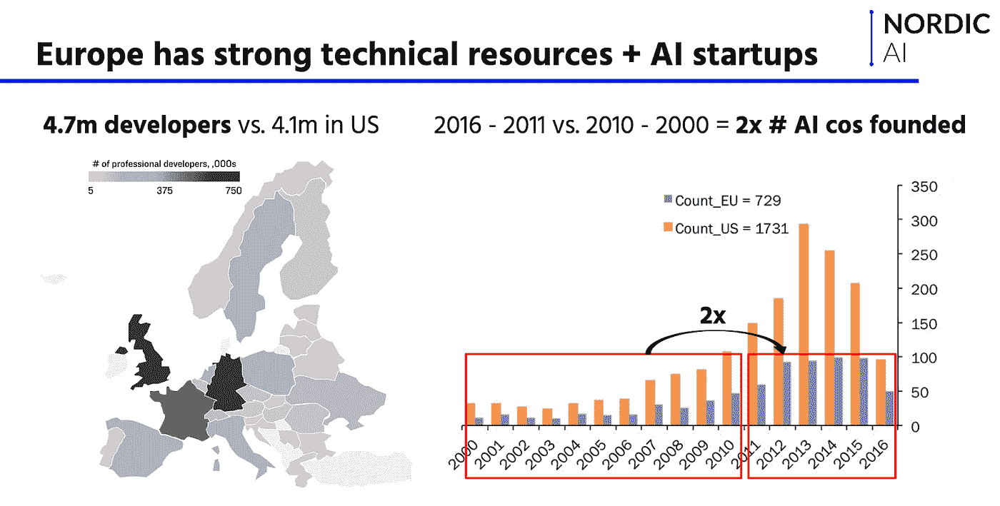*

*Slide by Nathan Benaich*

***🌍瞳孔***

*[mapi pillar](https://twitter.com/mapillary?lang=en)成立于马尔默，总部仍在马尔默，是一个开源的街道级图像平台，由社区和计算机视觉拍摄的众包图片提供支持。在活动上，联合创始人兼首席执行官 [Jan Erik Solem](https://www.linkedin.com/in/solem/) 表示，mapi pile 现在拥有 1 亿多张照片，在 190 个国家拥有大约 10 亿个标记图像区域。在这里阅读更多关于他们正在建造什么和为什么[的信息。](https://www.mapillary.com/manifesto)*

***🌍Spotify***

*“给我看你的播放列表，我将为你的生活配乐”是 Spotify 的工程副总裁 Andreas Mattson 的谈话名称。Spotify 的音乐流媒体服务在 3 月初达到了付费用户的一个新里程碑，现在全球有超过 5000 万人使用它来查找、聆听和分享音乐。安德烈亚斯带我们了解了支持 Spotify 著名播放列表和推荐的机器学习技术。*

*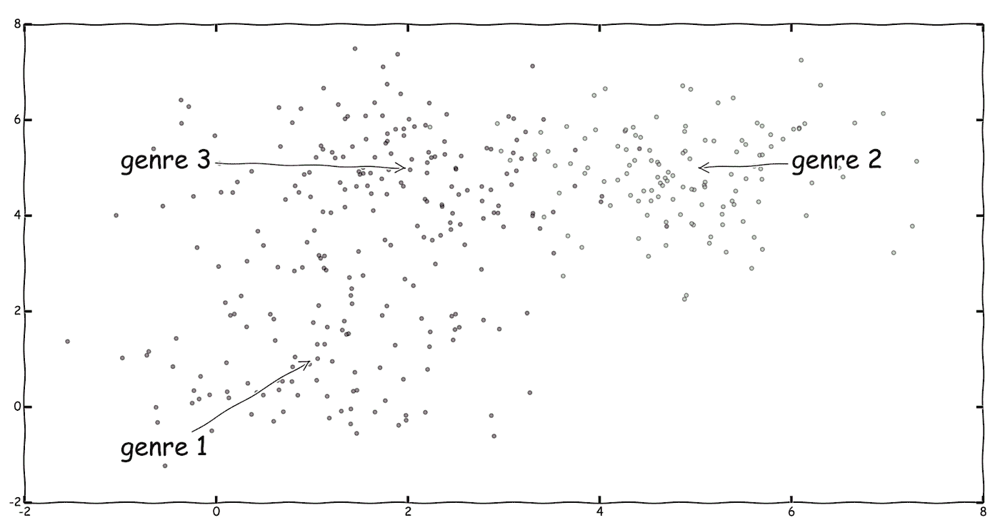*

*Slide by Andreas Mattson*

***🌍克拉纳***

*那么机器学习改善顾客结账体验的机会在哪里呢？Klarna 公司的【】[Samare Jarf](https://www.linkedin.com/in/samare-jarf-636aa846/) 解释说，这家瑞典支付技术公司如何建立统计模型来个性化客户体验。她谈到 Klarna 如何根据顾客对支付方式等变量的偏好来调整顾客的结账体验，以提高从浏览到购买的转化率。*

*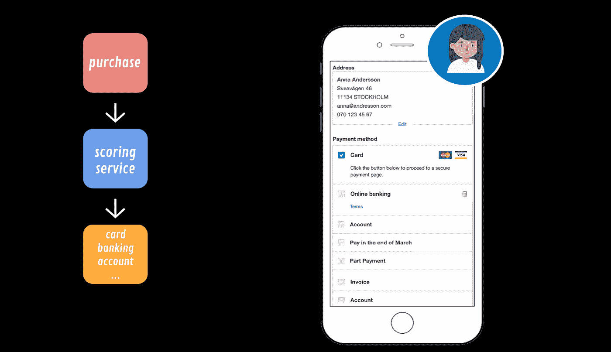*

*Slide by Samare Jarf*

***🌍布莱克伍德 7***

*来自 [Blackwood Seven](https://blackwoodseven.com/) 的[米歇尔·格林](https://www.linkedin.com/in/mickegreen/)讲述了机器学习如何应用于一个完全不同的行业，并在媒体机构领域谈论了贝叶斯人工智能引擎。Blackwood Seven 的 Maggie 平台旨在让客户根据从媒体价格和宏观经济到天气和股市波动等领域的数据预测媒体支出的影响。格林谈到了未来，人类媒体规划者可以向人工智能简要介绍战略，并建立一个可以建立和推理模型的人工智能。*

*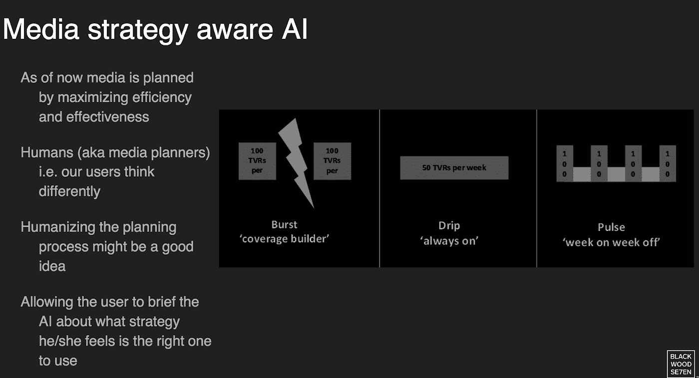*

*Slide by Michael Green*

***🌍科尔蒂***

*哥本哈根和旧金山的 Corti 将这项技术引向另一个方向，将机器学习应用于真实的人类对话。该团队的机器学习负责人[Lars maal le](https://dk.linkedin.com/in/larsmaaloe)谈到了深度学习在高度复杂的声音信号上的应用，以及如何在应急服务中部署。紧急服务是一些最紧张的对话界面，即使对于专业人员来说也需要很高的专业知识。Corti 通过基于大量历史数据的诊断来帮助界面，这对于人类来说是不可行的，并确保在分秒必争的情况下做出更快速的救生决策。*

*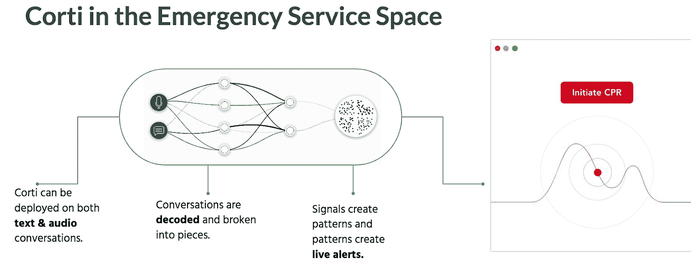*

*Slide by Lars Maaløe*

*他还指出，将这项技术应用于其他背景下的人类对话存在巨大的机会，并引用了一项研究，即每年客户给美国公司打电话的次数超过 2570 亿次，但这些对话中只有一半得到解决。*

***🌍美瞳***

*另一家将机器学习应用于医疗保健领域的初创公司是[MedEye](https://medeye.io/) ，旨在防止床边用药时出现错误。也就是说，确保患者在正确的时间获得正确的药物，并且他们知道自己在服用什么。它的扫描设备允许护士将特定患者的药物放入一次性抽屉中，并使用计算机视觉来验证药物和剂量是否正确。Medeye 也有一个应用程序，患者和他们的家人可以跟踪他们正在服用的药物。它是关于防止错误，拯救生命和削减错误的成本。*

*这是母公司 Mint Solutions 的第一款产品，该公司专注于使用技术来帮助护士和医生。*

***🌍iZettle***

*总部位于斯德哥尔摩的移动支付公司 [iZettle](https://www.izettle.com/) 的分析平台负责人 [Andreas Meisingseth](https://www.linkedin.com/in/andreas-meisingseth-37459725/) 分享了他关于使用开源和 AWS 进行机器学习的实用方法的演讲。iZettle 是一家移动支付公司，它让咖啡馆、面包店和沙龙等微型企业接受客户的信用卡。虽然支付是业务的核心，但更大的前景是为传统金融服务服务不佳的商家建立一套数据驱动的服务。*

***🌍Lytics***

*另一家位于马尔默的初创公司是 [Lytics.ai](http://lytics.ai/) ，它基于深度学习提供数据驱动的个性化预测医疗保健。Lytics 专注于严重疾病，如肾衰竭、慢性阻塞性肺病(慢性阻塞性肺病)和心脏问题。该公司认为，深度学习有可能在许多层面上彻底改变医疗保健行业，改善患者的生活，降低医疗保健提供商的成本。*

***🌍阿伦多分析***

*[Arundo](https://www.linkedin.com/in/elliedobson/)EMEA 地区数据科学总监 Ellie Dobson 谈到了最近在收集和分析数据方面的技术进步如何使人工智能优化每个行业的梦想实际上可以实现。Arundo Analytics 利用大数据和机器学习来分析行业数据，帮助优化运营。其针对资产密集型行业的专有技术使用大数据和机器学习技术来分析资产数据，以优化运营，并在事件发生前为客户提供洞察。*

***🌍电影***

*[Movi](http://movi.ai/) 是一个基于 AI 的视频引擎。联合创始人兼首席执行官 [Lars Erik Ravn](https://www.linkedin.com/in/lazererik/) 在奥斯陆成立，现在总部位于帕洛阿尔托，他分享了他对视频技术未来的愿景。Movi 开发智能视频技术。在 Movi 播放器上播放视频时，Movi analytics 可以收集与视频内容相关的一切数据，然后创建自动化的内容策略。*

***🌍好奇的艾公司***

*[好奇 AI 公司](https://thecuriousaicompany.com/)专注于无监督机器学习。该团队开发了[梯形网络技术](http://thecuriousaicompany.wp-palvelu.fi/technology/)，并表示现在开始将其无监督学习技术应用于各种试点应用领域。该公司表示，潜在的最终应用可能包括用于自动驾驶汽车的新型机器视觉技术、高级软件代理和智能个人助理。*

*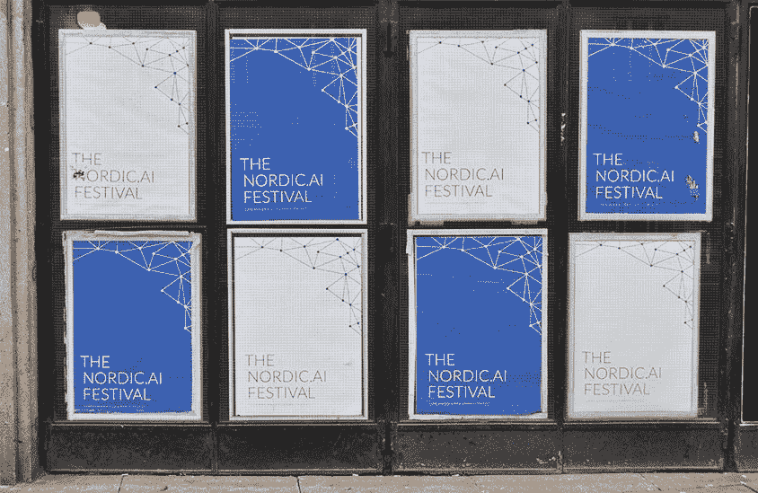*

***敬请关注:关注北欧人工智能**的下一步*

*那是第一个北欧人的包裹。AI 大会，但是这个运动才刚刚开始。使用#NordicAI 分享、关注和联系北欧人工智能社区正在发生的事情:让我们建立一些令人敬畏的东西。*

*👉 [#nordicai](https://twitter.com/search?q=%23nordicai&src=typd&lang=en)*

*👉 [www.nordic.ai](http://www.nordic.ai)*

*👉 [@Nordic_ai](https://twitter.com/Nordic_ai)*

*👉[中等](https://medium.com/@Nordic_AI/nordic-ai-a-movement-6fc8a935c38e)*