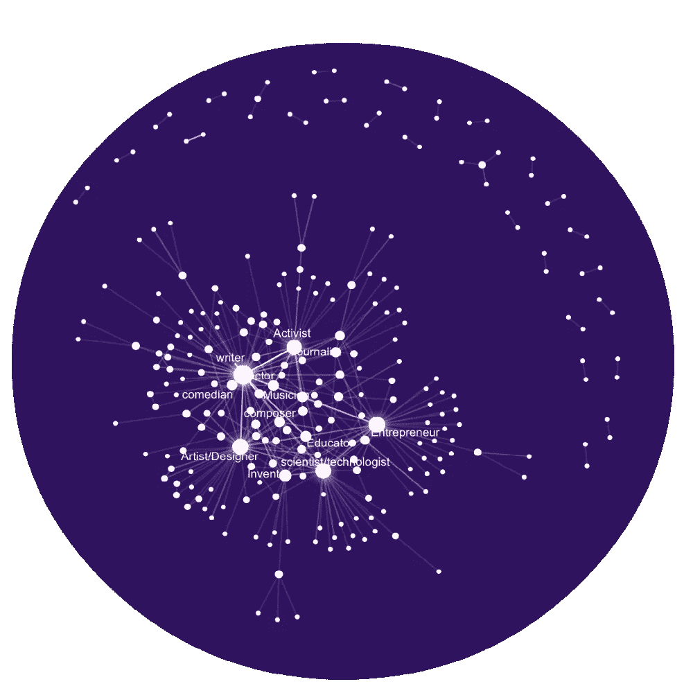
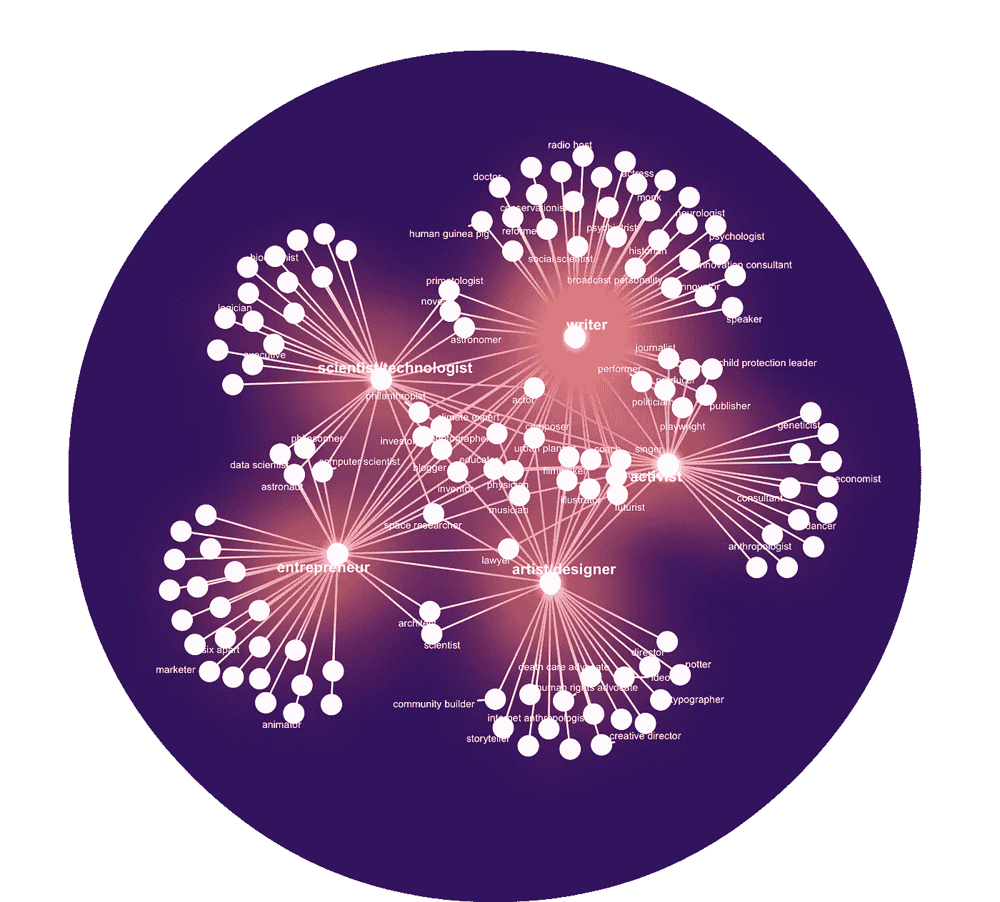

# TED 演讲者的职业

> 原文：<https://towardsdatascience.com/the-occupation-of-ted-speakers-4df1829c5ac7?source=collection_archive---------9----------------------->

是什么样的背景点燃了 ted 演讲者们思想的多样性？继之前关于 TED 演讲的[反复出现的话题](https://medium.com/towards-data-science/what-are-the-recurring-topics-in-ted-8392cf9f3fb)和[特点](https://medium.com/towards-data-science/finding-characteristics-of-ted-talks-911879560146)的帖子之后，今天我将看看演讲者的职业。

由于许多演讲者都戴着一顶以上的帽子，我绘制了一个同时出现的职业网络:

TED speakers of multiple occupations

接下来，我们放大到与至少 20 种其他职业同时出现的职业。我们可以看到许多有趣的组合:演讲者兼任表演者和活动家，艺术家/设计师和社区建设者，企业家和动画师，作家和禅宗牧师，科学家/技术专家和单口相声家。

People with these occupations branch out a lot

这是我关于数据科学和视觉故事的[# 100 日项目](https://medium.com/@yanhann10)的第 62 天。我的 [github](https://github.com/yanhann10/opendata_viz) 上的全部代码。感谢阅读。如果喜欢，请分享。欢迎新主题的建议和反馈。