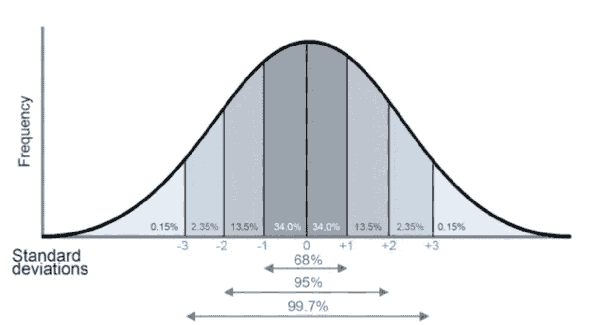
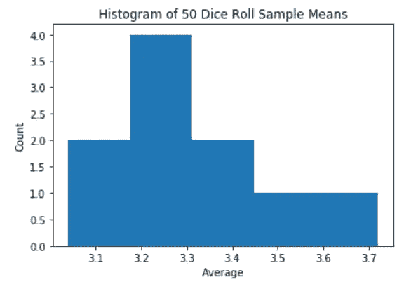
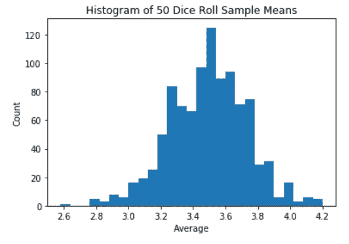
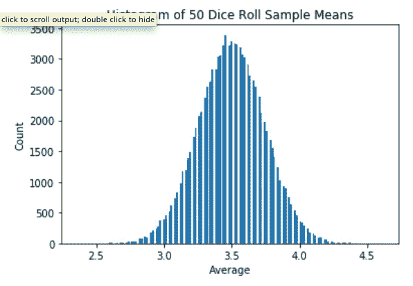

# 每个数据科学家都应该知道的一个定理

> 原文：<https://towardsdatascience.com/the-one-theorem-every-data-scientist-should-know-f7c501d54bad?source=collection_archive---------2----------------------->

本文是每个数据科学家都应该知道的最重要的定理之一的快速指南，即**中心极限定理。**

这是什么？什么时候可以不用？为什么重要？和大数定律是一回事吗？

# 中心极限定理与大数定律

通常，中心极限定理与大数定律相混淆。**大数定律**表明，随着样本量的增加，样本均值对总体均值的估计越准确。

这两个定理的区别在于大数定律描述的是单个样本均值，而中心极限定理描述的是样本均值的分布。

# 中心极限定理(CLT)

> 中心极限定理指出，如果样本量足够大，任何独立的随机变量的均值的抽样分布将是正态或接近正态的。

换句话说，如果我们采取足够大的随机样本，所有样本的比例将围绕人口的实际比例呈正态分布。请注意，应用 CLT 时，基础样本分布不必呈正态分布。为了进一步细分，想象收集一个样本并计算样本平均值。一遍又一遍地重复这一过程，每次从总体中收集一个新的独立样本。如果我们绘制每个样本平均值的直方图，分布将呈正态分布。

那看起来像什么？正态分布有一个钟形曲线，如下所示。大部分数据都聚集在中间，即平均值。该分布以平均值 0 为中心，标准偏差为 1。



你可能想知道，什么才算足够大？一般规则是，如果样本量为 30 或更多，样本量就足够大，足以容纳 CLT。


这是一个有趣的 CLT 工作演示。在制豆机或高尔顿板中，珠子从顶部落下，最终以钟形曲线聚集在底部的容器中。

# 什么时候可以不用 CLT？

*   取样不是随机的。
*   基础分布没有定义的平均值/方差。

# 掷骰子示例

CLT 的一个经典例子是掷骰子。每个数字都有六分之一的可能性出现在掷骰子中。我们可以用 python 来模拟掷骰子。

让我们将样本量设为 50 次观察。代码 randint(1，7，50)给出了一个由 50 个数字组成的数组，其中数字 1 到 6 出现的概率相同。让我们从观察 10 个样本平均值的分布开始。

```
means = [(randint(1, 7, 50)).mean() for i in range(10)]plt.hist(means, bins=’auto’)
plt.title(‘Histogram of 50 Dice Roll Sample Means’)
plt.xlabel(‘Average’)
plt.ylabel(‘Count’)
plt.show()
```



Result of 10 sample means

这个分布还没有太多的形状。让我们把样品数量增加到 1000 个。请注意，我们越来越接近钟形曲线。



Result of 1,000 sample means

现在，让我们来看看数量极其庞大的样本，确切地说是 10 万个。这看起来像一个非常明确的钟形曲线。是不是很神奇？我们的样本分布看起来就像高斯分布！就像 CLT 告诉我们的那样。



Result of 100,000 sample means

# 我们为什么关心 CLT？

它是统计学的基础。出去收集整个感兴趣人群的数据是不可能的。然而，通过从该人群中收集数据子集并使用统计学，我们可以得出关于该人群的结论。

CLT 从本质上简化了我们的分析！如果我们可以宣称正态分布，那么关于数据集我们可以说很多事情。在数据科学中，我们经常要通过统计显著性检验，即假设检验来比较两个不同的总体。借助 CLT 的力量和我们对高斯分布的了解，我们能够评估我们关于两个总体的假设。

感谢您的阅读！如有疑问，请发表评论。