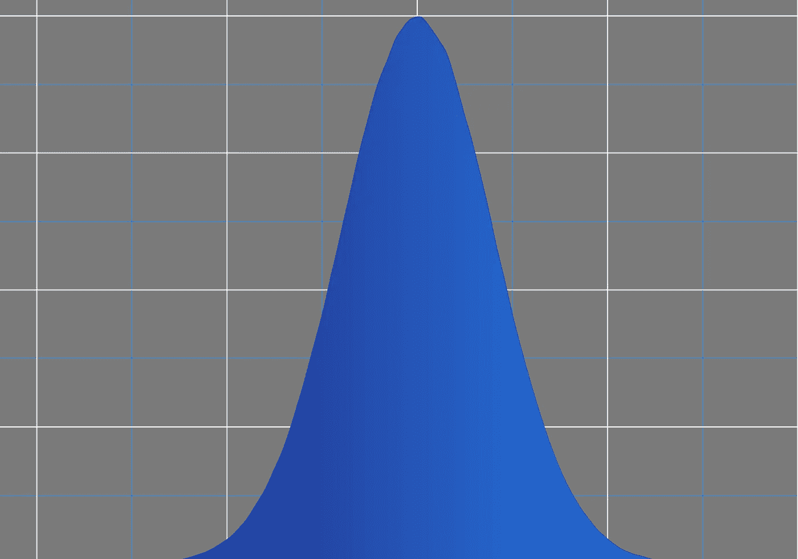
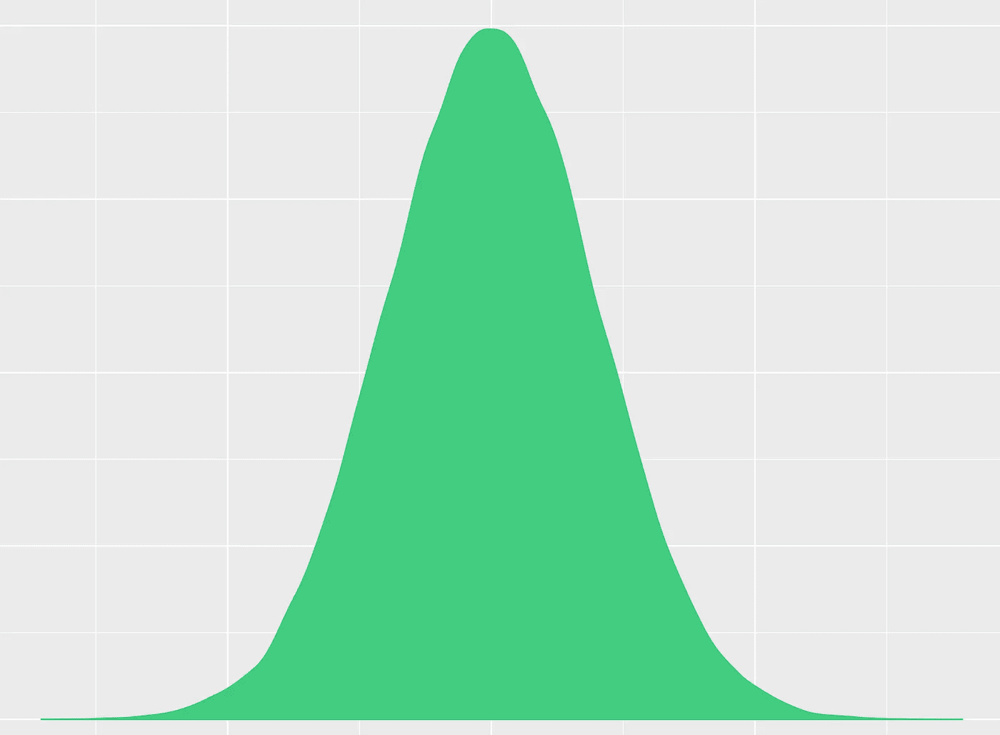
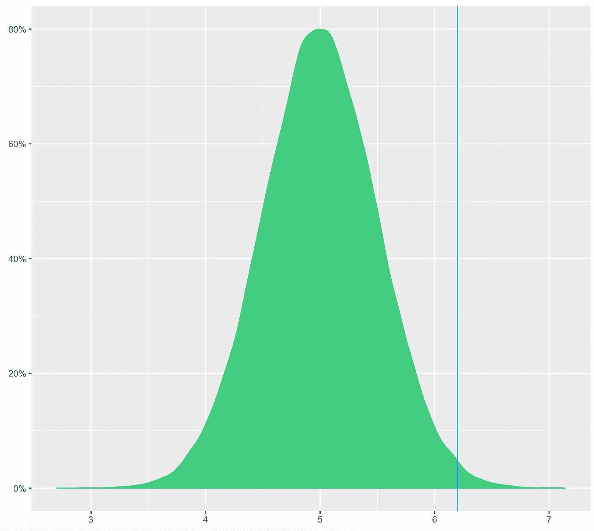

# 科学家需要知道的唯一定理数据

> 原文：<https://towardsdatascience.com/the-only-theorem-data-scientists-need-to-know-a50a263d013c?source=collection_archive---------1----------------------->

通常，我认为可能过于强调数据科学家的技术技能了。也就是说，在一些技术领域，科学家真的应该成为专家，而在这些领域中，假设检验是最重要的。

而假设检验依赖于*中心极限定理*。为什么重要？这是统计学的核心思想，让你用数据来评估你的想法，即使信息不完整。

# 它说什么

*中心极限定理* (CLT)简单。只是说样本量大，样本均值是正态分布的。

显然，其中一些术语需要限定或解释。让我们从最后开始，然后倒着做:

*正态分布*是指一组数字遵循一条钟形曲线。大多数数字集中在平均值附近的中间，在最右边和最左边的数字较少。看起来像这样:

A Normal Distribution

一个*样本均值*是一个更大群体的随机子集的平均值。因此，如果你从 100 个人中随机挑选 10 个人并记录他们的身高，这 10 个人的平均身高就是样本平均值。你可以这样做很多次，因为这是一个随机选择，样本均值每次都会不同。

什么构成了*大样本*当然是主观的，但是这里经常引用的数字是样本量应该大于 30。实际上，您的样本可能需要大得多，这取决于几个因素。

CLT 只是说，当你的样本中有大约 30 个或更多的观察值时，这些数字的平均值就是钟形曲线的一部分。因此，如果你选取一组 30+大小的样本并绘制它们，它们将看起来像上图中的正态分布-大多数平均值将向中心下降，但你会得到一些向极端的观察结果。

CLT 不会对基础数据的分布做任何假设。人的身高分布不需要正态分布才能知道身高的样本均值是正态分布。

# 为什么它很重要

现在你知道这个定理说了什么，让我们来解释为什么它很重要。假设检验是科学用来验证想法的方法。假设检验的框架总是:*我拥有的数据支持我的想法吗，或者我的数据可能只是偶然的？*

科学家量化*偶然性*的方法是，假设他们的想法是错误的，通过评估观察他们数据的可能性。因此，即使你的想法是错误的，如果你可能会看到你收集的数据，那么这些数据并不能为你的想法提供支持。有道理，对吧？

现在棘手的部分来了:当你的假设是错误的时候，你如何理解一些数据有多大的可能性？要做到这一点，你需要构建假设你的假设是错误的，你可以看到的值的范围，然后评估在这种情况下你观察到的值的可能性。幸运的是，这正是 CLT 允许你做的。

# 一个例子

假设你是一家软件公司的数据科学家，你被要求量化你的主页有多吸引人。你有一周的时间来得到这个问题的答案。你决定用花在主页上的平均时间作为衡量这个想法的标准，并认为如果你的主页吸引人，花在主页上的真实平均时间应该超过五分钟。

虽然你可以测量所有用户在你的主页上花费的平均时间，但这对于在一周内回答这个问题来说并不十分有效。

因此，你取 10%的用户作为样本，在 7 天内测量他们在你的主页上花费的平均时间。在这个样本中，花在主页上的平均时间是 6.2 分钟。但是与上面提到的随机组的高度一样，您的估计值也会有变化，因为您只测量了您关心的用户的子集。

因为与所有用户相比，您的样本花费的平均时间会有一些差异，所以您需要评估您的结果是偶然的可能性。也就是说，如果你在主页上花费的真实时间是 5 分钟或更少，但是由于随机变化，你测量的用户子集的平均时间是 6.2 分钟呢？

幸运的是，只要你的样本量大于 30，你就可以使用中心极限定理来构建如果你的假设是错误的，即当真实的平均花费时间不超过 5 分钟时，你在主页上花费的时间的分布会是什么样子。这被称为零假设下的分布或[零分布](https://en.wikipedia.org/wiki/Null_distribution)。

CLT 认为零分布将是正态的(即钟形的)，它还认为可以用样本中的值来逼近构建零分布所需的值。零分布的中间值是零假设的平均值，零分布的标准差(即分布)是样本的标准差除以样本大小的平方根，该值称为[标准差](https://en.wikipedia.org/wiki/Standard_error)。这就是在零假设下建立样本均值分布所需要的一切。

然后，你可以将你观察到的值 6.2 绘制成分布图，以评估观察到该值的概率，即使你的假设是错误的。结果看起来像这样:

Distribution of Sample Means of Time on Homepage

因此，当真实平均值为 5 时，观察到平均花费时间为 6.2 的概率由蓝线右侧的绿色分布区域表示。这是从零分布中抽取的 10%随机样本大于或等于 6.2 的频率。如果这种可能性很小(在这种情况下，概率小于 1/100)，你可以说你的证据表明花在主页上的时间大于 5 分钟。

# 贝叶斯呢？

好吧，我的标题可能有点误导。可能还有一个你应该知道的定理:[贝叶斯定理](https://en.wikipedia.org/wiki/Bayes%27_theorem)。

贝叶斯定理也允许你使用数据作为证据，但不是让科学家问他们的数据是否支持特定的假设，而是根据一些证据描述一系列可能的值。贝叶斯最酷的一点是，你可以随着时间的推移不断收集证据，并更新你对可能性的看法。

我将在另一篇文章中详细解释贝叶斯。同时，欢迎在下面发表评论或提出问题，或者你可以在 [Twitter](https://twitter.com/carsonforter) 和 [Linkedin](https://www.linkedin.com/in/carson-forter/) 上找到我。