# 最优子群难题

> 原文：<https://towardsdatascience.com/the-optimal-subgroup-puzzle-f3bfd7c3ff0c?source=collection_archive---------6----------------------->

# 利用机器学习算法的能力来解决不寻常的问题

如今，随着越来越多的计算机科学家/统计学家/数学家等，许多职业发生了转变。正在进入数据科学的世界。作为一名初级数据科学家，我在他们旅程的开始遇到了很多人，就像我一样。我最近想到，我遇到的许多低年级学生都有一种特定的思维模式，认为如果一个问题不能通过一个已知的模型来解决，那么它很可能是一个主要的问题，他们应该把它留给专业人员。就我个人而言，我认为即使我们作为初级数据科学家所拥有的工具也是极其强大的，我想用我所面临的一个有趣的问题来证明这一点。

我第一次遇到最优子群问题是在广告技术行业工作的时候。我是一名初级数据科学家，我的团队(实际上当时只有我一个人)的职责之一是**分段**过程。简单地说，给定一组描述一个人的特征，我们必须确定这个人是否喜欢鞋子、马、运动等等。但是，尽管我们实现了很高的准确性，并且在某些情况下**我们甚至将特征直接映射到片段**，业务人员对我们的结果并不满意:

*“我们不能把一些细分市场卖给广告商，它们没有市场吸引力”。*

他们进一步解释说，虽然他们完全信任我们的细分系统，但他们不能出售*体育迷*细分市场，例如，如果其中包含 70%的女性。*“如果细分市场的统计数据对广告商没有意义，他们就不会购买”*。

那么我们如何处理这个问题呢？让我们继续以*体育迷*为例:我们有许多个人的自我报告数据，所以我们对自己的标签非常有信心。问题是，我们的数据分布与人口分布不同，这意味着我们的男女比例(或任何其他比例)可能与现实世界不同。例如，根据我们的数据和维基百科，让我们看看美国的*年龄*分布:

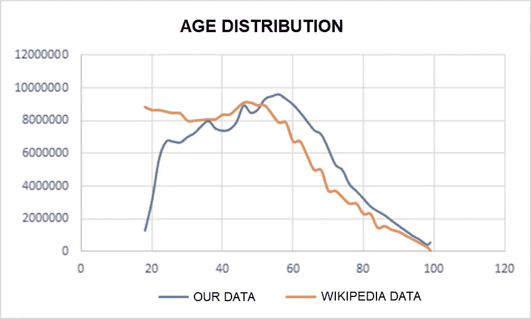

很明显，我们的数据分布不同。此外，我们还在这张图上看到了坏数据的影响，因为我们知道的 55 岁以上的人比维基百科多大约 1500 万是极不可能的。无论如何，问题就在那里，它不仅与年龄有关，还与性别、收入和其他许多特征有关。因此，为了继续使用我们的细分模型，**和**满足业务需求，我们需要解决最优子组问题:

> ***给定一组数据点 G，其在特征集 F 上具有分布 P，找出最大的子组 G’，其在 F 上具有想要的分布 P’***

请记住， *G'* 的大小直接影响 *P'* 。有可能某个 *G'* 会和 *P'* 完全匹配，但是如果这个同一个 *G'* 包含五个人，那么我们就真的卖不掉这个组了，不是吗？

# 那么我们如何解决这个问题呢？

我们面临的问题没有直接的“scikit-learn-implemented”解决方案。**但是，使用我们的数据科学工具箱中的基本但令人惊叹的工具，可以打造出一个优雅的解决方案。**让我们想想最优解:如果我们有一只知道最优解的小鸟，那么它可以告诉我们每个人是否被包括在*G’*中。所以也许，我们可以把这个问题转化成一个更简单的二进制分类问题。由于最终我们想要优化*G’*，选择逻辑回归似乎是很自然的，它使用梯度下降来找到最小化误差的解决方案。

问题是**我们的数据没有标注**，所以我们必须定义一个符合我们需求的损失函数。我们这样定义损失函数:

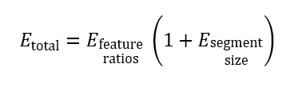

为什么我们不把这两种误差加起来呢？这是因为从商业角度来看，我们更喜欢比细分市场规模更高的比率准确性。对于上面的公式，如果片段大小误差很小，损失函数仍然取决于特征比率误差。另一方面，如果特征比率误差很小，损失函数将不会受到片段大小误差的太大影响。

现在让我们使用 MSE 估计量来定义单个误差:

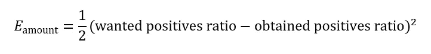

The definition for segment-size-error

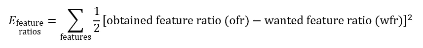

The definition for feature-ratios-error

我们将像一般回归模型一样进行:首先，我们将使用一组权重来计算谁在*G’*中。然后，我们将使用误差导数来更新同一组权重。但是在我们继续之前，让我们考虑一下我们想要处理的数据的结构。正确的功能将有助于加快计算速度，并扩展矢量化的使用，您将在接下来看到这一点。

我们处理了我们的输入数据， *X* ，，以便在其他特征中，它还将包括 *F* 中所有特征的二进制形式，这些特征是我们试图优化分布的特征。例如，特征*年龄*被分成我们关心分布的桶:即*年龄 _18_24* 、*年龄 _25_30* 等……(一热编码)。再比如:特征*性别*被转化为二元特征*是 _ 男*。

为什么我们需要这些二进制特性？因为它们让我们可以很容易地计算出想要的比率，而且很快。假设我们有标签向量 *y* ，那么计算每个特征比率就简化为这种矢量化形式:

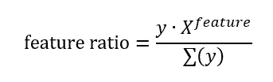

X at feature represents the feature column in X

我们如何得到标签向量， *y* ？类似于逻辑回归模型:

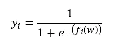

For person i, y is the logistic function applied to f(w)

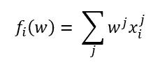

f(w) gives each person a “score” based on his/her features

最后，我们准备好找到我们的重量！

# 计算误差导数

让我们对权重向量 *E_total* w.r.t，**w求导:**

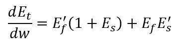

E = Error, t = total, f = feature-ratios, s = segment-size

段大小误差导数真的很简单，这里就不描述了。我仍然想展示特征比误差导数，因为它可以使用我们的二元特征很好地矢量化。根据商法则，特定特征**对所有数据点 *i* 的特征比率误差的导数等于:**

**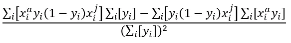**

**如果我们定义:**

**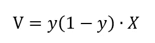**

**我们得到导数(w.r.t 特性 *a* )等于:**

**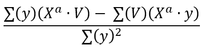**

**The feature-ratio error derivative for specific feature a. The sums are over all data points.**

**这真的很酷，但事实上，这可以进一步矢量化，如果我们用 *X* 替换特征 *a* 处的 *X* 以及我们关心的所有特征 *F* 。**

# **结果**

**所以当我们开始这个项目的时候，我们没有定义一个片段大小的错误。这导致该部分的人数下降了近一半，但比率看起来很大:**

**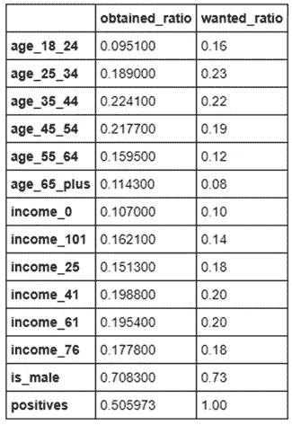**

**The first run of the algorithm, no segment-size error was defined.**

**根据这些结果，我们将片段大小误差添加到特征比率误差，并得到这些数字:**

****

**Too many people, feature-ratios accuracy dropped sharply**

**这显然太咄咄逼人了。最后，我们想出了上面给出的公式，并得到了这些结果，在质量和数量之间找到了一个平衡点:**

**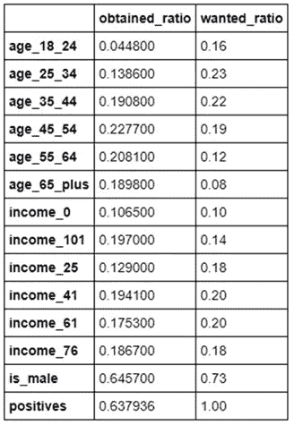**

**所有结果中值得注意的一点是，该算法是如何与年轻人和老年人进行斗争的。我们的数据分布高度偏向老年人，这在结果中可以清楚地看到。但是，嘿，商业人士对我们从扭曲的数据中得到的比率很满意，我们在 **不到一分钟就在 20 万人身上**收敛了！******

**总而言之，我看到初级数据科学家坚持已知和已实现的东西。这显然不坏，但是不要害怕使用你所拥有的工具来解决不重要的问题，它可能会起作用！**