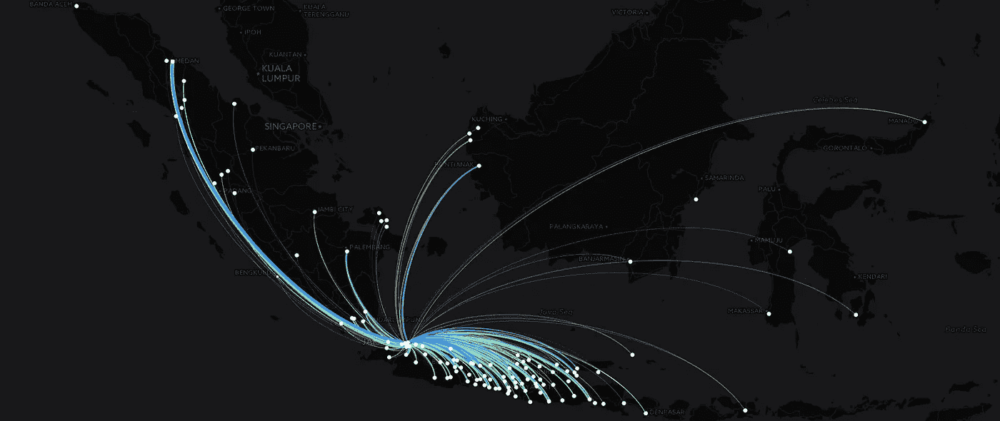
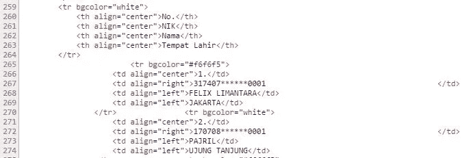
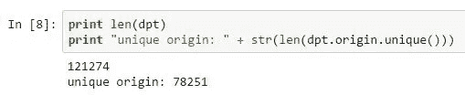
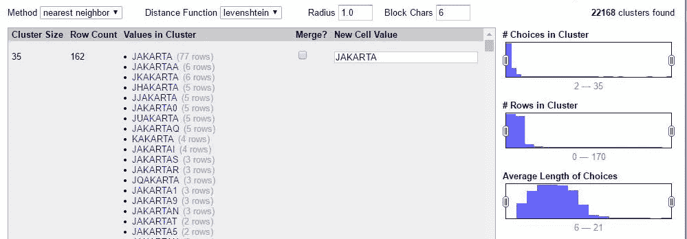
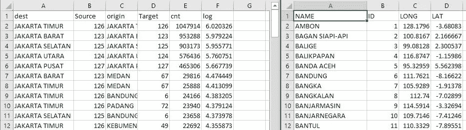
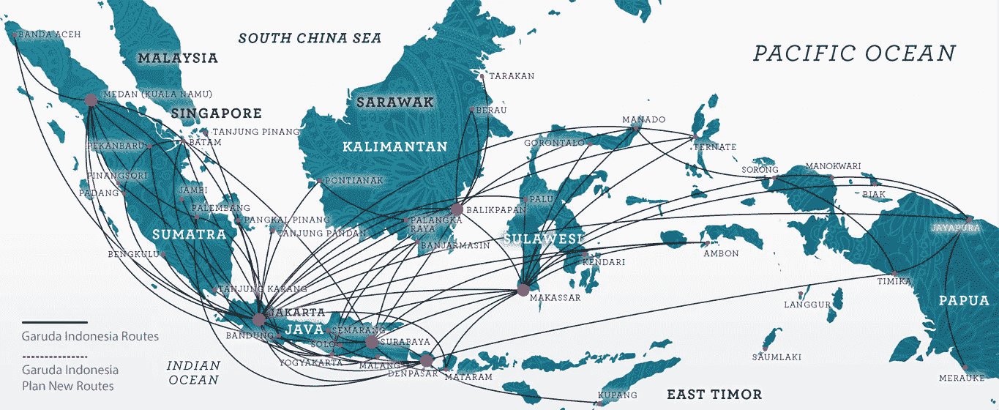
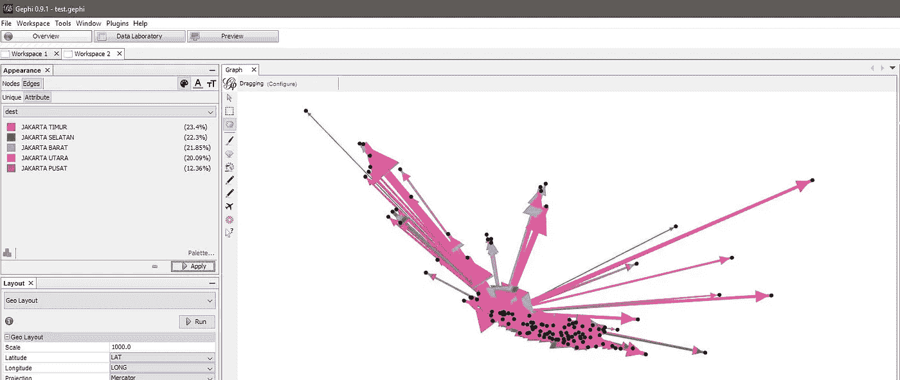

# 贾卡坦的起源

> 原文：<https://towardsdatascience.com/the-origin-of-jakartan-793f721369f6?source=collection_archive---------1----------------------->

## 使用印度尼西亚 2014 年大选数据，免费可视化 700 万人的来源。



这是大约 2014 年贾卡坦的家乡的地图。它仅包括迁移到雅加达的超过 1，000 人的始发城市，线宽与实际人数的对数值成比例，范围从 10 到 10⁶.每种颜色代表它们目前的居住地:雅加达南部、北部、西部、东部或中部。你能猜出哪个颜色代表哪个吗？

## 怎么开始的

故事是这样的，我一直想对印度尼西亚选民名单数据做些什么，原因很简单:

1.  它是巨大的。准确地说，是 188，268，423 个独立选民。我不想用 B 字，因为它不是太大的东西。根据我在餐巾纸背面的计算，整个数据集实际上可以放入一个 50 美元的 USB 闪存盘。然而，对于一个公开可用的数据集来说，这仍然是了不起的！
2.  这是公开的。实际上有点可怕的是，每个选民的名字*和*他们住在哪里(下至村一级)本身可供任何人[在](https://data.kpu.go.id/ss8.php)周围浏览，但如果它已经开放了，为什么不实际使用它，对吗？为了安全起见，我问了我的从事选举工作的非政府组织朋友和选举委员会的一名委员，他们确认名单本身确实是公开的，没有规定如何在选举范围之外使用。
3.  很容易接近。这一次，它不是在一个 PDF 格式的错位影印表格里！



Like, one Chrome Inspector and an overnight Python script away

你可以立即看到，虽然他们的详细地址、性别和年龄没有被列出(这是应该的)，但一个不寻常的变量是:出生地。当然，你可以很容易地从统计局的[印度尼西亚 2010 年人口普查](http://microdata.bps.go.id/mikrodata/index.php/catalog/2/datafile/F1)中得到同样的而且编码更好的东西，他们会很乐意给你一些美元，但是你必须填写一张表格。呀。不，我们就刮刮看能刮多远。

## 欺骗性的简单部分

唯一的问题是，我不知道如何轻松地处理数据，因为整个事情超出了我的笔记本电脑的能力。幸运的是，Google BigQuery 来了！类似于:

```
SELECT KELURAHAN, TEMPATLAHIR, COUNT(*) AS CNT FROM DPTS GROUP BY KELURAHAN, TEMPATLAHIR WHERE PROVINSI = 'DKI JAKARTA'
```

在 15 秒内给了我们这样的东西:


I don’t want to disclose how many times I screwed up the SQL query

然而，与任何数据探索实践一样，它从来没有那么容易。打开 Rstudio 或 ipython 笔记本，你会发现出生地一栏有多少唯一条目的问题:



For the purpose of this post, it looks fancier than R

120，000 分为雅加达的 5 个部分，理想情况下应该产生大约 24，000 个独特的家乡名称，而不是几乎 80，000 个。整个印度尼西亚只有 32 个省，大约 500 个区和 80，000 个村庄。数据本身来源于国家身份数据库，该数据库被认为是生命、宇宙和一切事物的答案。他们用超级昂贵的电脑系统建立了整个银河系中每个印尼人的数据库。不会错的。



But I can be wrong about them.

遗憾的是，在 Open Refine 中打开数据集并运行聚类功能会给你带来坏消息。我几乎能听到程序在我耳边轻声低语，*“我知道这是什么感觉。你无能为力。记住这是计划的一部分。”*

亲爱的善良的人们，你们所看到的是 22，000+串拼写相似的地方中的一个。错别字是真的。实际上，我在选举委员会网站上查看了几十个，只是为了确保这不是我的刮刀在搞怪。**在某个地方，不知何故，一个真正的政府官员在公民身份证中输入了 JQKARTA、JUAKARTA、JAKARTAT 或以上许多变体中的一个，而不是 Jakarta 作为他/她的出生地。**

你可能会认为他们实际上在系统中有下拉菜单而不是文本框。走吧。这是该死的雅加达，不是谷歌地图上的随机标记。它已经在那里叫了 50 年了。

更糟糕的是，构成出生地的并不总是一个城市。该值实际上从一个村庄的名称(没有任何其他地理标志)到一个国家。即使拼写正确，它也可能拼写不同(Singapura 而不是 Singapore)，缩写(Tanjung 变成 Tjg 或 Tj)，或者含糊不清(它是 X 村庄，城市，还是分区？那个省的还是另一个省的？).


all hail r/HighQualityGifs

虽然数据是免费的，但我的时间不是。

## 继续前进

最后，我希望这只是一个数据可视化练习。我要花好几个小时来清理那糟糕透顶的烂摊子。我选择了罪恶的全选，合并选择，然后关闭聚类窗口。我接受了那些相似名字的默认合并。

几分钟过去了，OpenRefine 崩溃了。

我只选择了有 1000 人来自始发地城市的那对，其余的都删掉了。愿数据科学之神原谅我，因为我犯了严重的罪。

我将每一对居住地-家乡配对与我定制的、手工制作的、本地采购的地理编码器进行比对，该编码器的工作是将纬度和经度分配给每个地理区域。我还创建了一个额外的字段，包含人数的对数值，从一百万到一千人不等。经过几次手动编辑，我有了两个节点和边的 CSV 文件。



Aww yiss.

现在让我们把它形象化！我总是对航线图情有独钟。



If only I can afford something beyond zero-mileage promo ticket.

让我们看看这样做是否有意义。启动 [Gephi](https://gephi.org/) ，将节点文件加载到节点数据库，将边文件加载到边数据库。这是一件轻而易举的事。将新创建的日志值指定为边权重。安装 GeoLayout 插件，分配纬度和经度列。单击应用。嘣。



We’re on to something!

现在，将这个漂亮的东西导出到一个制图平台，将其覆盖在一个同样漂亮的底图上，实际上是有意义的。不幸的是，最新版本打破了唯一的 Shapefile 导出插件，该插件自 2013 年以来一直没有更新。好了，剩下唯一要做的事情就是将图片导出为 4000x4000 PNG 格式，并使用盗版照片手动覆盖它…我的意思是，你可以选择免费的图像编辑程序。你完了！

## 但是为什么不把它变成互动的呢

是的，你可以使用 CartoDB 来绘制它，即使是在免费帐户上。上传两个相同的文件，从节点层创建一个新的地图，感谢他们的[便捷教程](http://blog.cartodb.com/jets-and-datelines/)，在 SQL 选项卡上使用它:

```
SELECT a2.cartodb_id,
 a2.name,r.dest,r.cnt,r.origin,r.log,ST_Transform(
 ST_Segmentize(
 ST_Makeline(
 a2.the_geom, 
 a1.the_geom
 )::geography, 
 100000
 )::geometry,
 3857
 ) as the_geom_webmercator
FROM node a1
JOIN edges r ON r.source = a1.id
JOIN node a2 ON r.target = a2.id
```

上面的脚本将从每个城市对创建大圆线。我再次应用了一些额外的样式规则，根据对数值改变线条的粗细，并根据住所区分线条的颜色。现在你可以平移和缩放了！将光标悬停在线上，您可以看到家乡名称以及编号。嵌入的地图可能对你的手机屏幕来说太小了，但是你可以在这里访问全屏版本[。](https://ryanurzha.cartodb.com/viz/778ae306-f929-11e5-a4a7-0e674067d321/public_map)

Things rarely looks bad on CartoDB.

## 最后的想法

老实说，这几千个错别字的事情是个败笔。如果一开始就没有这个疯狂的问题，地图看起来会酷得多。不过，考虑到所有的事情，我认为这仍然是一个有趣的 dataviz 迷你项目，它使用完全免费的软件和服务，从一个用于完全不同目的的数据集开始。

几个月后，数以百万计的贾卡坦人将体验穆迪克，即在开斋节回到家乡的仪式。那些活着的人将再次回到他们出生的地方，他们的家人生活的地方。这不仅仅是一个传统，而是一种逐渐消失的与千里之外的地方的联系，在那里他们曾经开始了漫长的旅程，

曾经被称为家的地方。