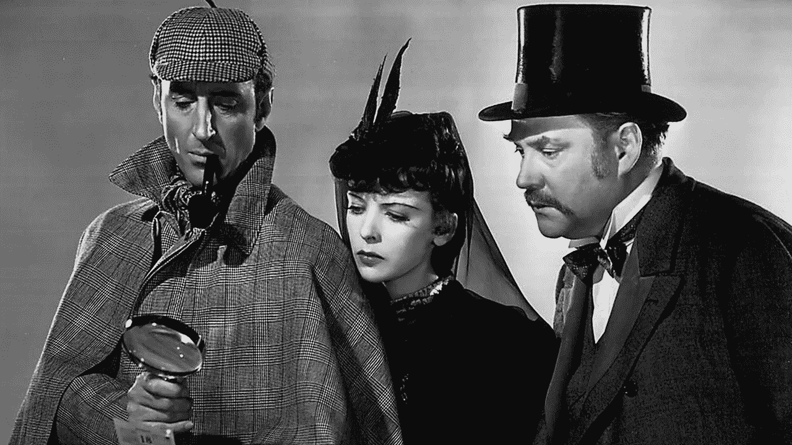
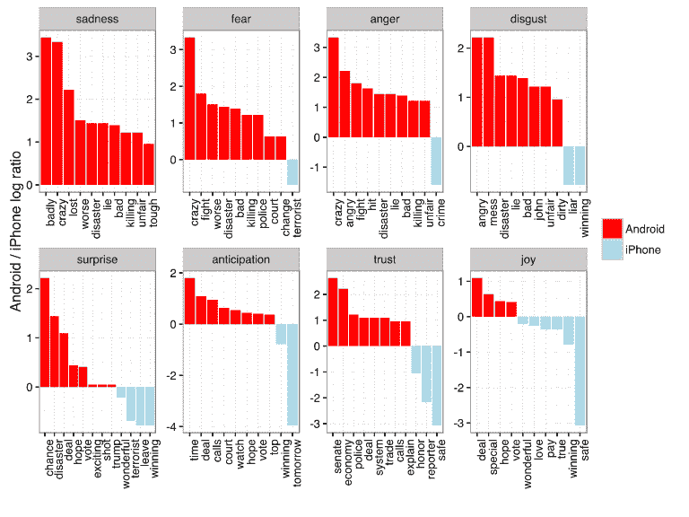

# 数据科学中演绎推理的悖论，以唐纳德·特朗普的推特账户为特色

> 原文：<https://towardsdatascience.com/the-paradox-of-deductive-reason-in-data-science-featuring-donald-trumps-twitter-account-43839d4dda82?source=collection_archive---------3----------------------->

Source: Library of Congress

> “这确实是一个谜，”我说。“你认为这意味着什么？”
> 
> “我还没有数据。在没有数据之前就进行理论化是一个严重的错误。不知不觉中，人们开始扭曲事实以适应理论，而不是让理论适应事实。而是纸条本身。你从中*推断出*什么？”
> 
> ― **亚瑟·柯南道尔**、**福尔摩斯***:**[***波希米亚丑闻***](http://etc.usf.edu/lit2go/32/the-adventures-of-sherlock-holmes/345/adventure-1-a-scandal-in-bohemia/)*

# *演绎的，定义的*

*是的，“演绎”是一个真实的词。这是我们为我们的公司选择的名字。我们选择它是因为它与逻辑和科学方法的理性关联，以及它与一个伟大的虚构侦探的情感联系。*

*但是，在数据科学术语中，这可能是一个糟糕的选择。*

*演绎推理的完整含义——因为它与演绎推理相关——仅代表数据科学中解决问题的三种主要模式之一。其他方法——*归纳*和*溯因*推理——实际上更重要。理解它们揭示了数据科学中的一个悖论，这个悖论与事实的本质、概率以及商业决策所需的举证责任有关。*

# ***演绎推理用事实找事实***

*演绎推理是自上而下的:你从事实开始，形成一个假设，然后用更多的事实进行检验，得出一个不可避免的结论。换句话说，你将事实从一般理论归纳为具体的事实结论。*

*例如，从亚里士多德关于苏格拉底死亡率的著名三段论建模:*

1.  *唐纳德·特朗普有一个个人推特账户*
2.  **唐纳德·特朗普赢得美国总统大选**
3.  *总统从他的个人账户发推文*

*尽管这一论点(以及推文)的可靠性值得怀疑，但它很能说明问题。我们通过还原事实来寻找事实。因此，演绎过程非常适合于结论的确定性至关重要的研究领域。*

*但是演绎法的应用也隐含地受到事实的可获得性和前提的确定性的限制。在数据科学在商业环境中的实际应用中，这可能是一个问题。*

# ***归纳推理利用事实来推断结论***

*当你有一个本身不确定的假设时会发生什么？归纳推理采取自下而上的方法。通过归纳推理，你可以从具体事实中推断出一般理论。在数据科学术语中，你检查一大组数据，以确定你的假设正确的概率。*

1.  **唐纳德·川普的推文来自 iPhones 和安卓设备**
2.  **川普安卓设备上的推文有 40-80%是负面的**
3.  *唐纳德·特朗普在安卓设备上发推特；他的员工使用苹果手机*

*在 2016 年美国总统竞选期间， [Stack Overflow 的大卫·罗宾逊](http://varianceexplained.org/r/trump-tweets/)使用归纳推理(通过情绪分析)来探索他和其他人的直觉:特朗普最夸张的推文直接来自他自己的私人手机，而他更公平的推文来自他的竞选工作人员，主要是在 iphone 上。*

**

*虽然这些发现令人着迷，并且总体上证实了大卫的预感，但这些结论不能被称为*确定的*(即使它们在 2017 年再次被[证实](http://www.thecrosstab.com/2017/03/07/analysing-trump-tweets/))。正如霍姆斯指出的，事实可以被扭曲以符合理论。*

*但是理解一个问题或者做出一个商业决策到底需要多少确定性呢？归纳推理提供可能的结论，而不是确定的事实。*

# ***溯因推理利用事实来推断最可能的解释***

*在数据科学(以及一般的科学)中，有时你不知道你试图解决的问题的确切性质——或者有一套完整的观察来创建一个理论。哲学家认为溯因推理是归纳推理的一种，它推断出最符合可观察事实的假设。*

*换句话说，*当我们找到一个比任何其他选项都更好地解释数据的模型时，这个模型很可能就是正确的模型*。数据科学的这一部分是最具创造性的，需要灵活性和想象力，以及对数据可能误导的敏锐理解。*

*事实上，霍姆斯的许多著名推论实际上都是溯因推理的例子。当他提出一个神秘谋杀案的解决方案时，他利用证据创造一个最符合现有事实的理论。他的才华在于他发现事实和创造理论的能力，而不是他对演绎推理的运用。*

*在这里的[演绎](http://www.deducive.com)，我们从福尔摩斯的创造者那里获得灵感，不要太纠结于演绎、归纳和溯因推理之间的语言和哲学差异。尽管数据科学基于统计学和数学理论，但创造性思维和战略洞察力对做出正确决策更为重要。*