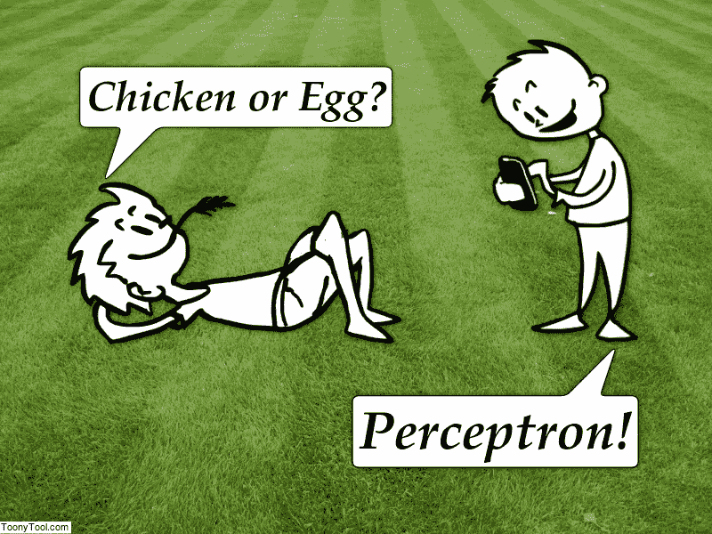
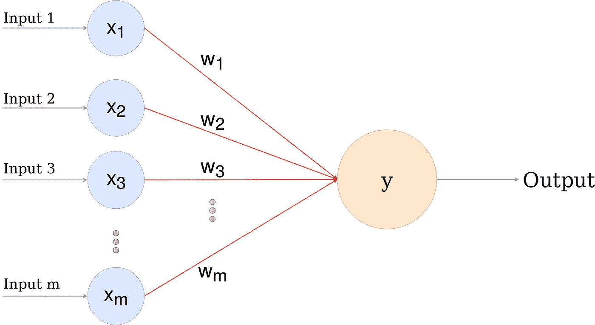
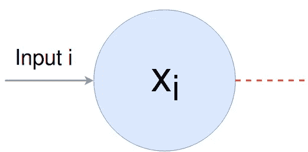
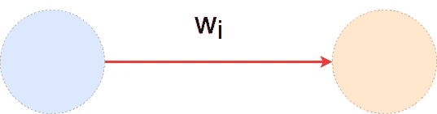
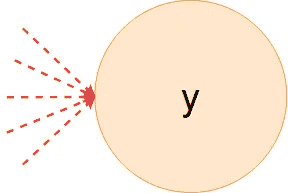
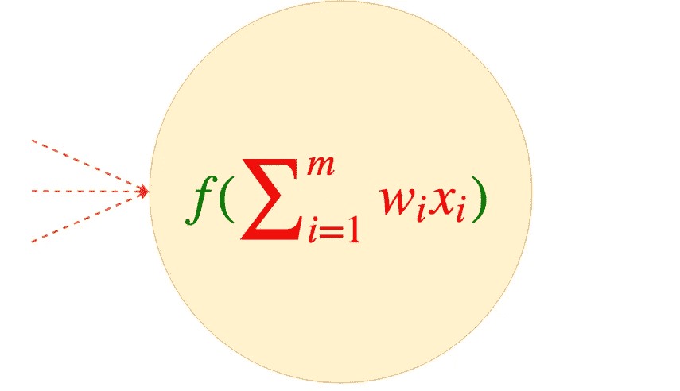
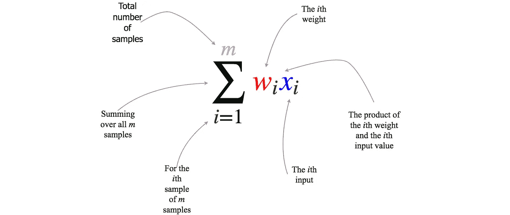
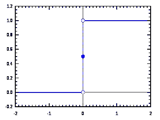

# 感知器

> 原文：<https://towardsdatascience.com/the-perceptron-3af34c84838c?source=collection_archive---------7----------------------->

**Fig 1: Chicken or Egg? | Perceptron!**

感知器最早是由 [***弗兰克·罗森布拉特***](https://en.wikipedia.org/wiki/Frank_Rosenblatt) 提出的。在这篇文章中，我们将看看什么是感知器，以及它如何根据给定的输入进行预测。所以，让我们开始吧！

**感知器是一个单层神经网络**，看起来像这样

**Fig 2: Perceptron**

现在，让我们看看这些节点和连接的含义。

**Fig 3: Input Node**

蓝色节点是 ***输入节点。*** 每个这样的节点代表一个输入问题的特征。在上面的例子中，我们有`m`输入特征。第 I 个输入特征由`x_{i}`表示。这一层叫做 ***输入层*** 。在神经网络中，我们只能有实数作为输入。

**Fig 4: Weights**

然后，红色箭头将输入节点连接到橙色节点。这些被称为突触。这些突触中的每一个都有一个权重，用`w_{i}`表示，即第 I 个突触的权重为*`w_{i}`。我们可以简单地称之为 ***权重层*** 。*

**

***Fig 5: Output node***

*然后，我们有橙色节点，上面写着`y`。是 ***输出节点*** 。它基于*输入*和*权重*计算*分数*，然后基于该分数使用*激活函数*获得*对`0`或`1`的预测*。*

*这就是感知器所做的一切！*

*现在，让我们看看分数是如何精确计算的，以及如何根据输入和权重在输出单元中进行预测。*

**

***Fig 6: Formula to make a prediction from the Inputs and *Weights****

*等式的红色部分简单地越过`m`输入特征，并对输入特征(`x_{i}`)和权重(`w_{i}`)之间的乘积求和。这就是我们如何计算给定输入特征的 ***分数*** 。*

*现在，让我们想象一下我刚才说的等式的红色部分。*

**

***Fig 7: Scores from Inputs***

*好了，现在，为了根据这个计算出的分数做出一个 ***预测*** ，我们必须使用一个 ***激活函数*** 。*

****激活功能？*** *激活函数主要用于在神经网络的每一层中引入网络中的非线性，没有激活函数，无论神经网络有多深，我们都将计算一个线性函数。
在输出层，对于分类问题，我们使用激活函数将分数映射到类别。**

*这里，我们将使用 [***Heaviside step 函数***](https://en.wikipedia.org/wiki/Heaviside_step_function) ，如果分数小于或等于 0，则简单地输出
**0** ，否则输出
**1** 。*

**

*[**Fig 8: Heaviside Step Function**](https://upload.wikimedia.org/wikipedia/commons/thumb/d/d9/Dirac_distribution_CDF.svg/512px-Dirac_distribution_CDF.svg.png)*

*在这种情况下，上图(图 6)中等式`f(...)`的绿色部分是亥维赛阶梯函数。*

*好了，现在如果你有了输入和权重，你就可以用红色方程得到分数，然后用一个激活函数得到预测！*

****注意事项*** :
**1)** 感知器中不存在非线性。所以，它只能计算线性函数(*“直线”*)。
**2)** 还有一个附加的偏置项(用`x_{0}`和`w_{0}`表示)。为了简单起见，我们跳过了这一步。一般带偏置`x_{0} = 1`和`w_{0} = theta`。其中，`theta`是网络学习的某个值。在这篇文章中，我们看到了如何使用感知器进行预测(*正向传播*)，而不是网络如何学习(*反向传播*)。*

*希望这篇文章对你有所帮助，如果有，那么👏 👏 👏！
喜欢我的作品？跟我来。*

*随时给我发消息！我们连线吧！*