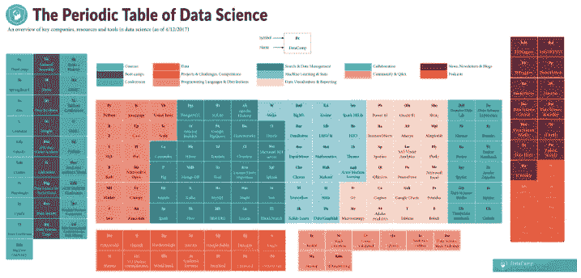

# 数据科学的周期表

> 原文：<https://towardsdatascience.com/the-periodic-table-of-data-science-8387cb44960d?source=collection_archive---------2----------------------->

该周期表可作为导航数据科学领域主要参与者的指南。表中的资源是通过查看数据科学用户的调查选择的，如 O'Reilly 的 [2016 年数据科学薪酬调查](http://www.oreilly.com/data/free/2016-data-science-salary-survey.csp)、 [Gartner 的](http://www.gartner.com/technology/home.jsp)2017 年数据科学平台魔力象限、 [KD Nuggets 2016 年软件民意调查](http://www.kdnuggets.com/2016/06/r-python-top-analytics-data-mining-data-science-software.html)结果，以及其他来源。表中的类别并不都是互斥的。

查看下面的完整数据科学周期表:

你可以在这里找到完整的图片。

# 浏览数据科学的周期表

你会看到表格的左边列出了与教育有关的公司:在这里，你会找到课程、训练营和会议。另一方面，在右侧，您将找到让您了解数据科学社区最新新闻、热门博客和相关材料的资源。在中间，您将找到可以用来开始学习数据科学的工具:您将找到编程语言、项目和挑战、数据可视化工具等。

该表将数据科学资源、工具和公司分为以下 13 类:

**课程:**对于那些想学习数据科学的人来说，有很多网站(公司)提供数据科学课程。你会在这里找到各种可能适合你的学习方式的选项:边做边学的数据营，Coursera 和 Edx 的 MOOCs 等等！

**新兵训练营:**本节包含为那些正在寻找更多指导选项来学习数据科学的人提供的资源。你会看到像数据孵化器[或激励](https://www.thedataincubator.com/)这样的训练营已经包含在内。

会议:学习不是你参加课程或训练营时做的活动。会议是学习者经常忘记的事情，但它们也有助于学习数据科学:作为数据科学的有志之士参加会议很重要，因为你将接触到最新的进展和最好的行业专家。表中列出的一些用户是[用户！](https://user2017.brussels/)、 [Tableau 大会](http://tc17.tableau.com/)和 [PyData](https://pydata.org/) 。

**数据:**熟能生巧，数据科学也是如此。您需要查看和查找数据集，以便开始实践您在现实生活数据课程中学到的知识，或者制作您的数据科学作品集。数据是数据科学的基本组成部分，发现数据可能是最困难的事情之一。当你寻找很酷的数据集时，你可以考虑的一些选项是 [data.world](https://data.world/) 、 [Quandl](https://www.quandl.com/) 和 [Statista](https://www.statista.com/) 。

**项目&挑战、竞赛:**实践之后，你也可以考虑接更大的项目:数据科学作品集、竞赛、挑战等等。你会在数据科学周期表的这一类别中找到所有这些！最受欢迎的选项之一可能是 [Kaggle](http://www.kaggle.com/) ，但 [DrivenData](https://www.drivendata.org/) 或 [DataKind](http://www.datakind.org/) 也值得一试！

**编程语言&分布:**数据科学家一般不只使用一种，而是使用多种编程语言；一些编程语言，如 Python，最近在社区中获得了很大的吸引力，Python 发行版，如 [Anaconda](https://anaconda.org/) ，似乎也找到了数据科学爱好者的道路。

**搜索&数据管理:**这个庞大的类别包含了你可以用来以某种方式搜索和管理数据的所有工具。一方面，你会看到像 [Lucene](https://lucene.apache.org/core/) 这样的搜索库，还有像 [Oracle](https://www.oracle.com/index.html) 这样的关系数据库管理系统。

**机器学习&统计:**这个类别不仅为你提供了机器学习入门库和 Python 等编程语言的统计，还提供了整个平台，如 [Alteryx](http://www.alteryx.com/) 或 [DataRobot](https://www.datarobot.com/) 。

**数据可视化&报告:**在对数据进行分析和建模之后，您可能希望将结果可视化并报告您所研究的内容。你可以利用像 [Shiny](https://shiny.rstudio.com/) 或 [Matplotlib](http://matplotlib.org/) 这样的开源选项来实现这一点，或者全部回到商业选项上，比如 [Qlikview](http://www.qlik.com/us/) 或 [Tableau](http://www.tableau.com/) 。

**协作:**协作是数据科学社区的热门话题。随着你的成长，你也会发现团队合作的需要(即使只是和另外一个人！)在这种情况下，你会想要使用像 Jupyter 这样的笔记本。但是，即使您只是独自工作，如果您刚刚起步，使用 IDE 也会很方便。在这种情况下，可以考虑 [Rodeo](https://www.yhat.com/products/rodeo) 或 [Spyder](https://github.com/spyder-ide) 。

**社区&问&答:**提出问题并求助于社区是你在学习数据科学时可能会经常做的事情之一。如果你不确定在哪里可以找到你的数据科学问题的答案，你可以在诸如 [StackOverflow](http://www.stackoverflow.com/) 、 [Quora](http://www.quora.com/) 、 [Reddit](http://www.reddit.com/) 等网站上找到。

**新闻、时事通讯&博客:**你会发现这个社区正在迅速发展壮大:关注新闻和最新趋势是必要的。像 [Data Science Weekly](https://www.datascienceweekly.org/) 或 [Data Elixir](https://dataelixir.com/) 这样的一般时事通讯，或者像 [Python Weekly](http://www.pythonweekly.com/) 或 [R Weekly](https://rweekly.org/) 这样的特定语言时事通讯，都可以在你的邮箱中提供你每周所需的数据科学信息。但是像 [RBloggers](https://www.r-bloggers.com/) 或 [KD Nuggets](http://www.kdnuggets.com/) 这样的博客网站也值得关注！

播客:最后，但绝对不是最不重要的，是播客。这些在很多方面都很棒，因为你会被介绍给专家面试，比如在[成为一名数据科学家](https://www.becomingadatascientist.com/)或具体的数据科学主题，比如在[数据故事](http://datastori.es/)或[会说话的机器](http://www.thetalkingmachines.com/)！

你在想另一种应该加入元素周期表的资源吗？在下面留下评论告诉我们吧！

*原载于*[*www.datacamp.com*](https://www.datacamp.com/community/blog/data-science-periodic-table)*。*