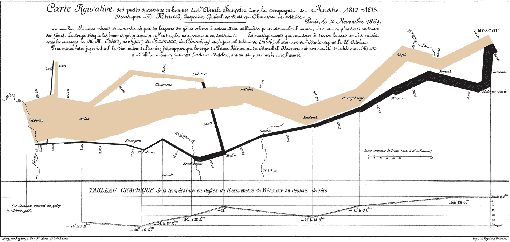
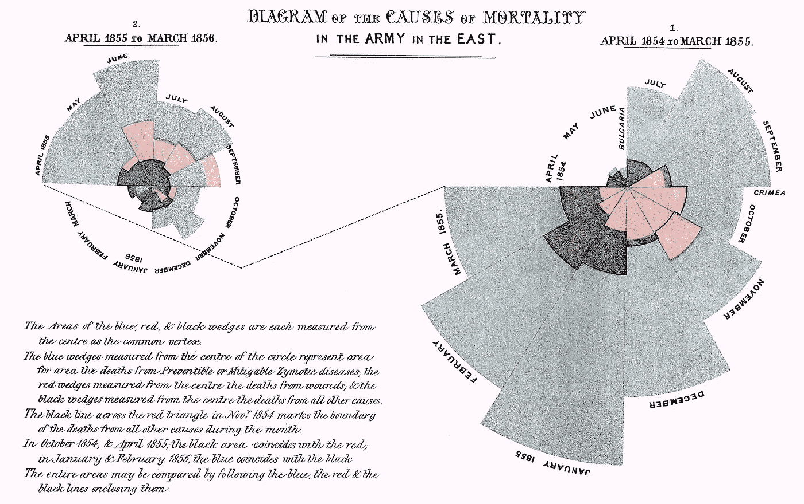
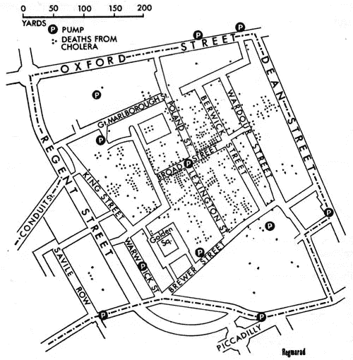

# 数据可视化是如何诞生的

> 原文：<https://towardsdatascience.com/the-pioneers-of-data-visualization-ca58b7dc8013?source=collection_archive---------7----------------------->

## 数据可视化的先驱

[Nicolaes Visscher](https://en.wikipedia.org/wiki/Nicolaes_Visscher_I), *Orbis Terrarum Nova et Accuratissima Tabula*, 1658

回顾人类的历史，我们可以观察到许多情况，在这些情况下，人们找到了可视化地描述和记录他们经历的方法。洞穴壁画描绘了人与兽之间的战斗场景，埃及壁画让我们一窥生活方式和对法老、皇室和其他神灵的崇敬；以及农民生活的挣扎和艰辛。几个世纪后，世界各地的画家、雕塑家和其他艺术家都通过他们的艺术来塑造他们的世界观。

> 我们天生需要描述和解释我们周围的世界

在科学和工程领域，记录你的实验是至关重要的。科学家们也依赖笔记、图画、注释以及后来的图片——几乎任何种类的记录——来支持他们的假设，并推进科学界的集体知识。

在其他情况下，我们希望讲述一个比简单的结果报告更复杂的故事。

在本文中，我想分享并赞美数据可视化先驱们的工作，他们为当今如此流行和广泛的信息图和数据可视化技术铺平了道路。

## 查尔斯·约瑟夫·密纳德

密纳德是一名法国土木工程师，在欧洲多个建筑项目中工作。他对表现数据有敏锐的眼光，特别是在制图方面。

他最著名的视觉叙事作品“信息图”描绘了拿破仑在 1812 年入侵俄罗斯的企图。米纳德在一个单一的表现形式中结合了多种类型的数据:背景是一张地图，但在底部是每个地区记录的温度；拿破仑军队的规模用通往莫斯科的米色区域的宽度表示，用黑色表示他们的返回。还添加了经纬度供参考。

Napoleon’s Invasion of Russia (1812)

在米纳尔的可视化中，最令人印象深刻的是他能够以这样一种方式表示许多复杂的数据点和数据类型，即叙事——从俄罗斯到俄罗斯的艰难旅程——作为图像的焦点保留下来。

你的眼睛直接跳到米色区域，这让你感到好奇，于是你开始寻找它背后的故事。这是当你看其他标记时，比如他们经过的城市的名称，标注在逐渐缩小的边上的数字，或者有一条非常细的黑线代表一支被击败的，技术上被击败的军队的回归。

## 弗罗伦斯·南丁格尔

佛罗伦萨·南丁格尔出生于维多利亚时代的伦敦市中心，是现代护理实践的“母亲”。她也是“南丁格尔誓言”的灵感来源，这是对护士们遵守的希波克拉底誓言的改编。

除了对护理实践的启迪之外，她对统计学的兴趣使她开发了[极区图](https://en.wikipedia.org/wiki/Pie_chart#Polar_area_diagram)。

*Diagram of the causes of mortality in the army in the East* (1854–1855)

Nightingale 的数据可视化用例是她工作的军队医院中死亡原因的表示。在收集了大约两年的数据后，她能够描述由可预防疾病(蓝色)导致的死亡，以及由创伤(红色)和其他未知原因(黑色)导致的死亡。

## 约翰·斯诺

*(* [*)不是那个*](https://en.wikipedia.org/wiki/Jon_Snow_(character)) *！)*

斯诺是英国医生，也是伦敦流行病学会的创始人之一。

在 19 世纪早期，伦敦经历了几次霍乱爆发，摧毁了这座城市。

其中一次爆发发生在 1854 年，约翰·斯诺博士对此进行了密切观察。当时，人们普遍认为这种疾病的传播是由于污染和“糟糕的空气”——瘴气理论。为了更好地了解它的来源以及这种疾病是如何在伦敦人中传播的，斯诺从绘制受影响家庭的地图开始。

Original depiction of the London cholera epidemic of 1854

斯诺博士特别感兴趣的是，当地酿酒厂的工人没有一个表现出这种疾病，而几乎所有其他家庭都受到了影响。通过当地多方询问，他得出结论，这次疫情的源头是水质太差。原来啤酒厂工人喝的啤酒比水多。

在他的地图上查看水泵的位置，我们可以看到，与没有水泵的社区相比，水泵附近的死亡率更高。

在疫情爆发的中心——Broad Street——拆除把手，从而关闭水泵的建议导致疫情得到遏制，总体死亡人数逐渐停滞。

这些先驱和他们同时代人的工作为我们今天所知的数据和信息可视化以及信息图表的广泛使用铺平了道路，这是非常了不起的。

*感谢阅读！*