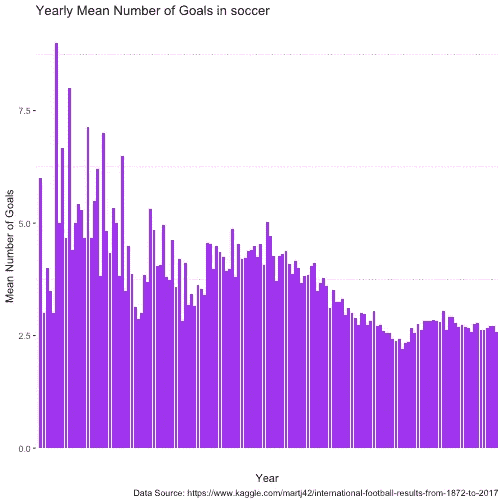
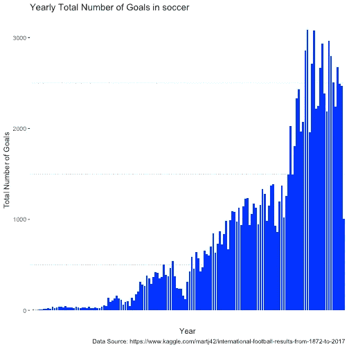
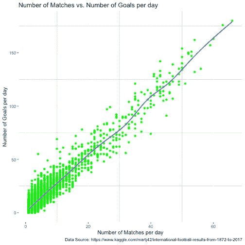
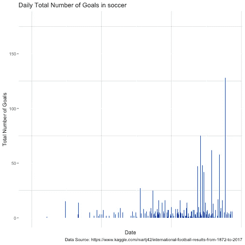
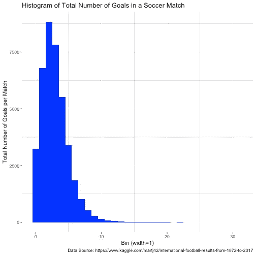
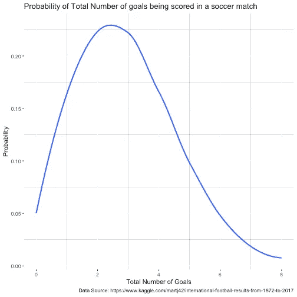

# 泊松分布

> 原文：<https://towardsdatascience.com/the-poisson-distribution-103abfddc312?source=collection_archive---------9----------------------->


Photo by [Tom Grimbert](https://unsplash.com/@tom_grimbert?utm_source=medium&utm_medium=referral) on [Unsplash](https://unsplash.com?utm_source=medium&utm_medium=referral)

前几天在常规通勤中，我听了另一个精彩的线性题外话集，名为[“更好地了解一个分布:泊松分布”](http://lineardigressions.com/episodes/2018/10/21/better-know-a-distribution-the-poisson-distribution)，我认为这将是一个很好的主题，可以用一些代码(R)作为博客帖子来解释。所以现在开始。

根据[维基百科](https://en.wikipedia.org/wiki/Poisson_distribution)的说法，以法国数学家西蒙·丹尼斯·泊松命名的泊松分布是一种离散的概率分布，它表示在固定的时间或空间间隔内发生的给定数量的事件的概率，如果这些事件以已知的恒定速率发生，并且与上次事件发生的时间无关。

让我们理解这到底意味着什么。

# 环境设置

## 打扫

Cleanup

## 加载库

# 数据

在这个练习中，我在寻找国际足联的比赛数据，并使用我们在谷歌[(谷歌数据集搜索)](https://toolbox.google.com/datasetsearch)的朋友提供的最新资源，我发现了这个惊人的数据集[从 1872 年到 2018 年的国际足球结果](https://www.kaggle.com/martj42/international-football-results-from-1872-to-2017)。这是从 1872 年到 2018 年所有足球比赛的数据集，总共 39669 场！
读入。

# 探索

看起来数据是完整和整洁的。一些有趣的观察-

1.  我们有从 1872 年 11 月 30 日到 2018 年 7 月 10 日的数据。喔！
2.  最大 home_score 值 31，最大 away_score 值 21？！一些比赛要看！
3.  大约 25%的比赛是在中立地区进行的。这些都是世界杯比赛吗？

## 让我们生成一些更有趣的特性

# 泊松分布什么时候合适？

随机变量`k`为泊松，需要满足以下 4 个条件[(维基百科)](https://en.wikipedia.org/wiki/Poisson_distribution#Assumptions:_When_is_the_Poisson_distribution_an_appropriate_model?)

1.  `k`是一个事件在一个区间内发生的次数，k 可以取值 0，1，2，…*即* `*k*` *需要是一个整数(与更流行的高斯分布的一个主要区别，这里变量是连续的)。*
2.  一个事件的发生不影响第二个事件发生的概率。也就是说，事件独立发生。
3.  事件发生的速率是恒定的。该比率不能在某些区间更高，而在其他区间更低。
4.  两件事不可能在完全相同的时刻发生；相反，在每个非常小的子间隔，恰好有一个事件发生或不发生。

或者

实际的概率分布是由二项式分布给出的，试验的次数远远大于人们所要求的成功次数。

现在，让我们首先确定我们的`k`和`interval`，看看它们是否满足上述 4 个条件。让我们探索以下 3 个选项-

1.  `k`是目标总数，`interval`是 1 年。
2.  `k`是目标总数，`interval`是 1 天。
3.  `k`是总进球数，`interval`是 1 场比赛。

虽然我们保留了 3 个选项，使得条件 1 和 2 将始终成立，即目标的数量始终是一个整数，并且一个目标与另一个目标相互独立(在大多数情况下)。但是我们将需要探索每个选项的条件 3 和 4。

# 1.`k`是目标总数，`interval`是 1 年



正如我们在上面两个图中所看到的，即使目标的平均数在这些年中保持不变，但每年的目标总数增加了，这违反了我们的条件 3，即它是泊松分布。此外，根据条件 4，试验次数应充分大于成功次数，这在这种情况下也是违反的，因为我们有 147 次试验(即数据集中的年数)和大约 1000 次或更多的成功(即每年的目标总数)。
甚至在逻辑上，我们可以认为，如果一年的比赛次数多了，那么那一年的总进球数就会多，这就违反了条件 3。

基于以上所述，我们还可以假设我们的选项 2(即一天内的总进球数)，虽然与选项 1 相比更接近泊松分布，但它仍然不会，因为一天内更多的比赛数将意味着更多的进球数，这将违反事件发生率需要恒定的条件 3。让我们为选项 2 设想一下。

# 2.`k`是目标总数，`interval`是 1 天



因此，即使成功的次数与试验次数相比相当低(满足条件 4)，事件发生率也不是恒定的，它取决于选项 2 的匹配次数。因此，我们也拒绝将选项 2 作为泊松分布。
让我们最终探索选项 3。

# 3.`k`是总进球数，`interval`是 1 场比赛。



找到了。我们每场比赛的进球数保持不变，峰值约为 3 球，平均每场比赛 2.935642 球。进球数(‘事件’是进球)是一个整数，其中一个进球独立于另一个进球，比赛次数(即尝试次数)远远高于每场比赛的进球数(即成功次数)。因此，我们找到了我们的泊松分布！

# 泊松分布的事件概率

现在我们有了泊松分布，我们可以使用以下公式计算`interval`中发生`k`事件的概率:

*P* ( *k 个事件中的一个区间* ) = e ^{-λ } * λ^{k}/k！其中，
`λ` =每场比赛的平均场次，即每场比赛的平均进球数。
`k` =概率估计的事件数，即目标数，
`e` =欧拉数，
`k!`= k 的阶乘

根据我们上面的探索，我们的平均进球数为 *λ* = 2.935642，我们可以将这个值代入上面的公式，计算一场比赛中任何数量的进球的概率。

举个例子，

*P* (一场比赛进 5 球)=*e*^-2.935642 * 2.935642^5/5！

P (一场比赛进 5 个球)= 0.096786787861

让我们用 R 来计算上面的。

```
## [1] 0.09647199
```

我们看到的值与上面计算的值相同。
我们还可以看到，随着事件数量的增加，即目标数量从 0 增加到 8，概率是如何变化的。



# 摘要

泊松分布的概率计算公式可以成为任何人评估事件发生概率的一个巧妙的小技巧。它还被广泛地用于工业中，例如估计 k 个顾客到达商店的概率以优化资源，或者估计网页已经经历了一些 k 次更新的概率以优化搜索引擎抓取网页的速率。