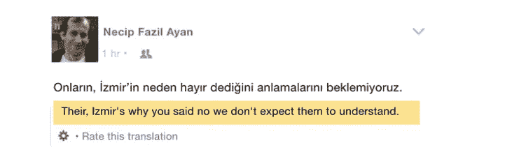

# 人工智能在脸书的力量

> 原文：<https://towardsdatascience.com/the-power-of-artificial-intelligence-across-facebook-c7e074f2d3b?source=collection_archive---------14----------------------->

我们每天都在使用脸书及其提供的各种服务，即使我们没有意识到。

其中一项服务包括自动翻译。在过去的一天里，这些翻译已经用一种新的人工智能机制实现了。

在这个人工智能功能之前，脸书通过一个被称为“神经网络”的网络来处理他们的翻译。这个网络是一个简单的翻译配置机器，但现在已经更新，变得完全先进。

脸书在他们的公司博客中提到:“为使用脸书的 20 亿人创造无缝、高度准确的翻译体验是困难的”…“我们需要同时考虑上下文、俚语、打字错误、缩写和意图。”

这一新的高级功能的优点是简单明了的。旧系统确实为我们自动翻译了，但有时这个句子完全没有意义！

举个例子，

旧:土耳其语到英语

新:土耳其语到英语

你已经可以看到这种进步的好处了！

神经网络几乎总是有可调参数来控制模型的学习速率等事情。选择这些超参数的最佳集合对性能非常有益。

[然而，这对于大规模的机器翻译来说是一个重大挑战，因为每个翻译方向都由一个具有自己的超参数集的唯一模型来表示。由于每个型号的最佳值可能不同，因此我们必须针对生产中的每个系统分别进行调整。](https://code.facebook.com/posts/289921871474277/transitioning-entirely-to-neural-machine-translation/)

[我们在几个月的时间里运行了数千次端到端的翻译实验，利用 **FBLearner Flow 平台**来微调学习速度、注意力类型和总体规模等超参数。这对一些系统产生了重大影响。例如，我们看到，仅基于优化模型超参数，英语到西班牙语的 BLEU 相对提高了 3.7%。](https://code.facebook.com/posts/289921871474277/transitioning-entirely-to-neural-machine-translation/)

完成从旧短语基础到这种新的更现代的神经机器的转换，是脸书国际化之旅的一个转折点。

有关脸书新开发的更多信息，请参见:[https://code . Facebook . com/posts/289921871474277/transitioning-totally-to-neural-machine-translation/](https://code.facebook.com/posts/289921871474277/transitioning-entirely-to-neural-machine-translation/)