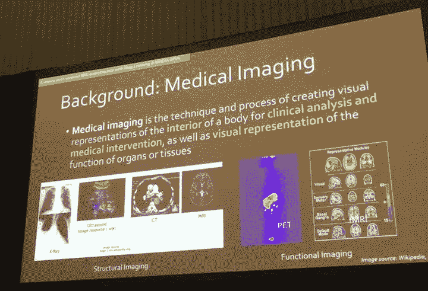
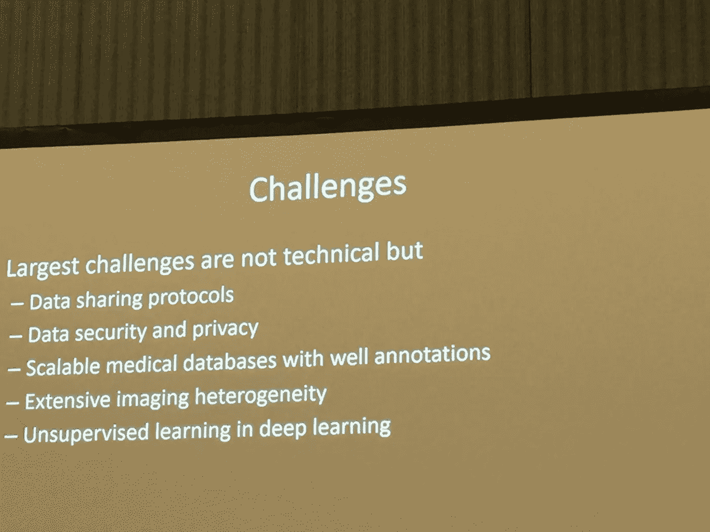
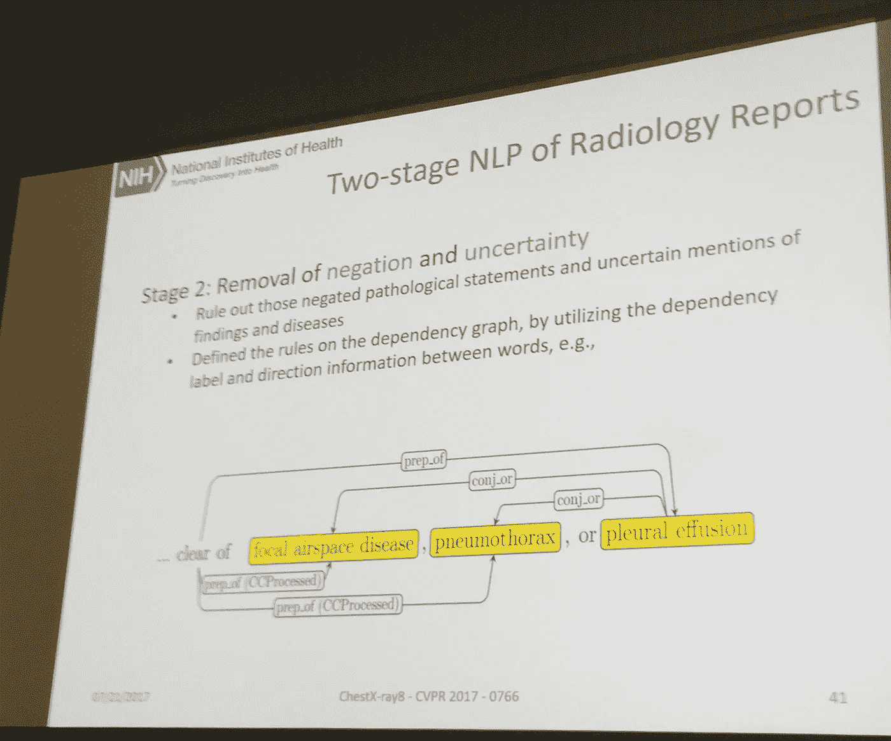
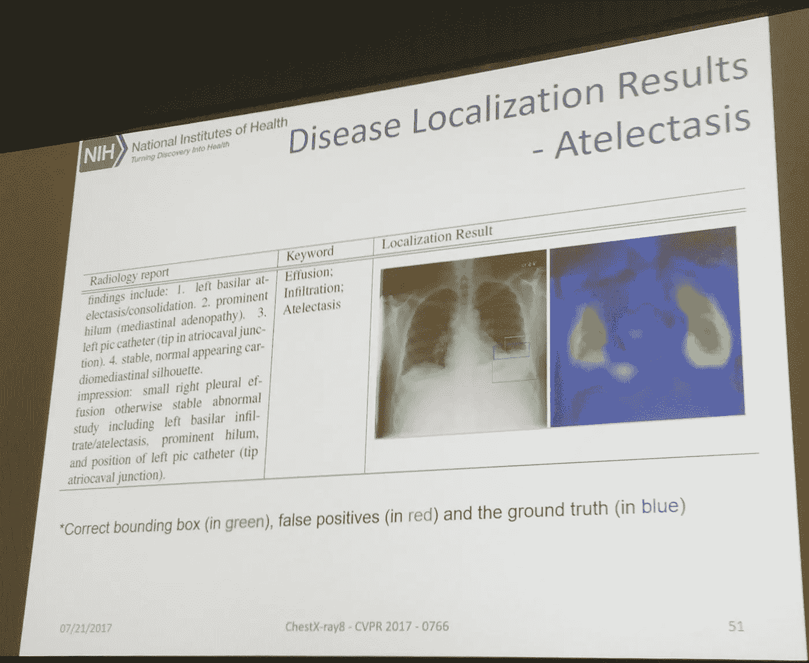
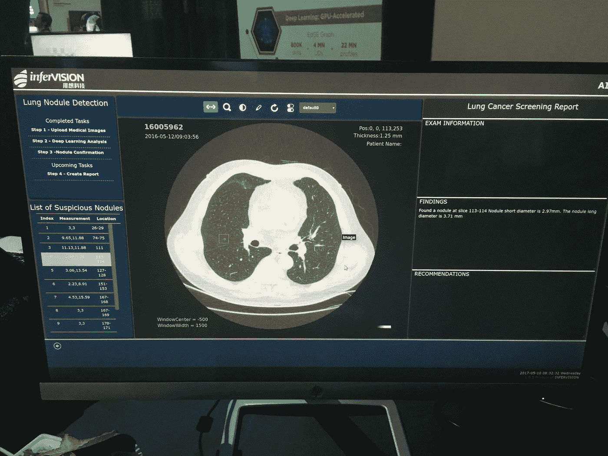
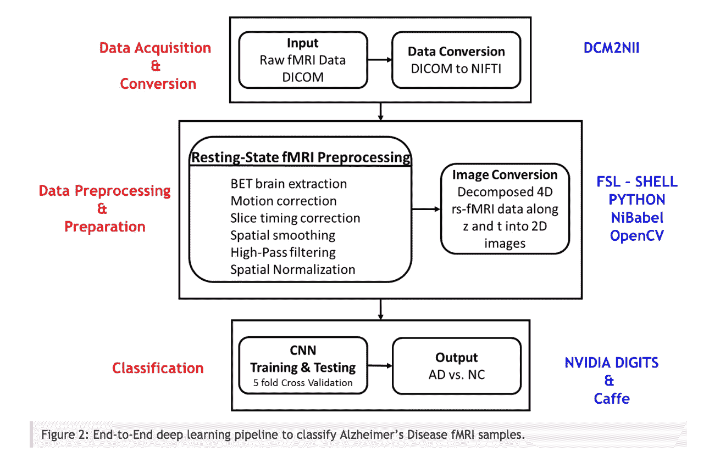
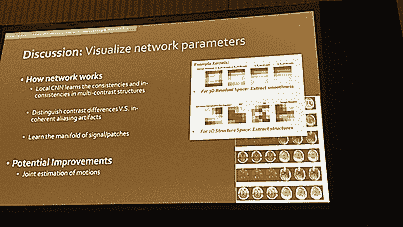
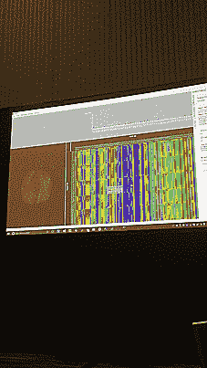
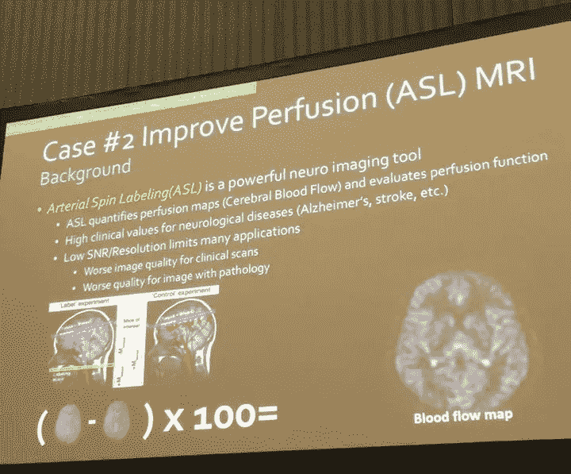

# 2017 年 GPU 技术大会(GTC)上人工智能(AI)、虚拟和增强现实(VR 和 AR)对医学成像的影响

> 原文：<https://towardsdatascience.com/the-power-of-artificial-intelligence-ai-virtual-and-augmented-reality-vr-and-ar-on-medical-4949c7a6fd72?source=collection_archive---------2----------------------->

This slide, like the picture below from InferVision (Chinese startup) are common with Indian and Chinese startups creating new interfaces generating reports (noting AI predictions) on the medical images.

今年的 GTC 组织了一场医疗保健跟踪，致力于人工智能和健康技术之间的应用。许多研讨会专注于使用 Nvidia 硬件、图形处理单元(GPU)应用机器学习算法来预测早期癌症检测的开始，许多会议分析解剖结构中的其他癌症肿瘤，如肺、乳腺和大脑。许多会议分析了大脑功能磁共振成像，特别是作为一种手段，推进对各种神经退行性疾病的研究，如阿尔茨海默病(AD)。

以下是会议的一些快速亮点，以及一些关于虚拟现实(VR)和增强现实(AR)演示的笔记，以及动态用户界面对医学研究技术应用的影响。

研究人员能够从用于查看人体解剖结构的各种扫描仪中获取图像，增强和扩大图像，检测病理，诊断疾病，在某些情况下，甚至可以帮助光谱的另一端，进行如上图所述的治疗和预后。

# 挑战

围绕数据质量(数据大小、注释、数据焦点),一些研讨会表达了与美国国立卫生研究院(NIH)科学家陆乐相同的观点。

> 然而，当通过“谷歌搜索”+众包(ImageNet 就是这样构建的)的传统方式很难获得注释时，无监督的图像分类(即没有地面真实标记)就很少被研究，非常重要，也很困难

“大数据”的传统定义倾向于在对数百万到数十亿用户的分析中讨论。然而，对于在健康、医疗和生物技术领域工作的研究人员来说，数据虽然丰富，但我经常听到这样的评论，即研究人员只限于这么多的数据集，并且局限于少数患者和规模较大的数据集(每个患者多个图像)。

斯坦福大学教授丹尼尔·鲁宾教授研究生课程“生物医学图像分析和解释的计算方法”，他讨论了这种斗争以及对更直观的机器学习(ML)工具的需求，许多了解计算机编程的生物医学研究人员不需要这些工具来加快医学研究的步伐。

同样，斯坦福大学电气工程博士候选人 Enhao Gong 发表了“利用 Nvidia GPUS 支持的深度学习增强多对比 MRI 重建以改善诊断”的演讲，他也有同样的观点。他的工作讨论了 Nvidia GPU 如何将他们的预处理速度提高 4000 倍和 100 倍，以进行推理和 MRI 的整体重建。鉴于大多数研讨会(以及 Nvidia 创始人兼首席执行官黄仁勋)不断重复谈论摩尔定律，生产良好硬件的限制不是我们最大的挑战，而是最大限度地优化从数据到算法和我们创建的应用程序。

点击这里观看黄仁勋的主题演讲[。](https://www.youtube.com/watch?v=6PGIWJIvwzI)

如果数据继续被孤立在特定的医院中(数据集仍然很小)，研究人员和临床医生将更难最大限度地发挥机器学习应用程序在医学成像方面的优势。如下面的幻灯片中所述，数据本身集中在一个特定的感兴趣区域(ROI)(意味着图像的一部分集中在图像中的结节、肿瘤或其他特定区域)，这仍然不够，因为大部分数据可以是给定解剖结构的完整图像。

Slide from Stanford Professor Daniel Rubins’ talk “Deep Learning in Medical Imaging: Opportunities and New Developments”

研究人员提到的医学成像和机器学习的另一个主要挑战是数据质量(高分辨率图像之外)。

陆乐的会议“建立真正大规模的医学图像数据库:深度标签发现和开放式识别”讨论了与许多研究人员和那些在国家范围内工作的人所面临的挑战相比，典型的良好注释的 ImageNet(斯坦福大学教授和计算机视觉先驱费-李非的工作)在大小和规模上的差异。与数百万或数十亿用户不同，患者数据少得多，不到 100，000 人，每人有多张图像(CT 和 MRI)。在这里为 NIH 开源数据集做贡献。

为了更有效地将机器学习应用于医学成像以进行特征提取，在缺乏临床医生对数据集的注释的情况下，需要进行标记。在 Lu 的会议中，他讨论了他如何建立一个以胸部 x 射线(肺癌)为重点的大规模数据集，采用放射科医生预定义的常见疾病模式的数据标签，为每幅图像生成一份报告，从而实现疾病的自动检测/分类和疾病定位。下图显示了陆的应用程序中的自然语言处理和报告生成，以及另一家初创公司世博大厅的 Infervision。

This slide, like the picture below from InferVision (Chinese startup) are common with Indian and Chinese startups creating new interfaces generating reports (noting AI predictions) on the medical images.

At the GTC Expo, Chinese startup Infervision’s user interface displaying a medical report on MRI [https://techcrunch.com/2017/05/08/chinese-startup-infervision-emerges-from-stealth-with-an-ai-tool-for-diagnosing-lung-cancer/](https://techcrunch.com/2017/05/08/chinese-startup-infervision-emerges-from-stealth-with-an-ai-tool-for-diagnosing-lung-cancer/)

虽然报告生成很好(正如在 GTC 世博会、Infervision 和陆乐的演讲中看到的那样)，但其中一些数据分析仍然有限，这就是为什么即使是放射科医生创建的虚拟现实工具(我将在本文结尾讨论)也试图通过沉浸式地查看他们的数据来改变研究人员的工作流程，就像 3D [可探索的解释](http://explorableexplanations.com)。

# 英伟达的软件框架:数字

工程师兼研究员 Saman Sarraf 还介绍了他在深度 AD(深度阿尔茨海默病)方面的工作，内容是如何使用 Nvidia 数字进行高精度预测。你可以在 Saman 的 IEEE 论文[这里](http://biorxiv.org/content/early/2017/01/14/070441)和 [Nvidia 博客](https://devblogs.nvidia.com/parallelforall/nvidia-digits-alzheimers-disease-prediction/#.WH7_9C6Lcvs.twitter)上读到更多。

这是一个信息架构，概述了放射科医生开始分析患者数据的过程(在数据准备和预处理上花费了大量时间)。

From Nvidia blog: [https://devblogs.nvidia.com/parallelforall/nvidia-digits-alzheimers-disease-prediction/#.WH7_9C6Lcvs.twitter](https://devblogs.nvidia.com/parallelforall/nvidia-digits-alzheimers-disease-prediction/#.WH7_9C6Lcvs.twitter)

Sarraf 的工作是，像我参加的处理图像的许多其他会议一样，在卷积神经网络(CNN)模型上进行训练，并产生可以帮助研究人员的图像分类。

这里有一个来自龚恩浩工作室的视频，它解释了 CNN，在某种程度上，它将类似的技术可视化，以平滑图像并进行特征提取。

除了大多数关于神经网络的演讲侧重于监督学习和图像分类之外，我参加的最有趣的会议之一，Robert Zigon 关于“神经成像基因组学中的 GPU 数据挖掘”的演讲展示了机器学习、生物信息学、生物统计学和神经学的交叉，他分析了 MRI 体素的属性和阿尔茨海默氏症患者 DNA 序列中的单核苷酸多态性(SNP)之间的相关性。用户界面(UI)热图高度概括了来自 MRI 的灰质密度和 SNP 基因型之间的关系。当用户悬停在大脑的每个片段上时，能够实时地看到大脑，并且逐个体素地看到与它的每个部分相关的 SNP。

# 其他相关研究

很像 Enhao Gong 提出的专注于解剖结构图像重建的用例，他讨论了动脉自旋标记(ASL)以量化灌注图(脑血流)，我很高兴地发现，在 Nvidia 提出的“使用 R 和 MXNet 进行医学图像分析的深度学习”期间，一项推动心脏病研究的培训利用 fMRI 数据来测量大脑中的血流。这个研讨会展示了亚马逊的深度学习框架 MXNet，用于训练 CNN 从体积 MRI 数据的时间序列中推断人类心脏左心室的体积。虽然不是专注于神经退行性脑部疾病，但该研讨会展示了如何将不同类型的机器学习算法应用于其他类型的医学成像，从而推动其他领域的医学研究，这是一种更全面的方法，涉及到将人体作为一个整体来考虑，而不是将单个器官或解剖结构与其他部分分离开来进行研究。

# 虚拟和增强现实演示

我尝试过的最好的虚拟现实演示之一来自一家瑞士公司，虚拟放射学让我想起了多伦多大学的工作，只有高分辨率，彩色的。看这里的[视频](https://www.youtube.com/watch?v=1hfXyC1IeH0&t=106s)多伦多大学的 demo (TVASurg 医学成像 VR 模块)黑白 MRI。

虚拟放射科首席执行官 Christof von Waldkirch 是一名受过培训的放射科医生，他展示了研究人员如何对图像进行切片和调整。对我来说，这无疑是我在 HTC Vive 的 healthtech space 上看到的最好的 VR 演示之一。

See the video of me here participating in their demo.

这是一个视频(特写)和更高分辨率的演示我做的。

尽管再次强调，虚拟现实、AR 的沉浸式新兴技术并不专注于脑成像，但它们正在以新的不同方式与健康技术和人工智能交叉。与我交谈过的许多在场的研究人员一样，虚拟放射学的联合创始人(以及我自己)在图像处理方面都遇到了同样的问题，在降低 MRI 的噪声(图像清晰度)方面遇到了困难，并且在发现任何数据洞察力之前，采取除平滑之外的不同方法是数据准备管道的很大一部分。

Y Combinator 支持的增强现实公司 [Meta](http://metavision.com) ，其首席技术官 Karri Pulli(前 Nvidia 研究员)在 GTC 期间简要介绍了 Spatial OS 和 [Meta 的 AR 设计指南](https://blog.metavision.com/introducing-meta-augmented-reality-design-guidelines)，Meta 的首席执行官 Meron Gribetz 在 GTC 第三天在[斯坦福的图像系统工程(科学)中心增强现实研讨会](https://scien.stanford.edu/index.php/workshop-on-augmented-and-mixed-reality/)上介绍了 AR 演示。

Meta 的设计基于神经科学。Gribetz 引用了 Dwight J. Kravitz 在 2011 年的开创性工作，指出人类在过去 50 年的计算中只参与了这两个视觉系统中的一个(背侧通路相对于腹侧通路)。传统的非直观的平面用户 2D 界面已经把我们的思维和交互限制在了屏幕(手机、桌面等)的范围内。)并且没有优化腹侧通路的使用，该腹侧通路理解与空间关系相关的物体，而增强现实有潜力做到这一点。他解释了人类在与我们创造的一些有限的图形用户界面(GUI)(如命令行)交互时，如何只锻炼大脑的特定区域。

> “大脑中解析符号信息和语言的部分，这些区域代表了大脑相当小的一部分，我们单独使用它们。随着我们锁定多个皮层模块，随着你越来越多地与大脑互动，你在零学习曲线的情况下接近这条渐近线，计算范式将像整个操作系统中的‘缩放’。”

格里贝茨简短地演示了 Glassbrain，这是一个大脑的交互式 3D 对象，并解释了亚当·加扎利·UCSF 教授实验室如何表现白质束。他在独奏一个鼓时，使用了感恩而死鼓手的脑电图扫描。他们在 DTI(扩散张量成像)上覆盖颜色来创造它。这是在 GTC 第三天的斯坦福增强现实研讨会上。请看下面的 YouTube 视频。

他提到了发现大脑中 F4 的 Leonard Fogassi，大脑可以创建你正在触摸的物体的深度图，以及你的手在物体附近的位置。

> “当我在这个大脑周围移动我的手时，我正在我的脑海中创建这个物体的内部 3D 模型。如果说外周神经系统的任何一部分，手掌拥有最高的神经元凝结度。如果我们直接接触全息图，我们有最高的自由度和控制精度。我们更深刻地理解物体，为什么我们这样做。这就是为什么我们提倡不要使用控制器或鼠标，因为它们会将两个 x-y 平面彼此分开，只会使您进一步远离这种微调多自由度控制。”

由于 Glassbrain 和虚拟放射学的高分辨率、彩色和交互式图形用户界面只是概念证明的开始，它展示了我们如何开始重新思考医学研究人员如何超越简单、黑白、平面设计或单调的报告与他们的用户界面进行交互，以让我们的思维流动。

# 结尾注释

自近年来人工智能爆发以来，医学成像和机器学习领域已经走过了漫长的道路，仍然在与各种挑战作斗争，其中许多挑战都是非技术性的，与数据收集和数据质量有更多的关系。在当前的 2D 界面上使用人工智能(在 VR 和 AR 之外的大多数讨论中占主导地位)与创建更多开源软件(工具)、开放数据以及直观用户界面(VR 和 AR)之间的融合，医学研究可以通过人工智能推进。VR 中的虚拟放射学和 AR 中的 Meta 只是查看医学成像(即使没有大量人工智能)如何改变用户界面以创建新的分析范式的几个例子。我很高兴看到这些新兴学科之间的新交叉可以进一步推动医疗技术的研究。