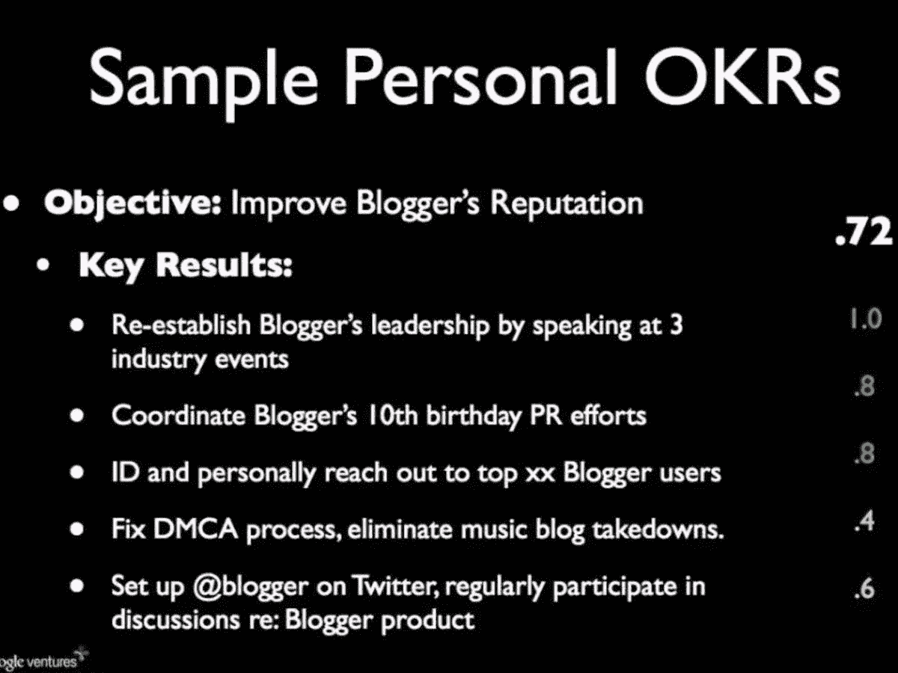
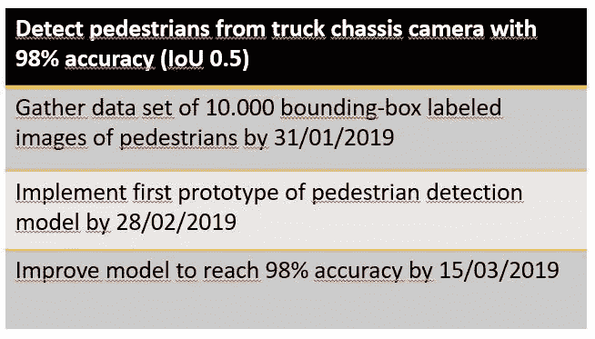

# 数据科学中设定目标的力量

> 原文：<https://towardsdatascience.com/the-power-of-goal-setting-for-your-data-science-project-9338bf475abd?source=collection_archive---------7----------------------->

## [人工智能项目管理](https://towardsdatascience.com/tagged/project-management-ai)

## 使用谷歌的目标设定方法 OKRs 来设定你的数据科学项目取得成功

T2[奥格尔](https://rework.withgoogle.com/guides/set-goals-with-okrs/steps/introduction/)深知设定目标的力量。2004 年，早期投资者约翰·杜尔登向这家年轻的公司介绍了“目标和关键成果”(OKRs)。随之而来的是一个奇迹般的增长和创新的故事。长期担任谷歌首席执行官的拉里·佩奇认为，OKRs 对公司的成功产生了重大影响。谷歌并不孤单——亚马逊、Zalando 和英特尔至今仍在使用 OKRs。

Photo by [Annie Spratt](https://unsplash.com/photos/t3IYuQZRDNE?utm_source=unsplash&utm_medium=referral&utm_content=creditCopyText) on [Unsplash](https://unsplash.com/search/photos/bow-aim?utm_source=unsplash&utm_medium=referral&utm_content=creditCopyText)

首先，这篇文章解释了 OKRs 是如何工作的。其次，它旨在说服数据科学家使用 OKRs 来指导他们的项目。数据科学家经常会陷入持久的研究或优化价值较低的指标。结果，浪费了时间和资源，危及了成功的交付。OKRs 提供战略指导和可测量性，帮助您实现项目目标。

内容基于著名风险投资家约翰·杜尔登的著作《[衡量什么是重要的](https://smile.amazon.com/Measure-What-Matters-Google-Foundation/dp/0525536221/ref=sr_1_2?ie=UTF8&qid=1538399686&sr=8-2&keywords=measure+what+matters)》和个人对 OKRs 的体验。让我们学习。📗

# 设定目标的力量

> "正确设定的目标已经成功了一半."——金克拉

设定目标可以说是启动任何项目最重要的一步。虽然研究还不清楚正确设定目标的好处，但我们可以推断出它的优点和缺点。如果我们没有明确的目标，员工就无法合作，行动也不一致，我们也不知道是否达到了目标。简而言之，浩劫迫在眉睫。

Photo by [Patrick Fore](https://unsplash.com/photos/DVpn-Ot0fV4?utm_source=unsplash&utm_medium=referral&utm_content=creditCopyText) on [Unsplash](https://unsplash.com/search/photos/goal?utm_source=unsplash&utm_medium=referral&utm_content=creditCopyText)

因此，每个数据科学项目都旨在实现一个目标。目标的广度可能有所不同，从研究一个新模型到创建一个改进现有系统的原型。即便如此，准确的目标设定对于数据科学项目来说也是至关重要的。数据科学项目非常适合精确的目标设定，因为我们可以将模型的结果与所需的指标进行比较。

让我们探索由英特尔首创、谷歌完善的目标设定方法——OKRs。

# 目标和主要成果

O 目标和关键成果是一种透明地调整资源并对其进行优先排序以实现共同目标的方法。这种方法是由英特尔[传奇人物](http://fortune.com/2016/03/21/andy-grove-fortune-classic/)首席执行官安迪·格罗夫在 20 世纪 80 年代创立的。OKRs 可以在公司、团队、项目或个人层面上被企业和组织使用。okr 被广泛用于在硅谷和欧洲的公司间协调战略计划。

Photo by [rawpixel](https://unsplash.com/photos/0GgjQAhKzVE?utm_source=unsplash&utm_medium=referral&utm_content=creditCopyText) on [Unsplash](https://unsplash.com/search/photos/bow-aim?utm_source=unsplash&utm_medium=referral&utm_content=creditCopyText)

okr 在项目开始时制定，并定义最终目标。下面是 [Rick Klau](https://www.atiim.com/google-okr-objectives-key-results-video-transcript/) 的个人简历，他在被谷歌收购后在 Blogger 工作:

您可以看到，Rick 宣布的目标是“提高 Blogger 的声誉”以及可衡量的关键结果。在每个季度末，这些关键结果被从 0 到 1 分级。

**目标**是*【什么】*。项目的目标是什么？他们…

*   表达目标和意图
*   既激进又现实
*   是有形的、客观的和明确的。一个理性的观察者能够判断目标是否达到
*   在以下情况下为公司提供明确的价值

**关键结果**是*“如何”*。我们如何达到项目目标？他们…

*   表达可衡量的里程碑
*   描述结果，而不是活动。“请教”或“帮助”是 OKR 的弱项。关注这项活动如何帮助实现目标。
*   包括完成的证据

# OKR 超级大国

根据约翰·杜尔登的说法，OKR 框架提供了四个不同的超级大国。

OKRs **透明地将员工的工作与**承诺的**目标结合起来。okr 是可衡量的**，在每个季度末进行评估。当达到 70%的关键结果时，okr 就是成功的。这促使员工树立远大目标。

接下来，让我们探索如何将 OKRs 的力量用于数据科学项目。

# 将 OKRs 应用到您的数据科学项目中

著名的人工智能先驱 ndrew Ng 在他的深度学习专业中教导说，每个数据科学项目都应该从定义一个可衡量的指标开始。该项目的目标是实现这一指标。这个目标指导你的项目的行动。

Photo by [rawpixel](https://unsplash.com/photos/0GgjQAhKzVE?utm_source=unsplash&utm_medium=referral&utm_content=creditCopyText) on [Unsplash](https://unsplash.com/search/photos/bow-aim?utm_source=unsplash&utm_medium=referral&utm_content=creditCopyText)

准确性、精确度和召回率或 F1 分数等指标是常见的数据科学指标。根据您的业务案例，每个指标都有明显的优势和劣势。当数据集高度不平衡时，精确度可能不是最佳指标。你会将你的算法与人类水平的性能进行比较吗？检测速度有多重要？

选择最有意义的指标来定义你是否已经解决了业务案例。分析每个指标的利弊超出了本文的范围，但是您可以在这里阅读更多相关内容。定义关键指标将阻止您在应该创建原型时进行研究，或者在已经达到指标时继续解决问题。

定义关键指标后，我们离定义数据科学 OKRs 更近了一步。在许多项目中，关键指标是目标的一部分是有意义的。它显示了我们想去的地方。接下来，我们需要定义关键结果来显示如何达到目标。

假设你在汽车行业工作。您发现需要检测城市环境中的行人，以警告卡车司机。您决定为卡车开发一个驾驶员辅助功能，以准确识别行人。卡车底盘抖动严重，因此一般的行人检测模型不能很好地工作。团队一致认为，第一季度 98%的检测率是一个合适的延伸目标。

接下来，您决定需要一个至少包含 10.000 个标记图像的数据集。你需要时间来做研究和实现第一个原型。最后，你需要时间和资源来迭代，直到你达到目标。让我们把信息转换成 OKRs。

这些 okr 指导您下一季度的行人检测项目工作。你在最后回顾你的 okr。你实现了你的主要目标了吗？如果你错过了他们，为什么？

将 OKR 方法应用到您的数据科学项目中，将使您保持成功的项目交付。

# 关键要点

*   OKRs 允许你调整和优先化你的工作，设定延伸目标和跟踪你的进展
*   通过设置正确的指标和 OKRs 开始每个数据科学项目
*   不断衡量你达到 OKRs 的进度

每个数据科学项目都是不同的。然而，所有的项目都是从设定目标开始的。通过使用 OKRs，让您的数据科学项目取得成功。🎯