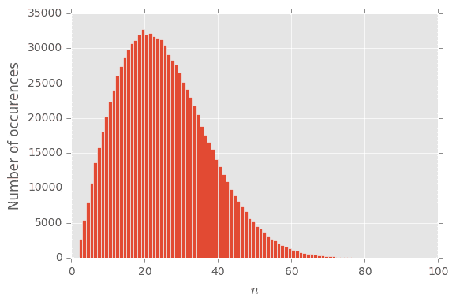
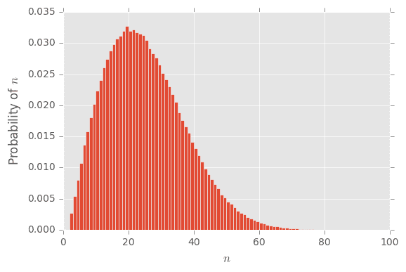
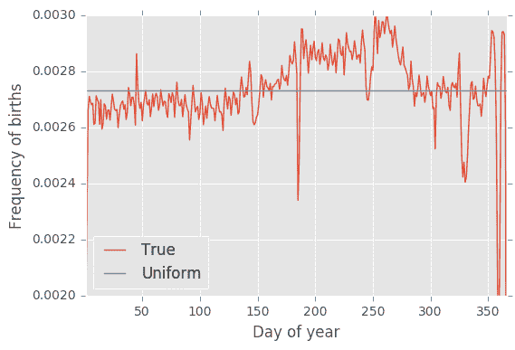
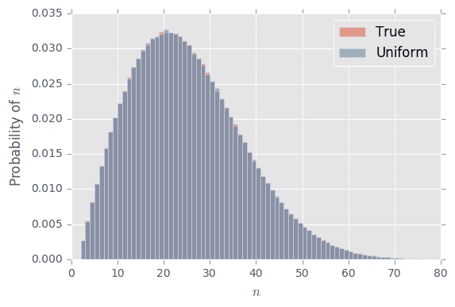

# 模拟的力量:生日悖论

> 原文：<https://towardsdatascience.com/the-power-of-simulation-birthday-paradox-29677ca5e145?source=collection_archive---------0----------------------->

[生日悖论](https://en.wikipedia.org/wiki/Birthday_problem)是这样的……*在一个有* ***23*** *人的房间里，他们中的两个人有 50%的机会在同一天过生日*。

好的，引入一个悖论的第一步是解释为什么它是一个悖论。有人可能认为，对于每个人来说，都有 1/365 的机会让另一个人和他们同一天生日。事实上，我能想到的和我同一天生日的人只有一个，他是我的双胞胎兄弟！既然我遇到的远远不止 **23** 人，这怎么可能是真的呢？

这个推理有几个原因是有缺陷的，第一个原因是这个问题不是问房间里是否有另一个人有特定的生日——任何一对人(或者更多！)可以共享一个生日来增加陈述为真的几率。

完整的答案很难计算，但是我想告诉你如何通过模拟实验来说服自己这是真的。模拟是对计算机或模型进行编程，使其表现得就像真实发生的事情一样。通常情况下，你这样做是为了让模拟的花费比实际的花费少得多。例如，将模型飞机机翼放在风洞中就是一种模拟。我用一种叫做 [Python](https://www.python.org/) 的计算机编程语言模拟了生日悖论，这篇文章可以在这里的笔记本式[中找到。的确，这比和 23 个人在一个房间里要容易得多。](https://gist.github.com/csferrie/0de0a8f531e6507cf5c98332765275b4)

下面我将*而不是*展示代码(同样，这里的[已经结束了](https://gist.github.com/csferrie/0de0a8f531e6507cf5c98332765275b4))，但是我将描述模拟是如何工作的，并展示结果。

# 模拟

打电话给我们需要问的人数，才能得到重复的生日。这就是所谓的[随机变量](https://en.wikipedia.org/wiki/Random_variable)，因为它的值是未知的，并且可能会由于我们无法控制的条件而改变(比如谁碰巧在房间里)。

现在我们模拟一个实验，实现如下的 *n* 值。

1.  随便选一个人，问他们的生日。
2.  看看别人是否已经给了你答案。
3.  重复步骤 1 和 2，直到生日被重复两次。
4.  数一数被询问的人数，称之为。

进入步骤 4 构成了一个单独的实验。出来的数字可能是 *n = 2* 或者 *n = 100* 。这完全取决于谁在房间里。所以我们重复所有的步骤很多很多次，看看数字是如何下降的。我们重复的次数越多，我们获得的数据就越多，我们对正在发生的事情的理解就越好。

这是我们运行这个实验一百万次后的样子。

模拟生日悖论。横轴是 *n* ，在找到重复的生日之前我们需要询问的人数。我们做了一百万次实验，并记录了结果。

那么这些数字意味着什么呢？好吧，让我们看看发生了多少次 *n = 2* 比如。在这一百万次试验中，结果 2 出现了 2679 次，相对来说是 0.2679%。请注意，这接近 1/365 ≈ 0.274%，这是意料之中的，因为第二个人与第一个人具有相同的概率正好是 1/365。所以每一次出现的次数除以一百万，大概就是我们在一次实验中看到这个数字的概率。

然后我们可以绘制同样的数据，考虑到纵轴是在重复生日之前需要见 *n* 个人的概率。

与之前的图相同，但现在每个柱都被解释为一个概率。

将每个条形的值相加，总和为 100%。这是因为当我们做实验时，其中一个值必须出现。好，现在我们可以把这些概率加起来，从 *n = 2* 开始，一直加到 50%。从视觉上看，是这个数字将上面的彩色区域分成了两个相等的部分。这个数字就是我们有 50%的机会重复过生日所需要遇到的人数。你能猜到会是什么吗？

鼓声… **23** ！Tada！模拟的生日悖论，模拟解决！

# 但是，等等！还有更多。

那些闰年的宝宝呢？其实生日平均分布的假设不是错的吗？如果我们真的在现实生活中尝试这个实验，我们会得到 **23** 或其他数字吗？

令人高兴的是，我们可以用真实数据来检验这个假设！至少对于美国的新生儿来说，你可以在 fivethirteight 的 github 页面找到数据。这是实际的分布情况。

1994 年至 2014 年美国出生人口分布，按年份分。

也许用眼睛看起来不太均匀。你可以清楚地看到 12 月 25 日和 12 月 31 日有巨大的下降。关于这一点已经写了很多，也有很多美丽的视觉效果。但是，我们的问题是这是否对生日悖论有影响。举例来说，也许没有多少人出生在 12 月 25 日这一事实意味着很容易在剩下的日子里找到同一个生日。让我们通过用生日的真实分布模拟实验来检验这个假设。

为此，我们执行与上面相同的 4 个步骤，但是从生日的实际分布中随机抽取答案。另外一百万次实验的结果绘制如下。

模拟出生人口真实分布的生日悖论。横轴是 n，在找到重复的生日之前我们需要询问的人数。我们做了一百万次实验，并记录了结果。

而且答案是一样的！生日悖论在生日的实际分布中依然存在。

# 书呆子狙击

上述讨论很好地证明了生日悖论对于出生的实际分布是稳健的。但是，这并不构成数学上的*证明*。一个实验只能提供*证据*。所以我将以一个技术性的问题来结束这篇文章，这个问题是给那些数学迷们的。(我接下来要做的也叫[书呆子狙击](https://xkcd.com/356/)。)

[Nerd Sniping](https://xkcd.com/356/)

这里有一个广泛的问题:量化上述观察。我觉得这里不止一个问题。例如，应该可以将 50–50 阈值限制为与均匀分布的偏差的函数。

这篇文章最初发表于 2017 年 3 月 23 日的[https://csferrie.com](https://csferrie.com/2017/03/23/the-power-of-simulation-birthday-paradox/)。