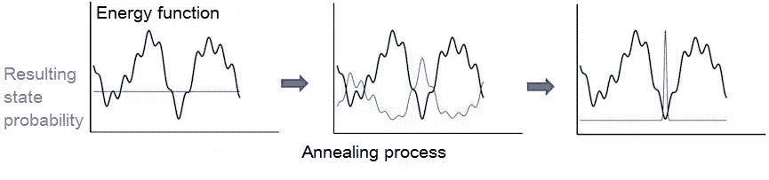

# 人工智能量子计算的现在和未来

> 原文：<https://towardsdatascience.com/the-present-and-future-of-quantum-computing-for-ai-fb600546bbb7?source=collection_archive---------3----------------------->

量子计算仍处于起步阶段，目前还没有通用的量子计算机架构。然而，他们的原型已经在这里，并在密码学、物流、建模和优化任务中显示出有希望的结果。对于人工智能研究人员来说，优化和采样尤为重要，因为它允许以更高的精度更快地训练机器学习模型。

目前，加拿大 D-Wave 是量子计算领域的领先公司。他们最新的机器 D-Wave 2000Q 包含 2000 个量子比特，工作温度为 0.015K(比绝对零度略高*)。他们的目标不是在不久的将来制造通用量子计算机，但有一件事他们的设备可以做得很好——**量子退火**。*

*D-Wave 2000Q 以毫秒级工作，上传输入数据，找到解决方案并读出。你可以很容易地重复整个过程很多次，以获得不同的解决方案。它的工作速度比模拟退火的现代 GPU 实现快数千倍。*

*量子退火非常适合从基于能量的模型(如玻尔兹曼机器)中进行训练和采样。值得注意的是，无监督学习对人工智能研究人员来说是一个很大的挑战，量子计算可能是关键。然而，数值精度存在问题。即使是半精度的浮点数也很难处理，所以目前大部分工作都是处理二进制变量。*

*D-Wave 正计划在 2019 年前为机器学习创造行业就绪的混合量子/经典计算机。此外，1QBit 已经在为他们的机器开发专门的软件。*

## *QA 如何工作*

*简而言之，量子退火是一种控制量子系统能量减少的方法，它将量子位从叠加态移动到具有低能量配置的经典态。任务描述被编码为量子位之间连接的能量函数，通过退火，它们朝着某个最优配置移动。*

*如果转换进行得足够慢，该算法将以很高的概率找到基态(即最优解):*

**

*During the annealing process, probability of qubits ending up in the minimum energy state increases*

*量子耦合允许量子位同时探索所有潜在的解决方案，同时量子隧道允许它们穿过高能垒向“更好”的状态移动。这两种效应使得量子计算机能够比经典计算机更快地解决许多困难的优化问题。D-Wave 的这个视频更详细地解释了 QA:*

## *IBM Q*

*另一个主要参与者是 IBM Q。蓝色巨人正在从事门模型量子计算，他们的机器*是*通用量子计算机。它们的应用范围更广，但同时也更难控制。IBM 最先进的处理器有 16 和 17 个量子位，真的很难进一步扩展。*

*IBM 处理器的更通用架构允许它们运行任何量子算法。例如，Grover 的算法可以找到一个黑盒函数的输入，该黑盒函数只需要对该函数进行 O 次(√N)计算就可以产生指定的输出。更不用说 Shor 的整数因式分解算法，它给许多经典加密算法的安全性带来了许多担忧。*

*对了，16 量子位版本通过 IBM Q 体验计划公开发售。IBM Watson 的认知服务在 AI 社区的声誉现在相当糟糕。也许，IBM Q 将能够改变这种局面。*

*在量子世界和 AI **的交叉点还有一件事——量子神经网络**是对经典人工神经网络的一种固有的随机修改。这是一个有趣的研究方向，但是还没有任何有意义的成果。只有关于玩具问题的理论研究和模拟。*

*总的来说，量子计算看起来像是机器学习中随机模型的一个有前途的方向。随着 D-Wave 和 IBM 最近的进展，我认为我们可以预计到 2020 年量子计算机在人工智能中的实际应用。*

**相关论文:**

*   *[量子计算的优缺点](https://www.researchgate.net/publication/308414229_Strengths_and_Weaknesses_of_Quantum_Computing)*
*   *[用于训练完全可见的玻尔兹曼机器的基准量子硬件](https://arxiv.org/pdf/1611.04528.pdf)*
*   *[量子退火在局部的坚固性和全局的挫败感中](https://arxiv.org/pdf/1701.04579.pdf)*
*   *[探索量子神经网络](https://arxiv.org/pdf/1408.7005.pdf)*

**最初发表于* [*认知混乱*](http://cognitivechaos.com/present-future-quantum-computing-ai/) *。**