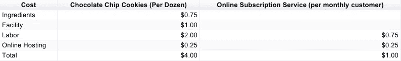
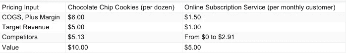
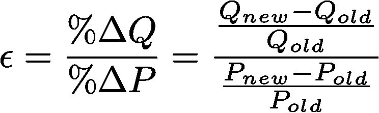
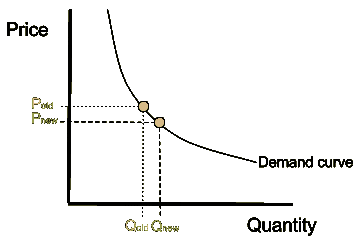
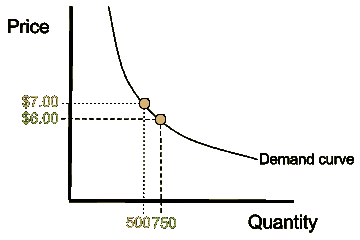
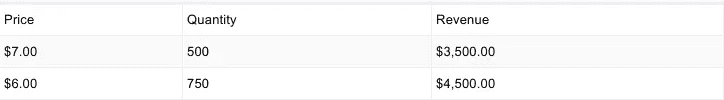

# 价格是正确的:定价策略—第 1 部分

> 原文：<https://towardsdatascience.com/the-price-is-right-pricing-strategy-part-1-d4952dc5f5dd?source=collection_archive---------6----------------------->

## 为你的产品/服务定价是一项复杂的任务。选择太低的价格，你可能会减少你的利润。把你的产品定价太高，你可能会失去顾客。这是如何帮助你找到合适价格的 2 部分系列的第 1 部分。

**定价策略**

你生意的一个基本方面是计算出你的产品向顾客收取多少价格。在以前版本的每日数据驱动中，我们假设您已经确定了价格，以便通过与您的收入相关的指标与您交谈，如[客户终身价值](http://us10.campaign-archive2.com/?u=245464ba329500bd07849ab0d&id=918c6c5620)。在接下来的两周，我们将抛开这一假设，更深入地讨论如何利用数据为您的企业制定定价策略。

在我们开始之前，让我自我介绍一下。我是[道格·米塔罗通达](https://www.linkedin.com/in/dougmitarotonda)，Outlier 的客户开发主管，我的整个职业生涯都在研究定价。我开始通过拍卖出售二氧化碳排放配额，然后设计公用事业的住宅电价，最近还帮助运动队和现场娱乐推广商定价门票。

通过所有这些经历，我学到的最重要的事情是，定价应该被认为是一个不断发展的策略。因为你公司的目标和你所处的竞争环境会随着时间的推移而变化，所以你的定价也需要进行战略性的调整。

接下来的两周，我们将深入探讨定价概念，通过回答以下关键问题，帮助您成为利润更高的企业:

*   在制定价格时，您应该考虑哪些因素？
*   你如何衡量客户对价格变化的反应？
*   你如何最大化每个客户群的收入？
*   什么时候打折或促销你的产品是有意义的？

为了回答每个问题，我会花一天的时间谈论理论方面，然后第二天用一个具体的例子，使用一个假设的公司，道格的甜点(因为我喜欢烘焙！).这家假想的公司在网上销售烘焙食品，还提供在线订阅服务，为客户提供食谱和技巧。

创建定价策略总是需要一些技巧的，但是在本系列结束时，希望你能更轻松地识别正确的数据和工具，为你的定价策略提供信息。如果一路上有什么问题，请给我发[线](mailto: doug@outlier.ai)。我是来帮忙的。

具体来说，我们将涵盖:

*   定价投入(理论)
*   定价输入(示例)
*   需求价格弹性(理论)
*   需求的价格弹性(示例)

**定价输入(理论)**

今天，我们将重点关注您做出定价决策所需的信息。当你第一次坐下来试图决定如何给你的产品定价时，有许多不同的输入可以用来缩小最优价格的范围:

*   销货成本(COGS)，加上利润
*   目标收入除以预期客户数量
*   竞争对手的价格
*   您的产品对客户的价值

让我们考虑一下其中每一项的优势和劣势，以了解它们在您的定价策略中的位置。

**销货成本(COGS)，加上毛利**

这是考虑定价最直接、最容易计算的方法之一。你有生产产品的固定成本和可变成本，所以只要你能在短期内弥补可变成本(并能找到弥补长期固定成本的方法)，你就成功了！你仍然需要测试客户是否愿意支付足够的钱来弥补你的可变成本，但是知道你每单位需要赚多少钱有助于你理解你需要收取的价格来维持业务。但是如果顾客愿意支付比你的成本更多的钱，你将会在桌面上留下很多钱！

**目标收入除以预期客户数量**

另一个相对直接的输入是确定一个目标收入目标，并除以预期的客户数量，从而得出你应该向每个客户收取的费用。这个指标很容易计算，因为您的收入和客户目标是基于您公司当前的战略目标。收入和客户目标可以帮助你实现目标，但你不会知道是否有/足够多的客户愿意支付你计算的价格，或者相对于他们的支付意愿，你的价格是否偏低。

**竞争对手的价格**

了解竞争对手的价格以及与报价相关的相关产品，有助于您了解您的市场，尤其是客户愿意为类似的产品或服务支付多少钱。这种输入可以作为你的产品的基准，应该很容易衡量，因为大多数 SaaS 和电子商务公司的定价都可以在他们的网站上找到。

然而，你的产品在影响价格的重要方面不同于你的竞争对手。或者，在某些情况下，你正在开发新的东西，没有直接的竞争对手。此外，你不知道你的竞争对手已经深思熟虑地设定价格，以使他们的收入最大化。出于所有这些原因，将竞争对手的价格作为定价策略的唯一输入是一个坏主意。

**您的产品对客户的价值**

在制定定价策略时，牢记你的产品为客户提供了多少价值是关键。这种成本/收益分析肯定是你的客户在决定是否购买你的产品时有意识或无意识地问自己的问题！以这种方式思考定价会让你真实地了解人们对你的产品的看法，以及他们愿意为此支付多少钱。你得到的关于产品价值的信息有一个额外的好处，那就是帮助你确定哪些特性是最有价值的，或者哪些新特性是需要添加的。

与其他定价投入相比，产品价值是最难准确衡量的。一种方法是进行市场调查或与客户交谈；然而，顾客的反应是有偏见的，因为他们希望将他们的成本降到最低。因此，他们没有动力如实告诉你他们愿意为你的产品付多少钱。另一种选择是估计你的产品的直接收益，例如，估计你的客户的员工使用你的产品节省的时间。

那么，我该怎么做？

在确定产品价格时，最重要的数据是你要增加的价值。其他定价输入有助于完成定价叙述，但仅靠这些是不够的。例如，了解竞争对手的价格表明你对自己的行业很了解，并给你机会展示为什么你的产品更好，以证明你的价格是合理的。当你知道你要求的价格也将涵盖你的可变成本，并把你放在实现你的目标的道路上，你知道你有一个可行的业务！

**定价输入(示例)**

现在我们知道了在为我们的产品制定定价策略时应该考虑哪些因素，让我们来看看如何在 Doug 's Desserts 中实现这一点。Doug's Desserts 是一家假设的公司，它在网上销售烘焙食品，还提供在线订阅服务，为客户提供食谱和技巧。

**商品销售成本(COGS)，加上毛利**

Doug's 甜品公司的烘焙食品生产成本很高，比如巧克力曲奇饼干，这些产品会邮寄给顾客，还有在线订阅服务。

假设我想在每种产品上赚取 50%的利润。然后，我需要以每打 6.00 美元的价格出售饼干，并以每月 1.50 美元的价格向每位客户在线订阅。

**目标收入除以预期客户数量**

在我公司生命的这个阶段，我的目标是每月收入 5000 美元，每个月有 1000 名顾客购买至少一打巧克力曲奇，因此我需要将曲奇的售价定为每打 5.00 美元*，以达到我的目标。我的目标是每月从 10，000 名在线订阅服务客户那里获得 10，000 美元的收入，即*每月订阅 1 美元*。*

**你的竞争对手的价格**

我在当地的 Safeway 卖 50 块巧克力饼干，售价 5.00 美元，每打 1.20 美元。但是，我的饼干的配料质量和味道都比西夫韦的好得多，所以他们不是真正的竞争对手！这篇[在线评论](http://www.thedailymeal.com/eat/10-best-store-bought-chocolate-chip-cookies-america-0/slide-11)称，在美国最好的商店购买的巧克力片饼干是泰特的，出售 14 块饼干，售价 5.99 美元，或*每打 5.13 美元*。

[Cook's Illustrated](https://www.cooksillustrated.com/) (我最喜欢的食谱网站)以每年 34.95 美元的价格出售他们的标准在线会员资格，或者说*每个月 2.91 美元*。但是他们有一个完整的测试厨房，用来测试每种食谱的数百种版本，所以他们的食谱和建议可能比我能提供的更好。也有很多免费的选择从广告中赚钱。

**您的产品对客户的价值**

购买巧克力饼干给我的顾客带来的好处是节省了他们购物、烘烤和清理的时间，而且与他们自己的(或我的竞争对手的)相比，我的饼干味道鲜美，质量上乘。他们的原料成本和我的差不多，但可能会贵一点，因为我可以批量购买。让我们假设我的消费者的原料每打要多花 25%,或者每打 5 美元。让我们假设每个顾客每月烘烤两打饼干，购物/烘烤/清理需要两个小时，他们的时间价值每小时 5 美元。这意味着每两打可以节省 10 美元的时间，或者每打可以节省 5 美元。所以对顾客的总价值是 *$10.00 每打*(在考虑我的饼干的上乘口感和质量之前)。

在线订阅也节省了我的客户的时间。让我们假设一个月花两个小时做饮食计划，我的食谱/菜单可以把这个时间减少一半。每小时 5.00 美元，对我的顾客的价值是*每个月 5.00 美元(在考虑其他好处之前，比如用如此美味的食物打动他们的家人和朋友)。*

**

*我的产品为我的客户提供的理论价值超过了其他投入，所以这给了我一个很好的主意，我可以收取多少费用。但是直到我卖掉了我的产品，并与顾客交谈，这些价值才有点模糊。*

*我会把我的巧克力饼干定价为每打 7.00 美元，因为我知道我要向顾客解释我的产品比我的竞争对手优越多少。我将把我的在线订阅服务定价为每个月 2 美元，因为我还不确定我的价值是否会超过我的竞争对手。*

*这项研究为我的定价提供了一个很好的起点。明天我会讲，通过需求价格弹性的概念，当你改变价格时，你可以预期会发生什么。*

***需求的价格弹性(理论)***

*需求的[价格弹性](https://en.wikipedia.org/wiki/Price_elasticity_of_demand)是衡量你的客户对你的产品的需求对价格变化的反应的方法。通过理解和衡量这一指标，您将对价格变动后的收入预期有更好的了解。*

***定义***

*产品需求的自有价格弹性被计算为响应自有产品价格百分比变化的产品需求数量百分比变化。*

**

*Price elasticity of demand equation*

*例如，如果你以每件 50 美元的价格卖出 100 件，在将价格改为 55 美元后，你卖出了 95 件，那么你自己的需求价格弹性是-0.5。此结果是一个介于 0 和负无穷大之间的无单位(因为它是以百分比变化来衡量的)、负数(因为价格的变化与数量的变化方向相反)。*

**

***解读***

*需求价格弹性最重要的方面是它与-1 的关系。如果需求的价格弹性介于 0 和-1 之间，那么数量的变化百分比小于价格的变化百分比。你可以通过提高价格来获得更多的收入，因为损失的销售额可以通过更高的销售价格来弥补。正因为如此，当需求的价格弹性在 0 和-1 之间时，称为*无弹性*，因为顾客对你的价格变化并不敏感。*

*另一方面，如果需求的价格弹性小于-1，则相反。你可以通过降低价格来获得更多的收入，因为新销售的数量会弥补较低的价格点。在这种情况下，需求的价格弹性被称为*弹性*，因为顾客对价格的变化很敏感。*

***测量和使用***

*有几种方法可以使用调查技术来测量需求的价格弹性，例如[基于选择的联合分析](https://en.wikipedia.org/wiki/Conjoint_analysis_(marketing))或[价格敏感度量表](https://en.wikipedia.org/wiki/Van_Westendorp%27s_Price_Sensitivity_Meter)。然而，由于一些因素，如激励结构和潜在偏见，调查需要有所保留。对产品需求价格弹性最准确的看法是通过改变价格来观察顾客的反应。*

*重要的是要记住，需求的价格弹性在任何时候对所有消费者来说都不是一个恒定值。例如，您应该估计每个客户群的需求价格弹性，以及需求何时因季节影响而变化。*

*即使你不进行调查或改变价格来计算需求的价格弹性，也有许多因素会影响需求的价格弹性，你应该始终牢记在心。特别是，有许多相近替代品的产品具有很高的弹性，因为客户很容易转向更便宜的选择。此外，被视为奢侈品的产品具有很高的弹性，因为如果价格大幅变动，顾客可以不买也能继续消费。这些概念反映了贵公司的驱动目标——创造一种独特的产品，深深植根于客户的生活或工作流程中。*

***需求的价格弹性***

*今天，让我们来看看需求的价格弹性是如何对我假设的公司 Doug's Desserts 产生影响的。在前面的例子中，我决定将我的巧克力饼干定价为每打 7 美元。假设按这个价格，我每月卖 500 打，但我想我可能定价过高，如果我降价 1 美元，就能卖出更多的饼干。在我把价格从每打 7 美元降到 6 美元后，我开始每月销售 750 打。*

**

*将这些值代入昨天的等式，我发现我的饼干的需求自有价格弹性为-3.5。*

**

*这意味着对我的饼干的需求是有弹性的，这可能并不令人惊讶，因为有许多接近我的巧克力饼干的替代品，特别是优质饼干，不是必需品。因为对我的饼干的需求是有弹性的，这一价格变化为我的企业带来了更多的月收入。*

**

*下周，我们将继续讨论定价策略，看看分级定价、折扣和促销。*