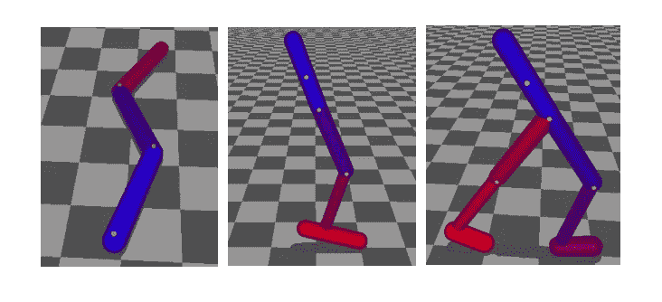
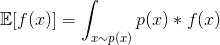
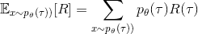
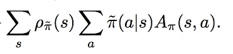
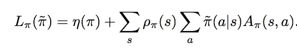
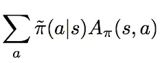
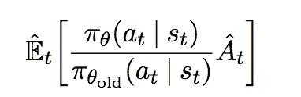
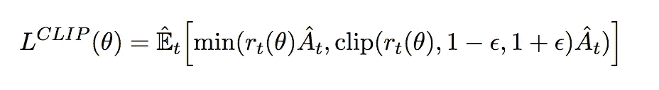
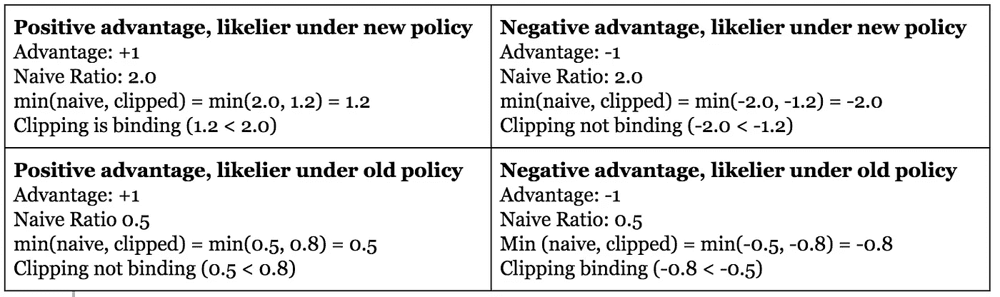
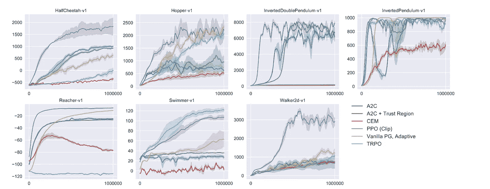

# 追求(机器人)幸福:TRPO 和 PPO 如何稳定政策梯度方法

> 原文：<https://towardsdatascience.com/the-pursuit-of-robotic-happiness-how-trpo-and-ppo-stabilize-policy-gradient-methods-545784094e3b?source=collection_archive---------7----------------------->

强化学习给我的印象是现在机器学习的狂野西部:一个充满戏剧性和进步的地方，每个人的视野中都有宏伟未来的梦想。但是，这也是一个远离规则和假设的地方，这些规则和假设支配着监督和非监督学习的世界。典型假设的一个最显著的违反是，特别是在政策梯度中，你无法可靠地知道你前进的方向是否会真正提高你的回报。因此，许多最近的政策梯度创新——本文将讨论其中的两个——专注于如何在你对追求的最佳方向的估计存在有意义的更高方差的情况下更有信心地进行优化。

# 快速了解术语

*   “轨迹”——轨迹被定义为一系列状态、行动和奖励。轨迹是通过遵循一些政策来收集的，这些政策决定了在给定的状态下你将采取什么行动，但是这些政策不需要动机；在随机策略下，理论上也可以计算轨迹
*   “状态”——这通常用来宽泛地表示:在任何给定的时间点，代理与之交互的环境输入的集合。
*   “奖励”——根据上下文，这可以指在特定时间步长给出的奖励，也可以指从给定动作的时间步长直到轨迹结束的折扣奖励。

# 你不可能总是知道自己想要什么:学分分配问题

强化学习问题的基本框架是一个在环境中运行的代理:它接受观察(或称为状态 s)，并采取行动，这触发环境产生一些奖励 r，并更新到由给定行动产生的新状态。关于这种设置，需要注意的一件重要事情是，它隐含地假设环境具有做出判断的能力，无论是关于动作还是世界的首选状态。

这似乎是显而易见的，但这可能只是因为我们习惯于听到“奖励”是 RL 的一个基本组成部分。但是，不要把奖励简单地想成一些完全抽象的概念，而是应该考虑不同类型的环境，以及它们在量化奖励中的表现和不表现。

一方面，你有像许多 Atari 游戏那样的基于点数的游戏，因为拥有许多点数是赢得游戏的决定性因素，点数可以提供一个相当直接的奖励信号。在中间，想象像 Go 这样的东西。在这种情况下，有一个定义明确的赢或输的概念，但环境不会自动提供任何给定中间步骤的价值评估，或者它离赢得游戏有多近。事实上，在这种情况下，我们想让代理人做的一个实质性的部分就是发展关于什么样的中间博弈状态比其他的更好的知识。

另一方面，我们还有教机器人走路的问题。在这种情况下，任何奖励都必须由人类明确设计，以捕捉我们认为有效行走意味着什么；它们不是由环境结构所固有的。所有这些只是想说:奖励的概念可能是一个有用的抽象概念，但你应该记住，它是用来描述一个相当广泛的反馈机制。

这个关于奖励的讨论符合我认为的关于强化学习的一个最明确的事实:你无法看到你试图优化的功能。这是一个微妙的问题，而且常常是以一种比实际情况更明显的语气随口说出的。

想象一下，在监督学习中，您的模型产生了一组 softmax 值(分类网络的传统输出结构)。如果将这些输出与 one-hot-encoded true label 进行比较，就可以将交叉熵误差计算为每个 softmax 输出的直接解析函数，这样就可以反推这些 softmax 输出发生变化时，损耗会如何变化，并返回到网络中。但是，在 RL 中，你的损失不是一个可微的函数，你对它有完全的方程级的可视性，而是一个由宇宙控制的黑匣子。你采取了一系列的行动，并获得了一系列的奖励，但是你不可能直接计算出为了增加你的奖励，你应该上调或下调每个具体行动的概率。

你可以根据你的参数创建奖励梯度的估计值，这是现代 RL 的两个主要分支之一 policy gradients 所采用的方法，但这些估计值比监督学习中的估计值具有更高的内在方差。在监督学习中，小的迷你批次大小会使您当前估计的损失量发生变化，但损失相对于参数的实际导数是由网络定义的确定量。相比之下，在强化学习中，你是在估计导数本身。特别是在多步骤中，早期的单个操作可以导致完全不同的路径，给定政策可以导致的可能轨迹的空间非常大，这意味着您需要更多的样本来很好地估计给定政策的执行情况。

# 符合政策梯度

Source: Trust Region Policy Optimization paper. This simulated walker is an example of the kind of continuous-valued problem (where the policy is the continuous-valued torque on each joint) for which policy gradient methods are particularly well-suited

要建立对政策梯度方法的直觉，首先要考虑强化学习最直接的形式:进化方法。在一种被称为交叉熵方法的原型进化方法中，你定义一些政策参数的分布——让我们说一个具有一些均值和方差的高斯分布——并收集 N 组参数下的 N 条轨迹。然后，取前 p%的最高表现轨迹，并基于使用该 p%的参数样本作为经验起点来拟合新的高斯参数分布。所以，在下一轮，你的 N 个样本是从对应于上一轮最佳样本的分布中抽取的。

这背后的想法是，在生成良好轨迹的参数集内，该集内的每个参数都可能更接近最佳参数设置。虽然像这样的简单方法[有时令人惊讶地工作得很好](https://blog.openai.com/evolution-strategies/)，但是它们的缺点是随机更新参数值，而不遵循任何明确的梯度，该梯度携带关于参数值的什么改变可能提高性能的信息。现在，有人可能会合理地争辩说:你刚刚说过，不是 10 段之前，在强化学习中，你不能指定一个从你的参数到你的奖励的梯度链，因为行动和奖励之间的环境函数是一个黑盒。

没错:你不能直接计算。但是，在通过动作输出柔量最大值的网络中，您可以计算一个梯度，将柔量最大值移向一些不同的动作集。所以，如果你定义了一个关于你的行动的估计损失梯度，你可以通过你的行动分布来改进这个估计损失。

沿着这些路线的一个基本政策梯度是通过给每一个行动附加一个叫做优势估计的东西来运作的。这从数字上回答了“这个行动比我在这种状态下采取的平均或预期行动好多少”的问题。重要的是，优势评估使用未来折扣奖励，这意味着从采取行动的那一点开始累积到未来的所有奖励，折扣率适用于未来的奖励。请注意，这与进化方法不同，在进化方法中，每个行为都被隐含地赋予了对整个轨迹的回报的部分责任，而不仅仅是在此之后的回报。给定附加到每个动作的这个优势估计，基本策略梯度方法使用给定轨迹的预期优势作为其回报，通过计算和求和从概率策略采样的动作的优势估计，根据每个动作的概率隐含地加权每个动作。虽然每种方法都有自己的细微变化，但这一基本框架是政策梯度方法的概念基础。

# 当你怀孕的时候会期待什么

许多机器学习问题是根据某种期望值的最小化或最大化来定义的。对于那些离统计时代稍远的人来说，函数的期望值定义为:

期望值是相对于某个概率分布 p(x)来定义的，你期望 x 从该概率分布中被采样，并且在概念上可以被描述为“如果你从 p(x)中采样 x，你会得到什么，并且平均你从那些样本中得到的 f(x)”。在强化学习的背景下，这一点非常突出，因为它有助于说明 it 和强化学习之间的另一个微妙差异。

在规范的监督学习问题中，f(x)是某种损失函数，例如，预测的 softmax 输出和目标之间的交叉熵损失，而 p(x)分布是训练集中存在的输入的分布。换句话说，这个问题框架寻求最小化预期损失，这转化为构建一个对某个输入集 x(构成训练集的输入集)具有低误差的网络。这是隐含地完成的，因为根据定义，网络只看到训练集中存在的例子，并且如果在训练集 p(x)的经验分布下一个例子(或接近输入空间的一组例子)是高概率的，将更频繁地看到该例子。这里，p(x)不在你的控制范围内，f(x)，网络+损失函数，是你训练网络时要优化的。

现在，想象一个强化学习问题，我们想从给定的政策中获得最大的期望回报。

方程的结构在这里几乎是相同的，除了 x 已经被替换为τ，以表示每个τ现在是从策略 p-θ得出的轨迹。(τ是轨迹的标准符号)。然而，在这里，你所优化的已经翻转。因为优化策略的结果是让您选择不同的行动，当您优化策略参数时，这会通过计算奖励的轨迹分布对期望值*产生影响，*在监督学习中，样本的分布由固定的训练集决定。相比之下，之前，我们的网络优化了作用于样本的损失/回报函数，在这里，我们无法看到 R(t)回报函数，我们影响预期回报的唯一杠杆是通过改变我们采样的轨迹的分布。

这一事实对政策梯度方法可能经历的失败模式有影响。在监督学习环境中，无论我们采取多少不明智的优化步骤，我们都不会影响我们正在学习的样本的分布，因为这超出了我们的控制范围。相比之下，在政策梯度环境中，如果我们最终处于一个特别糟糕的行动空间区域，这可能会让我们处于一个很少有有用的信息轨迹可供学习的境地。例如，如果我们试图在一个迷宫中寻找一种奖励，并且意外地学会了保持静止或转圈的策略，我们将很难达到任何有积极回报的行动，因为我们只能通过体验那个行动并看到它导致奖励来学习增加行动的可能性。

# 别担心，你可以信任我

前面提到的灾难性崩溃问题在历史上导致了策略梯度方法中超参数优化成为一个脆弱而复杂的过程:你需要找到一个足以在问题上取得实际进展的学习率，但又不能高到经常意外终止学习过程。在学习过程的灾难性结束不仅仅意味着不得不重新运行一些代码，而且实际上意味着可能刚刚驶下悬崖的物理机器人代理的毁灭的情况下，这一点尤为突出。

当我们要更新我们的政策时，我们真正想回答的一个问题是:我们能不能做出一个保证改善我们当前政策的更新，或者至少不会使它恶化？完全计算这一点的一种方法(将我们的策略更新后称为“新策略”，更新前称为“旧策略”)是:

1.  了解新政策将访问哪些州，以及访问这些州的概率有多大。
2.  在每个州，对以下行为求和:该州每个行为的新政策概率，乘以该行为比该州旧政策的平均行为好多少。(这个量，“这个动作比这个状态下的平均动作好多少”，被称为优势)。
3.  上面的求和操作相当于在每个状态获得预期的优势，根据该状态下新策略的动作分布进行采样。
4.  我们通过新政策到达该州的可能性来衡量每个州的预期新政策优势
5.  总的来说，这将使我们获得新政策相对于旧政策的预期优势，并让我们在采取行动之前确认预期优势是积极的。

This equation is basically a mathematically restatement of items 1–5 above

新策略在给定状态下的给定动作的概率很容易计算:我们可以很容易地将来自任何状态的数据(甚至是由不同策略采样的数据)输入到具有更新参数的策略网络的副本中，并获得该网络的动作分布。

然而，更困难的是新政策将覆盖的州的分布。与许多预期一样，我们没有任何方法可以直接估计给定策略在某个状态下结束的概率。因此，我们不是显式地对状态求和并计算每个状态的 p(s ),而是通过采样进行估计:如果我们获得一个策略所达到的状态集，并计算每个状态的新策略优势，那么我们将通过 p(s) 进行*隐式加权，因为更有可能的状态将更有可能被包含在样本中。为了在没有采样的情况下进行计算，我们需要知道转移函数——在给定状态下，给定动作下一个环境状态的分布——这是一个未知的环境黑箱。*

信赖域策略优化(TRPO)的方法是计算上述优势量的估计，但是使用来自旧策略的状态分布来这样做，而不是来自新策略的状态分布，新策略的状态分布基本上只能通过潜在昂贵的采样来获得。

Note: eta(pi), the first term, is just the expected reward of the old policy, which already knew from sampling from it. You can see that, in contrast to the partial equation above, the distribution over states is from the old policy (pi) rather than the new policy (pi tilde)

这种近似的有效性直接关系到旧策略状态分布与新策略状态分布的不同程度。如果更新的策略以足够相似的概率到达相同的状态，那么这种近似更有可能成立。直觉上，这是有意义的:如果新策略经常出现在旧策略从未或很少出现的某个状态，其中所有的行为都比旧策略要糟糕得多，那么旧策略近似的损失(赋予该状态低权重或零权重)将会对新策略的性能不恰当地乐观。

虽然这篇文章的证明有点长，但原始的 TRPO 论文表明，如果您对新旧策略的动作分布(或动作分布参数，如果您正在学习参数化的策略)之间的 KL 差异进行限制，这将转化为新旧策略状态分布差异的限制。而且，如果对这种差异有足够强的限制，我们知道我们的新策略状态分布与旧策略状态分布足够接近，我们的近似损失函数应该是有效的。

# 再见了，吉隆坡

从经验上看，TRPO 方法表现得相当好:以前需要精确的特定问题超参数搜索者的问题现在可以用一组合理的参数来解决，这些参数可以很好地跨问题转移。然而，TRPO 的一个挑战是需要计算参数之间 KL 散度的估计值:这需要使用共轭梯度法，这增加了该方法实施的复杂性和计算时间。

OpenAI 去年发布的近似策略优化(PPO)T1 试图解决这个问题。为了理解这种方法，我们首先需要了解一些关于替代损失函数 L-pi 的计算方法，特别是预期优势的计算方法(如下所示)。

虽然我们的模型结构给出了在给定状态下直接计算行动概率的能力，但是为了减少计算，我们不倾向于明确地计算在给定状态下每个行动的优势，并且计算它的加权概率。相反，我们只是再次通过采样来计算隐含的期望:我们根据我们网络的 softmax 动作分布来采样动作，因此给定状态下的动作根据它们的可能性来显示。然而，回想一下，使用 TRPO，整个目标是能够使用从旧政策中抽取的样本来推断新的更新后政策**的行为。**因为我们使用的是在旧策略下抽取的样本，所以每个动作都隐含地乘以在旧策略下被抽样的概率。因此，为了纠正这一点，在 TRPO 中，我们将旧政策下采样的每个优势估计值乘以一个比率:新政策下的概率除以旧政策下的概率。从概念上讲，这只是通过除以显式旧策略概率(得到 1)然后乘以新策略概率来抵消隐式旧策略概率。

Slightly different symbols than the last few equations, but hopefully still clear.

这个概率比，PPO 论文称之为 r-theta，是 PPO 改进方法的焦点。PPO 没有估计一个替代的预期优势损失，而是提出了 KL 散度损失(注意，这组符号将对状态的期望包含在 et 项中):

换句话说，这就是计算两件事，并取其中的最小值:

1.  **R-theta * Advantage** :比值项如上所述，只是取新的动作概率除以旧的。
2.  **一个削波的 R-theta *优势**:这里，ε被定义为一个相当小的项，比如说 0.20，我们将概率比削波到 0.8 到 1.2 之间。然后，我们将这个削波比率乘以优势。

这种方法的基本操作理论与 TRPO 是一样的:保守主义，以及对更新的谨慎，这种更新会把你带到旧政策没有探索的区域。让我们通过几个可能的案例来思考为什么。

A few made-up illustrative examples

剪裁只适用于使我们对新政策优势的估计更加悲观:当在新政策下更有可能出现真正好的行动，而在旧政策下更有可能出现坏的行动。在前一种情况下，我们限制了你能给予新政策多少向上加权的好行为的信任，在后一种情况下，我们限制了你能削减多少向下加权的坏行为的新政策松弛。这一点的总体要点是，我们给予算法更少的动力来进行将导致行动或状态分布发生强烈变化的更新，因为我们正在抑制可能导致这种更新发生的两种信号。

In all but one case, PPO outperforms or is tied for top performance with competing algorithms. Source: PPO paper

这种方法的一个有意义的优点是，与 TRPO 的硬 KL 发散约束不同，这种削波目标可以使用梯度下降直接优化，允许更干净和更快的实现。

# 切斯特顿的政策栅栏

在 1929 年的一本书中，G.K .切斯特顿写道:

> 在改造事物的问题上，与改变事物不同的是，有一个简单明了的原则……在这种情况下，存在着某种制度或法律；为了简单起见，让我们说一个横跨马路的栅栏或大门。更现代的改革家兴高采烈地走上前去说，“我看不出这有什么用；让我们清除它。”对于这个问题，更聪明的改革家会很好地回答:“如果你看不到它的用处，我当然不会让你把它清理掉。走开想一想。然后，当你能回来告诉我你看到它的用途，我可能允许你摧毁它

这种对全新方法的谨慎，以及对过于热衷于变革(即使表面上看起来是一种改进)的警惕，是贯穿这里讨论的两种政策梯度改进方法的基本主题。冒着变得过于华丽的风险，这是一个非常隐喻的想法:通过渐进、谨慎的步骤获得信心，让你离更好的地方更近一点。

# 剩余问题

现在这已经成为我的习惯，我想以一些问题来结束我的演讲

*   在许多问题中，直到成功的那一刻才有稀疏或不存在的回报，我预计强化学习方法一般会有麻烦。对于 Q 学习和政策梯度在这些低回报密度的情况下是否表现更好，有没有已知的研究？
*   与此相关，我很想了解奖励形成——创造手工设计奖励的过程——对解决不同类型的问题有多重要。
*   我从来没有完全弄清楚为什么在 TRPO 中计算 KL 散度约束需要共轭梯度来估计

即使仅在政策梯度这个主题中，这个领域也有如此多的丰富性和细微差别，以至于我没有时间在这里触及:优势估计在减少方差中的作用，PG 与 Q 学习的利弊，随机政策在导致更好学习中的作用。如果你对了解以上任何一点感兴趣，我有一个有点非正统的建议:约翰·舒尔曼(TRPO 和 PPO 背后的研究人员，目前是 OpenAI 的研究员)的博士论文。鉴于这本书并没有明确地写为面向公众的教学，它写得非常好，非常清楚，包含了我在研究过程中能够找到的一些概念的最佳解释。