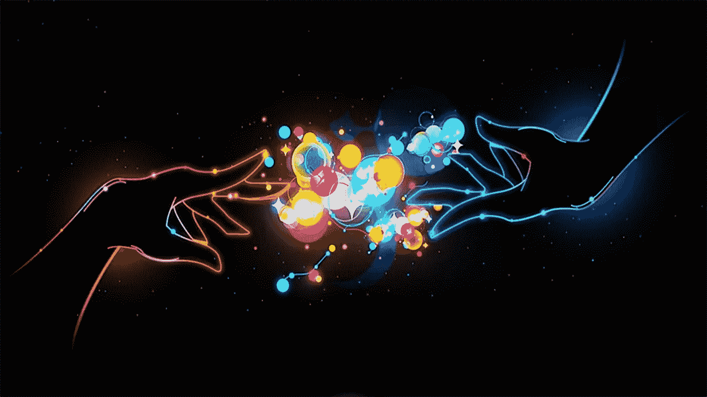

# 人工智能难的真正原因

> 原文：<https://towardsdatascience.com/the-real-reason-ai-is-difficult-10b64a230c5e?source=collection_archive---------5----------------------->

今年圣诞节，我朋友的祖母终于发现了她孙子多年来一直在做的事情。他是一名数据科学家，在英语环境中长大，偶尔在家庭场合会说一点西班牙语。他的祖母只会说西班牙语。

> “在今天之前，我的祖母不知道我到底是做什么的。”

关于数据科学家研究什么的科幻小说式的谣言——尤其是如果我们专门研究[人工智能](http://bit.ly/quaesita_ai)——吸引了一股荒谬的气息，所以我们许多人发现自己不得不不断地解释我们的生活选择。这就是为什么当我得知我的朋友分享了我的博客帖子的西班牙语翻译时，我非常感动。他的祖母终于能够告诉他，她理解他，并为他感到骄傲。

> 这是她第一次可以想象他在工作中真正做了什么的圣诞节。

她第一次明白，他的召唤并不是某种模糊的杀手机器人味道的东西，而是某种因其能够让人类生活变得更好而深具美感的东西。[机器学习和 AI](http://bit.ly/quaesita_ai) 给你第二种和计算机对话的方式。旧的方法是给计算机明确的指令，而新的方法是给出例子——数据！—相反。这就是 AI 的本质。

> 不要让它的简单让你失望；杠杆也很简单，但它们可以移动世界。

正是在这样的时刻，我的写作受到了极大的鼓舞。我写作的原因(通常会放弃每个周末的一半时间来做这件事)是为了让[数据科学](http://bit.ly/quaesita_datasci)和[决策智能](http://bit.ly/quaesita_gcpp)对所有人来说都是容易理解的。

> 我相信，对这些理念的基本了解对于参与人类不可避免地走向的[人工智能](http://bit.ly/quaesita_emperor)未来至关重要，我对任何人被抛在后面的想法感到不寒而栗。

我不希望 AI 只属于学者、专家、大公司，以及那些和流行博主说同样语言的人。说[应用人工智能](http://bit.ly/quaesita_fail)聪明而神秘是一个谎言——以下是今天它很难的真正原因:

大规模实现自动化是很困难的。这是我大惊小怪的事情，但这不是人工智能特有的问题。从做汉堡到提供搜索结果，在全球范围内做任何事情都是复杂的。然而，从个人的角度来看，这可能相当容易，除非这些工具不是用户友好的。这就引出了第二点。

**(2)今日工具吸**。是的，所有的人。

我什么意思？简单来说:大多数五岁的孩子不会使用今天的[数据科学](http://bit.ly/quaesita_datasci)工具。想法[并不难](http://bit.ly/quaesita_emperor) ( [例子进去，菜谱出来](http://bit.ly/quaesita_slkid))，但是[界面](http://bit.ly/quaesita_sc17demo)难。对于你们当中的终身工程师来说，他们可能不这么看，但对于那些以前从未编写过[*for loop*](https://www.learnpython.org/en/Loops)*的人来说，他们是令人生畏的。好消息是工具正在迅速变得更好。很快，非专家将能够使用简单的界面从他们的生活中去除各种烦人的苦差事……只要他们知道这是一种选择。我不希望看到人们仅仅因为看不懂英语或者没有在大学学过数学，就被排除在人工智能之外，无法成为自己更美好生活的建筑师。*

> *好消息是工具正在迅速变得更好。*

*测试一个重要的应用需要专业知识。作为一名[的统计学家](http://bit.ly/quaesita_statistics)，我可能会对甚至在睡梦中的测试感到愤怒——对缺乏严谨性感到愤怒是我这类人根深蒂固的本能——所以我必须提醒自己，在许多应用中失败并不痛苦。*

*有时候失败是如此有趣，它们实际上是最好的部分——例如在这个人工智能生成的烤蜗牛黄油食谱中，由 aiweirdness.com 的[提供。我要求你大声读出来，不要笑出声来。](http://aiweirdness.com/post/159022733587/three-bad-recipes-generated-by-neural-network)*

**

*An AI-generated recipe, courtesy of [aiweirdness.com](http://aiweirdness.com/post/159022733587/three-bad-recipes-generated-by-neural-network). I dare you to read it out loud without cracking up.*

*这样的应用程序不需要同温层标准的严格测试，而同温层标准会让我的坏脾气伙伴们感到骄傲。创造一种救命的药物和为我的家庭娱乐创造一种新的黄油配方是有区别的。如果我们决定药物不再需要统计测试，我会立刻加入抗议。至于*不敢相信这是黄油……*我一直在我的厨房里做疯狂的事情，那里唯一接近测试的东西就是火警。(它经常给我唱它的人民的歌。)*

*在我的演讲和文章中，我经常支持[行业用例](http://bit.ly/quaesita_ds5)，但是让我们不要忘记所有带来一点个人快乐或舒适的个人[可爱应用](http://bit.ly/quaesita_island)。我有很多定制的基于 ML 的个人生产力工具，让我可以表现得好像一天有 25 个小时一样。这些并不重要，但它们让我的小生活变得更好。*

*我希望其他人也能获得这些技术——这就是为什么我为成为 [Google Cloud](http://bit.ly/gcloudpstart) 的一部分而感到自豪……制造更好的工具，将大量计算资源交给所有不想建立自己的数据中心的人，这基本上是我们存在的目的。不幸的是，如果人们不知道什么是人工智能，他们最终仍然会被排除在外，他们被允许在没有成为教授的情况下加入这种乐趣。所有那些关于机器人的科幻废话真的对事情没有帮助。*

> *我不想看到人们仅仅因为看不懂英语或者他们在大学里没有学过数学而被排除在为自己创造更美好生活的建筑师之外。*

*每个人都应该参与到人工智能的想法中，这就是我写作的动机。我只是众多声音中的一个——这是一件好事，因为每一点都有帮助。我想对那些帮助我摆脱英语科技泡沫的人说谢谢。*

*对于那些花了一点时间与可能被排除在外的人分享人工智能想法——我的或其他人的——的人，请接受我衷心的感谢。每个人都应该成为其中的一部分，不管他们是谁，说什么。*

*********************************************************************

*我的第二个 Medium [账号](https://medium.com/@kozyr_91350)上有其他语言的社区翻译文章。下面是🇦🇪 [*阿拉伯语*](https://medium.com/@kozyr_91350/arabic-simplest-ml-4e755850dc3c) *，* 🇨🇳 [汉语](http://tinyurl.com/y7o98dg6)，🇳🇱 [荷兰语](https://medium.com/@kozyr_91350/de-eenvoudigste-uitleg-van-machine-learning-die-je-ooit-zult-lezen-46ea5158a45e)， *🇫🇷* [*法语*](http://tinyurl.com/y7n72ds3) *，* 🇩🇪 [*德语*](https://medium.com/@kozyr_91350/die-einfachste-beschreibung-von-maschinellem-lernen-die-sie-jemals-lesen-werden-2a75dbba54b7) *，🇮🇹* [*意大利语*](http://tinyurl.com/ydbm4anw) *，🇯🇵* [🇷🇺](https://tinyurl.com/y7bzr34d) [*俄语*](http://tinyurl.com/ydck2zhy)*🇪🇸[西班牙语](http://tinyurl.com/y7klx5s2)*和🇹🇷* [*土耳其语*](http://tinyurl.com/y8ppqp33) 。**

**我希望我知道每一种语言，这样我就可以用它们来写作，但是我不知道。如果你想多做一点，把这个词表达出来，我总是欢迎志愿者翻译。[谷歌翻译](https://translate.google.com/)传达了最基本的意思，但却失去了很多乐趣。我这样写是因为我认为快乐是至关重要的……否则我会链接到一本[教科书](https://www-bcf.usc.edu/~gareth/ISL/ISLR%20First%20Printing.pdf)然后就到此为止。我非常感谢那些抓住了我的文章精神的人，所以当他们到达语言障碍的另一边时，他们仍然很有趣。**

# **感谢阅读！YouTube AI 课程怎么样？**

**如果你在这里玩得开心，并且你正在寻找一个为初学者和专家设计的有趣的应用人工智能课程，这里有一个我为你制作的娱乐课程:**

**Enjoy the entire course playlist here: [bit.ly/machinefriend](http://bit.ly/machinefriend)**

# **喜欢作者？与凯西·科兹尔科夫联系**

**让我们做朋友吧！你可以在 [Twitter](https://twitter.com/quaesita) 、 [YouTube](https://www.youtube.com/channel/UCbOX--VOebPe-MMRkatFRxw) 、 [Substack](http://decision.substack.com) 和 [LinkedIn](https://www.linkedin.com/in/kozyrkov/) 上找到我。有兴趣让我在你的活动上发言吗？使用[表格](http://bit.ly/makecassietalk)取得联系。**