# 这就是推特如何看待世界:情感分析第一部分

> 原文：<https://towardsdatascience.com/the-real-world-as-seen-on-twitter-sentiment-analysis-part-one-5ac2d06b63fb?source=collection_archive---------3----------------------->


by [Hugh Ha](https://unsplash.com/@hughhan?utm_source=medium&utm_medium=referral)n on [Unsplas](https://unsplash.com?utm_source=medium&utm_medium=referral)h

Twitter 是一个在线社交网络，截至 2018 年 2 月，月活跃用户超过 3.3 亿。twitter 上的用户创建称为 tweets 的短消息，与其他 twitter 用户分享，这些用户通过转发和回复进行互动。Twitter 采用了 280 个字符或更少的消息大小限制，这迫使用户专注于他们希望传播的消息。这一特性使得 twitter 上的消息非常适合情感分析的机器学习(ML)任务。情感分析属于自然语言处理的范畴，自然语言处理是人工智能的一个分支，处理计算机如何处理和分析人类语言。

训练数据是从[感知 140](http://help.sentiment140.com/) 获得的，由大约 160 万条随机推文组成，并带有相应的二进制标签。0 表示负面情绪，1 表示正面情绪。在这篇博客文章中，我们将使用[朴素贝叶斯分类器](https://en.wikipedia.org/wiki/Naive_Bayes_classifier)从这个训练集中学习正确的标签，并进行二元分类。在坚果壳中，朴素贝叶斯定理根据某些其他事件的联合概率分布来计算某个事件发生的概率。我使用 twitter 的 API 下载了测试数据集，并将用于测试模型的真实性能。API 的完整文档和条款可在[developer.twitter.com/en/docs](https://developer.twitter.com/en/docs)获得。

在这篇博客文章的第一部分，我们将介绍一个情感分析 ML 任务中对文本数据执行的标准预处理步骤。第二部分[将在后续的博客文章中介绍，我们将预处理合并到 ML 管道中的一个步骤中。第一篇文章解释了当我们使用管道来处理预处理时，在幕后发生了什么。](https://medium.com/p/3ed2670f927d)

# 第 1 部分:探索带标签的训练数据集

在我们的工作流程中，我们将使用带有 Python 的 Jupyter Notebook。

*   导入此项目中使用的 python 库。
*   将数据导入到 pandas 数据框架中，并进行一些探索性的数据分析。

```
**# you can see the full list of imports on GitHub!****# Machine Learning imports
import** **nltk
from** **sklearn.pipeline** **import** Pipeline
**from** **sklearn.model_selection** **import** train_test_split
**from** **sklearn.metrics** **import** classification_report, confusion_matrix, accuracy_score
**from** **sklearn.naive_bayes** **import** MultinomialNB
**from** **sklearn.model_selection** **import** KFold, cross_val_score
**from** **sklearn.ensemble** **import** RandomForestClassifier
**from** **sklearn.feature_extraction.text** **import** CountVectorizer
**from** **sklearn.feature_extraction.text** **import** TfidfTransformer
**from** **sklearn.model_selection** **import** GridSearchCV
**from** **sklearn.externals** **import** joblib
**from** **nltk.corpus** **import** stopwords
**from** **nltk.tokenize** **import** TweetTokenizer
**from** **nltk.stem.wordnet** **import** WordNetLemmatizerLoad training dataset to Pandas and preview the top rows.
```

```
*# load train data*
data = pd.read_csv('Sentiment Analysis Dataset.csv',
                   error_bad_lines=**False**)
data.columns = ['id','label','source','text']
data.head(2)*# get text and matching label columns*
data = data.drop(['id','source'],axis=1)
data.head(10)
```

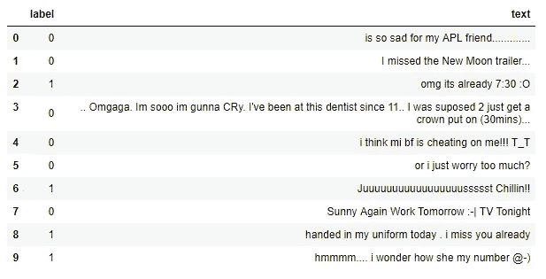

*   我们可以观察到数据确实来自 twitter 上发布的 tweet 消息。
*   标签和文本似乎没有按照列出的顺序排列。如果数据不是随机分布的，这可能是一个问题，因为它会给学习模型带来偏差。在任何情况下，我们都将使用 [Scikit Learn](http://scikit-learn.org/stable/documentation.html) 库，该库具有拆分我们的训练和测试数据并同时混洗数据的功能。
*   洗牌数据减少了方差，并确保我们的模型可以更好地概括数据，减少过度拟合。我们希望确保训练和测试数据集能够代表数据的总体分布。
*   为此，我们还想检查数据中的标签频率分布，如下所示。
*   我们可以观察到的另一个现象是文本包含不同的格式。一些单词包含混合的大小写字母，需要规范化为它们的基本单词。例如:‘哭’变‘哭’了。
*   第一个字母大写的单词可以尝试，因为它们可能包含不同的特征空间，如人名或国名等。

探索标签类型的分布。

```
*# check the number of positive vs. negative tagged sentences*
positives = data['label'][data.label == 0]
negatives = data['label'][data.label == 1]print('number of positve tagged sentences is:  **{}**'.format(len(positives)))
print('number of negative tagged sentences is: **{}**'.format(len(negatives)))
print('total length of the data is:            **{}**'.format(data.shape[0]))
```

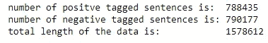

positive VS negative

*   考虑到数据集的大小，标签似乎“大约”均匀地分布在 788435 和 790177 处，分别为正和负。
*   接下来，我们希望看到每个句子中包含的单词数，所以我创建了一个函数来提取这些信息，并将其附加到*文本列*旁边的列中。下面是一个示例输出。

```
*# get a word count per sentence column*
**def** word_count(sentence):
    **return** len(sentence.split())

data['word count'] = data['text'].apply(word_count)
data.head(3)
```

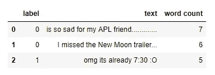

word count per message

```
*# plot word count distribution for both positive and negative sentiments*
x = data['word count'][data.label == 1]
y = data['word count'][data.label == 0]
plt.figure(figsize=(12,6))
plt.xlim(0,45)
plt.xlabel('word count')
plt.ylabel('frequency')
g = plt.hist([x, y], color=['r','b'], alpha=0.5, label=['positive','negative'])
plt.legend(loc='upper right')
```

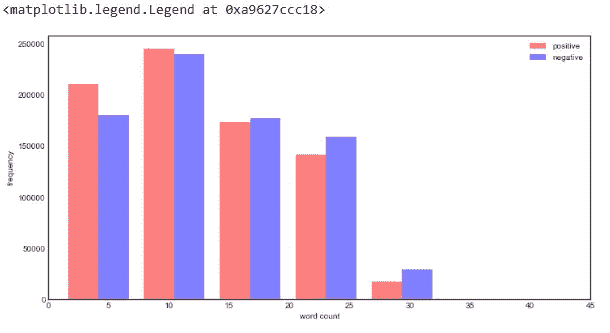

*word count distribution for both positive and negative*

*   从上面的图表来看，大多数句子在 5 到 10 个单词之间，但是可以说 twitter 上的大多数文本在 1 到 25 个单词之间。考虑到 twitter 对一条消息中可以使用的字符数有限制，这就不足为奇了。在撰写本文时，280 个字符已经是极限了。
*   总之，看起来 1-20 个单词覆盖了所有句子的 80%以上，这使得该数据集成为一个很好的训练候选集。
*   5 个单词以内的肯定句比否定句多，这种差异目前看来还不足以引起任何关注。

```
*# get most common words in training dataset*
all_words = []
**for** line **in** list(data['text']):
    words = line.split()
    **for** word **in** words:
        all_words.append(word.lower())

Counter(all_words).most_common(10)
```

以下输出:

```
[('i', 741876),
 ('to', 556149),
 ('the', 516654),
 ('a', 374024),
 ('my', 309966),
 ('and', 294805),
 ('you', 236109),
 ('is', 229444),
 ('for', 212852),
 ('in', 209009)]
```

*   在上面的单元格中，我们提取了数据集中最常见的单词，并列出了前十名。
*   也许毫不奇怪，我们会遇到像 **i、**和**是**这样的词，因为它们在人类表达中使用频率很高。这种词通常在消极和积极的表达中同样出现，因此它们带来的信息很少，可以纳入模型中，所以我们必须在以后的道路上摆脱它们。
*   在后面的文本预处理步骤中，我们将学习如何处理这些对特征空间没有太大贡献的常用词。
*   下面的代码输出一个图表，显示前 25 个单词的频率。

```
*# plot word frequency distribution of first few words*
plt.figure(figsize=(12,5))
plt.title('Top 25 most common words')
plt.xticks(fontsize=13, rotation=90)
fd = nltk.FreqDist(all_words)
fd.plot(25,cumulative=**False**)*# log-log plot*
word_counts = sorted(Counter(all_words).values(), reverse=**True**)
plt.figure(figsize=(12,5))
plt.loglog(word_counts, linestyle='-', linewidth=1.5)
plt.ylabel("Freq")
plt.xlabel("Word Rank")
plt.title('log-log plot of words frequency')
```

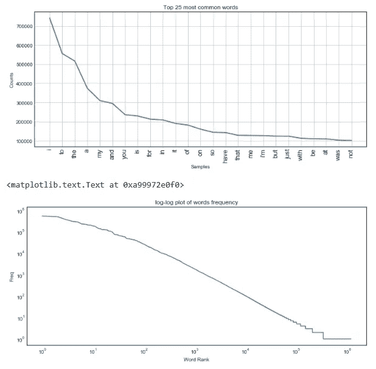

*   我还为单词频率创建了一个 [**双对数**](https://en.wikipedia.org/wiki/Log%E2%80%93log_plot) 图，它类似于之前的频率图，但包括所有单词，并以 10 为基数的对数标度绘制，这有助于我们可视化单词频率随着排名下降而快速减少的情况。
*   本数据字典中出现的单词分布是大样本单词中非常常见的现象，如[齐夫定律](https://simple.wikipedia.org/wiki/Zipf%27s_law)所示，其中最频繁出现的单词的出现频率大约是第二频繁出现的单词的两倍，第三频繁出现的单词的三倍，等等。
*   如果我们从上面的观察中去掉像 **i、**和 **is** 这样的词，看看这是否成立将会很有趣。

# 第 2 部分:探索原始 Twitter 数据

在训练模型后，我们对原始 twitter 数据进行情感预测，但在此之前，我们需要下载并进行一些基本的数据清理。您可以通过关键字*从 twitter RESTful API 下载推文，并获得历史推文流和元数据。我使用了 [Tweepy](https://tweepy.readthedocs.io/en/v3.6.0/) ，这是 twitter API 的一个 python 包装器库，它可以让您更好地控制如何查询 API。你可以在 [GitHub](https://github.com/RonKG/machine-learning-portfolio-projects.......in-progress/tree/master/3.%20NLP_twitter_sentiment_analysis) 上看到代码。*

用于下载历史推文的关键词是“保罗·瑞安”，他是本文撰写时的美国众议院议长。我对这个关键字的选择是任意的，但我觉得足够好来返回一些两极分化的推文。这很重要，因为推文本身可以作为自己的基准。考虑到语言是相对的并且总是在变化的，NLP 的障碍之一是评估模型的性能。

*   导入和预览原始数据。

```
*# create column names*
col_names=['date','user_loc','followers','friends','message','bbox_coords',\
           'full_name','country','country_code','place_type']*# read csv*
df_twtr = pd.read_csv('paul_ryan_twitter.csv', names=col_names)*# check head*
df_twtr.head()
```

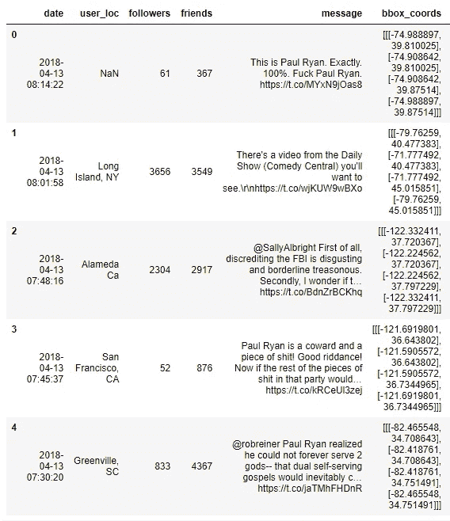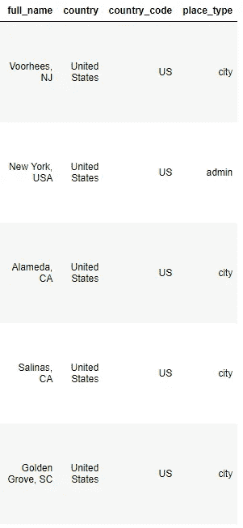

我们将保留位置数据，并在以后使用它在地理地图上绘制出我们的结果。

# 第 3 部分:文本预处理

*   我们希望删除数据中任何不必要的质量，这些质量会使训练好的模型成为不良的概括器。
*   文本预处理涉及许多事情，如删除表情符号，正确格式化文本以删除文本中多余的空格或任何其他我们认为不会给我们的模型添加信息的信息。我们将在下面看到一些例子。
*   我们还必须确保我们传递给模型的信息是计算机能够理解的格式。我们还将在下面完成其中的一些步骤。
*   在这个预处理步骤之后，我们的数据应该准备好用于机器学习分类任务。

注意:无论我们在训练数据上做什么样的文本预处理，也必须在测试和原始数据上完成。

## 预处理 1:通过删除链接、特殊字符

*   这一步我们可能会花很多时间，但目标总是找到最佳平衡。
*   NLP 中的大部分工作是在特征工程上完成的。现在我们将去掉链接和表情符号。值得一提的是，我们可以将它们用作特性，但目前我们只是在构建一个基本模型。

我创建了一个函数，使用 *regex* 对数据集中的每条 tweet 进行批量格式化。示例输出包含在代码中。

```
*# helper function to clean tweets*
**def** processTweet(tweet):
    *# Remove HTML special entities (e.g. &amp;)*
    tweet = re.sub(r'\&\w*;', '', tweet)
    *#Convert @username to AT_USER*
    tweet = re.sub('@[^\s]+','',tweet)
    *# Remove tickers*
    tweet = re.sub(r'\$\w*', '', tweet)
    *# To lowercase*
    tweet = tweet.lower()
    *# Remove hyperlinks*
    tweet = re.sub(r'https?:\/\/.*\/\w*', '', tweet)
    *# Remove hashtags*
    tweet = re.sub(r'#\w*', '', tweet)
    *# Remove Punctuation and split 's, 't, 've with a space for filter*
    tweet = re.sub(r'[' + punctuation.replace('@', '') + ']+', ' ', tweet)
    *# Remove words with 2 or fewer letters*
    tweet = re.sub(r'\b\w{1,2}\b', '', tweet)
    *# Remove whitespace (including new line characters)*
    tweet = re.sub(r'\s\s+', ' ', tweet)
    *# Remove single space remaining at the front of the tweet.*
    tweet = tweet.lstrip(' ') 
    *# Remove characters beyond Basic Multilingual Plane (BMP) of Unicode:*
    tweet = ''.join(c **for** c **in** tweet **if** c <= '**\uFFFF**') 
    **return** tweet
*# ______________________________________________________________**# clean dataframe's text column*
df_paulry['message'] = df_paulry['message'].apply(processTweet)
*# preview some cleaned tweets*
df_paulry['message'].head()
```

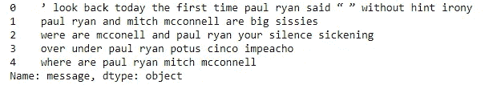

*   还要注意，你不可能有一套完美的清理步骤，因为一些清理步骤最终会在数据中引入一些缺陷。
*   下面是一个前后示例，其中*已从*重选*中删除，这改变了该词的含义，或许也改变了用户的本意。单词*不会*也会变成*赢了*显然有完全不同的意思。*

*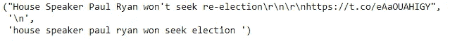*

*我们删除重复的推文，因为它们没有给数据集带来新的信息，而且计算效率也很低。我们还将语料库中最常见的单词可视化。*

```
**# most common words in twitter dataset*
all_words = []
**for** line **in** list(df_paulry['message']):
    words = line.split()
    **for** word **in** words:
        all_words.append(word.lower())*# plot word frequency distribution of first few words*
plt.figure(figsize=(12,5))
plt.xticks(fontsize=13, rotation=90)
fd = nltk.FreqDist(all_words)
fd.plot(25,cumulative=**False**)*# log-log of all words* 
word_counts = sorted(Counter(all_words).values(), reverse=**True**)plt.figure(figsize=(12,5))plt.loglog(word_counts, linestyle='-', linewidth=1.5)
plt.ylabel("Freq")
plt.xlabel("Word Rank")*
```

*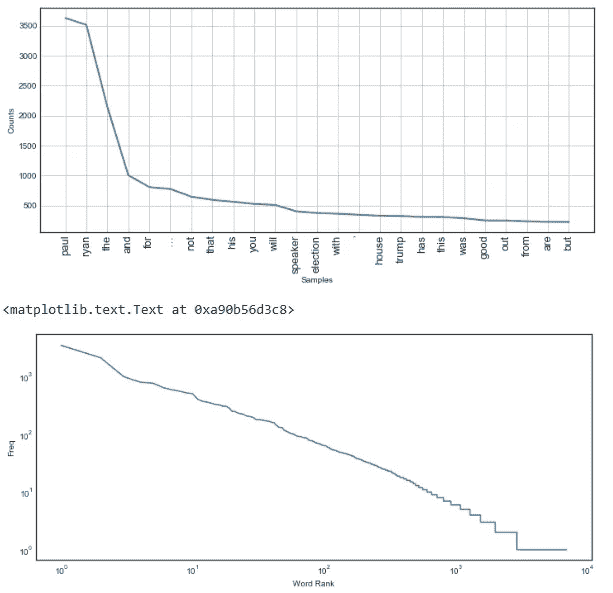*

## *预处理 2:不带停用词的标记化*

*   *我们的训练数据现在已经被转换成更加精简的文本体，对于特征提取来说更加清晰。正如我们之前提到的，我们在数据集中确实有一些词，它们在自然人类语言中很常见，但在大多数句子成分中使用，我们最好不要使用它们，因为它们不会给我们的模型带来有用的特征。*
*   *这些词在 NLP 中通常被称为[停用词](https://en.wikipedia.org/wiki/Stop_words)，并且 [NLTK 库](http://text-processing.com/demo/sentiment/)带有一个函数，可以从数据集中过滤出这些词。以下是停用字词表中包含的实际字词。我们还可以制作自己的特殊停用词列表，以适应任何独特的情况。例如，如果您正在对法律文档进行情感分析，考虑到其中包含的法律术语在本质上是独特的，您可能需要一个特殊的集合。*

```
**# show stop words examples*("i , me , my , myself , we , our , ours , ourselves , you , you're , you've , you'll , you'd , your , yours , yourself , yourselves , he , him , his , himself , she , her , hers , herself , it ")*
```

*   *在移除停用词后，我们将数据集中的所有句子进行拆分，以获得单个单词**(令牌)**，这基本上是新处理的 tweet 中包含的每个句子的单词列表。现在我们可以看到，数据帧中有两个新列，包含这些 tweet 的标记化版本。*
*   *下面是一个示例输出。*

```
**# tokenize helper function*
**def** text_process(raw_text):
    *"""*
 *Takes in a string of text, then performs the following:*
 *1\. Remove all punctuation*
 *2\. Remove all stopwords*
 *3\. Returns a list of the cleaned text*
 *"""*
    *# Check characters to see if they are in punctuation*
    nopunc = [char **for** char **in** list(raw_text) **if** char **not** **in** string.punctuation] *# Join the characters again to form the string.*
    nopunc = ''.join(nopunc)

    *# Now just remove any stopwords*
    **return** [word **for** word **in** nopunc.lower().split() **if** word.lower() **not** **in** stopwords.words('english')] **def** remove_words(word_list):
    remove = ['paul','ryan','...','“','”','’','…','ryan’']
    **return** [w **for** w **in** word_list **if** w **not** **in** remove]*# -------------------------------------------**# tokenize message column and create a column for tokens*
df_paulry = df_paulry.copy()
df_paulry['tokens'] = df_paulry['message'].apply(text_process) *# tokenize style 1*
df_paulry['no_pauls'] = df_paulry['tokens'].apply(remove_words) *#tokenize style 2*
df_paulry.head()*
```

*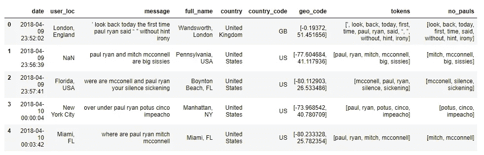*

*Compare the message column VS tokens column VS no_pauls.*

*   *还有其他标准化技术，如 [**词干**](http://www.nltk.org/howto/stem.html) 和 [**词汇化**](http://www.nltk.org/api/nltk.stem.html?highlight=lemmatizer#nltk.stem.wordnet.WordNetLemmatizer) ，我们可以在我们的数据上尝试，但 twitter 消息被设计得很短，上述方法可能不会很好，因为它们本质上是将单词缩短为基本单词。例如:*运行*到*运行*。*
*   *现在，我们将坚持我们的消息数据的当前规范化状态，我们现在可以将它转换成一个向量，这个向量可以输入到适当的 ML 算法中。*
*   *我还创建了一个词云，描述标准化后整个 twitter 数据集中最常见的词。*
*   *我们可以看到我们的关键词——Paul 和 Ryan——显然非常突出，但一些领域知识将有助于理解为什么其他一些词会在那里。毕竟这是 twitter，所以你总是可以期待各种各样的情绪。数据集中的一些单词确实使用了非常强烈的语言。单词 cloud 还排除了单词 *paul* 和 *ryan* ，因为它们在数据集中出现的频率过高。*

```
**# split sentences to get individual words*
all_words = []
**for** line **in** df_paulry['no_pauls']: *# try 'tokens'*
    all_words.extend(line)

*# create a word frequency dictionary*
wordfreq = Counter(all_words)*# draw a Word Cloud with word frequencies*
wordcloud = WordCloud(width=900,
                      height=500,
                      max_words=500,
                      max_font_size=100,
                      relative_scaling=0.5,
                      colormap='Blues',
                      normalize_plurals=**True**).generate_from_frequencies(wordfreq)plt.figure(figsize=(17,14))
plt.imshow(wordcloud, interpolation='bilinear')
plt.axis("off")
plt.show()*
```

*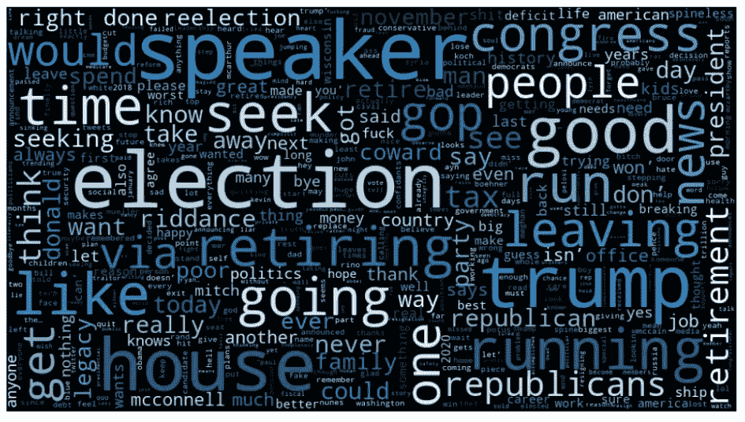*

*Tokenized words word cloud*

## *预处理 3:特征提取*

## *矢量化—(单词袋)*

*我们将把每条由一系列符号表示的消息转换成机器学习模型可以理解的向量。*

*为此，我们使用了包含三个步骤的[单词袋](https://en.wikipedia.org/wiki/Bag-of-words_model)模型。*

*   *1.计算一个单词在每条消息中出现的次数(称为词频)*
*   *2.对计数进行加权，以使频繁出现的令牌获得较低的权重(逆文档频率)*
*   *3.将向量归一化为单位长度，以从原始文本长度中提取(L2 范数)*

*每个向量将具有与 tweeter 语料库中的唯一单词一样多的维度。*

*我们将首先使用 SciKit Learn 的 CountVectorizer 函数，该函数将一组文本文档转换成一个令牌计数矩阵。*

*想象这是一个二维矩阵，其中一维是消息中包含的全部词汇，另一维是每条推文的一列。*

*由于有如此多的消息，我们可以预期数据中每个单词的出现都有很多零计数，但是 SciKit Learn 将输出一个[稀疏矩阵](https://en.wikipedia.org/wiki/Sparse_matrix)。下面是一个矢量化句子的例子——代码和输出。*

```
**# vectorize*
bow_transformer = CountVectorizer(analyzer=text_process).fit(df_paulry['message'])
*# print total number of vocab words*
print(len(bow_transformer.vocabulary_))# output
6865*# example of vectorized text*
sample_tweet = df_paulry['message'][111]
print(sample_tweet)
print('**\n**')*# vector representation*
bow_sample = bow_transformer.transform([sample_tweet])
print(bow_sample)
print('**\n**')*
```

*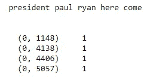*

*Sample sentence in vector representation*

```
**# transform the entire DataFrame of messages*
messages_bow = bow_transformer.transform(df_paulry['message'])*# check out the bag-of-words counts for the entire corpus as a large sparse matrix*
print('Shape of Sparse Matrix: ', messages_bow.shape)
print('Amount of Non-Zero occurences: ', messages_bow.nnz)*
```

**

*Whole corpus in vector representation*

## *术语频率，逆文档频率*

*   *tf-idf 代表术语频率-逆文档频率，TF-IDF 权重是信息检索和文本挖掘中经常使用的权重。该权重是一种统计度量，用于评估一个单词对集合或语料库中的文档有多重要。*
*   *重要性与单词在文档中出现的次数成比例增加，但是被单词在语料库中的频率抵消。tf-idf 加权方案的变体通常被搜索引擎用作给定用户查询时对文档相关性进行评分和排序的中心工具。*
*   *最简单的排名函数之一是通过对每个查询项的 tf-idf 求和来计算的；许多更复杂的排名函数是这个简单模型的变体。*
*   *通常，tf-idf 权重由两项组成:第一项计算归一化项频率(tf)，aka。单词在文档中出现的次数，除以该文档中的总单词数；第二项是逆文档频率(IDF ),计算为语料库中文档数量的对数除以特定术语出现的文档数量。*
*   *TF:术语频率，衡量一个术语在文档中出现的频率。因为每个文档的长度不同，所以一个术语在长文档中出现的次数可能比短文档多得多。因此，术语频率通常除以文档长度(又名。文档中的术语总数)作为标准化的一种方式:*

*TF(t) =(术语 t 在文档中出现的次数)/(文档中的总术语数)。*

*   *IDF:逆文档频率，衡量一个术语的重要程度。在计算 TF 时，所有项都被认为是同等重要的。然而，众所周知，某些术语，如“是”、“的”和“那个”，可能会出现很多次，但并不重要。因此，我们需要通过计算以下各项来降低常用术语的权重，同时提高罕见术语的权重:*

*IDF(t) = log_e(文档总数/包含术语 t 的文档数)。*

*   *下面是一个简单的例子。*
*   *`Example: Consider a document containing 100 words wherein the word cat appears 3 times. The term frequency (i.e., tf) for cat is then (3 / 100) = 0.03\. Now, assume we have 10 million documents and the word cat appears in one thousand of these. Then, the inverse document frequency (i.e., idf) is calculated as log(10,000,000 / 1,000) = 4\. Thus, the Tf-idf weight is the product of these quantities: 0.03 * 4 = 0.12.`*

```
**# from sklearn.feature_extraction.text import TfidfTransformer*
tfidf_transformer = TfidfTransformer().fit(messages_bow)
tfidf_sample = tfidf_transformer.transform(bow_sample)
print(tfidf_sample)*
```

*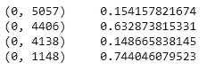*

*   *我们将继续检查单词“trump”和单词“gop”的 IDF ( [逆文档频率](https://en.wikipedia.org/wiki/Tf%E2%80%93idf))是多少？*

```
**# some IDF (inverse document frequency) example*
print(tfidf_transformer.idf_[bow_transformer.vocabulary_['trump']])
print(tfidf_transformer.idf_[bow_transformer.vocabulary_['gop']])*
```

*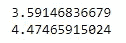*

*   *为了将我们的整个 twitter 单词库一次转换成 TF-IDF 语料库，我们将使用下面的代码:*

```
**# to transform the entire bag-of-words corpus*
messages_tfidf = tfidf_transformer.transform(messages_bow)
print(messages_tfidf.shape)# Output
(4164, 6865)*
```

*   *在对数据进行预处理之后，我们现在准备让它通过一个 ML 分类算法。*
*   *这就结束了我们工作流程的文本预处理阶段，但是我们将在这里继续的[下一部分](https://medium.com/p/3ed2670f927d)中作为流水线中的**一步**重新审视这些步骤。*