# 这就是推特如何看待世界:情感分析第二部分

> 原文：<https://towardsdatascience.com/the-real-world-as-seen-on-twitter-sentiment-analysis-part-two-3ed2670f927d?source=collection_archive---------6----------------------->

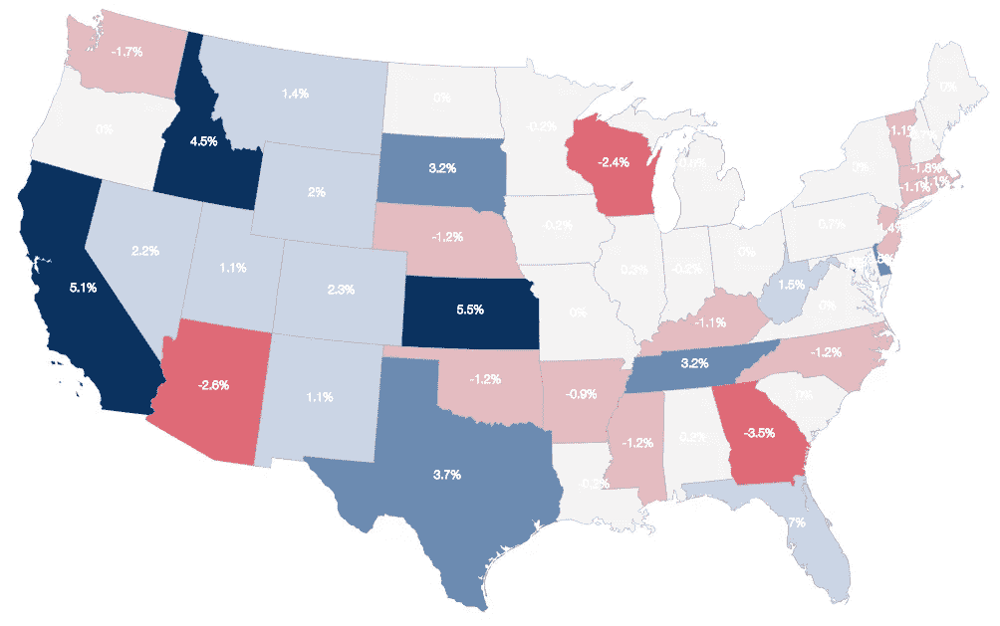

image by [Deepthiyathiender](https://commons.wikimedia.org/wiki/File:State_Choropleth.png)

这篇博客文章是上一篇文章的延续，上一篇文章讲述了机器学习(ML)情感分析任务的文本预处理的内部工作。在这篇文章中，我们将把来自[集 140](http://www.sentiment140.com/) 的数据分成训练集和测试集。在训练模型之后，我们将使用它来对未见过的 twitter 数据进行情感分类，这些数据已经以与训练数据相同的方式进行了预处理。

# 第一部分:模型训练

## 朴素贝叶斯分类器

在这个分类任务中，我们将使用基于[贝叶斯定理](https://en.wikipedia.org/wiki/Bayes%27_theorem)的**朴素贝叶斯(NB)** 分类器。简而言之，NB 分类器假设一个类中特定特征的存在与任何其他特征的存在无关。因此，举例来说，如果一个水果是橙色的，圆形的，直径约为 3 英寸，那么它就可以被认为是橙子。朴素贝叶斯分类器认为这些“特征”(橙色、圆形、直径 3 英寸)中的每一个都独立地影响水果是苹果的概率，而不考虑特征之间的任何相关性。然而，特征并不总是独立的，这通常被视为朴素贝叶斯算法的缺点，这也是它被标记为“朴素”的原因。然而，它理解、构建和训练相对简单，而且速度非常快，这使得它成为情感分类的良好候选。

贝叶斯定理提供了一种从 P(c)，P(x)和 P(x|c)计算后验概率 P(c|x)的方法。看下面的等式:

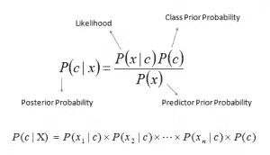

```
- P(c|x) is the posterior probability of class (c, target) given predictor (x, attributes).
- P(c) is the prior probability of class.
- P(x|c) is the likelihood which is the probability of predictor given class.
- P(x) is the prior probability of predictor.
```

## 创建管道来一步管理预处理步骤

*   [Scikit Learn](http://scikit-learn.org/stable/) 提供了一个[管道](http://scikit-learn.org/stable/modules/pipeline.html)功能，允许您定义一个管道工作流，该工作流将采取上述所有步骤，甚至是一个分类器和网格搜索参数。
*   管道使代码更具可读性，并使交换管道片段变得容易(管道片段可以包含其他 ML 算法并尝试不同的配置)。
*   管道还允许对模型工作流进行交叉验证。
*   通过确保使用相同的样本来训练转换器和预测器，管道还有助于避免在交叉验证中将测试数据中的统计数据泄漏到训练模型中。

## 交叉验证:

*   训练好模型的推荐方法是首先使用训练集本身的一部分进行交叉验证，以检查您是否使用了容量过大的模型(即模型是否过度拟合数据)。
*   为了同时交叉验证和选择最佳参数配置，我们使用了 [GridSearchCV。](http://scikit-learn.org/stable/modules/generated/sklearn.model_selection.GridSearchCV.html)
*   这使我们能够轻松地测试不同的超参数配置，例如使用 KFold 策略将模型分成随机部分，以确定它是泛化得好还是过度拟合。
*   GridSearchCV 允许您使用要迭代的超参数配置值定义 ParameterGrid。对所有组合进行测试和评分，并返回最佳模型。
*   对于我们的例子，有 4 + 2 + 2 个参数组合要测试，有 10 kfold 验证，因此模型将在验证集上训练和测试 8 x 10 = 80 次。

```
*# Run Train Data Through Pipeline analyzer=text_process*
*# uncomment below to train on a larger dataset but it's very slow for a slower machine.**# X_train, X_test, y_train, y_test = train_test_split(data['text'], data['label'], test_size=0.2)*
X_train, X_test, y_train, y_test = train_test_split(data['text'][:5000], data['label'][:5000], test_size=0.2)*# create pipeline*
pipeline = Pipeline([
    ('bow', CountVectorizer(strip_accents='ascii',
                            stop_words='english',
                            lowercase=**True**)),  *# strings to token integer counts*
    ('tfidf', TfidfTransformer()),  *# integer counts to weighted TF-IDF scores*
    ('classifier', MultinomialNB()),  *# train on TF-IDF vectors w/ Naive Bayes classifier*
])*# this is where we define the values for GridSearchCV to iterate over*
parameters = {'bow__ngram_range': [(1, 1), (1, 2)],
              'tfidf__use_idf': (**True**, **False**),
              'classifier__alpha': (1e-2, 1e-3),
             }*# do 10-fold cross validation for each of the 6 possible combinations of the above params*
grid = GridSearchCV(pipeline, cv=10, param_grid=parameters, verbose=1)
grid.fit(X_train,y_train)*# summarize results*
print("**\n**Best Model: **%f** using **%s**" % (grid.best_score_, grid.best_params_))
print('**\n**')
means = grid.cv_results_['mean_test_score']
stds = grid.cv_results_['std_test_score']
params = grid.cv_results_['params']
**for** mean, stdev, param **in** zip(means, stds, params):
    print("Mean: **%f** Stdev:(**%f**) with: **%r**" % (mean, stdev, param))
```

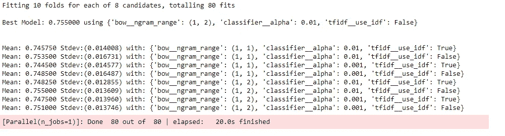

*   我们向 GridsearchCV 对象传递了 8 个参数和 10 个用于交叉验证的折叠参数，这意味着对于每个参数组合，网格将运行 10 次不同的迭代，每次使用不同的测试集。
*   在尝试了不同的模型参数组合之后，GridsearchCV 返回了性能最佳的模型，我们可以用它来对新的(twitter)数据进行分类。我们将下面的模型保存到工作目录中，以便将来在不重新训练它的情况下检索训练过的模型。
*   如果您计划将模型部署到其他地方，比如移动应用程序或 web 应用程序，那么保存模型也是一个必要的步骤。

# 第 2 部分:模型评估

在下面的代码中，我们将在测试维持数据集上测试我们的训练模型。

```
*# save best model to current working directory*
joblib.dump(grid, "twitter_sentiment.pkl")*# load from file and predict using the best configs found in the CV step*
model_NB = joblib.load("twitter_sentiment.pkl" )*# get predictions from best model above*
y_preds = model_NB.predict(X_test)print('accuracy score: ',accuracy_score(y_test, y_preds))
print('**\n**')
print('confusion matrix: **\n**',confusion_matrix(y_test,y_preds))
print('**\n**')
print(classification_report(y_test, y_preds))
```

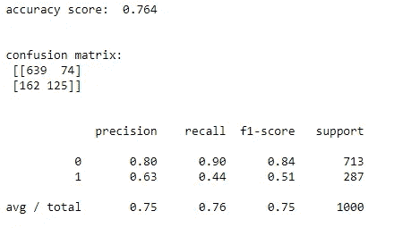

*   在上面的单元格中，我使用了最佳模型来对看不见的测试数据进行预测，这让我们可以对性能指标进行分级和检索。
*   我们可以从上面得到的一些性能指标包括分类报告和混淆矩阵。
*   一个[混淆矩阵(CM)](https://en.wikipedia.org/wiki/Confusion_matrix) 非常简单明了，但下面是解释它以及得出分类报告的关键:

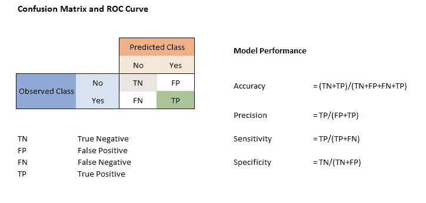

**根据上面的精度指标:**

*   95%是模型在数据集中所有标签中预测正确标签的次数。
*   当数据中类的分布非常均衡时，准确性可以让您很好地了解模型的执行情况。

**来自混淆矩阵:**

*   该模型将 553 个标签正确预测为阴性，将 799 个标签正确预测为阳性。
*   我们还得到 4 个预测为阳性的标签，尽管它们是阴性的(假阴性)。
*   从 CM 中我们可以知道的另一件事是，模型预测 62 个标签为阴性，但它们结果是阳性(假阳性)。

**来自分类报告:**

可以从混淆矩阵中的度量获得的分类报告给出了关于模型性能的更详细的信息。

*   **精度**:标签 0 为 99%，标签 1 为 93%。这个数字告诉我们在该类别的所有预测中，正确预测的标签所占的比例。
*   **回忆**:标签 0 为 90%，标签 1 为 100%。这是该类别的真实标签中正确预测的数量。
*   **f1 -score** :这是该类的精度和召回率的加权平均值。它通常给出该标签的模型表现的更大画面，并且显然该数字越高越好。标签 0 为 94 %，标签 1 为 96%。0 表示消极情绪，1 表示积极情绪。
*   从上述指标来看，该模型似乎表现得相对较好，尽管它在预测类 0 的正确标签方面可以做得更好。
*   根据研究，由于[评分者之间的可靠性问题](https://en.wikipedia.org/wiki/Inter-rater_reliability)，人类评分者通常同意 80%的时间【Roebuck，k .(2012–10–24】】。
*   因此，一个 70%准确的程序做得几乎和人类一样好，即使这样的准确性可能看起来并不那么令人印象深刻。如果一个程序在 100%的时间里都是“正确的”，人类仍然会在 20%的时间里不同意它，因为他们对任何答案都不同意。
*   我们还可以将我们的模型与类似的工作进行比较，这些工作对情感分析和情感标签的二元分类进行了广泛的研究。最终的模型是基于支持向量机( [SVM](https://en.wikipedia.org/wiki/Support_vector_machine) )并进而达到 79.08%的准确率。
*   到目前为止，我们已经采取措施来避免过度拟合我们建立模型管道的方式，但最终真正的测试是在看不见的数据上测试模型。

# 第 3 部分:真实世界的模型性能

下一步，我想用我们的模型对通过 twitter API 获得的数据进行情感预测，并评估它的性能。预测和预览结果是在下面的代码中完成的。

```
*# run predictions on twitter data*
tweet_preds = model_NB.predict(df_twtr['message'])*# append predictions to dataframe*
df_tweet_preds = df_twtr.copy()
df_tweet_preds['predictions'] = tweet_preds
df_tweet_preds.shape# Output
(4164, 8)
```

查看下面的一些示例预测。

0 =正，1 =负。

```
*# print text and sentiment*index = random.sample(range(tweet_preds.shape[0]), 20)
**for** text, sentiment **in** zip(df_tweet_preds.message[index],
                           df_tweet_preds.predictions[index]):
    print (sentiment, '--', text, '**\n**')#------------------------------
# SAMPLE PREDICTIONS BELOW    #
#------------------------------0 -- Spot on correct. The Paul Ryan Story: From Flimflam to Fascism [https://t.co/BPwrobl0aS](https://t.co/BPwrobl0aS)0 -- .@Varneyco @charleshurt   Paul Ryan didn't get Tax Reform.  Donald Trump got Tax Reform.  Boy George could have bee… [https://t.co/vGmRJWQnlG](https://t.co/vGmRJWQnlG)1 -- @HumanBeings1st @LotraineH Paul Ryan is cold-hearted👎🏼👹He hates Social Security and Medicare and Medicaid and has t… [https://t.co/oQAXvfEuLI](https://t.co/oQAXvfEuLI)0 -- Paul Ryan is an unconvincing charlatan whose primary goal in life has been to make life harder for poor people. The… [https://t.co/yyK80Tsgmz](https://t.co/yyK80Tsgmz)0 -- absolutely delish...#winningMeghan McCain Erupts After Audience Cheers Paul Ryan Retirement: ‘You Deserve Trump’ [https://t.co/7s2AUVGrgp](https://t.co/7s2AUVGrgp)0 -- Is anyone surprised Paul Ryan isn’t going to run? #morningjoe0 -- @CNN If the Repubs stand by and continue to let the lunatic run the asylum, then they are accountable, if the Repub… [https://t.co/uNNkd9yljp](https://t.co/uNNkd9yljp)0 -- .@IronStache wins eight months early [https://t.co/7txWs0YvER](https://t.co/7txWs0YvER)
```

下面，我在互联网上的一些文本上测试了这个模型，以更好地了解它在一些随机数据上的表现。

```
*# Testing random text from the internet**# load model*
model_NB = joblib.load("twitter_sentiment.pkl" )*# test string*
sample_str = """While ride-sharing first mover Uber has fallen on tough times with
scandal and abyssal track records of leadership, and cash burning
growth-orientated practices, the world has caught up with self-driving
tech with many players now in the race."""p = model_NB.predict([sample_str])*# formatting helper*
**def** sentiment_str(x):
    **if** x==0:
        **return** 'Negative'
    **else**:
        **return** 'Positive'
*#_____________________________________________**# test result ___ 0=Negative, 1=Positive*
print("the sentence: **\n\n**'**{}**' **\n\n**has a **{}** sentiment".format(sample_str,sentiment_str(p[0])))
```

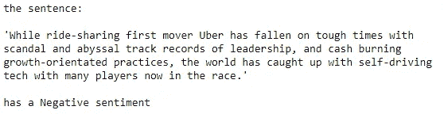

# 观察

*   我在上面的单元格中可视化了由我们的模型分类的 10 个 tweets 示例，这些示例看起来执行得基本正确，但有时会令人尴尬地失败。
*   当在非 twitter 文本上测试时，该模型似乎拾取了许多嵌入的情感，但需要更多工作来从所述文本中提取一般结论。例如，我们可能需要对整个段落进行训练，而不仅仅是一句话。
*   关于情感分析的一个棘手的问题是，即使该模型在一些基准上表现良好，最终的表现也将不得不留给难以量化的实际人类法官。
*   话虽如此，我查看了许多随机的负面分类和正面分类的推文，有一些非常好的分类，还有一些分类似乎不属于任何地方。这也让我觉得我们应该探索第三种分类。所以我们会有**积极、消极和中性的情绪**。
*   虽然我认为模型已经完成了一些学习，但我认为我们可以通过调整模型的参数、探索其他算法或创建算法集合来做得更好。

比较 twitter 数据上的模型预测统计

```
pos = df_tweet_preds.predictions.value_counts()[0]
neg = df_tweet_preds.predictions.value_counts()[1]print('Model predictions: Positives - **{}**, Negatives - **{}**'.format(neg,pos))*# save dataframe with appended preditions* 
df_tweet_preds.to_pickle('paulry_predicts_df.p')
```


# 第 7 部分:地质图、最终想法和结论

*   在这一部分，我们还创建了下载推文的地理可视化，这是数据故事的重要组成部分。
*   在训练任何 ML 模型时，一个重要的部分是能够以促进利益相关者决策的方式呈现我们的发现。
*   我们将加载包含预测的数据框架，并探索国家和美国各州的分布，特别是因为我们的 twitter 数据围绕着美国新闻。
*   值得一提的是，我们的数据集在发展过程中存在一些限制。大多数 twitter 用户不广播他们的地理位置，但我们的搜索标准只提取了启用了位置信息的推文。
*   因此，我们可能错过了很多推文，这些推文描绘的画面可能与我们在地图上绘制的画面不同。了解这一点不仅对解释结果至关重要，而且对理解我们如何使模型更加稳健也至关重要。

```
*# load dataframe with predictions*
df = pd.read_pickle('paulry_predicts_df.p')*# get all the countries in dataset*
df.country.unique()
```

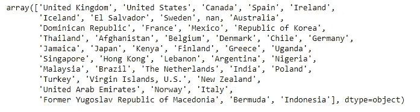

```
*# get top countries in the dataset by percentage of tweets*
df.country.value_counts(1).head(10)
```


在[132]:

```
*# plot histogram of tweets counts by country of origin*
sns.set_style("darkgrid")
x = df.country.value_counts(1).head(20)
x.plot(kind='bar',figsize=(10,6),fontsize=13,color='steelblue')
plt.ylabel('**% o**f Total Tweets', fontsize=13)
```

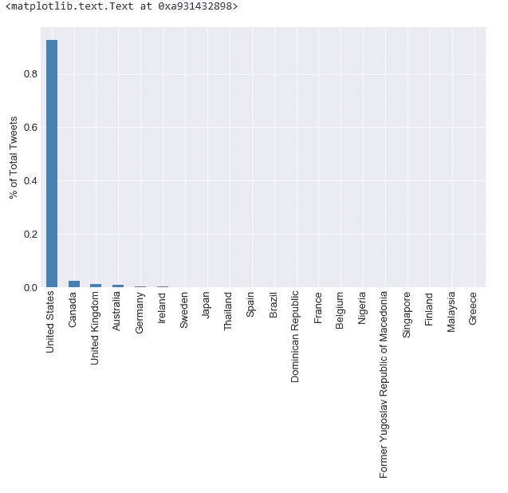

*   正如我们所怀疑的，绝大多数推文来自美国。接下来，我们将通过状态计数来获取状态。

```
*# get latitudes and longitudes**# some helper funtions to get longs and lats*
**def** lats(x):
    **return** x[1]**def** longs(x):
    **return** x[0]*# --------------------------------------------------------#*
*# append longs and lats to dframe*
df['latitude'] = df['geo_code'].apply(lats)
df['longitude'] = df['geo_code'].apply(longs)
df.columns
```

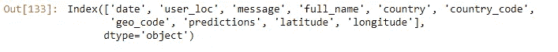

```
*# for US tweets extract state abbreviations for a new STATE column*
*# helper function to extract state origin of every tweet*
**def** get_state(x):

    states = ["AL", "AK", "AZ", "AR", "CA", "CO", "CT", "DC", "DE", "FL", "GA", 
              "HI", "ID", "IL", "IN", "IA", "KS", "KY", "LA", "ME", "MD", 
              "MA", "MI", "MN", "MS", "MO", "MT", "NE", "NV", "NH", "NJ", 
              "NM", "NY", "NC", "ND", "OH", "OK", "OR", "PA", "RI", "SC", 
              "SD", "TN", "TX", "UT", "VT", "VA", "WA", "WV", "WI", "WY"]states_dict = {
            'AK': 'Alaska','AL': 'Alabama','AR': 'Arkansas','AS': 'American Samoa',
            'AZ': 'Arizona','CA': 'California','CO': 'Colorado','CT': 'Connecticut',
            'DC': 'District of Columbia','DE': 'Delaware','FL': 'Florida','GA': 'Georgia',
            'GU': 'Guam','HI': 'Hawaii','IA': 'Iowa','ID': 'Idaho','IL': 'Illinois',
            'IN': 'Indiana','KS': 'Kansas','KY': 'Kentucky','LA': 'Louisiana',
            'MA': 'Massachusetts','MD': 'Maryland','ME': 'Maine','MI': 'Michigan',
            'MN': 'Minnesota','MO': 'Missouri','MP': 'Northern Mariana Islands',
            'MS': 'Mississippi','MT': 'Montana','NA': 'National','NC': 'North Carolina',
            'ND': 'North Dakota','NE': 'Nebraska','NH': 'New Hampshire','NJ': 'New Jersey',
            'NM': 'New Mexico','NV': 'Nevada','NY': 'New York','OH': 'Ohio','OK': 'Oklahoma',
            'OR': 'Oregon','PA': 'Pennsylvania','PR': 'Puerto Rico','RI': 'Rhode Island',
            'SC': 'South Carolina','SD': 'South Dakota','TN': 'Tennessee','TX': 'Texas',
            'UT': 'Utah','VA': 'Virginia','VI': 'Virgin Islands','VT': 'Vermont',
            'WA': 'Washington','WI': 'Wisconsin','WV': 'West Virginia','WY': 'Wyoming'
    }abv = x.split(',')[-1].lstrip().upper()
    state_name = x.split(',')[0].lstrip()
    **if** abv **in** states:
        state = abv
    **else**:
        **if** state_name **in** states_dict.values():
            state = list(states_dict.keys())[list(states_dict.values()).index(state_name)]
        **else**:
            state = 'Non_USA'    
    **return** state*# ____________________________________________________________________________**# create abreviated states column*
df = df.copy()
df['states'] = df['full_name'].apply(get_state)
list(df['states'].head())
```

输出:

```
['Non_USA', 'PA', 'FL', 'NY', 'FL']
```

在下面创建一些可视化效果。

```
*# save updated dataframe*
df.to_pickle('df_paulry_longs_lats.p')*# retrive updated dataframe*
df = pd.read_pickle('df_paulry_longs_lats.p')*# plot tweets distribution by state*plt.style.use('seaborn-darkgrid')
df_states = df[df.country=='United States']
df_states = df_states[df_states.states!='Non_USA']x = df_states.states.value_counts()
x.plot(kind='bar',figsize=(14,6),fontsize=12,color='steelblue')
plt.ylabel('Origin of Tweets', fontsize=13)
```

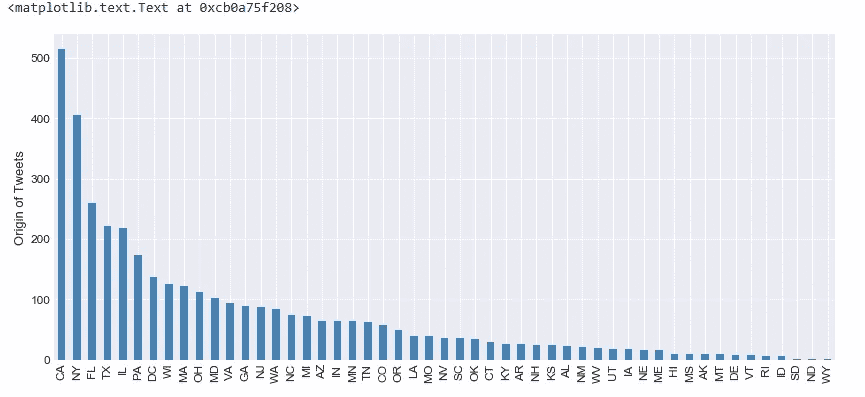

*   从上面我们可以看到大多数推文来自哪里，看起来可能与人口数量和州的大小有关。
*   接下来，我们通过将积极和消极相加来提取每个状态的总体情绪，最后的数字就是指标。
*   我们将使用每个州的总体情绪来创建一个热图，显示从最消极到最积极的状态。

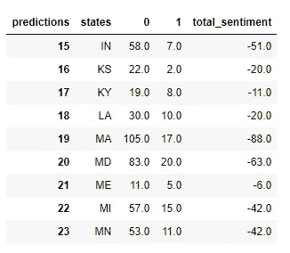

```
*# Create the sentiment by state Heat Map*colorscale=[
            [0, 'rgb(31,120,180)'], 
            [0.35, 'rgb(166, 206, 227)'], 
            [0.75, 'rgb(251,154,153)'], 
            [1, 'rgb(227,26,28)']
           ]data = dict(type='choropleth',
            colorscale = colorscale,
            reversescale=**True**,
            locations = df_state_sentiment['states'],
            z = df_state_sentiment['total_sentiment'],
            locationmode = 'USA-states',
            text = df_state_sentiment['states'],
            marker = dict(line = dict(color = 'rgb(255,255,255)',width = 2)),
            colorbar = {'title':"Twitter Sentiment"}
            )layout = dict(title = 'Twitter Sentiment: GOP House Speaker: Paul Ryan',
              geo = dict(scope='usa'
                        )
             )choromap_us = go.Figure(data = [data],layout = layout)*# plotly.offline.plot(choromap_us, filename='img_map.html')  # save html map*
IFrame('img_map.html', width=950, height=700)  *# view saved map html file*
```

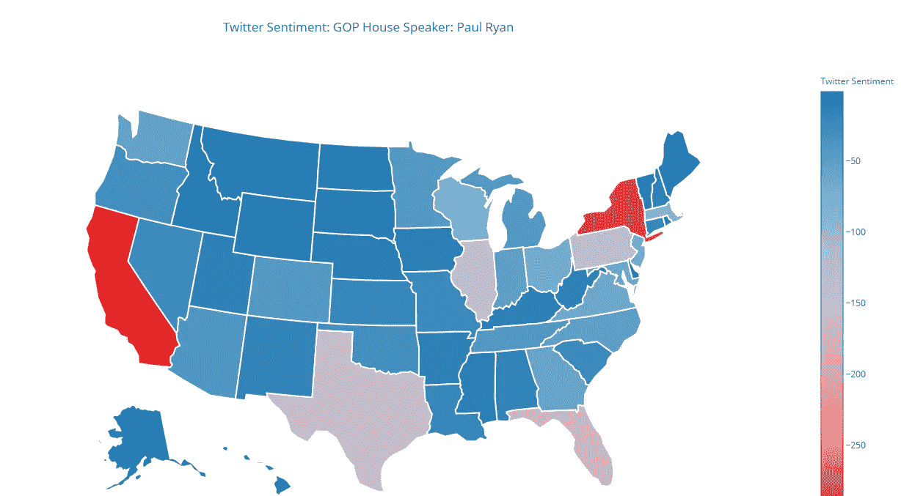

*   总情绪是通过对每个州的积极和消极因素求和得出最终数字。
*   从上面的热图中，我们可以做出一些有趣的观察。
*   从地图右侧的色标来看，蓝色过渡到红色，表示积极到消极的情绪。该量表实际上是从 0 开始的，因为没有一个州的总体情绪是积极的。所以我们赤字越多，情绪就越消极。
*   纽约和加州对这个关键词搜索的负面情绪最大。请记住，纽约和加州的推特用户最多，这很可能会扭曲上面的图片。
*   因此，我觉得这张热图不太可靠，但它是探索 ***情绪 vs***状态可视化的良好起点。
*   接下来，我们将看到另一个热图，我们将根据各自的地理位置数据绘制数据集中的每条推文。

```
*# use the folium library to create all tweet origins in the dataset on map of US*geoplots = []
**for** index, row **in** df_states[['latitude','longitude','predictions']].iterrows():
    geoplots.append([row['latitude'],row['longitude'],row['predictions']])mus = folium.Map(location=[39, -99], zoom_start=4)
plugins.Fullscreen(
    position='topright',
    title='Expand me',
    title_cancel='Exit me',
    force_separate_button=**True**).add_to(mus)mus.choropleth(
    geo_data='us_states.geojson',
    fill_color='red', 
    fill_opacity=0.1, 
    line_opacity=0.2,
    name='US States')

mus.add_child(plugins.HeatMap(geoplots,
                            name='Twitter HeatMap',
                            radius=10,
                            max_zoom=1,
                            blur=10, 
                            max_val=3.0))
folium.TileLayer('cartodbpositron').add_to(mus)
folium.TileLayer('cartodbdark_matter').add_to(mus)
folium.TileLayer('Mapbox Control Room').add_to(mus)
folium.LayerControl().add_to(mus)
mus.save("twitter_us_map.html") 
IFrame('twitter_us_map.html', width=960, height=520)
```

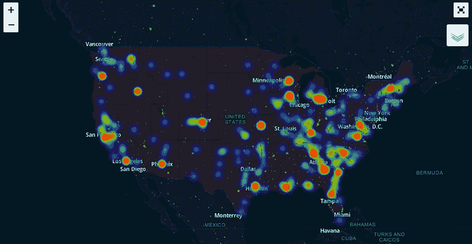

*   上面的美国地图显示，许多推文来自这些人口密度高的地区。
*   充其量，地图给我们提供了一种方式来查看推文来自哪里，下一步将根据它们的情感值来映射它们，以便更好地表达情感。
*   我们还可以在地图上添加一个时间维度，以可视化推文，因为它们在时间序列中实时发生，这将是一个跟踪相关方感兴趣的主题的伟大工具。这种工具以前在总统竞选和自然灾害中使用过。

# 结论

*   到目前为止，对于情绪分析模型来说，我们的模型表现得相对较好，其*准确率为 76%* ，但我们还可以做很多事情来提高对这种表现的信心。
*   我认为这是一个很好的基本模型，可以通过试验以下建议来提高其性能:
*   可以对训练语料库执行额外的数据归一化。我们从训练数据中移除了停用词，但我们也可以尝试使用[词干](https://en.wikipedia.org/wiki/Stemming)和[词汇化](http://nbviewer.jupyter.org/github/RonKG/machine-learning-portfolio-projects/blob/master/3.%20NLP_twitter_sentiment_analysis/FINAL____twitter_sentiment_twitter.ipynb)，这两种方法都是基于词根或基本词来分析语料库中的单词。
*   我们还可以尝试不同的单词标记方法，特别注意大写单词和特殊字符。
*   表情符号也可以用来提取更多的文本内容。
*   尝试使用多类标签来容纳所有可以通过文本传达的人类情感。*例如:悲伤、快乐、兴奋、厌烦等..*
*   考虑其他 ML 算法，如支持向量机、决策树、神经网络等，甚至这些算法的集合。
*   最后，我想知道在不同的主题上训练一个模型并为不同的数据集选择最相关的一个是否有益。例如，在广泛的法律文档库上训练的用于*法律*的模型，或者在体育相关文本上训练的用于*体育*的模型，比如与体育和体育名人相关联的推文。当然，对于实验和随后的评估来说，这方面的基础无疑是丰富的。

这篇文章的代码和更多内容可以在我的 [GitHub](https://github.com/RonKG/machine-learning-projects-2/tree/master/3.%20NLP_twitter_sentiment_analysis) 获得。